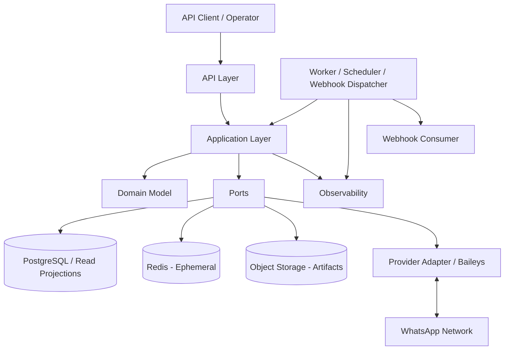

# OmniWA

> Modern WhatsApp API platform built on WhiskeySockets/Baileys, designed for reliable automation, clean boundaries, and long-term extensibility.

**Project status:** Platform Evolution / SDK Client Foundation
**Current phase:** Phase J platform clients complete; Rust SDK hardening in progress
**Logo:** Placeholder. A project logo has not been added yet.

## Table of Contents

- [What Is OmniWA?](#what-is-omniwa)
- [Design Philosophy](#design-philosophy)
- [Architecture Overview](#architecture-overview)
- [Documentation Portal](#documentation-portal)
- [Recommended Reading Order](#recommended-reading-order)
- [Current Project Status](#current-project-status)
- [Repository Structure](#repository-structure)
- [Guiding Principles](#guiding-principles)
- [Development Workflow](#development-workflow)
- [Contributing](#contributing)
- [Roadmap](#roadmap)
- [License](#license)

## What Is OmniWA?

OmniWA is a WhatsApp API platform built on top of WhiskeySockets/Baileys. It turns a low-level WhatsApp Web library into a product-grade platform for teams that need managed instances, QR pairing, message workflows, webhook delivery, operational visibility, and responsible usage guardrails.

The MVP targets developer-led SaaS builders as the primary persona and internal technical teams as the secondary persona. The frozen MVP model is Single Tenant + Multi Instance, with support for text, image, video, document, and audio messages.

OmniWA is not a replacement for Meta's WhatsApp Business Platform or WhatsApp Cloud API. It is not a spam, campaign, broadcast, scraping, or policy-bypass tool. It does not guarantee upstream WhatsApp delivery when WhatsApp, account, device, network, or provider state prevents delivery.

## Design Philosophy

OmniWA is designed around a documentation-first, boundary-first approach:

- **API First:** product behavior is exposed through stable contracts, not direct library calls.
- **Clean Architecture:** dependencies point inward toward Application and Domain policy.
- **Modular Monolith:** MVP remains operationally simple while preserving internal module ownership.
- **Domain-Driven Design:** product language, bounded contexts, aggregates, events, policies, and invariants are explicit.
- **Ports and Adapters:** Baileys, persistence, queueing, webhooks, configuration, secrets, and observability sit behind ports.
- **Event-Driven where useful:** async work, lifecycle facts, projections, and webhook delivery are modeled explicitly.
- **Long-term Maintainability:** architecture, domain, API, persistence, and infrastructure freezes constrain implementation drift.

## Architecture Overview

OmniWA uses a Modular Monolith with Clean Architecture and Hexagonal Ports and Adapters. The API layer adapts external requests into Application commands and queries. Application orchestrates workflows. Domain owns business rules. Infrastructure implements ports for persistence, provider integration, queues, webhooks, secrets, configuration, and observability.



The key rule is simple: product behavior enters through the Application layer. API, Worker, Scheduler, Provider, Webhook, and Persistence boundaries must not bypass the frozen dependency rules.

## Documentation Portal

| Area                 | Description                                                                                                                              | Document                                                                                                                                                                                                                                                                                                                       |
| -------------------- | ---------------------------------------------------------------------------------------------------------------------------------------- | ------------------------------------------------------------------------------------------------------------------------------------------------------------------------------------------------------------------------------------------------------------------------------------------------------------------------------ |
| Vision               | Product direction, mission, principles, positioning, and non-goals.                                                                      | [VISION.md](docs/VISION.md)                                                                                                                                                                                                                                                                                                    |
| Product              | Scope, MVP persona, tenancy, guardrails, supported message types, and freeze baseline.                                                   | [PRODUCT_SCOPE.md](docs/PRODUCT_SCOPE.md), [DECISIONS.md](docs/DECISIONS.md), [FREEZE_PHASE_0.md](docs/FREEZE_PHASE_0.md)                                                                                                                                                                                                      |
| Architecture         | Architecture style, ADRs, system context, modules, runtime model, and architecture freeze.                                               | [ARCHITECTURE_FREEZE.md](docs/architecture/ARCHITECTURE_FREEZE.md), [ARCHITECTURE_STYLE.md](docs/architecture/ARCHITECTURE_STYLE.md), [ADR Index](docs/architecture/adr/)                                                                                                                                                      |
| Domain               | Strategic and tactical DDD model, bounded contexts, aggregates, events, repositories, services, and domain freeze.                       | [DOMAIN_FREEZE.md](docs/domain/DOMAIN_FREEZE.md), [DOMAIN_OVERVIEW.md](docs/domain/DOMAIN_OVERVIEW.md)                                                                                                                                                                                                                         |
| Application          | Use cases, workflows, commands, queries, application services, transaction, validation, authorization, and application freeze.           | [APPLICATION_FREEZE.md](docs/application/APPLICATION_FREEZE.md), [APPLICATION_OVERVIEW.md](docs/application/APPLICATION_OVERVIEW.md)                                                                                                                                                                                           |
| API                  | API surface, resource model, auth, versioning, request/response/error models, async model, webhooks, and API freeze.                     | [API_FREEZE.md](docs/api/API_FREEZE.md), [API_OVERVIEW.md](docs/api/API_OVERVIEW.md)                                                                                                                                                                                                                                           |
| Persistence          | Persistence boundaries, repository mapping, projections, physical storage, retention, backup, recovery, and persistence freeze.          | [PERSISTENCE_FREEZE.md](docs/persistence/PERSISTENCE_FREEZE.md), [PERSISTENCE_OVERVIEW.md](docs/persistence/PERSISTENCE_OVERVIEW.md)                                                                                                                                                                                           |
| Infrastructure       | Runtime platform, process model, technology decisions, topology, observability, security, operations, DR, and infrastructure freeze.     | [INFRASTRUCTURE_FREEZE.md](docs/infrastructure/INFRASTRUCTURE_FREEZE.md), [RUNTIME_PLATFORM.md](docs/infrastructure/RUNTIME_PLATFORM.md)                                                                                                                                                                                       |
| Engineering Planning | Implementation roadmap, package layout, coding standard, test strategy, CI/CD expectations, release strategy, and implementation freeze. | [IMPLEMENTATION_FREEZE.md](docs/engineering/IMPLEMENTATION_FREEZE.md), [ENGINEERING_PLAN.md](docs/engineering/ENGINEERING_PLAN.md)                                                                                                                                                                                             |
| Platform Evolution   | Incremental plan to evolve OmniWA into a platform with REST, OpenAPI, SDK, TUI, Web, CLI, MCP, and integrations.                         | [EVOLUTION_PLAN.md](docs/platform-evolution/EVOLUTION_PLAN.md), [PHASE_H_GROUPS_DOMAIN.md](docs/platform-evolution/PHASE_H_GROUPS_DOMAIN.md), [PHASE_I_CHATS_CONTACTS_LABELS.md](docs/platform-evolution/PHASE_I_CHATS_CONTACTS_LABELS.md), [PHASE_J_PLATFORM_CLIENTS.md](docs/platform-evolution/PHASE_J_PLATFORM_CLIENTS.md) |
| SDK                  | Official Rust SDK with generated operations, real HTTP transport, typed envelopes, and platform client profiles.                         | [RUST_SDK_FOUNDATION.md](docs/sdk/RUST_SDK_FOUNDATION.md), [OpenAPI Contract](docs/api/OPENAPI_CONTRACT.md)                                                                                                                                                                                                                    |
| AI Runtime Kit       | Repo-local operating guide, context summaries, skills, playbooks, templates, and implementation prompts for AI coding agents.            | [AGENTS.md](AGENTS.md), [AI Runtime Kit](.omniwa/README.md)                                                                                                                                                                                                                                                                    |
| Conventions          | Naming, documentation, commits, versioning, branching, RFC, ADR, and agentmemory usage conventions.                                      | [PROJECT_CONVENTIONS.md](docs/PROJECT_CONVENTIONS.md)                                                                                                                                                                                                                                                                          |
| Glossary             | Shared product and domain vocabulary.                                                                                                    | [GLOSSARY.md](docs/GLOSSARY.md)                                                                                                                                                                                                                                                                                                |

## Recommended Reading Order

1. Start with this README to understand the repository shape.
2. Read [VISION.md](docs/VISION.md) and [PRODUCT_SCOPE.md](docs/PRODUCT_SCOPE.md) to understand what OmniWA is and is not.
3. Read [FREEZE_PHASE_0.md](docs/FREEZE_PHASE_0.md) and [DECISIONS.md](docs/DECISIONS.md) before making product assumptions.
4. Read [ARCHITECTURE_FREEZE.md](docs/architecture/ARCHITECTURE_FREEZE.md) and the ADRs before changing structure or dependencies.
5. Read [DOMAIN_FREEZE.md](docs/domain/DOMAIN_FREEZE.md) before modeling business behavior.
6. Read [APPLICATION_FREEZE.md](docs/application/APPLICATION_FREEZE.md) before designing use cases, commands, queries, or workflows.
7. Read [API_FREEZE.md](docs/api/API_FREEZE.md) before defining external contracts.
8. Read [PERSISTENCE_FREEZE.md](docs/persistence/PERSISTENCE_FREEZE.md) before planning storage, repositories, projections, or retention.
9. Read [INFRASTRUCTURE_FREEZE.md](docs/infrastructure/INFRASTRUCTURE_FREEZE.md) before planning runtime, operations, deployment, observability, or security.
10. Read [PHASE7_HANDOFF.md](docs/PHASE7_HANDOFF.md) and [IMPLEMENTATION_FREEZE.md](docs/engineering/IMPLEMENTATION_FREEZE.md) before implementation.
11. AI coding agents should read [AGENTS.md](AGENTS.md) and the [AI Runtime Kit](.omniwa/README.md) before making changes.

## Current Project Status

| Area                 | Status  | Reference                                                                                    |
| -------------------- | ------- | -------------------------------------------------------------------------------------------- |
| Product              | Frozen  | [FREEZE_PHASE_0.md](docs/FREEZE_PHASE_0.md)                                                  |
| Architecture         | Frozen  | [ARCHITECTURE_FREEZE.md](docs/architecture/ARCHITECTURE_FREEZE.md)                           |
| Domain               | Frozen  | [DOMAIN_FREEZE.md](docs/domain/DOMAIN_FREEZE.md)                                             |
| Application          | Frozen  | [APPLICATION_FREEZE.md](docs/application/APPLICATION_FREEZE.md)                              |
| API                  | Frozen  | [API_FREEZE.md](docs/api/API_FREEZE.md)                                                      |
| Persistence          | Frozen  | [PERSISTENCE_FREEZE.md](docs/persistence/PERSISTENCE_FREEZE.md)                              |
| Infrastructure       | Frozen  | [INFRASTRUCTURE_FREEZE.md](docs/infrastructure/INFRASTRUCTURE_FREEZE.md)                     |
| Engineering Planning | Frozen  | [IMPLEMENTATION_FREEZE.md](docs/engineering/IMPLEMENTATION_FREEZE.md)                        |
| OpenAPI Contract     | Current | [OPENAPI_CONTRACT.md](docs/api/OPENAPI_CONTRACT.md)                                          |
| Rust SDK Foundation  | Current | [RUST_SDK_FOUNDATION.md](docs/sdk/RUST_SDK_FOUNDATION.md)                                    |
| Query Projections    | Current | [PHASE_E_QUERY_PROJECTIONS.md](docs/platform-evolution/PHASE_E_QUERY_PROJECTIONS.md)         |
| Realtime Foundation  | Current | [PHASE_F_REALTIME_EVENT_STREAM.md](docs/platform-evolution/PHASE_F_REALTIME_EVENT_STREAM.md) |
| Durable Persistence  | Current | [PHASE_G_DURABLE_PERSISTENCE.md](docs/platform-evolution/PHASE_G_DURABLE_PERSISTENCE.md)     |
| Groups Domain        | Current | [PHASE_H_GROUPS_DOMAIN.md](docs/platform-evolution/PHASE_H_GROUPS_DOMAIN.md)                 |
| Navigation Domains   | Current | [PHASE_I_CHATS_CONTACTS_LABELS.md](docs/platform-evolution/PHASE_I_CHATS_CONTACTS_LABELS.md) |
| Platform Clients     | Current | [PHASE_J_PLATFORM_CLIENTS.md](docs/platform-evolution/PHASE_J_PLATFORM_CLIENTS.md)           |
| Implementation       | Current | Platform Evolution Phase J complete; Rust SDK hardening in progress                          |

## Repository Structure

The repository has completed planning and now includes the Phase 8 Sprint 0 implementation skeleton. Product/design documents remain the source of truth, while `AGENTS.md` and `.omniwa/` provide the AI agent operating layer for implementation work.

```text
.
|-- .omniwa/
|-- apps/
|   |-- api/
|   |-- background/
|   |-- health/
|   |-- metrics/
|   |-- projection-builder/
|   |-- provider-runtime/
|   |-- scheduler/
|   |-- webhook-dispatcher/
|   `-- worker/
|-- docs/
|   |-- api/
|   |-- application/
|   |-- architecture/
|   |   `-- adr/
|   |-- domain/
|   |-- engineering/
|   |-- infrastructure/
|   `-- persistence/
|-- deploy/
|   `-- docker/
|       |-- env/
|       |-- Dockerfile
|       |-- compose.local.yml
|       `-- compose.production.yml
|-- packages/
|   |-- application/
|   |-- config/
|   |-- domain/
|   |-- errors/
|   |-- infrastructure-object-storage/
|   |-- infrastructure-observability/
|   |-- infrastructure-persistence/
|   |-- infrastructure-provider-baileys/
|   |-- infrastructure-queue/
|   |-- infrastructure-secrets/
|   |-- infrastructure-webhook/
|   |-- interface-api/
|   |-- observability/
|   |-- shared/
|   `-- testing/
|-- scripts/
|-- sdks/
|   `-- rust/
|       `-- omniwa-sdk/
|-- tooling/
|-- AGENTS.md
|-- package.json
|-- pnpm-workspace.yaml
`-- README.md
```

## Guiding Principles

- Frozen documents are the source of truth for implementation planning.
- Business logic belongs in the Domain layer.
- Application orchestrates use cases and workflows; it does not redefine business rules.
- API calls Application commands and queries only.
- API must not call Domain, Provider, Baileys, persistence, queue, or infrastructure directly for product behavior.
- Provider and Baileys behavior must stay behind provider adapters and approved ports.
- Provider adapters must not contain business rules.
- PostgreSQL is the MVP durable source of truth; Redis is ephemeral; Object Storage stores artifacts only.
- Secret and raw Confidential data must not be logged, cached, projected, traced, exposed, or placed in object paths.
- Architecture, scope, or freeze changes require the appropriate ADR or affected-phase review.

## Development Workflow

OmniWA follows a phased design-to-implementation workflow:

```text
Product
  -> Architecture
  -> Domain
  -> Application
  -> API
  -> Persistence
  -> Infrastructure
  -> Engineering Planning
  -> Implementation
  -> Testing
  -> Release
```

The project is currently in **Platform Evolution**, after Phase 8 repository bootstrap. REST, OpenAPI, official Rust SDK foundation with real HTTP transport and typed envelopes, projection read routes, SSE realtime foundation, durable JSON persistence adapters, first-class Groups support, Chat/Contact/Label navigation domains, and SDK-only platform client profiles are present. Implementation must follow the frozen engineering plan and must not reopen Product, Architecture, Domain, Application, API, Persistence, or Infrastructure decisions without ADR and affected-phase review.

## Contributing

Before contributing, read the relevant freeze documents, [IMPLEMENTATION_FREEZE.md](docs/engineering/IMPLEMENTATION_FREEZE.md), and [AGENTS.md](AGENTS.md). Pull requests should preserve traceability back to approved product, architecture, domain, application, API, persistence, infrastructure, and engineering documents.

Do not change frozen scope, architecture, domain model, API contract, persistence decisions, or infrastructure constraints without the appropriate ADR or affected-phase review. Implementation work must respect the dependency rules, data safety rules, and non-negotiable constraints documented in the freeze files.

A dedicated `CONTRIBUTING.md` has not been added yet. Contribution rules should be formalized during implementation planning.

## Roadmap

The design and engineering planning phases are complete and frozen through Phase 7. Platform evolution has completed REST/OpenAPI/SDK foundation work, Phase E query projections, Phase F realtime event stream foundation, Phase G durable persistence adapter work, Phase H Groups Domain Addendum, Phase I Chats / Contacts / Labels, and Phase J Platform Clients foundation. The Rust SDK now has real HTTP transport, typed envelopes, and Git dependency readiness. The next platform increment should be defined from the remaining resource-specific DTO, provider runtime, async transport, and client runtime gaps.

For the broader product progression, see [ROADMAP.md](docs/ROADMAP.md). Detailed implementation tasks should be derived from [IMPLEMENTATION_FREEZE.md](docs/engineering/IMPLEMENTATION_FREEZE.md), [SPRINT_PLAN.md](docs/engineering/SPRINT_PLAN.md), and the AI Runtime Kit, not invented independently.

## License

Copyright 2026 hiepknor.

Licensed under the [Apache License 2.0](LICENSE).
