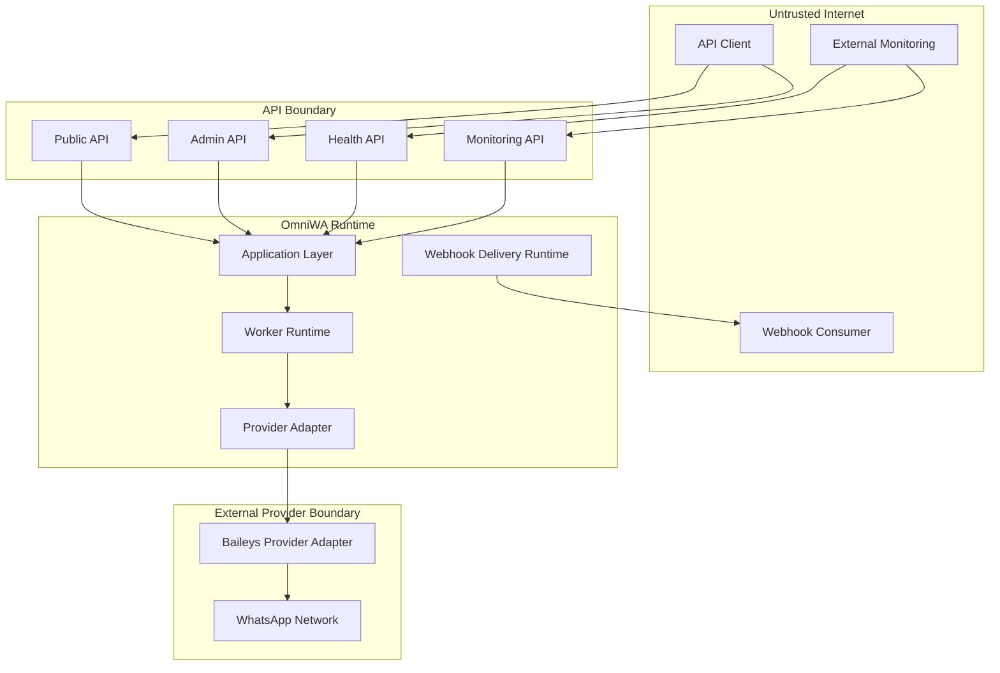

# API Boundaries

## Boundary Principles

- Boundaries are security and responsibility boundaries, not deployment design.
- Public API, Admin API, Health/Monitoring API, and Internal Runtime API have different authentication and data exposure rules.
- Webhook Delivery is outbound work from OmniWA to a configured webhook consumer. It is not an inbound public API.
- API must not expose Domain, Provider, queue, or database internals.

## Boundary Catalog

| Boundary | Purpose | Who Can Access | Auth Requirement | Data Exposure | MVP |
|---|---|---|---|---|---|
| Public API | Product API for instance, messaging, media, webhook subscription, and safe status | API clients owned by developer-led SaaS builders and internal teams | API Key | Product-safe resources only | Yes |
| Admin API | Restricted operations for configuration, audit, provider, diagnostics, destructive lifecycle, and operational control | Operator or trusted internal admin | Admin Key | Access-safe operational data | Yes |
| Internal Runtime API | Runtime signal boundary for worker, scheduler, provider adapter, and internal processing if exposed over transport | Trusted runtime components only | Internal runtime identity | Internal command signal only; no public data | Internal |
| Health API | Liveness and readiness | Monitoring and deployment systems | Minimal liveness can be unauthenticated; readiness/details require auth | No sensitive data | Yes |
| Monitoring API | Metrics, worker status, queue visibility, action-required items | Monitoring system and operators | Monitoring scope or Admin Key | Aggregated operational data | Yes |
| Webhook Receiver API | Inbound callback endpoint owned by OmniWA | Not part of MVP public contract unless a future inbound integration is approved | Auth required if introduced | Future only | Future |
| Webhook Delivery Boundary | Outbound HTTP delivery from OmniWA to user-owned webhook endpoint | Webhook consumer receives outbound calls | Outbound signing secret or configured verification | Integration event data only; no secrets | Yes |

## Public API Boundary

Public API includes authenticated access to:

- Instance lifecycle operations.
- QR pairing workflow.
- MVP message send operations.
- Media registration and status.
- Webhook subscription management.
- Safe status and history queries.

Public API must not expose:

- Admin-only configuration.
- Raw provider payloads.
- Session secrets.
- Internal queue control.
- Full audit records unless explicitly authorized through Admin API.

## Admin API Boundary

Admin API includes:

- Configuration validation and activation.
- Audit record queries.
- Provider capability refresh.
- Restricted diagnostic capture.
- Destructive or high-risk operations.
- Webhook dead-letter and replay operations when allowed.

Admin API requires stronger authentication and authorization than Public API. Admin API must still call Application commands and queries.

## Internal Runtime Boundary

Internal Runtime API is not a user-facing contract. It represents trusted runtime entry points that may be transport-based later.

Internal runtime interactions include:

- Provider signal translation.
- Worker job lifecycle.
- Webhook delivery work.
- Scheduler-triggered cleanup or retry.

If exposed over a network in the future, it must be authenticated independently and unavailable from the public internet.

## Health And Monitoring Boundary

Health API has two levels:

| Level | Authentication | Allowed Content |
|---|---|---|
| Minimal liveness | May be unauthenticated | Process is alive only |
| Readiness and detailed health | Required | Safe service readiness, dependency state, action-required summaries |

Monitoring API always requires authentication because it may reveal operational capacity, failure rates, queue state, or provider health.

## Webhook Boundary

OmniWA sends webhook deliveries to configured external endpoints. This is outbound integration work.

Webhook Delivery must:

- Be asynchronous.
- Be idempotent from OmniWA delivery perspective.
- Include correlation/request trace metadata when safe.
- Be signed or verifiable by the receiver.
- Avoid session secrets, raw provider payloads, and data outside the event contract.

Webhook Delivery must not:

- Be treated as an inbound API.
- Allow consumers to mutate OmniWA state by returning special payloads.
- Bypass retry and dead-letter policy.

## Boundary Diagram

## Boundary Auth Matrix

| Boundary | API Key | Admin Key | Monitoring Scope | Internal Runtime Identity | No Auth |
|---|---:|---:|---:|---:|---:|
| Public API | Yes | Yes | No | No | No |
| Admin API | No | Yes | No | No | No |
| Internal Runtime API | No | No | No | Yes | No |
| Minimal Liveness | No | No | No | No | Allowed only if no product data |
| Detailed Health | Yes | Yes | Yes | No | No |
| Monitoring API | No | Yes | Yes | No | No |
| Webhook Delivery | Not applicable | Not applicable | Not applicable | Not applicable | Outbound signed delivery |
