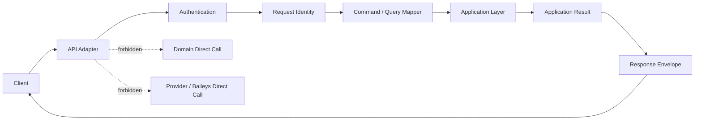

# API Conventions

## Convention Principles

- API naming must be predictable for developers and stable across versions.
- API responses must be safe, structured, and traceable.
- Commands and queries must remain distinguishable at the API surface.
- Public API conventions must not expose implementation details from Domain, Provider, database, queue, or Baileys.

## URL Naming

| Convention | Rule |
|---|---|
| Version prefix | `/v1` |
| Resource names | Lowercase plural nouns |
| Multi-word resource paths | Kebab-case, for example `webhook-deliveries` |
| Path parameters | Snake case inside braces in documentation, for example `{instance_id}` |
| Action paths | Use only when an operation is a command that is not simple create/update/delete |
| Resource nesting | Use nesting when the child resource is naturally scoped by parent, for example instance messages |

## HTTP Method Usage

| Method | API Meaning |
|---|---|
| GET | Query only; no state change |
| POST | Create resource or execute command |
| PATCH | Partial resource update where supported by Application command |
| DELETE | Retire, destroy, or cancel when product semantics allow |

Rules:

- Queries must not have side effects.
- Commands must not be represented as GET.
- Async commands return accepted or queued visibility, not provider final delivery.
- Retry and action operations require idempotency when duplicate-prone.

## Resource Naming

| Concept | Resource Name |
|---|---|
| Instance | `instances` |
| QR pairing | `qr` or `pairing` under instance scope |
| Message | `messages` |
| Media | `media` |
| Webhook subscription | `webhooks` |
| Webhook delivery | `webhook-deliveries` |
| Provider capability | `providers` |
| Health | `health` |
| Metrics | `metrics` |
| Worker job | `worker-jobs` |
| Configuration | `configuration` |
| Audit record | `audit-records` |

## ID Format

API IDs are opaque strings. Clients must not infer database type, provider identity, shard, or timestamp from an ID.

Recommended public prefixes:

| Resource | Prefix |
|---|---|
| Instance | `inst_` |
| Message | `msg_` |
| Media | `media_` |
| Webhook subscription | `wh_` |
| Webhook delivery | `whd_` |
| Worker job | `job_` |
| Configuration snapshot | `cfg_` |
| Audit record | `audit_` |
| Correlation | `corr_` |

Provider IDs, phone numbers, and JIDs must not be used as public resource IDs.

## Time Format

- All API timestamps use RFC 3339 / ISO 8601 UTC format.
- Time values must include timezone marker, preferably `Z`.
- API must not return local server timezone values.
- Duration values use explicit unit naming, for example seconds or milliseconds in field name.

## Field Naming

| Field Type | Convention |
|---|---|
| JSON fields | `snake_case` |
| Status enum values | `lower_snake_case` |
| Error codes | `lower_snake_case` |
| Boolean values | Prefer `is_`, `has_`, `can_`, or `should_` prefixes |
| Count fields | Explicit noun, for example `retry_count` |
| Duration fields | Include unit, for example `timeout_ms` |

## Status Naming

Status values should use product lifecycle language already defined in Domain and Runtime documents.

Examples:

- Instance: `created`, `connecting`, `qr_pending`, `connected`, `disconnected`, `logged_out`, `destroyed`.
- Message: `created`, `queued`, `processing`, `sent`, `delivered`, `read`, `failed`, `cancelled`.
- Webhook delivery: `pending`, `delivering`, `delivered`, `retrying`, `failed`, `dead_letter`.
- Worker job: `queued`, `reserved`, `running`, `completed`, `retrying`, `dead`.

Unknown future status values must be handled conservatively by clients.

## Error Naming

API error codes map from Application error categories.

| Application Error Category | API Error Code Family |
|---|---|
| ApplicationValidationError | `validation_error` |
| ApplicationAuthorizationError | `authorization_error` |
| ApplicationConflictError | `conflict_error` |
| ApplicationWorkflowError | `workflow_error` |
| ApplicationAsyncVisibilityError | `async_visibility_error` |
| ApplicationMappingError | `mapping_error` |
| ApplicationConsistencyError | `consistency_error` |
| ApplicationDependencyError | `dependency_error` |
| ApplicationUnknownError | `unknown_error` |

API error details must not include secrets, raw provider payloads, message bodies, raw phone numbers, or raw JIDs.

## Request ID And Correlation ID

| Identifier | Source | Purpose |
|---|---|---|
| Request ID | Client supplied or generated at API boundary | Tracks one API request |
| Correlation ID | Client supplied or generated at workflow boundary | Tracks multi-step workflow across API, Application, worker, webhook, and provider |

Rules:

- API should accept safe client-provided request and correlation identifiers.
- Invalid identifiers are replaced or rejected according to validation rules.
- IDs must be returned in response metadata when safe.
- IDs must be included in logs after redaction rules.

## Response Envelope Strategy

Success responses should include:

- `data`: resource or result representation.
- `meta`: API version, request/correlation identifiers, pagination when applicable, and async visibility when applicable.

Error responses should include:

- Stable error code.
- Human-readable safe message.
- Optional safe details.
- Request/correlation identifiers.

Response envelopes must not include:

- Session secrets.
- API key or admin key secrets.
- Webhook signing secrets.
- Raw provider payloads.
- Raw message body when retention policy forbids it.
- Raw phone numbers or JIDs unless a future policy explicitly permits safe representation.

## Pagination Strategy

Cursor-based pagination is the default for list and history endpoints.

| Resource Family | Pagination Strategy | Filtering |
|---|---|---|
| Messages | Cursor pagination, newest-first default | Instance, message status, direction, created time, updated time |
| Webhook deliveries | Cursor pagination, newest-first default | Webhook subscription, delivery status, event type, time range |
| Media | Cursor pagination, newest-first default | Media status, media type, instance, created time |
| Audit records | Cursor pagination, append-only ordering | Actor key ID, action type, resource type, time range |
| Event logs future | Cursor pagination with time range | Event type, context, correlation ID, time range |

Filtering must not require searching retained message bodies or raw provider payloads.

## API Boundary Diagram

