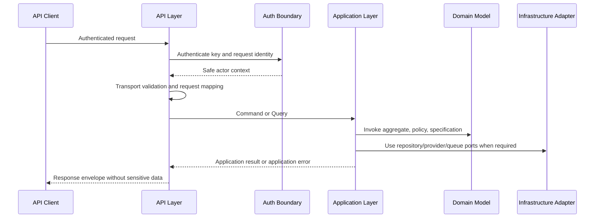

# OmniWA API Overview

## Purpose

OmniWA API is the public and administrative interface for developer-led SaaS builders and internal technical teams to operate WhatsApp automation through OmniWA.

The API exposes product capabilities that were approved in Product, Architecture, Domain, and Application freezes:

- Instance lifecycle and connection status.
- QR pairing workflow.
- Text and MVP media message submission.
- Message status and delivery history.
- Media registration and processing status.
- Webhook subscription and delivery visibility.
- Operational health, metrics, configuration, and audit visibility.

## Primary Audience

| Audience | API Need | Boundary |
|---|---|---|
| Developer-led SaaS builder | Integrate instance, messaging, media, and webhook workflows into a SaaS product | Public API |
| Internal technical team | Operate OmniWA safely, observe state, rotate configuration, inspect audit records | Admin API |
| Webhook consumer owner | Configure and monitor webhook subscriptions and delivery attempts | Public API and Admin API |
| Monitoring system | Read health and operational signals | Health and Monitoring API |

## What The API Does Not Do

The API does not:

- Replace WhatsApp Cloud API.
- Expose Baileys or provider-native behavior as product contract.
- Bypass product guardrails, compliance policy, rate limits, or authorization.
- Guarantee final WhatsApp delivery after accepting asynchronous work.
- Expose session secrets, raw provider payloads, raw phone numbers, raw JIDs, or message bodies beyond retention rules.
- Support campaign, broadcast, group administration, contact, chat, or unsupported advanced message APIs in MVP.
- Provide direct database, queue, worker, or provider control.

## API Layer Relationship To Application Layer

The API Layer is an Interface adapter. It translates authenticated transport requests into approved Application commands and queries, then maps Application results into safe external responses.

| API Responsibility | Application Responsibility |
|---|---|
| Authenticate request identity | Authorize product operation through approved access decisions |
| Validate transport shape and safe input format | Orchestrate use cases and workflows |
| Map request to command/query | Enforce command/query boundary |
| Map application errors to API errors | Preserve domain and workflow semantics |
| Return accepted, queued, completed, or failed API-level status | Own asynchronous visibility and lifecycle state |

## Why API Must Not Call Domain Directly

The API must not call Domain directly because:

- Application commands and queries are the frozen contract for use cases.
- Idempotency, transaction timing, workflow orchestration, and authorization boundaries live in Application design.
- Domain objects protect business invariants but do not know transport, authentication, or response envelopes.
- Direct Domain access would duplicate orchestration logic and create inconsistent behavior between API, worker, scheduler, and provider-signal entry points.

## Why API Must Not Call Provider Or Baileys Directly

The API must not call Provider or Baileys directly because:

- Provider behavior is behind the approved provider abstraction.
- Baileys instability and provider-native payloads must not leak into public API contracts.
- External provider failures must be translated into provider/application errors.
- Sending and receiving messages are asynchronous workflows, not synchronous provider calls.
- Direct provider access would bypass compliance guardrails, retry policy, queue visibility, and audit.

## API Surface Summary

| Surface | Purpose | Primary Boundary | MVP |
|---|---|---|---|
| Instance API | Create, connect, disconnect, reconnect, destroy, and inspect instances | Public API | Yes |
| QR API | Start, refresh, and inspect QR pairing through instance workflow | Public API | Yes |
| Message API | Submit text/media messages and inspect message lifecycle | Public API | Yes |
| Media API | Register media and inspect processing state | Public API | Yes |
| Webhook API | Manage webhook subscriptions and delivery visibility | Public API | Yes |
| Provider API | Inspect provider compatibility and capability state | Admin API | Yes |
| Health API | Read safe health state | Health and Monitoring API | Yes |
| Metrics API | Read operational metrics snapshots | Monitoring API | Yes |
| Admin API | Manage configuration, audit, diagnostics, and restricted operations | Admin API | Yes |

## API Guardrails

The API must enforce these guardrails before a request can reach the Application Layer or before a response is returned:

| Guardrail | Enforcement |
|---|---|
| Do not send if instance is not connected | API maps to Application command that checks instance/session state and returns safe failure |
| Do not send unsupported message type | API accepts only MVP message types: text, image, video, document, audio |
| Do not expose QR without authentication | QR resource is always authenticated and scoped |
| Do not expose session secret | Session output is limited to safe status and lifecycle information |
| Do not log sensitive request body | API logging redacts message body, media reference, webhook secret, raw phone/JID, and provider payload |
| Do not bypass Application Layer | Every API operation must trace to an approved command or query |

## API To Application Flow

## Phase 4.1 Checklist

| Item | Status |
|---|---|
| API surface defined | PASS |
| Resource model defined | PASS |
| Endpoint groups defined | PASS |
| API boundaries defined | PASS |
| Versioning defined | PASS |
| Auth model defined | PASS |
| Authorization model defined | PASS |
| Conventions defined | PASS |
| Traceability completed | PASS |

**Phase 4.1 is ready for review.**
