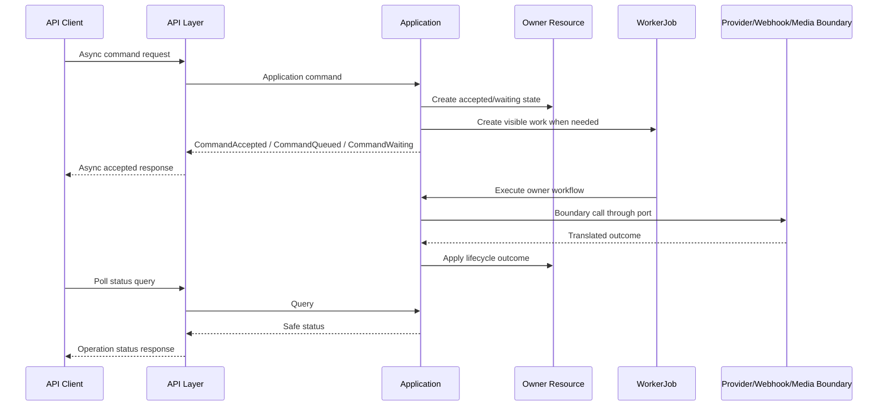

# Async Operation Model

## Purpose

This document defines the conceptual API contract for asynchronous operations in OmniWA Phase 4.2.

It does not define queue implementation, worker implementation, BullMQ, OpenAPI, JSON Schema, HTTP status codes, DTO classes, database schema, or source code.

## Async Principles

- API must not block on external provider final completion.
- Application must create visible owner state or WorkerJob-visible lifecycle before API reports accepted async work.
- Every duplicate-prone async request requires idempotency.
- Polling must use approved queries.
- Cancellation is available only when the workflow and domain lifecycle allow it.
- Async operation state must be safe, traceable, and redacted.

## Async Operation Families

| Operation Family | API Trigger | Application Command | Workflow | Status Query | Primary Domain Events |
|---|---|---|---|---|---|
| Send Text Message | Message API command request | SendTextMessage | WF-MSG-001, WF-MSG-003 | GetMessageStatus | MessageAccepted, MessageQueued, WorkerJobQueued, MessageDispatched, MessageDelivered, MessageFailed |
| Send Media Message | Message API command request | SendMediaMessage, RegisterMedia if needed | WF-MSG-002, WF-MED-001, WF-MED-002, WF-MSG-003 | GetMessageStatus, GetMediaStatus | MediaAccepted, MediaProcessed, MessageAccepted, MessageQueued, MessageFailed |
| Media Upload / Registration | Media API command request | RegisterMedia | WF-MED-001, WF-MED-002 | GetMediaStatus | MediaAccepted, MediaProcessingStarted, MediaProcessed, MediaFailed |
| Webhook Retry | Webhook API command request | RetryWebhookDelivery | WF-WEB-003 | GetWebhookStatus, GetWebhookDeliveryHistory | WebhookDeliveryRetryScheduled, WebhookDeliverySucceeded, WebhookDeliveryFailed, WebhookDeliveryDeadLettered |
| Reconnect | Instance API command request or scheduler | ReconnectInstance | WF-INS-004 | GetInstanceStatus | WorkerJobQueued, InstanceConnected, InstanceDisconnected, InstanceActionRequired |
| QR Authentication | Instance API command request | StartQrPairing, RefreshQrPairing, ConfirmSessionActivated | WF-INS-003 | GetInstanceStatus | SessionPairingStarted, SessionPending, SessionActivated, InstanceConnected |
| Provider Capability Refresh | Admin command request | RefreshProviderCapability | WF-PRV-001 | GetProviderCapabilityStatus | ProviderCapabilityChanged, ProviderProfileSupported, ProviderProfileDegraded |
| Configuration Activation | Admin command request | ActivateConfigurationSnapshot | WF-ADM-001 | GetConfigurationStatus | ConfigurationActivated, ConfigurationSuperseded, AuditRecorded |

## Async Accepted Contract

An async accepted response means:

- The request passed API boundary checks.
- Application accepted the command or placed it in waiting state.
- Owner state, WorkerJob, or operation visibility exists.
- The caller can inspect status using an approved query.

It does not mean:

- WhatsApp delivered the message.
- Provider accepted the final send.
- Webhook consumer received the event.
- Media processing is complete.
- Reconnect succeeded.
- QR was scanned.

## Operation Status Model

| Status Category | Meaning |
|---|---|
| accepted | Application accepted intent and owner state exists |
| queued | Worker-visible work exists |
| waiting | External actor/provider/user action is required or pending |
| processing | Worker or owner workflow is currently executing |
| retrying | Retry is scheduled or in progress |
| completed | Application responsibility is complete for that operation |
| failed | Operation failed with safe failure category |
| cancelled | Operation was stopped where lifecycle allowed |
| dead_letter | Retry budget exhausted or operator recovery required |
| action_required | Human/operator/config/provider action is required |

Status names must align with owner resource lifecycle where applicable.

## Polling Contract

Polling uses read-only queries.

Rules:

- Polling must not trigger refresh or retry.
- Polling response may include staleness marker.
- Polling must respect authorization and instance boundaries.
- Polling must not expose internal worker payload or provider payload.
- Polling frequency may be rate-limited.

## Cancellation Contract

Cancellation is not universal.

| Operation | Cancellation Position |
|---|---|
| Outbound message | Allowed only before lifecycle passes cancellation point |
| Media processing | Allowed only if no dependent accepted message requires the media |
| Webhook delivery | Allowed only before delivered/dead terminal state and according to subscription policy |
| Reconnect | Allowed only if workflow has not reached provider/runtime state where cancellation is unsafe |
| QR authentication | Can expire or refresh; cannot cancel provider-auth success after it is applied |
| Configuration activation | Not cancellable after activation fact is durable |

Cancellation failure must return explicit non-cancellable outcome rather than pretending success.

## Long-Running Operation Rules

Long-running operations must:

- Carry correlation ID across API, Application, Worker, Provider, and Webhook boundaries.
- Preserve idempotency across retries.
- Surface retry count or retry classification when safe.
- Surface action-required state when operator/user/provider repair is needed.
- Move exhausted retries to failed, dead-letter, or action-required state.

Long-running operations must not:

- Hide accepted work.
- Retry terminal business failures.
- Skip intermediate visible state.
- Expose raw job payloads or provider internals.

## Async Flow

## Failure Handling

| Failure Timing | Contract Outcome |
|---|---|
| Before acceptance | Error response; no async accepted response |
| Accepted but visibility cannot be created | Error response or failed visible state; never claim accepted invisible work |
| Worker retryable failure | Operation status becomes retrying with safe classification |
| Worker non-retryable failure | Operation status becomes failed or dead_letter |
| Provider action required | Operation status becomes action_required |
| Polling read unavailable | Query unavailable/stale response; must not mutate operation |

## Async Traceability

| Async Contract | Use Case Source | Command / Query Source | Workflow Source | Domain Event Source |
|---|---|---|---|---|
| Send Message | UC-MSG-001, UC-MSG-002 | SendTextMessage, SendMediaMessage, GetMessageStatus | WF-MSG-001, WF-MSG-002, WF-MSG-003 | Message and WorkerJob events |
| Media Processing | UC-MED-001, UC-MED-006 | RegisterMedia, GetMediaStatus | WF-MED-001, WF-MED-002 | Media and WorkerJob events |
| Webhook Retry | UC-WEB-008, UC-WEB-010 | RetryWebhookDelivery, GetWebhookDeliveryHistory | WF-WEB-003 | WebhookDelivery and WorkerJob events |
| Reconnect | UC-INS-008, UC-INS-011 | ReconnectInstance, GetInstanceStatus | WF-INS-004 | Instance, Session, WorkerJob events |
| QR Pairing | UC-INS-004, UC-INS-005, UC-INS-006 | StartQrPairing, RefreshQrPairing, GetInstanceStatus | WF-INS-003 | Session and Instance events |
| Long-running Operations | Runtime reliability use cases | Owner commands and queries | Long-running workflows | Owner and WorkerJob events |
