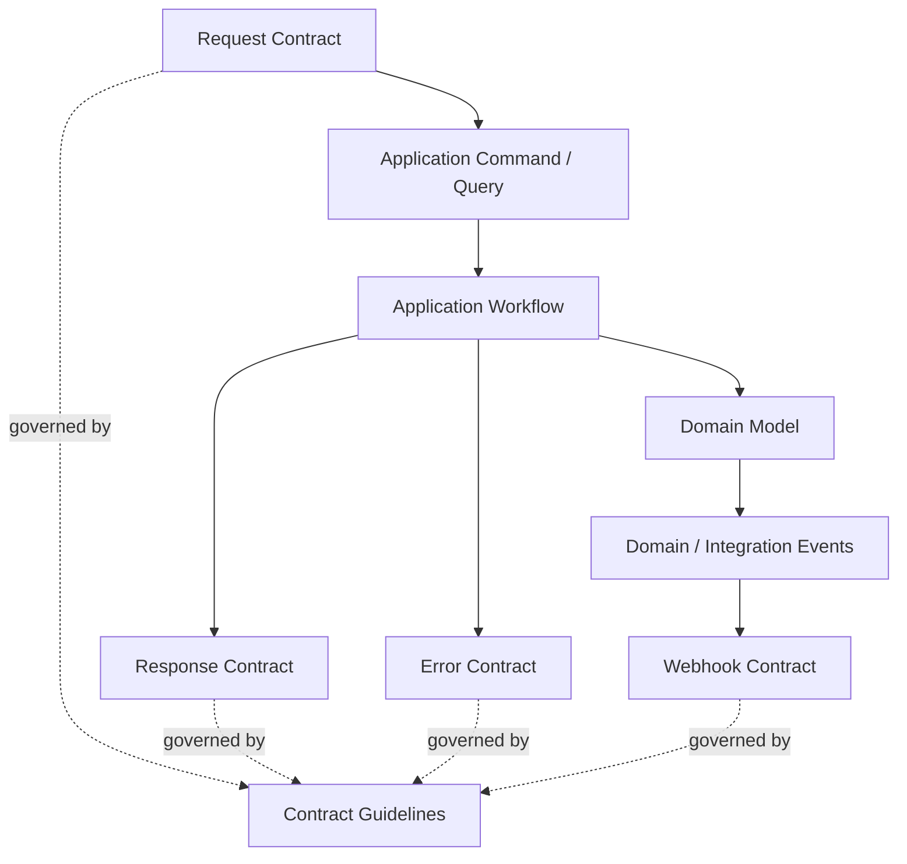

# API Contract Guidelines

## Purpose

This document defines cross-cutting API contract guidelines for OmniWA Phase 4.2.

It does not define OpenAPI, JSON Schema, DTO classes, controllers, HTTP status codes, database schemas, provider payloads, or source code.

## Contract Principles

- API contract is an Interface adapter contract over the frozen Application Layer.
- Every operation must trace to an Application command or query.
- Every externally visible product fact must trace to Domain language or Integration Event governance.
- Contract changes must preserve product safety, sensitive data rules, and async visibility.
- API contracts must remain stable within `/v1` unless a breaking change requires a new major version.

## Backward Compatibility

Compatible changes:

- Adding optional safe response metadata.
- Adding optional safe resource fields.
- Adding new safe enum values when clients are instructed to handle unknown values.
- Adding new endpoint groups only after product scope approval.
- Adding new Integration Events with `.v1` where governance approves external exposure.

Incompatible changes:

- Removing required response meaning.
- Renaming error codes.
- Changing async accepted semantics.
- Changing idempotency behavior in a way that can duplicate side effects.
- Changing event business meaning within the same version.
- Returning sensitive data previously not exposed.
- Making a query mutate state.

## Breaking Change Policy

Breaking API changes require:

- New API major version or explicit approved migration plan.
- Updated contract documentation.
- Updated traceability to Application/Domain.
- Compatibility window unless security or compliance risk requires immediate change.
- Review against Product, Architecture, Domain, and Application freezes.

## Null Handling

Null handling rules:

- Prefer omission for optional unavailable fields when absence is unambiguous.
- Use explicit null only when the distinction between absent, unknown, and intentionally empty is meaningful.
- Use status markers for unknown, unavailable, stale, expired, or redacted data.
- Do not use null to hide authorization failure.
- Do not use null to represent Secret data. Use safe redaction markers instead.

## Enum Evolution

Enum values use `lower_snake_case`.

Rules:

- Clients must handle unknown enum values conservatively.
- API must not repurpose an existing enum value.
- Terminal states must not later become non-terminal within the same version without review.
- Provider-native status values must be translated before becoming API enum values.
- New enum values that alter workflow behavior may require version review.

## Optional Fields

Optional fields are allowed when:

- They are safe.
- Their absence does not change core meaning.
- They can be ignored by existing clients.
- They do not imply new product scope.
- They do not leak implementation details.

Optional fields are not allowed when:

- They carry Secret or raw Confidential values.
- They expose provider-native payload names.
- They alter idempotency, authorization, or async semantics.

## Unknown Fields

Clients must:

- Ignore unknown optional fields.
- Preserve stable known fields.
- Not treat unknown fields as evidence of new supported capability.

Server must:

- Avoid requiring clients to echo unknown fields.
- Not depend on unknown fields for command behavior.
- Reject unknown request fields only when accepting them would create safety risk or ambiguity.

## Deprecation

Deprecation requires:

- Clear reason.
- Replacement contract when applicable.
- Compatibility window.
- Documentation update.
- Response metadata marker when safe.
- Monitoring of affected usage where feasible.

Compatibility windows:

- Stable GA public API: at least 180 days.
- MVP preview API: at least 90 days unless security/compliance risk requires faster removal.
- Webhook Integration Event deprecation follows Event Versioning governance.

## Sensitive Data Contract Rules

API contracts must never expose:

- Session secrets.
- API key or admin key secrets.
- Webhook signing secrets.
- Raw provider payloads.
- Raw Baileys callbacks.
- Raw phone numbers or JIDs by default.
- Raw message bodies outside retention and product policy.
- Raw media binary through status/history contracts.
- Stack traces, SQL errors, queue engine payloads, or provider internals.

Sensitive data should be represented with:

- Opaque product IDs.
- Safe status categories.
- Redaction markers.
- Data classification markers.
- Correlation references.

## Contract Traceability Matrix

| Contract | Use Case Source | Command / Query Source | Workflow Source | Domain Event Source |
|---|---|---|---|---|
| Request Model | Phase 3.1 use case inventory | Command and Query Catalogs | Workflow Catalog | Domain Events only through Application outcomes |
| Response Model | Status, command, history, monitoring use cases | Application Messages, Command/Query Catalogs | WF-QRY and owner workflows | Owner lifecycle events and WorkerJob events |
| Error Model | All use cases | Application Error Strategy | Failure branches of owner workflows | Domain Errors and translated provider/infrastructure events |
| Pagination Model | List/history/metrics/audit use cases | Query Catalog | WF-QRY-001 | Retained lifecycle/audit/telemetry events |
| Filtering And Sorting | Query/status/history use cases | Query Catalog | WF-QRY-001 | Retained owner events |
| Async Operation Model | Long-running use cases | Async commands and status queries | WF-INS, WF-MSG, WF-MED, WF-WEB, WF-PRV, WF-ADM | Owner events and WorkerJob events |
| Webhook Contract | Webhook subscription and delivery use cases | Webhook commands and queries | WF-WEB-001 through WF-WEB-003 | Integration Events from EVENT_CATALOG |

## Contract Governance

Before adding or changing API contract behavior, answer:

| Question | Required Answer |
|---|---|
| Which Product Scope item allows this? | Explicit scope or approved future decision |
| Which Application command/query owns it? | One approved command/query |
| Which workflow orchestrates it? | One approved workflow or documented workflow category |
| Which Domain context owns the meaning? | One owner context |
| Does it expose data? | Classification and redaction rule documented |
| Is it async? | Visibility, polling, idempotency, and retry rules documented |
| Is it external webhook behavior? | Integration Event version and governance documented |
| Is it breaking? | Versioning/deprecation plan documented |

## Mermaid Overview

## Phase 4.2 Checklist

| Item | Status |
|---|---|
| Request model defined | PASS |
| Response model defined | PASS |
| Error model defined | PASS |
| Pagination defined | PASS |
| Filtering defined | PASS |
| Async model defined | PASS |
| Webhook contract defined | PASS |
| Contract guidelines defined | PASS |

**Phase 4.2 is ready for review.**
