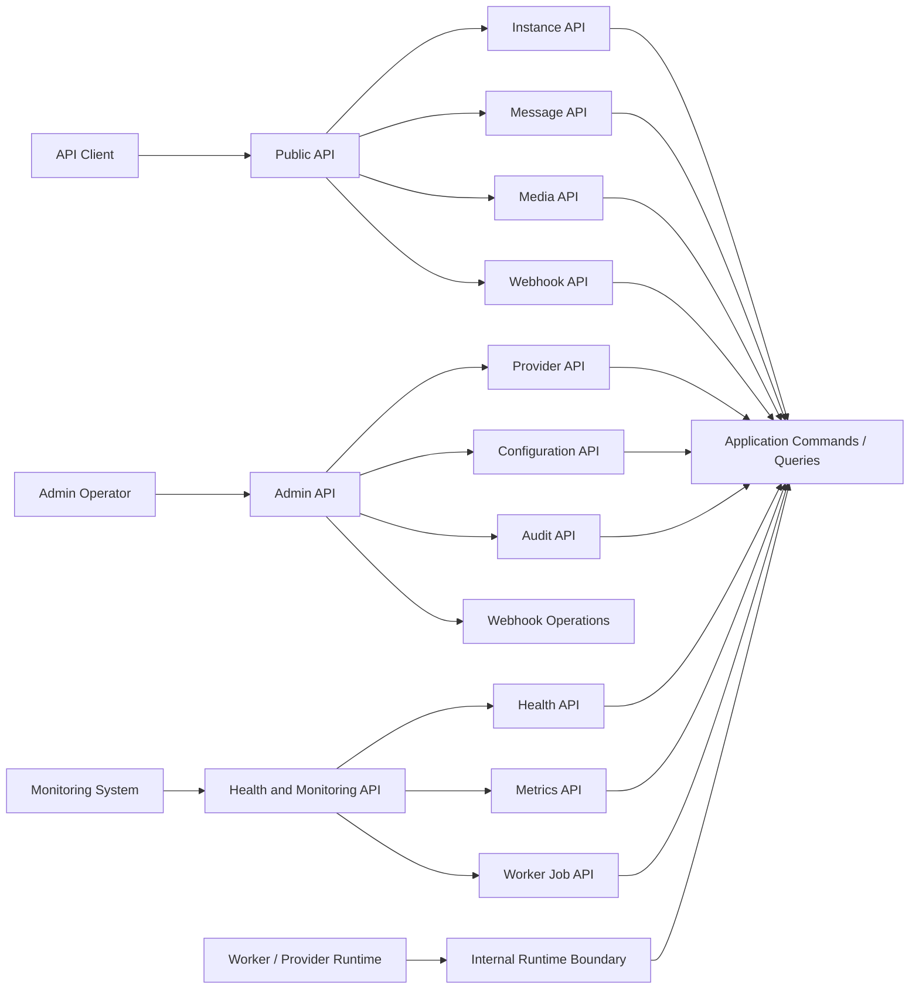

# Endpoint Groups

## Endpoint Group Principles

- Endpoint groups describe API surface only; they are not OpenAPI definitions.
- Every command endpoint must map to one Application command.
- Every query endpoint must map to one Application query.
- Async command endpoints must expose accepted or queued state without implying external completion.
- Public endpoints require API authentication unless explicitly identified as minimal health checks.

## Endpoint Group Catalog

| Group | Surface Path Family | Resources | Operation Families | Application Mapping | Auth Boundary | Scope |
|---|---|---|---|---|---|---|
| Instance API | `/v1/instances` | Instance, safe Session, QR | Create, list, inspect, update metadata, connect, disconnect, reconnect, destroy, start/refresh QR | Instance commands and queries | API Key; Admin Key for destructive/restricted operations | MVP |
| Message API | `/v1/instances/{instance_id}/messages` | Message | Send text, send media, inspect status, inspect delivery history, retry, cancel | Messaging commands and queries | API Key scoped to instance; Admin Key for override visibility | MVP |
| Media API | `/v1/media` and instance-scoped media paths when needed | Media | Register media, inspect media status, request diagnostic capture if allowed | Media commands and queries | API Key; Admin Key for diagnostics | MVP |
| Webhook API | `/v1/webhooks` and `/v1/webhook-deliveries` | WebhookSubscription, WebhookDelivery | Register, update, activate, suspend, retire, inspect status, inspect delivery history, retry delivery | Webhook commands and queries | API Key; Admin Key for dead-letter or restricted replay | MVP |
| Provider API | `/v1/providers` | Provider | Inspect provider capability, refresh capability, inspect compatibility | Provider commands and queries | Admin Key | MVP |
| Health API | `/v1/health` | Health | Read liveness, readiness, safe operational status | Health queries | Minimal health may be unauthenticated; detailed health requires auth | MVP |
| Monitoring API | `/v1/metrics`, `/v1/worker-jobs`, `/v1/action-required` | Metrics, WorkerJob, Health | Read metric snapshots, queue/worker status, action-required items | Monitoring queries | Admin Key or monitoring-scoped API Key | MVP |
| Configuration API | `/v1/admin/configuration` | Configuration | Validate configuration, activate configuration, inspect configuration status | Configuration commands and queries | Admin Key | MVP |
| Audit API | `/v1/admin/audit-records` | AuditRecord | Query safe audit evidence | Audit queries | Admin Key | MVP access-safe |
| Internal Runtime API | Internal path only if required by deployment | WorkerJob, Provider signal, WebhookDelivery | Runtime callbacks and translated provider/worker signals | Internal commands | Internal trust boundary only | Internal |

## Instance API

Instance API is the primary surface for managing Single Tenant + Multi Instance runtime.

Allowed operation families:

- Create an instance.
- List instances.
- Inspect instance status, including safe session state.
- Update instance metadata.
- Connect, disconnect, and reconnect instance.
- Start or refresh QR pairing.
- Destroy an instance with restricted authorization.

Not allowed:

- Direct session secret read.
- Direct provider connection manipulation.
- Direct Baileys event access.

## Message API

Message API is the public surface for MVP message types: text, image, video, document, and audio.

Allowed operation families:

- Submit outbound text message.
- Submit outbound media message.
- Inspect message status.
- Inspect message delivery history.
- Retry or cancel eligible message workflows.

Not allowed:

- Unsupported message types.
- Broadcast or campaign behavior.
- Direct provider send.
- Sending when the instance is not connected.

## Media API

Media API exposes media registration and status for message workflows.

Allowed operation families:

- Register media metadata/reference.
- Inspect media processing status.
- Inspect media metrics through monitoring boundary.

Not allowed:

- Permanent media hosting promise.
- Raw binary retention guarantee beyond retention policy.
- Serving confidential media without authorization and retention checks.

## Webhook API

Webhook API manages outbound webhook subscriptions and visibility of delivery attempts.

Allowed operation families:

- Register, update, activate, suspend, and retire webhook subscriptions.
- Inspect subscription health.
- Inspect delivery history.
- Retry eligible failed deliveries.
- Move delivery to dead letter through restricted operation.

Not allowed:

- Treating webhook delivery as an inbound public API.
- Bypassing retry, dead-letter, and idempotency rules.
- Exposing webhook signing secrets.

## Provider API

Provider API is administrative and read-heavy. It exists to expose safe provider capability and compatibility state.

Not allowed:

- Raw Baileys object exposure.
- Provider-native payload passthrough.
- Direct provider lifecycle manipulation from public API.

## Health And Monitoring API

Health and Monitoring APIs expose safe operational visibility.

- Minimal process liveness may be unauthenticated only if it contains no product, tenant, instance, provider, queue, or sensitive state.
- Readiness, health details, action-required items, metrics, queue status, and worker status require authentication.

## Endpoint Group Diagram

## Endpoint Group Traceability

| Endpoint Group | Product Scope | Use Case Group | Command / Query Mapping | Domain Context |
|---|---|---|---|---|
| Instance API | Instance | Instance | CreateInstance, ConnectInstance, DisconnectInstance, ReconnectInstance, DestroyInstance, GetInstanceStatus, ListInstances | Instance, Session |
| Message API | Messaging | Messaging | SendTextMessage, SendMediaMessage, RetryMessageSend, CancelMessage, GetMessageStatus, GetMessageDeliveryHistory | Messaging |
| Media API | Media | Media | RegisterMedia, GetMediaStatus | Media |
| Webhook API | Webhook | Webhook | Webhook subscription commands, webhook delivery commands, GetWebhookStatus, GetWebhookDeliveryHistory | Webhook |
| Provider API | Provider abstraction | Provider | EvaluateProviderCompatibility, RefreshProviderCapability, GetProviderCapabilityStatus | Provider |
| Health API | Observability | Monitoring | GetHealthStatus, GetActionRequiredItems | Health |
| Monitoring API | Observability, Queue | Monitoring, Operations | Metrics snapshot queries, GetWorkerJobStatus | Observability, Operations |
| Configuration API | Configuration | Administration | ValidateConfigurationSnapshot, ActivateConfigurationSnapshot, GetConfigurationStatus | Configuration |
| Audit API | Audit | Administration | QueryAuditRecords | Audit |
| Internal Runtime API | Runtime processing | Provider, Operations, Webhook | Provider signal commands, worker job lifecycle commands, webhook delivery work commands | Provider, Operations, Webhook |
