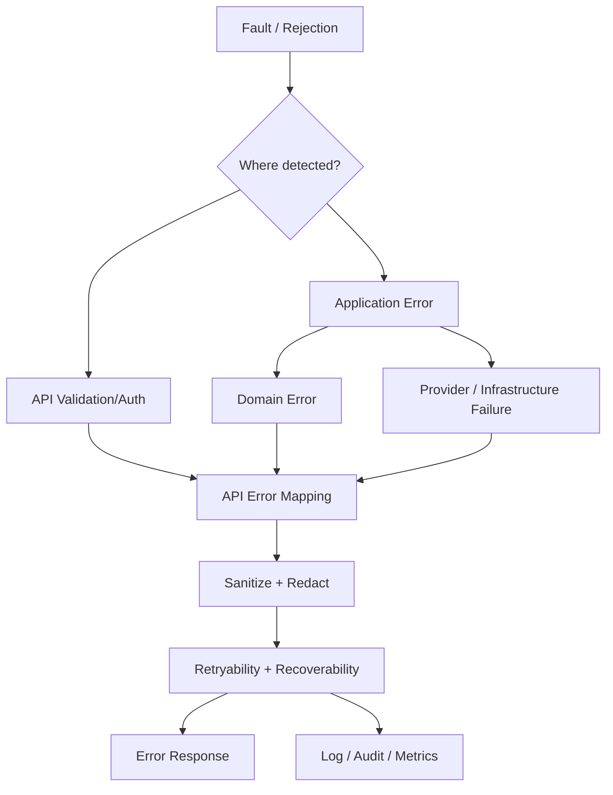

# API Error Model

## Purpose

This document defines the conceptual API error model for OmniWA Phase 4.2.

It does not define HTTP status codes, OpenAPI error schemas, exception classes, source code, log formatter implementation, provider error payloads, or database errors.

## Error Principles

- API errors map from Application error categories and safe Domain error meaning.
- Error output uses product-safe vocabulary.
- Retryability and recoverability must be explicit when known.
- API errors must not reveal secrets, raw provider payloads, raw phone/JID, message bodies, media binaries, webhook secrets, stack traces, database errors, queue errors, or Baileys internals.
- Authentication and authorization failures must avoid leaking whether a cross-instance resource exists.

## Error Taxonomy

| API Error Category | Meaning | When Used | Recoverable | Log Level |
|---|---|---|---|---|
| Validation Error | Request shape or safe input format is invalid at API boundary | Missing required conceptual input, invalid ID format, invalid cursor, invalid filter | Caller-correctable | warn |
| Authentication Error | Request identity is missing or invalid | Missing/invalid API key, admin key, monitoring key, internal identity | Caller/operator-correctable | warn; escalate on repeated attempts |
| Authorization Error | Authenticated caller is not allowed to perform operation | Missing scope, wrong instance boundary, admin-only operation | Caller/operator-correctable | warn; audit when privileged |
| Business Error | Domain business rule rejected a valid request | Instance not connected, invalid state transition, inactive webhook subscription | Sometimes | info or warn |
| Provider Error | Translated provider failure affects operation | Provider disconnected, timeout, unsupported provider capability, logged out signal | Sometimes | warn or error |
| Infrastructure Error | Required dependency/port is unavailable or degraded | Repository, queue, secret, configuration, observability, transport failure | Usually retryable only when idempotent | error |
| Rate Limit Error | API or product guardrail throttled request | API key, instance, endpoint, guardrail, receiver pressure | Time-correctable | warn |
| Conflict Error | Duplicate, stale, concurrent, or idempotency conflict | Same idempotency key with different request, concurrent reconnect, stale transition | Caller/operator-correctable | warn |
| Not Found Error | Requested safe resource is not available to caller | Missing resource, outside scope, retention expired when represented as absence | Sometimes | info |
| Retention Error | Requested data is expired or cannot be exposed under retention policy | Message body expired, webhook payload no longer retained, diagnostic capture unavailable | Usually not recoverable for expired data | info or warn |
| Sensitive Data Error | Request/output would expose or process unsafe data | Secret in request, raw provider payload, raw phone/JID, unsafe webhook evidence | Correctable only by redaction/design | error and security audit |
| Internal Error | Unknown failure after sanitization | Unclassified runtime failure | Unknown; treat as retryable only if marked | error or critical |

## Mapping From Application Errors

| Application Error | API Error Mapping |
|---|---|
| ApplicationValidationError | Validation Error |
| ApplicationAuthorizationError | Authorization Error or Authentication Error depending boundary |
| ApplicationConflictError | Conflict Error |
| ApplicationWorkflowError | Business Error, Conflict Error, or Internal Error based on safe classification |
| ApplicationAsyncVisibilityError | Infrastructure Error or Internal Error with async visibility category |
| ApplicationMappingError | Sensitive Data Error or Internal Error |
| ApplicationConsistencyError | Conflict Error or Business Error |
| ApplicationDependencyError | Infrastructure Error, Provider Error, or Webhook transport error |
| ApplicationUnknownError | Internal Error |

## Mapping From Domain Errors

| Domain Error | API Error Mapping | Exposure Rule |
|---|---|---|
| BusinessRuleViolation | Business Error | Safe reason code allowed |
| InvalidStateTransition | Conflict Error or Business Error | Current safe state may be returned |
| UnsupportedCapability | Business Error | Capability category allowed |
| PolicyViolation | Business Error or Rate Limit Error | Policy outcome allowed, no sensitive signal |
| IdentityError | Validation Error or Not Found Error | Do not expose unsafe identity value |
| ConsistencyError | Conflict Error | Safe precondition category allowed |
| SensitiveDataViolation | Sensitive Data Error | Generic safe message only |
| RetentionRuleViolation | Retention Error | Retention marker allowed |
| AccessDecisionViolation | Authorization Error | No cross-instance leak |
| ExternalSignalClassificationError | Provider Error or Infrastructure Error | No raw external signal |
| ConfigurationDomainError | Business Error or Validation Error | Safe configuration category only |

## Retryable And Non-Retryable Errors

| Retry Classification | Meaning | Examples | Client Guidance |
|---|---|---|---|
| Retryable | Same request may succeed later without semantic change | Temporary provider timeout, webhook receiver timeout, dependency unavailable, rate limit after wait | Retry only when idempotent and after guidance |
| Non Retryable | Same request should not be retried unchanged | Unsupported message type, invalid ID, unauthorized operation, destroyed instance | Change request or resolve access/state |
| Action Required | Operator or user must repair condition | Logged out instance, missing secret, unsafe configuration, dead-letter delivery | Resolve indicated action before retry |
| Unknown | Retry safety cannot be determined | Sanitized unexpected error | Retry only if command is idempotent and contract marks it safe |

## Error Response Content

Error responses should include conceptually:

- Stable API error code.
- Safe human-readable message.
- Safe error category.
- Retry classification when known.
- Action-required marker when applicable.
- Request ID and correlation ID.
- Resource or operation reference only when caller is authorized to know it.

Error responses must not include:

- HTTP framework exception names.
- Stack traces.
- SQL/ORM/database details.
- Queue engine details.
- Provider-native error body.
- Baileys callback or socket details.
- Secret or raw Confidential data.

## Log Level Guidance

| Error Category | Default Log Level | Escalation |
|---|---|---|
| Validation Error | warn | Repeated abuse pattern |
| Authentication Error | warn | High frequency, credential stuffing, suspicious source |
| Authorization Error | warn | Privileged access attempt or cross-instance probing |
| Business Error | info or warn | Unexpected spike or action-required |
| Provider Error | warn | Persistent provider degradation |
| Infrastructure Error | error | Dependency outage or data visibility risk |
| Rate Limit Error | warn | Abuse or guardrail pressure |
| Conflict Error | warn | Repeated concurrency/idempotency conflict |
| Not Found Error | info | Cross-instance probing pattern |
| Retention Error | info | Repeated unsafe retention access |
| Sensitive Data Error | error | Security alert and audit |
| Internal Error | error | critical when data integrity or availability is at risk |

## Error Flow

## Error Traceability

| API Error Category | Use Case Source | Command / Query Source | Workflow Source | Domain Event Source |
|---|---|---|---|---|
| Validation Error | All API use cases | All commands/queries | Precondition stage | None |
| Authentication Error | Boundary access | Access decision precondition | API boundary before workflow | AccessDenied if recorded later |
| Authorization Error | Privileged and scoped use cases | EvaluateAccessDecision plus target command/query | WF-ADM-001 and command preconditions | AccessDenied, AccessDecisionExpired |
| Business Error | Instance, messaging, media, webhook use cases | Owner commands | Owner workflow failure branch | MessageRejected, GuardrailBlocked, ConfigurationRejected |
| Provider Error | Provider and runtime use cases | Provider signal/compatibility commands | WF-PRV, WF-MSG, WF-INS | ProviderFailureClassified, ProviderProfileDegraded |
| Infrastructure Error | Async and dependency-backed use cases | Queue/provider/webhook/media commands | Async/worker workflows | WorkerJobDead, HealthDegraded |
| Rate Limit Error | Messaging and guardrail use cases | EvaluateOutboundGuardrails, send commands | WF-MSG-001, WF-MSG-002 | GuardrailThrottled |
| Conflict Error | Lifecycle and idempotency use cases | Connect/reconnect/retry/cancel commands | Owner workflow conflict branches | Invalid transition-related owner events |
| Not Found Error | Query/status use cases | Query catalog | WF-QRY-001 | None |
| Retention Error | History/media/audit use cases | History and media queries | Query and cleanup workflows | MediaExpired, AuditRetentionExpired |
| Sensitive Data Error | Security-sensitive use cases | Mapping/validation/access commands | Redaction and audit workflows | AuditRedactionApplied, TelemetryDropped |
| Internal Error | Any use case | Any command/query | Unknown failure branch | HealthActionRequired if systemic |
