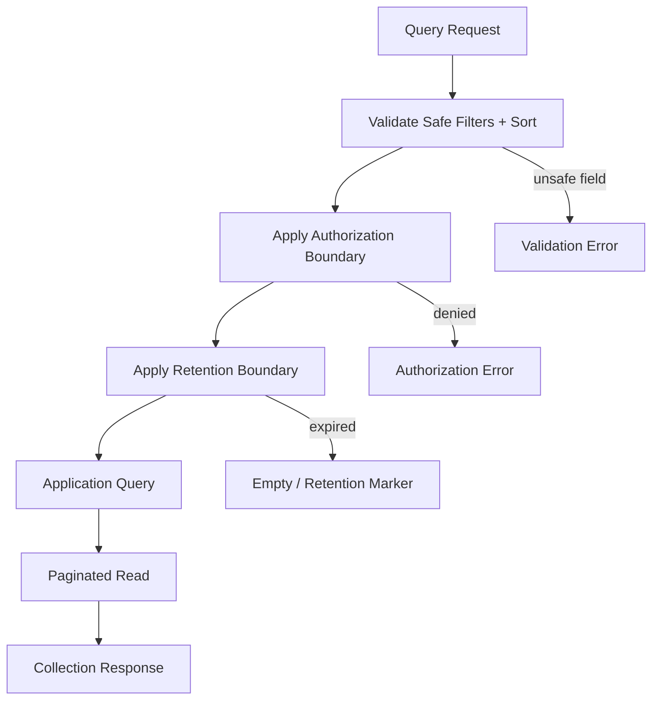

# Filtering And Sorting

## Purpose

This document defines the conceptual filtering, searching, sorting, field selection, and expansion contract for OmniWA Phase 4.2.

It does not define query parameters, OpenAPI syntax, JSON Schema, database indexes, SQL, ORM implementation, or search infrastructure.

## Principles

- Filters must use product-safe fields only.
- Sorting must be deterministic and documented for each collection.
- Searching is restricted and must not imply full-text search over message bodies or raw provider payloads.
- Field selection and expansion are optional contract features and must not expose sensitive data.
- Filtering and sorting must preserve authorization, retention, and instance boundaries.

## Filtering Contract

Filtering narrows a collection by approved safe criteria.

Allowed filter categories:

- Product resource IDs.
- Instance boundary.
- Lifecycle status.
- Message direction and MVP message type category.
- Media category and processing state.
- Webhook subscription/delivery status.
- Worker job lifecycle.
- Health category.
- Provider capability classification.
- Audit action category and time range.
- Correlation ID or request ID where safe.

Forbidden filter categories:

- Raw phone numbers.
- Raw JIDs.
- Raw message body.
- Raw media binary.
- Raw webhook payload.
- Provider-native payload fields.
- Session secret or key material.
- Database row IDs.
- Queue engine fields.

## Searching Contract

Search is not a general MVP capability.

Allowed conceptual search:

- Exact lookup by safe product ID.
- Exact lookup by correlation ID.
- Exact lookup by request ID.
- Future admin audit search over safe audit categories only.

Not allowed:

- Search by raw message text.
- Search by raw WhatsApp phone/JID.
- Search by provider callback payload.
- Search across retained media binary.
- Analytics-style exploratory search unless future product scope approves it.

## Sorting Contract

Sorting defines stable ordering for collections.

| Collection | Default Sorting | Alternate Sorting Candidate | Notes |
|---|---|---|---|
| Instances | Created time or display-safe order | Lifecycle status, updated time | Health summary may be eventual |
| Message delivery history | Newest transition first | Oldest transition first | Retention-bound |
| Webhook delivery history | Newest attempt/update first | Oldest attempt/update first | Active retries may update |
| Media | Newest created or updated first | Status, media category | Binary is not returned |
| Audit records | Newest audit time first | Oldest audit time first | Append-only semantics |
| Worker jobs | Newest lifecycle update first | Oldest pending first | Operational visibility |
| Metrics snapshots | Newest snapshot first | Oldest snapshot first in time window | Snapshot freshness marker required |

Sorting must not:

- Depend on provider-native order.
- Expose database sorting keys.
- Change command behavior.
- Hide active failures behind non-deterministic ordering.

## Field Selection

Field selection is optional and must be conservative.

Allowed:

- Selecting safe top-level resource summary groups.
- Selecting metadata or status views already authorized.
- Reducing response size for collection views.

Forbidden:

- Selecting hidden sensitive fields.
- Selecting raw provider fields.
- Selecting internal infrastructure fields.
- Selecting fields outside retention policy.

If field selection is unsupported for a resource, API should return the default safe representation rather than inventing ad hoc behavior.

## Expansion

Expansion includes related safe summaries in a response.

Allowed expansion candidates:

- Instance response including safe health summary.
- Message response including safe worker job summary.
- Webhook subscription response including recent safe delivery summary.
- Media response including safe message association summary.

Forbidden expansion:

- Session secret.
- Full provider profile internals.
- Raw event payloads.
- Raw audit evidence.
- Cross-instance related records outside caller authorization.

Expansion must not create N+1 hidden implementation commitments at contract level. Detailed performance strategy belongs to later implementation design.

## Filter Safety Matrix

| Filter Category | Allowed? | Reason |
|---|---:|---|
| Product ID | Yes | Opaque and product-owned |
| Instance ID | Yes | Needed for Single Tenant + Multi Instance boundary |
| Status | Yes | Product lifecycle language |
| Time range | Yes | Needed for history and retention |
| Correlation ID | Yes | Operational traceability |
| Request ID | Yes | Support/debug traceability |
| Provider ID | No by default | Provider identity is not public contract |
| Phone/JID | No raw | Confidential and policy-sensitive |
| Message body | No | Not retained by default and sensitive |
| Webhook secret | No | Secret |
| Queue engine state | No | Implementation detail |

## Filtering And Sorting Flow

## Traceability

| Contract Area | Use Case Source | Command / Query Source | Workflow Source | Domain Event Source |
|---|---|---|---|---|
| Filtering | Status/history/monitoring use cases | Query Catalog | WF-QRY-001 | Retained owner events |
| Sorting | List/history/metrics use cases | Query Catalog | WF-QRY-001 | Event occurrence/update order |
| Searching | Operational support and audit use cases | QueryAuditRecords, status queries | WF-QRY-001 | Audit and owner lifecycle events |
| Field Selection | Query response optimization | Query Catalog | WF-QRY-001 | None directly |
| Expansion | Safe related summaries | Status queries | WF-QRY-001 | Owner and projection events |

## Rejection Rules

A filtering/sorting design must be rejected if it:

- Requires full-text search over raw message bodies.
- Uses provider-native payload fields.
- Allows cross-instance data leakage.
- Bypasses retention policy.
- Requires query workflows to mutate state.
- Turns operational metrics into future analytics or campaign scope without product approval.
