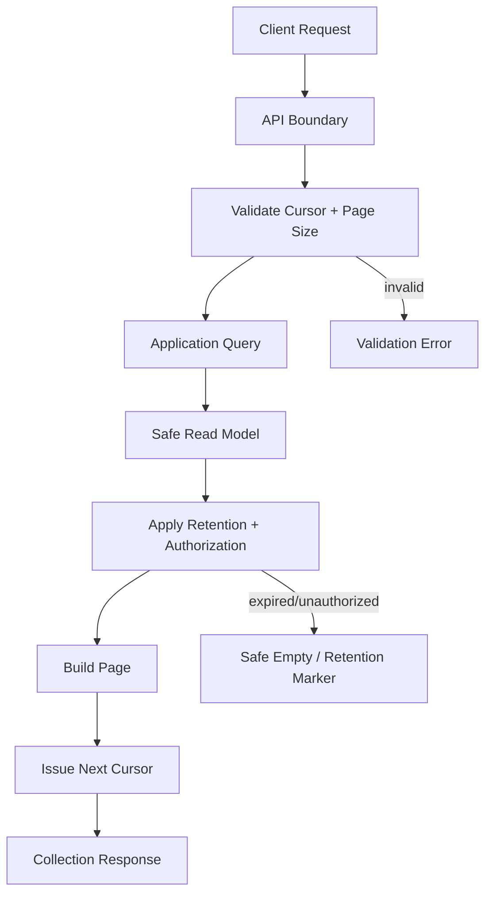

# Pagination Model

## Purpose

This document defines the conceptual pagination contract for OmniWA Phase 4.2.

It does not define query parameters, JSON Schema, SQL, database indexes, ORM queries, API implementation, or concrete cursor encoding.

## Pagination Principles

- Pagination is required for list and history responses.
- Pagination tokens are opaque and product-owned.
- Pagination must preserve authorization and retention boundaries.
- Pagination must not expose database identifiers, provider identifiers, queue identifiers, timestamps as hidden IDs, or shard topology.
- Pagination must be stable enough for operational troubleshooting and history review.

## Strategy Options

| Strategy | Meaning | Pros | Cons | Fit For OmniWA |
|---|---|---|---|---|
| Cursor Pagination | Client advances using opaque position token | Stable for append-heavy histories, hides internals, works with retention and authorization | More complex than offset, cannot jump to arbitrary page | Recommended default |
| Offset Pagination | Client asks for offset and limit | Simple to understand, easy for small static lists | Unstable with changing data, expensive for large histories, leaks positional assumptions | Not recommended for core histories |
| Page Number Pagination | Client asks for page number and size | Familiar for UI pages | Same instability as offset, poor for real-time event/history data | Not recommended |

## Recommendation

Use cursor-based pagination as the default for all collection and history APIs.

Reasons:

- Messages, webhook deliveries, audit records, worker jobs, and metrics snapshots are append-heavy or state-changing.
- Cursor tokens can encode safe continuation without exposing storage details.
- Cursor contract works with retention windows and eventual projections.
- Cursor contract avoids inconsistent pages under concurrent updates.

## Cursor Contract

Cursor pagination conceptually includes:

- An opaque cursor token.
- Requested page size.
- Returned item count.
- Next cursor when more data is available.
- Previous cursor only when the underlying read model supports safe reverse traversal.
- Sort direction marker.
- Staleness or snapshot marker when projection is eventual.

Cursor tokens must:

- Be opaque to clients.
- Be scoped to the query, caller authorization, and filter/sort context.
- Expire or become invalid safely.
- Not include Secret or raw Confidential values.
- Not expose database, provider, queue, or shard internals.

## Resource Pagination Rules

| Resource / Query Family | Pagination Required | Default Ordering | Notes |
|---|---:|---|---|
| ListInstances | Yes when result can exceed page size | Stable display or created time order | Eventual health summary may be stale-marked |
| GetMessageDeliveryHistory | Yes | Newest-first by transition time | Retention-bound; no body search |
| GetWebhookDeliveryHistory | Yes | Newest-first by attempt or transition time | Active attempts may change between pages |
| Media list/status history | Yes for collection/history | Newest-first by created or updated time | Binary content not included |
| QueryAuditRecords | Yes | Append-only newest-first or oldest-first by audit use case | Admin-only; retention-bound |
| Worker job status list | Yes | Newest-first by lifecycle update | Admin/monitoring boundary |
| Metrics snapshots | Yes for historical snapshots | Newest-first by snapshot time | Snapshot freshness must be explicit |
| Event logs future | Yes | Time-window plus cursor | Future scope only |

## Page Size Guidance

Page size is a contract concern but exact numeric limits are implementation policy.

Rules:

- API must define a default page size later in detailed API design.
- API must define a maximum page size later in detailed API design.
- Requests above maximum are rejected or capped consistently.
- Page size must protect operational stability and avoid unbounded memory/response sizes.
- Large export behavior requires a future product decision and is not implicit pagination.

## Retention And Pagination

Pagination must respect retention:

- Expired items are not returned.
- Cursor continuation across retention expiry may return fewer items or a safe retention marker.
- A cursor must not restore access to data that has expired or become unauthorized.
- Message body, raw webhook payload, media binary, and raw provider payload are not returned through paginated histories.

## Cursor Failure Cases

| Failure | Response Behavior |
|---|---|
| Cursor expired | Validation Error with safe cursor-expired reason |
| Cursor malformed | Validation Error |
| Cursor belongs to different filter/sort context | Validation Error or Conflict Error |
| Cursor no longer authorized | Authorization Error or Not Found behavior without resource leak |
| Cursor points beyond retained data | Empty collection with retention marker or Retention Error based on query semantics |

## Pagination Flow

## Pagination Traceability

| Pagination Contract | Use Case Source | Command / Query Source | Workflow Source | Domain Event Source |
|---|---|---|---|---|
| Message history pagination | Messaging visibility | GetMessageDeliveryHistory | WF-QRY-001 | Message lifecycle events |
| Webhook delivery pagination | Webhook reliability | GetWebhookDeliveryHistory | WF-QRY-001 | WebhookDelivery events |
| Audit pagination | Security/audit visibility | QueryAuditRecords | WF-QRY-001, WF-ADM-002 | AuditRecorded, AuditRetentionExpired |
| Metrics pagination | Observability | Metrics snapshot queries | WF-QRY-001, WF-MON-002 | TelemetryProjected, Health events |
| Worker job pagination | Queue/operations visibility | GetWorkerJobStatus / queue metrics | WF-QRY-001 | WorkerJob events |
