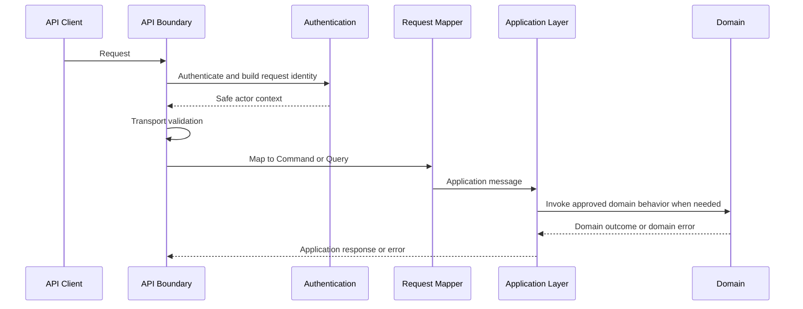

# API Request Model

## Purpose

This document defines the conceptual API request model for OmniWA Phase 4.2.

It does not define OpenAPI operations, JSON Schema, DTO classes, controller code, validation libraries, HTTP implementation, database schema, or provider payloads.

## Request Model Principles

- A request is a transport-level representation of an approved Application command or query.
- API requests must not redefine product meaning already owned by Application, Domain, or Event contracts.
- Command requests can mutate state only through Application commands.
- Query requests must remain read-only and must not trigger refresh, recovery, enqueue, webhook delivery, or provider calls.
- Requests must never carry Secret values unless a future approved secret-management flow explicitly permits a protected secret reference.
- Requests must not carry raw provider payloads, Baileys objects, raw phone numbers, raw JIDs, or queue implementation details as public contract.

## Request Categories

| Request Category | Meaning | Maps To | Mutates State? | Requires Idempotency? | Examples |
|---|---|---|---:|---:|---|
| Command Request | Caller intent to create, change, start, retry, cancel, or destroy product state | Application Command | Yes when accepted | Yes when duplicate-prone | Create instance, send message, register webhook |
| Query Request | Caller intent to read safe state or history | Application Query | No | No | Get instance status, list instances, get message status |
| Bulk Request | Multiple independent requests submitted together under one transport envelope | Multiple approved commands or queries | Depends on member operation | Per command item when duplicate-prone | Deferred; safe query batching only unless later approved |
| Async Request | Command request that accepts long-running work and returns visible operation state | Async acceptance workflow | Yes when accepted | Yes | Send message, reconnect, media registration, webhook retry |
| Admin Request | Restricted command/query requiring Admin boundary | Application Command or Query with access decision | Depends | Usually yes for commands | Activate configuration, query audit records |
| Internal Runtime Request | Trusted runtime signal mapped to internal command | Internal Application Command | Depends | Uses internal occurrence identity | Provider signal, worker result |

## Command Request Contract

Command requests express intent and must include only conceptual input required by the approved command.

Command requests must carry:

- Authenticated request identity from the API boundary.
- Correlation context.
- Idempotency key when the command is duplicate-prone.
- Resource identity or creation intent using product IDs, not provider IDs.
- Safe input categories needed by the target command.

Command requests must not carry:

- Domain object snapshots.
- Repository or database identifiers.
- Provider-native payloads.
- Queue payloads.
- Raw Secret values.
- Business-rule decisions that belong to Domain policies/specifications.

## Query Request Contract

Query requests ask for safe reads.

Query requests may include:

- Resource identity.
- Pagination cursor where the query returns collections.
- Filtering and sorting instructions from the approved filter contract.
- Field selection or expansion only where explicitly allowed.
- Staleness tolerance only as a read preference, never as mutation permission.

Query requests must not:

- Trigger refresh of provider, health, projection, or queue state.
- Enqueue recovery work.
- Write audit evidence as a side effect.
- Request unsafe fields such as session secret, provider payload, message body outside retention, raw phone/JID, or webhook signing secret.

## Bulk Request Contract

Bulk request support is not a broad MVP feature and must not become campaign, broadcast, or batch-send behavior.

Allowed conceptual use:

- Future safe query batching where each query remains read-only.
- Future admin maintenance batching if approved by product/security review.
- Future import/export workflows only after separate product decision.

Rules:

- Each member operation must trace to an approved command or query.
- Each command member must have its own idempotency scope.
- Partial success must be explicit and item-scoped.
- Bulk execution must not bypass per-instance, per-key, or endpoint-family rate limits.
- Bulk send, broadcast, campaign, and group administration are out of MVP scope.

## Async Request Contract

Async requests start work that cannot be completed at the API boundary.

Async requests must:

- Return only after Application has created visible owner state or WorkerJob-visible lifecycle.
- Include idempotency key where duplicate execution could create duplicate product effects.
- Produce an operation reference, owner resource reference, or both.
- Make polling possible through an approved query.
- Distinguish acceptance from provider completion, webhook delivery completion, or final external outcome.

Async requests must not:

- Wait synchronously for provider final delivery.
- Claim WhatsApp delivery, read status, webhook success, or media processing completion before those facts exist.
- Hide queue visibility failure behind accepted responses.

## Admin Request Contract

Admin requests require Admin API boundary and Application authorization.

Admin requests include:

- Configuration validation and activation.
- Audit record queries.
- Provider capability refresh.
- Restricted diagnostics.
- Destroy instance.
- Webhook dead-letter or restricted replay operations.

Admin requests must:

- Carry safe actor identity.
- Preserve auditability.
- Use explicit reason category when a privileged mutation requires it.
- Avoid exposing Secret values in either request logs or response output.

## Validation Boundary

| Validation Layer | Owns | Must Not Own |
|---|---|---|
| API Transport Validation | Request shape, field naming convention, safe primitive format, required headers, allowed endpoint group | Business rule decisions, aggregate invariants |
| Application Validation | Command/query semantic validity, idempotency requirement, workflow preconditions, authorization boundary | HTTP status mapping, provider-native interpretation |
| Domain Validation | Business invariants, policies, specifications, lifecycle rules | API key validation, HTTP concepts |
| Infrastructure Validation | Adapter-specific safety and dependency validation | Product authorization or business meaning |

## Request Flow

## Request Traceability

| Request Category | Use Case Source | Command / Query Source | Workflow Source | Domain Event Source |
|---|---|---|---|---|
| Command Request | Phase 3.1 use case inventory | `COMMAND_CATALOG.md` | `WORKFLOW_CATALOG.md` | Aggregate events in `EVENT_CATALOG.md` |
| Query Request | Query/status use cases | `QUERY_CATALOG.md` | WF-QRY-001 | No Domain Event produced |
| Async Request | Long-running workflows | Async commands such as SendTextMessage, SendMediaMessage, ReconnectInstance, RetryWebhookDelivery | WF-MSG, WF-INS, WF-MED, WF-WEB workflows | WorkerJob and owner aggregate events |
| Admin Request | Administration use cases | Administration commands and queries | WF-ADM-001, WF-ADM-002 | Access, Audit, Configuration events |
| Internal Runtime Request | Provider, Operations, Monitoring use cases | Provider signal and worker job commands | WF-PRV, WF-WEB, WF-MON workflows | Translated owner events only |

## Request Rejection Rules

A request contract must be rejected if it:

- Requires API to call Domain, Provider, Baileys, database, or queue directly.
- Introduces unsupported message types or broadcast/campaign behavior.
- Depends on raw provider payloads.
- Requires raw message body retention beyond policy.
- Exposes session, API key, admin key, or webhook signing secrets.
- Lets a query mutate state.
- Lets a bulk request bypass per-item authorization, idempotency, rate limits, or guardrails.
