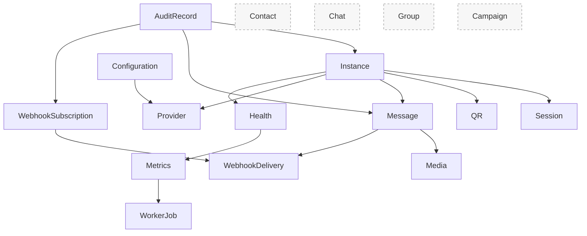

# API Resource Model

## Resource Model Principles

- API resources represent product concepts, not database tables.
- A resource must trace to an approved Application use case, command, or query.
- Resource state exposed through API must be safe for the caller and must not include Secret data.
- Async resources expose accepted, queued, processing, delivered, failed, or dead-letter visibility without claiming provider success prematurely.
- Future resources are documented as deferred and must not be treated as MVP commitments.

## Resource Catalog

| Resource | Purpose | Owner Application Use Case | Related Domain Context | Mutability | Boundary | Scope |
|---|---|---|---|---|---|---|
| Instance | Represents a WhatsApp account runtime managed by OmniWA | CreateInstance, UpdateInstanceMetadata, ConnectInstance, DisconnectInstance, ReconnectInstance, DestroyInstance, GetInstanceStatus, ListInstances | Instance, Session, Provider, Health | Mutable | Public and Admin | MVP |
| Session | Represents safe session lifecycle state for an instance | ConfirmSessionActivated, MarkInstanceLoggedOut, GetInstanceStatus | Session, Instance | Read-only externally | Public safe view, Admin safe view | MVP |
| QR | Represents a time-bound pairing challenge for an instance | StartQrPairing, RefreshQrPairing, GetInstanceStatus | Session, Instance | Mutable workflow | Public authenticated | MVP |
| Message | Represents an outbound or inbound message lifecycle visible to OmniWA | SendTextMessage, SendMediaMessage, RetryMessageSend, CancelMessage, GetMessageStatus, GetMessageDeliveryHistory | Messaging, Media, Provider, Webhook | Mutable for command operations, read-only for status | Public and Admin | MVP |
| Media | Represents media metadata and processing status used by message workflows | RegisterMedia, ProcessMediaWork, AttachMediaToMessageWorkflow, GetMediaStatus | Media, Messaging | Mutable for registration, read-only for status | Public and Admin | MVP |
| WebhookSubscription | Represents a configured outbound webhook target | RegisterWebhookSubscription, UpdateWebhookSubscription, ActivateWebhookSubscription, SuspendWebhookSubscription, RetireWebhookSubscription, GetWebhookStatus | Webhook, Configuration, Security | Mutable | Public and Admin | MVP |
| WebhookDelivery | Represents a delivery attempt lifecycle for an outbound webhook event | ScheduleWebhookDelivery, DeliverWebhookWork, RetryWebhookDelivery, MoveWebhookDeliveryToDeadLetter, GetWebhookDeliveryHistory | Webhook, Operations, Observability | Read-mostly; retry/dead-letter commands are controlled operations | Public read, Admin operations | MVP |
| Provider | Represents provider capability and compatibility state, not provider internals | EvaluateProviderCompatibility, RefreshProviderCapability, GetProviderCapabilityStatus | Provider, Configuration, Health | Read-only externally | Admin | MVP |
| Health | Represents safe operational status | RefreshHealthStatus, GetHealthStatus, GetActionRequiredItems | Health, Observability, Operations | Read-only | Health and Monitoring | MVP |
| Metrics | Represents operational metric snapshots | GetOperationalMetricsSnapshot, GetQueueMetricsSnapshot, GetWebhookMetricsSnapshot, GetMessageMetricsSnapshot, GetMediaMetricsSnapshot | Observability, Operations | Read-only | Monitoring and Admin | MVP |
| WorkerJob | Represents safe worker/job visibility | QueueAsyncWork, ReserveWorkerJob, CompleteWorkerJob, MarkWorkerJobRetryOrDead, GetWorkerJobStatus | Operations | Read-only externally | Admin and Internal | MVP |
| Configuration | Represents validated runtime configuration state | ValidateConfigurationSnapshot, ActivateConfigurationSnapshot, GetConfigurationStatus | Configuration, Security | Mutable by admin | Admin | MVP |
| AuditRecord | Represents access-safe audit evidence | RecordAuditEvidence, QueryAuditRecords | Audit, Security | Append-only, read-only through API | Admin | MVP access-safe |
| Contact | Represents WhatsApp contact model | Not approved in Phase 3 | Contact future context | Deferred | None | Future |
| Chat | Represents WhatsApp chat/conversation listing | Not approved in Phase 3 | Chat future context | Deferred | None | Future |
| Group | Represents group membership or administration | Not approved in Phase 3 | Group future context | Deferred | None | Future |
| Campaign | Represents broadcast/campaign behavior | Explicitly out of MVP scope | Campaign future context | Deferred | None | Future |

## Resource Ownership Notes

### Instance

Instance is the main operational resource for Single Tenant + Multi Instance MVP. It owns the external identity of a WhatsApp runtime from the API perspective, but API must not expose provider session internals.

### Session

Session is not a full public resource in MVP. The API exposes only safe session lifecycle information through instance status. Direct session secret reads are forbidden.

### QR

QR is modeled as a subresource of instance pairing, not as a standalone credential. It is always authenticated, short-lived, and never public.

### Message

Message is the primary command resource for send workflows. Message API responses must distinguish API acceptance from provider dispatch, delivery, and read status.

### Media

Media represents metadata and processing state. Binary storage is not guaranteed by MVP retention policy; the API must not promise permanent media hosting.

### WebhookSubscription And WebhookDelivery

WebhookSubscription is configured by users. WebhookDelivery is produced by OmniWA as outbound integration work. Webhook delivery is not an inbound public API.

### Provider

Provider resource exists only as a safe operational view. It must not expose Baileys objects, connection internals, raw events, or provider-specific payloads as stable API contract.

## Resource Relationships

## Resource Traceability

| Resource | Product Scope | Use Case / Command / Query | Domain Context |
|---|---|---|---|
| Instance | Instance | CreateInstance, ConnectInstance, DisconnectInstance, ReconnectInstance, DestroyInstance, GetInstanceStatus, ListInstances | Instance |
| Session | Instance, Reliability | ConfirmSessionActivated, MarkInstanceLoggedOut, GetInstanceStatus | Session |
| QR | Instance | StartQrPairing, RefreshQrPairing | Session |
| Message | Messaging | SendTextMessage, SendMediaMessage, RetryMessageSend, CancelMessage, GetMessageStatus | Messaging |
| Media | Media, Messaging | RegisterMedia, GetMediaStatus | Media |
| WebhookSubscription | Webhook | RegisterWebhookSubscription, UpdateWebhookSubscription, ActivateWebhookSubscription, SuspendWebhookSubscription, RetireWebhookSubscription | Webhook |
| WebhookDelivery | Webhook, Queue | RetryWebhookDelivery, MoveWebhookDeliveryToDeadLetter, GetWebhookDeliveryHistory | Webhook, Operations |
| Provider | Provider abstraction | EvaluateProviderCompatibility, RefreshProviderCapability, GetProviderCapabilityStatus | Provider |
| Health | Observability | GetHealthStatus, GetActionRequiredItems | Health |
| Metrics | Observability, Queue | Metrics snapshot queries | Observability, Operations |
| WorkerJob | Queue, Worker | Worker job lifecycle commands, GetWorkerJobStatus | Operations |
| Configuration | Configuration | ValidateConfigurationSnapshot, ActivateConfigurationSnapshot, GetConfigurationStatus | Configuration |
| AuditRecord | Audit, Security | RecordAuditEvidence, QueryAuditRecords | Audit |
