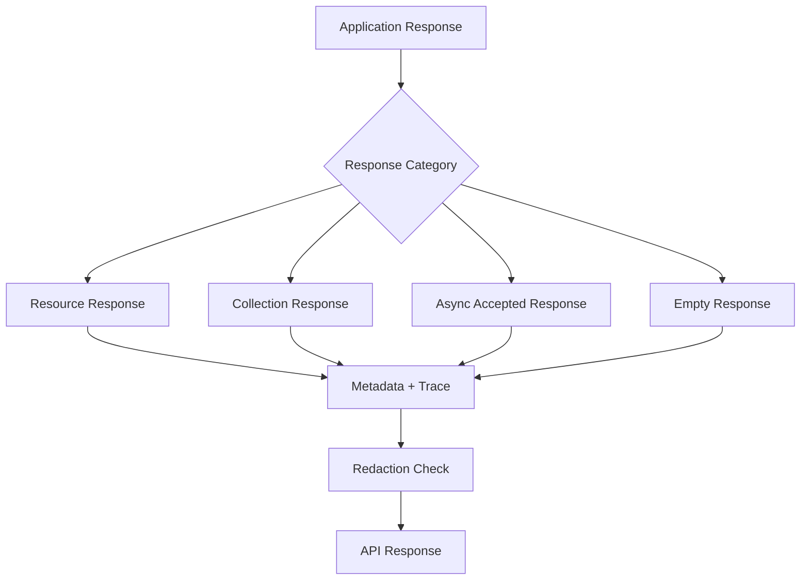

# API Response Model

## Purpose

This document defines the conceptual API response model for OmniWA Phase 4.2.

It does not define JSON Schema, OpenAPI responses, DTO classes, HTTP status codes, serializers, or implementation code.

## Response Principles

- API responses map from Application responses and errors.
- Response shape must preserve command/query semantics.
- Async acceptance must not be represented as final external delivery.
- Response metadata must support traceability, debugging, pagination, and versioning without leaking sensitive data.
- Response output must never expose session secrets, API/admin keys, webhook signing secrets, provider-native payloads, raw phone/JID, or raw Confidential payloads.

## Response Categories

| Response Category | Meaning | Maps From | Used For |
|---|---|---|---|
| Success Response | Request completed API/Application responsibility | CommandCompleted or QueryResult | Synchronous command or query |
| Resource Response | One safe resource representation | QueryResult or CommandCompleted | Instance, message, media, webhook, provider, health |
| Collection Response | Ordered collection of safe resources | QueryResult | List/history queries |
| Async Accepted Response | Work accepted and visible, but not externally complete | CommandAccepted, CommandQueued, CommandWaiting | Send message, reconnect, media processing, webhook retry |
| Empty Response | Command completed with no resource body required | CommandCompleted | Delete/retire/cancel-style operations when safe |
| Operation Status Response | Current status of a workflow or owner resource | QueryResult, QueryStale, QueryUnavailable | Polling async operations |
| Error Response | Safe error outcome | Application error mapping | Rejections, denied reads, dependency failures |

## Success Response

Success responses include a safe result plus metadata.

Success response must communicate:

- The resource or operation outcome.
- Whether the operation is completed, accepted, queued, waiting, stale, or unavailable.
- API version.
- Request ID and correlation ID when safe.
- Pagination metadata when response is a collection.
- Async operation metadata when operation is long-running.

Success response must not communicate:

- Provider final delivery unless that state has been observed and translated.
- Worker internals.
- Queue engine details.
- Raw provider acknowledgement payloads.
- Sensitive input echo.

## Resource Response

Resource responses represent one product resource.

Rules:

- Resource identity is opaque and product-owned.
- Resource status uses approved lifecycle vocabulary.
- Resource body includes only safe API representation, not Domain aggregate internals.
- Sensitive resource details are redacted or replaced with safe markers.
- Provider-specific details are translated to product categories.

Examples of resource response categories:

- Instance status summary.
- Message status summary.
- Media status summary.
- Webhook subscription summary.
- Webhook delivery attempt summary.
- Health or metrics snapshot.

## Collection Response

Collection responses represent retained, authorized, and safely filtered data.

Collection response must include:

- Ordered list of resource summaries.
- Pagination metadata.
- Applied filter/sort metadata when safe.
- Staleness marker when projection is eventual or stale.

Collection response must not include:

- Unlimited result sets.
- Message bodies where retention disallows body return.
- Raw provider payloads.
- Cross-instance records outside caller authorization.

## Async Accepted Response

Async accepted response is used when Application has accepted work and made lifecycle visible.

It must include conceptually:

- Accepted owner resource reference, operation reference, or both.
- Current operation status such as accepted, queued, waiting, retrying, or action_required.
- Polling query relationship.
- Correlation ID.
- Idempotency replay marker when response is returned from duplicate idempotent command.

It must not include:

- Final provider delivery claim.
- Final webhook success claim.
- Final media processing claim unless processing already completed.
- Hidden best-effort work without visible owner state.

## Empty Response

Empty response is allowed when:

- The Application command completed.
- Returning a resource body is unnecessary or could leak sensitive data.
- The caller can query the resource status if needed.

Empty response must still include safe trace metadata where the response envelope allows it.

## Operation Status

Operation status is a safe representation of current lifecycle.

| Operation Family | Status Source | Query Path |
|---|---|---|
| Instance connect/reconnect/QR | Instance, Session, WorkerJob | GetInstanceStatus |
| Send message | Message and WorkerJob | GetMessageStatus |
| Media processing | MediaAsset and WorkerJob | GetMediaStatus |
| Webhook delivery/retry | WebhookDelivery and WorkerJob | GetWebhookStatus or GetWebhookDeliveryHistory |
| Configuration activation | ConfigurationSnapshot and Audit | GetConfigurationStatus |
| Provider capability refresh | ProviderProfile and Health | GetProviderCapabilityStatus |

## Metadata

Response metadata may include:

- API version.
- Request ID.
- Correlation ID.
- Resource type.
- Operation type.
- Idempotency replay marker.
- Pagination metadata.
- Staleness/freshness marker.
- Deprecation marker.
- Rate-limit or retry guidance when safe.

Metadata must not include:

- Secrets.
- Raw payload previews.
- Internal stack traces.
- Database row IDs.
- Queue engine identifiers.
- Provider-native request/response IDs unless translated to safe product reference.

## Trace Metadata

| Trace Metadata | Purpose | Exposure Rule |
|---|---|---|
| Request ID | One API request | Safe to return |
| Correlation ID | Multi-step workflow | Safe to return |
| Idempotency reference | Duplicate detection and replay visibility | Safe marker only, not raw sensitive key content |
| Operation reference | Polling and support | Safe opaque ID |
| Event reference | Webhook and integration traceability | Safe opaque ID |

## Response Flow

## Response Traceability

| Response Category | Use Case Source | Command / Query Source | Workflow Source | Domain Event Source |
|---|---|---|---|---|
| Resource Response | Status and lifecycle use cases | GetInstanceStatus, GetMessageStatus, GetMediaStatus, GetWebhookStatus | WF-QRY-001 | Owner context events |
| Collection Response | List/history/monitoring use cases | ListInstances, QueryAuditRecords, delivery history queries, metrics queries | WF-QRY-001 | Retained event/history projections |
| Async Accepted Response | Async command use cases | SendTextMessage, SendMediaMessage, ReconnectInstance, RegisterMedia, RetryWebhookDelivery | Async acceptance workflows | MessageAccepted, MessageQueued, WorkerJobQueued, WebhookDeliveryScheduled |
| Empty Response | Command completion use cases | CancelMessage, RetireWebhookSubscription, restricted lifecycle commands where safe | Command workflows | Owner terminal events where applicable |
| Operation Status Response | Long-running operation visibility | Status queries | Long-running workflows | WorkerJob and owner lifecycle events |
| Error Response | All rejected/failed use cases | Application error outcome | Failure branch of workflow | Domain error or translated dependency/provider failure |
