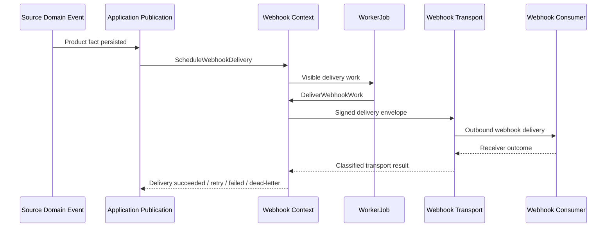

# Webhook Contract

## Purpose

This document defines the conceptual webhook delivery contract for OmniWA Phase 4.2.

It does not define webhook JSON payload schema, OpenAPI, HTTP implementation, signing algorithm, queue implementation, retry algorithm, source code, provider payloads, or database schema.

## Webhook Principles

- Webhook Delivery is outbound from OmniWA to user-configured receivers.
- Webhook Delivery is not an inbound public API.
- Webhook payloads are Integration Events owned by the Webhook context.
- Webhook delivery must be asynchronous, retry-visible, idempotent, signed or verifiable, and observable.
- Webhook payloads must not contain Secret values, raw provider payloads, session material, raw phone/JID, or data outside approved event contracts.

## Delivery Envelope

A webhook delivery envelope conceptually includes:

- Event name.
- Event version.
- Event identity.
- Delivery identity.
- Occurred time.
- Delivery attempt metadata.
- Correlation context.
- Source resource reference.
- Data classification marker.
- Event data as approved by Integration Event contract.

The envelope must not include:

- Webhook signing secret.
- API or admin key.
- Session secret.
- Raw provider/Baileys callback payload.
- Raw message body unless future product decision and retention policy allow it.
- Raw phone number or JID unless future privacy decision explicitly allows safe representation.

## Integration Event Scope

MVP external Integration Events are defined in `EVENT_CATALOG.md` and include categories such as:

- Instance lifecycle events.
- Session safe lifecycle events.
- Message received/accepted/dispatched/delivered/read/failed events.
- Media processed/failed events.
- Webhook delivery succeeded/failed/dead-lettered events.
- Guardrail blocked/throttled events.
- Health degraded/recovered events.

Events outside this catalog require governance review.

## Retry Metadata

Webhook retry metadata conceptually includes:

- Delivery identity.
- Attempt number.
- Retry eligibility.
- Safe failure category.
- Next retry window when safe.
- Dead-letter marker when exhausted.

Retry metadata must not include:

- Receiver raw response body by default.
- Secret headers.
- Transport stack traces.
- Internal queue details.

## Signature And Verification

Webhook delivery should be signed or otherwise verifiable.

Conceptual requirements:

- Signature is computed from stable delivery envelope material.
- Receiver can verify authenticity and detect tampering.
- Timestamp or freshness marker helps prevent replay.
- Delivery identity supports receiver-side deduplication.
- Signing secret is never returned in delivery payload or logs.

The concrete algorithm and header names are deferred to detailed API/implementation design.

## Event Identity And Idempotency

| Identity | Purpose |
|---|---|
| Event identity | Identifies the product/integration event fact |
| Delivery identity | Identifies one webhook delivery lifecycle for one subscription/event |
| Attempt number | Identifies a retry attempt within delivery lifecycle |
| Correlation ID | Links event back to source workflow |

Rules:

- Same event identity must represent the same source fact.
- Same delivery identity must allow receivers to deduplicate repeated attempts.
- Retry attempts must not create new source business facts.
- Replays require explicit future policy and must not alter source state.

## Versioning

Webhook Integration Event names include version suffix, such as `.v1`.

Rules:

- Breaking changes require a new event version.
- Optional safe fields may be added without new version if consumers can ignore them.
- Consumers must ignore unknown optional fields.
- Producers must not change business meaning within a version.
- Sensitive data changes require security review.

## Webhook Delivery Status

| Status | Meaning |
|---|---|
| pending | Delivery is scheduled but not yet attempted |
| delivering | Delivery attempt is in progress |
| delivered | Receiver acknowledged according to transport rules |
| retrying | Failure was retryable and retry is scheduled |
| failed | Delivery failed terminally without further normal retry |
| dead_letter | Delivery requires operator visibility or recovery |
| cancelled | Delivery was cancelled by lifecycle policy |

## Webhook Flow

## Webhook Receiver Responsibilities

Webhook consumer owns:

- Endpoint uptime.
- Receiver authentication/verification implementation.
- Receiver-side idempotency using delivery identity.
- Handling repeated attempts.
- Ignoring unknown optional fields.
- Not treating event delivery order as a full source-of-truth database.

OmniWA owns:

- Event sanitization.
- Delivery lifecycle.
- Retry and dead-letter visibility.
- Signing or verification support.
- Correlation and event identity.
- Redaction and sensitive data protection.

## Webhook Contract Traceability

| Webhook Contract | Use Case Source | Command / Query Source | Workflow Source | Domain Event Source |
|---|---|---|---|---|
| Subscription management | UC-WEB-001 through UC-WEB-005 | Register/Update/Activate/Suspend/RetireWebhookSubscription | WF-WEB-001 | WebhookSubscription events |
| Delivery scheduling | UC-WEB-006 | ScheduleWebhookDelivery | WF-WEB-002 | Source Domain Events and WebhookDeliveryScheduled |
| Delivery execution | UC-WEB-007 | DeliverWebhookWork | WF-WEB-002 | WebhookDeliveryStarted/Succeeded/Failed |
| Retry/dead-letter | UC-WEB-008, UC-WEB-009 | RetryWebhookDelivery, MoveWebhookDeliveryToDeadLetter | WF-WEB-003 | WebhookDeliveryRetryScheduled, WebhookDeliveryDeadLettered |
| Delivery visibility | UC-WEB-010 | GetWebhookStatus, GetWebhookDeliveryHistory | WF-QRY-001 | WebhookDelivery events |
| Integration event payload | Product event notifications | ScheduleWebhookDelivery | WF-WEB-002 | Integration Events in EVENT_CATALOG |

## Rejection Rules

A webhook contract must be rejected if it:

- Treats webhook delivery as inbound API.
- Requires synchronous webhook delivery before product workflow can complete.
- Exposes raw provider payload or session material.
- Allows webhook receiver response to mutate source business state.
- Omits event identity or delivery identity.
- Omits versioning for external event contract.
- Introduces events outside approved product/domain scope.
