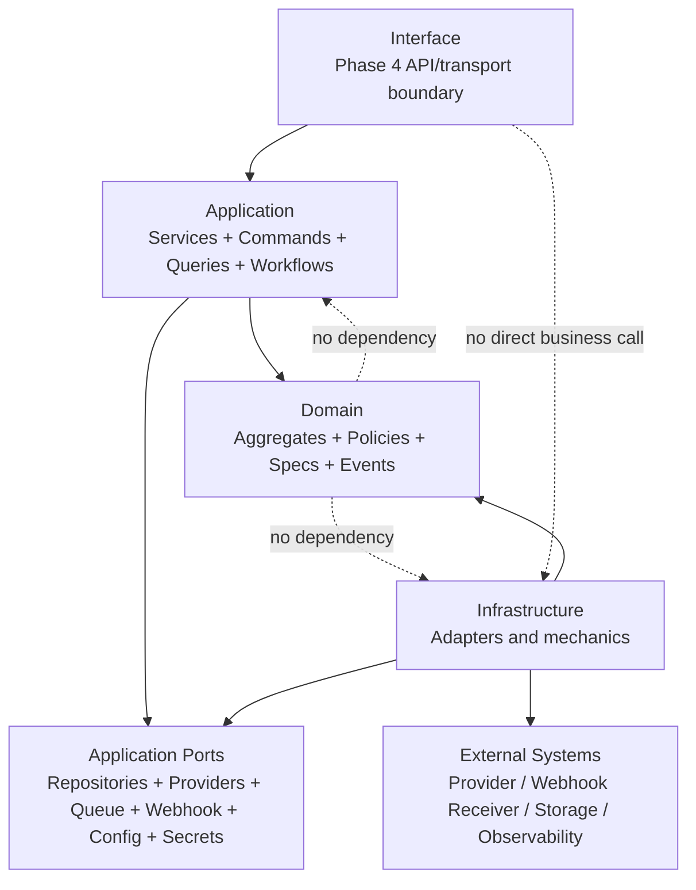

# OmniWA Application Boundaries

## Purpose

This document defines the final Phase 3 Application Layer boundaries for OmniWA.

It replaces the Phase 3.1 boundary draft with the Phase 3.4 freeze-ready boundary definition. It does not define REST APIs, OpenAPI, DTO implementations, database schema, Prisma, repository implementations, provider implementations, queue implementations, or source code.

## Boundary Position

OmniWA uses the frozen dependency direction:

```text
Interface -> Application -> Domain
Infrastructure -> Application ports and Domain types
Shared -> no OmniWA package
```

Application is the orchestration boundary. It receives product-level commands, queries, worker requests, scheduler requests, translated provider signals, and publication follow-up requests.

## Boundary Summary

| Concern | Owner | Application Boundary Rule |
| --- | --- | --- |
| Product intent orchestration | Application | Route commands/queries to approved use cases and workflows. |
| Business rules and invariants | Domain | Application invokes Domain; it must not redefine policy or invariants. |
| Transport entry and formatting | Interface | Interface maps future transport input/output; it must not own product decisions. |
| Technical integration | Infrastructure | Infrastructure implements ports and translates external systems. |
| Persistence mechanics | Infrastructure | Application owns conceptual transaction boundary; infrastructure performs mechanics later. |
| Provider behavior | Infrastructure provider adapter behind ports | Application receives safe translated signals and uses provider ports only. |
| Async lifecycle visibility | Application + Operations Domain | Accepted async work must become visible through WorkerJob or owner lifecycle. |
| Event publication timing | Application | Domain creates event facts; Application decides publication timing and follow-up. |
| Query read safety | Application | Queries are side-effect free and return safe read models only. |
| Authorization preconditions | Application + Security and Access Domain | Application invokes access decisions before privileged mutation. |
| Validation layering | Interface, Application, Domain, Infrastructure | Each validates its own boundary and does not replace another layer. |
| Error classification | Application with Domain/Infrastructure inputs | Errors are mapped to safe product categories before crossing boundaries. |

## What Belongs To Application

Application owns:

- Application services and use case orchestration.
- Command and query handling in product language.
- Workflow sequencing across bounded contexts.
- Repository port calls.
- External port calls through approved abstractions.
- Cross-aggregate precondition sequencing.
- Conceptual transaction and Unit of Work boundaries.
- Idempotency scope for accepted commands and retryable work.
- Event publication timing.
- Async work request creation and visibility checks.
- Application-level validation of command/query semantics and workflow preconditions.
- Authorization orchestration through Security and Access domain decisions.
- Safe mapping from Application messages to Domain inputs and safe responses.
- Error mapping from Domain, Infrastructure, Provider, and unknown failures to safe outcomes.
- Correlation, request, and trace context propagation without embedding sensitive data.

Application does not own business meaning. It coordinates approved Domain decisions.

## What Belongs To Domain

Domain owns:

- Ubiquitous language.
- Bounded contexts.
- Aggregate invariants.
- Aggregate lifecycle transitions.
- Domain services.
- Domain policies.
- Domain specifications.
- Domain factories.
- Domain events as business facts.
- Domain error categories.
- Repository port semantics.

Domain must not:

- Load repositories from aggregates, policies, or specifications.
- Open, commit, or roll back transactions.
- Call providers, queues, webhooks, logs, metrics, or external systems.
- Know HTTP, REST, OpenAPI, DTOs, database, Prisma, queue engines, Baileys, or provider adapter details.
- Authenticate actors or read identity-provider tokens.
- Publish events directly to EventBus, Queue, Webhook, Log, Provider, or external consumers.

## What Belongs To Interface

Interface will be designed in Phase 4.

Interface may later:

- Authenticate transport entry where appropriate.
- Validate transport shape.
- Map external request concepts into Application commands/queries.
- Map safe Application responses into transport-specific responses.
- Attach request/correlation context.

Interface must not:

- Call Domain directly.
- Call Infrastructure directly for product behavior.
- Own product authorization decisions.
- Own retry, queue, provider, webhook, persistence, or guardrail policy.
- Publish Domain Events or Integration Events directly.
- Expose Secret or raw Confidential data.

## What Belongs To Infrastructure

Infrastructure later owns:

- Persistence adapter mechanics.
- Queue adapter mechanics.
- Provider/Baileys adapter mechanics.
- Webhook transport mechanics.
- Event bus mechanics.
- Configuration source loading.
- Secret provider mechanics.
- Logging, metrics, tracing, audit sink, and telemetry exporter mechanics.
- External dependency probing.

Infrastructure must not:

- Own product policy.
- Orchestrate use cases.
- Bypass Application guardrails.
- Create Domain Events.
- Leak provider-native payloads, Secret values, or raw Confidential payloads into Application or Domain.

## Boundary By Operation Step

| Step | Interface | Application | Domain | Infrastructure |
| --- | --- | --- | --- | --- |
| Receive external input | Parse/authenticate later. | Accept product command/query concept. | No transport knowledge. | No direct product role. |
| Validate input | Shape-level validation later. | Command/query semantics, idempotency presence, safe references. | Business semantics and invariants. | Adapter/config/provider boundary validation. |
| Authorize | Authenticate actor later. | Invoke AccessDecision where required. | Security context defines access policy. | Identity/secret adapter mechanics later. |
| Load state | No persistence. | Call repository ports. | Defines aggregate semantics. | Implements repository adapters later. |
| Decide business outcome | No business decision. | Invoke Domain in approved order. | Owns business decision. | No product policy. |
| Persist outcome | No persistence. | Owns conceptual commit timing. | No storage mechanics. | Performs persistence mechanics later. |
| Publish/follow-up | No direct publication. | Decides publication timing and follow-up work. | Creates event facts only. | Transports events later. |
| Run async work | No worker logic. | Creates visible work and routes worker commands. | Owns WorkerJob lifecycle meaning. | Queue/worker mechanics later. |
| Return response | Format later. | Return safe Application outcome. | No response concept. | No direct response role. |

## Boundary Rules

| Rule ID | Rule | Reason |
| --- | --- | --- |
| AB-001 | Application must not contain business policy that belongs to Domain. | Preserves Domain freeze and testability. |
| AB-002 | Application must not depend on concrete Infrastructure. | Preserves ports/adapters architecture. |
| AB-003 | Application must not use provider-native payloads as command/query/domain input. | Protects Provider abstraction and data safety. |
| AB-004 | Queries must be side-effect free. | Preserves command/query boundary. |
| AB-005 | Commands that accept async work must create visible lifecycle state. | Prevents silent drops. |
| AB-006 | Worker Runtime must enter through Application commands, not Interface. | Preserves dependency direction. |
| AB-007 | Provider signals must be translated before Application workflows consume them. | Protects Domain from Baileys/provider churn. |
| AB-008 | Webhook delivery must not mutate source business facts. | Preserves source-of-truth ownership. |
| AB-009 | Audit, Health, and Observability are evidence/projection boundaries, not business owners. | Prevents projection-driven state mutation. |
| AB-010 | Secret and raw Confidential data must not cross Webhook, Audit, Observability, or normal response boundaries. | Preserves Phase 0 data classification. |

## Boundary Diagram



## Freeze Boundary Decision

The Application boundary is **APPROVED** for Phase 3 freeze.

No Phase 4 API contract may bypass these boundaries. Any exception requires a new ADR and Application freeze review update.
