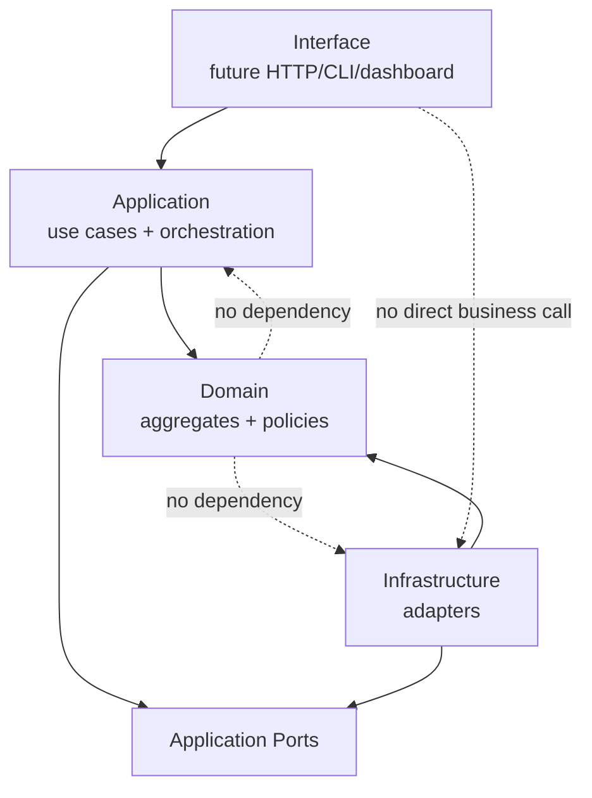

# OmniWA Application Boundaries

## Purpose

This document defines what belongs in the Application Layer and what must remain in Domain, Infrastructure, or Interface.

It does not define REST APIs, DTOs, database schema, repository implementation, service implementation, provider implementation, queue implementation, or source code.

## Boundary Summary

| Concern | Owner | Application Boundary Rule |
| --- | --- | --- |
| Business policy | Domain | Application invokes policy and enforces sequence; it must not redefine policy. |
| Workflow orchestration | Application | Application sequences use cases, ports, repositories, events, and async work. |
| Transport entry | Interface | Interface maps future external input to application commands/queries. |
| Technical integration | Infrastructure | Infrastructure implements ports and translates external systems. |
| Persistence implementation | Infrastructure | Application uses repository ports only. |
| Provider implementation | Infrastructure / Provider adapter | Application uses provider ports only and receives translated signals. |
| Event publication timing | Application | Domain creates facts; Application decides when/where to publish. |
| Domain event transport | Infrastructure | Application uses EventBus or equivalent port later. |
| Async work visibility | Application + Operations Domain | Application creates visible work through Operations; queue engine mechanics are Infrastructure. |
| Data safety | Domain + Application + Infrastructure | Application must prevent unsafe payload propagation across boundaries. |

## What Belongs To Application

Application owns:

- Use case orchestration.
- Command/query handling in product language.
- Repository port calls.
- External port calls.
- Cross-aggregate precondition sequencing.
- Application-level transaction scope.
- Idempotency boundary.
- Event publication timing.
- Async work request creation.
- Error category mapping across domain/application/infrastructure.
- Correlation context propagation.
- Access decision invocation before privileged use cases.
- Audit, health, telemetry, and webhook scheduling requests when driven by domain facts.

## What Belongs To Domain

Domain owns:

- Bounded context language.
- Aggregate invariants.
- Aggregate lifecycle transitions.
- Entity and value object rules.
- Domain event facts.
- Domain services.
- Domain policies.
- Domain specifications.
- Domain factories.
- Domain errors.
- Repository port semantics.

Application must not duplicate these rules. If a use case needs a business decision, it must invoke the approved domain object/service/policy/specification or request a future domain decision.

## What Belongs To Infrastructure

Infrastructure owns:

- Persistence adapter implementation.
- Queue adapter implementation.
- Provider/Baileys adapter implementation.
- Webhook transport adapter implementation.
- Secret provider implementation.
- Configuration source implementation.
- Event bus implementation.
- Logging, metrics, tracing, and telemetry exporter implementation.
- External dependency probes.

Infrastructure must not bypass Application or own product policy.

## What Belongs To Interface

Interface owns future external delivery concerns:

- Authentication boundary invocation.
- Transport-level shape validation.
- Request parsing.
- Response formatting.
- Dashboard, CLI, HTTP, or webhook receiver presentation details.

Interface must not call Infrastructure for business behavior and must not publish events directly.

## Boundary By Workflow Step

| Step | Interface | Application | Domain | Infrastructure |
| --- | --- | --- | --- | --- |
| Receive external intent | Parse and authenticate later. | Accept product command/query. | No transport knowledge. | No direct role. |
| Validate shape | Boundary validation later. | Validate workflow preconditions. | Validate business rules. | No direct role. |
| Load state | No direct persistence. | Call repository ports. | Define aggregate semantics. | Implement persistence adapter later. |
| Decide business outcome | No business policy. | Invoke domain in correct order. | Own decision. | No product policy. |
| Persist outcome | No direct persistence. | Call repository ports. | No storage mechanics. | Implement storage later. |
| Publish events | No direct event publishing. | Decide publication timing. | Create event facts. | Transport events later. |
| Run async work | No worker logic. | Create visible work and call ports. | Own work lifecycle meaning through Operations aggregate. | Implement queue/worker mechanics later. |
| Return outcome | Format later. | Return safe application outcome. | No API response concept. | No direct role. |

## Application Must Not

- Change frozen Product, Architecture, or Domain decisions.
- Implement business rules that belong to aggregates, domain services, policies, or specifications.
- Use provider-native payloads as command/query/domain input.
- Depend on Baileys, database, queue engine, logger, telemetry exporter, HTTP framework, or secret-provider implementation.
- Retain message/media bodies by default.
- Expose Secret or raw Confidential data.
- Publish events from Domain, repository ports, Interface, or provider adapters directly.
- Let configuration disable mandatory guardrails.
- Let Worker Runtime call Interface/API layer.
- Let Webhook Delivery mutate source business state.
- Let Operations decide owner aggregate business outcome.
- Turn repository ports into reporting/search APIs.

## Application Boundary Diagram

## Boundary Validation Questions

Before approving a Phase 3 use case, reviewers must answer:

| Question | Required Answer |
| --- | --- |
| Is the use case named in product language? | Yes. |
| Does it have one explicit business intent? | Yes. |
| Does it rely on approved Domain objects or decisions? | Yes. |
| Does Application only sequence, load, persist, publish, and call ports? | Yes. |
| Are business rules kept out of Application orchestration? | Yes. |
| Are provider, queue, database, transport, and logging details excluded? | Yes. |
| Are Secret and raw Confidential data protected? | Yes. |
