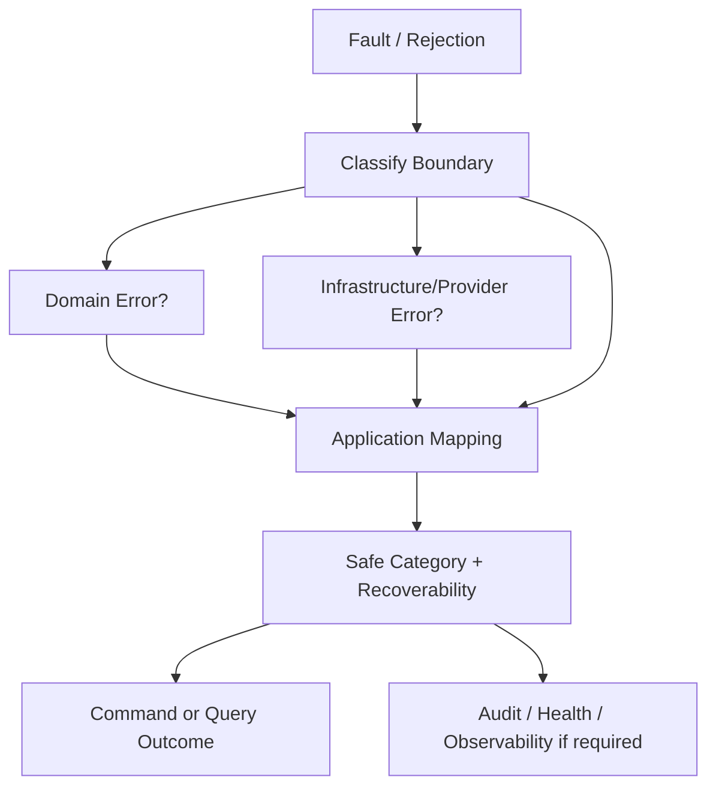

# OmniWA Application Error Strategy

## Purpose

This document defines Phase 3.4 Application error strategy.

It maps Domain, Application, Infrastructure, Provider, Validation, Authorization, and Unknown failures into safe Application outcomes. It does not define HTTP status codes, REST error bodies, OpenAPI schemas, exception classes, log formats, database errors, provider error payloads, or source code.

## Error Principles

- Errors must be classified before crossing Application boundaries.
- Application errors use product-safe vocabulary.
- Domain errors are preserved as product meaning and mapped to safe outcomes.
- Infrastructure and provider errors are translated into safe Application categories.
- Unknown errors are sanitized and observable.
- Secret and raw Confidential data must never appear in Application error output.
- Retryability is an explicit product classification, not an implementation guess.

## Application Error Categories

| Application Error | Meaning | Typical Source | Default Outcome |
| --- | --- | --- | --- |
| ApplicationValidationError | Command/query is malformed at Application semantic level. | Missing target identity, missing idempotency key, unknown command/query. | Rejected or QueryDenied. |
| ApplicationAuthorizationError | Required access decision is missing, denied, expired, or unsafe. | Authorization boundary. | Rejected or QueryDenied. |
| ApplicationConflictError | Duplicate, stale, or conflicting workflow/idempotency state. | Idempotency, concurrency, workflow lifecycle. | Rejected, current visible state, or ActionRequired. |
| ApplicationWorkflowError | Orchestration could not proceed safely. | Missing precondition, invalid workflow dependency, publication scheduling failure. | Failed, ActionRequired, or retry-visible state. |
| ApplicationAsyncVisibilityError | Accepted async work cannot be made visible. | Queue/WorkerJob visibility failure. | Rejected before acceptance or Failed if after accepted owner state. |
| ApplicationMappingError | Safe mapping from boundary/domain/event failed. | Mapper strategy, redaction, unsafe payload. | Rejected, QueryDenied, or ActionRequired. |
| ApplicationConsistencyError | Cross-aggregate precondition is inconsistent. | Application-coordinated preconditions. | Rejected or ActionRequired. |
| ApplicationDependencyError | Required port/dependency is unavailable or degraded. | Repository/queue/config/secret/observability ports. | Failed, Retry, ActionRequired, or degraded health. |
| ApplicationUnknownError | Unexpected failure after sanitization. | Any unclassified runtime condition. | Failed/Retry/ActionRequired with safe unknown category. |

## Domain Error Mapping

| Domain Error Category | Application Mapping | Outcome Guidance |
| --- | --- | --- |
| BusinessRuleViolation | Business rejection. | Reject before acceptance or mark accepted work failed if failure occurs after acceptance. |
| InvalidStateTransition | Lifecycle conflict. | Reject, return current visible state, or ActionRequired. |
| UnsupportedCapability | Unsupported scope rejection. | Reject; do not retry automatically. |
| PolicyViolation | Policy/guardrail/access rejection. | Reject, throttle/action-required, or audit where required. |
| IdentityError | Invalid product reference. | Reject or QueryDenied. |
| ConsistencyError | Cross-state conflict. | Reject, ActionRequired, or recovery workflow. |
| SensitiveDataViolation | Security/data safety failure. | Reject and audit/security signal where required. |
| RetentionRuleViolation | Retention conflict. | Reject, defer cleanup, or ActionRequired. |
| AccessDecisionViolation | Authorization failure. | Reject before mutation. |
| ExternalSignalClassificationError | Unsafe/unknown translated signal. | Ignore stale signal, reject, retry classification, or ActionRequired. |
| ConfigurationDomainError | Unsafe configuration. | Reject activation/startup; ActionRequired. |

## Infrastructure Error Mapping

| Infrastructure Failure | Application Mapping | Retry Guidance |
| --- | --- | --- |
| Repository port unavailable | ApplicationDependencyError. | Retry only when command can remain idempotent; otherwise fail/action-required. |
| QueueProvider cannot create visible work | ApplicationAsyncVisibilityError. | Reject before accepted async outcome; alert if visibility at risk. |
| EventBus publication failure | ApplicationWorkflowError. | Preserve source state; retry publication/follow-up where required. |
| SecretProvider unavailable | ApplicationDependencyError / Security Error. | ActionRequired for secret-dependent workflow. |
| ConfigurationProvider failure | ApplicationDependencyError / Configuration Error. | Fail fast before accepting unsafe work. |
| Observability sink unavailable | ApplicationDependencyError. | Do not corrupt business state; mark observability gap if mandatory. |
| WebhookTransport failure | ApplicationDependencyError mapped to Webhook failure category. | Retry bounded; dead-letter on exhaustion. |
| Persistence conflict | ApplicationConflictError / ApplicationConsistencyError. | Retry only when idempotent and safe. |

## Provider Error Mapping

| Provider Failure | Application Mapping | Owner Workflow |
| --- | --- | --- |
| Provider disconnected | External Provider Error with recoverable/disconnected classification. | ReconnectInstance / health workflow. |
| Provider logged out or unlinked | External Provider Error with action-required classification. | MarkInstanceLoggedOut. |
| Provider send timeout | External Provider Error retryable category. | ProcessOutboundMessageWork. |
| Provider send rejected non-retryably | External Provider Error terminal category. | MessageFailed. |
| Provider media failure | External Provider Error or Media failure category. | ProcessMediaWork / SendMediaMessage. |
| Provider status stale/out-of-order | ExternalSignalClassificationError. | ApplyProviderMessageStatus ignores/classifies safely. |
| Provider capability unsupported | UnsupportedCapability / External Provider Error. | ProviderCompatibilityRefresh / command rejection. |
| Unknown provider payload | ApplicationMappingError / ExternalSignalClassificationError. | Quarantine/drop/ActionRequired where needed. |

Provider errors must not expose Baileys stack traces, raw callbacks, socket objects, session data, phone numbers, JIDs, or provider-native message payloads.

## Command Outcome Mapping

| Error Timing | Outcome |
| --- | --- |
| Before accepted state | CommandRejected. |
| During validation/authorization | CommandRejected or CommandActionRequired. |
| During idempotent duplicate | Existing safe outcome or conflict rejection. |
| After accepted async owner state but before work visibility | CommandFailed or ActionRequired; visibility gap must be observable. |
| During worker execution with retryable failure | Retrying / CommandQueued equivalent visible lifecycle. |
| Retry exhausted | DeadLettered or CommandFailed with operator-visible reason. |
| Unsafe sensitive data detected | CommandRejected and security/audit signal where required. |

## Query Outcome Mapping

| Error | Outcome |
| --- | --- |
| Unauthorized read | QueryDenied. |
| Unsafe field requested | QueryDenied. |
| Projection unavailable | QueryUnavailable. |
| Projection stale | QueryStale. |
| Retention expired | QueryEmpty or QueryUnavailable with retention marker. |
| Unknown query | ApplicationValidationError / QueryDenied. |

## Error Flow

## Logging And Exposure Rules

Application error output may include:

- Safe category.
- Safe reason code.
- Owner context.
- Product identifier where allowed.
- Correlation/request/trace references where safe.
- Retry/action-required/dead-letter classification.

Application error output must not include:

- HTTP status code.
- SQL/ORM/prisma/database error.
- Queue engine error.
- Baileys/provider raw error.
- Stack trace.
- Secret values.
- Raw Confidential payloads.
- Raw phone numbers or JIDs.

## Freeze Decision

The Application error strategy is **APPROVED** for Phase 3 freeze.
