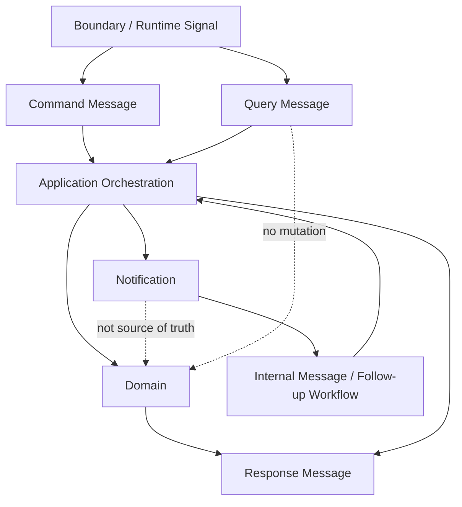

# OmniWA Application Messages

## Purpose

This document defines the Application message vocabulary for Phase 3.3.

Application messages are internal Application Layer concepts. They are not DTOs, REST payloads, OpenAPI schemas, database rows, queue payload schemas, webhook payload schemas, provider payloads, or source code.

## Message Vocabulary

| Message Type | Meaning | Direction | Mutates State? | Produces Events? | Notes |
| --- | --- | --- | --- | --- | --- |
| Command | Product or internal intent to change state, start workflow, classify translated signal, or create visible async work. | Boundary/runtime -> Application. | Yes, when accepted. | May result in Domain Events from aggregate roots. | Cataloged in `COMMAND_CATALOG.md`. |
| Query | Read-only request for safe state, status, history, configuration, metrics, or monitoring information. | Boundary/monitoring -> Application. | No. | No. | Cataloged in `QUERY_CATALOG.md`. |
| Response | Safe outcome of a Command or Query. | Application -> caller boundary. | No. | No. | Not an API response shape. |
| Notification | Application-controlled internal publication signal for follow-up work after a product fact. | Application -> Application handler/port. | Not by itself. | It carries publication intent, not source business truth. | May schedule webhook, audit, health, telemetry, or async work. |
| Internal Message | Application-level signal from worker, scheduler, provider translation, or publication handler. | Runtime boundary -> Application. | Depends on mapped command. | Depends on mapped command. | Must route to an approved command/workflow. |

## Command Messages

Command messages represent intent. They must:

- Use product language.
- Map to approved use cases.
- Carry only safe conceptual inputs.
- Include correlation conceptually.
- Include idempotency conceptually when duplicate-prone.
- Never carry provider-native payloads, Secret values, raw Confidential content, database identifiers as business identity, queue-engine payloads, or transport details.

Command messages may originate from:

- Future Interface boundary.
- Worker Runtime.
- Scheduler.
- Provider Signal Handler after translation.
- Application Event Handler after publication decision.
- Administration/operator boundary.

## Query Messages

Query messages represent safe reads. They must:

- Be side-effect free.
- Use safe read scope.
- Declare consistency expectations through the query catalog.
- Return staleness or unavailable markers conceptually when needed.
- Avoid implicit recovery, refresh, or projection repair.
- Avoid Secret/raw Confidential exposure.

## Response Messages

Responses are safe Application outcomes, not DTOs or HTTP responses.

| Response Category | Meaning | Applies To |
| --- | --- | --- |
| CommandCompleted | Command finished Application responsibility. | Synchronous commands. |
| CommandAccepted | Command accepted product work. | Async acceptance commands. |
| CommandQueued | Command created visible async work. | Worker-backed commands. |
| CommandWaiting | Command entered visible waiting state. | QR, reconnect, provider/user action workflows. |
| CommandRejected | Command failed before acceptance. | Policy/access/validation/precondition failure. |
| CommandFailed | Command failed after acceptance or orchestration. | Non-retryable or unexpected classified failure. |
| CommandActionRequired | Command requires operator/user/provider/config/secret action. | Recovery and safety workflows. |
| QueryResult | Query returned safe data. | Queries. |
| QueryEmpty | Query found no safe data. | Queries. |
| QueryStale | Query returned stale projection with marker. | Cached/eventual queries. |
| QueryUnavailable | Query could not read safe state. | Projection/read model unavailable. |
| QueryDenied | Query read scope is denied or unsafe. | Access/data safety failure. |

## Notification Messages

Notifications are internal Application publication signals. They are not Domain Events and are not external webhook payloads.

| Notification | Purpose | Source | Consumer |
| --- | --- | --- | --- |
| ProductFactPublished | Coordinate follow-up after aggregate fact is persisted. | Application publication timing. | Webhook, Audit, Health, Observability handlers. |
| AsyncWorkRequested | Ask Operations to create visible WorkerJob. | Application workflow. | Operations workflow. |
| AuditEvidenceRequested | Ask Audit to record safe evidence. | Application publication timing. | Audit workflow. |
| HealthRefreshRequested | Ask Health to project safe health state. | Application publication timing or scheduler. | Health workflow. |
| TelemetryProjectionRequested | Ask Observability to project sanitized telemetry. | Application publication timing. | Observability workflow. |
| WebhookDeliveryRequested | Ask Webhook Delivery to schedule async delivery. | Application publication timing. | Webhook workflow. |

Notifications must not become a hidden event bus design in this phase.

## Internal Messages

| Internal Message | Maps To | Boundary Rule |
| --- | --- | --- |
| ProviderConnectionSignalReceived | HandleProviderConnectionSignal. | Provider payload already translated and sanitized. |
| ProviderAuthSignalReceived | HandleProviderAuthSignal or ConfirmSessionActivated/MarkInstanceLoggedOut. | No raw session material. |
| ProviderMessageSignalReceived | HandleProviderMessageSignal, ApplyProviderMessageStatus, ReceiveInboundMessage, or ClassifyUnsupportedInboundMessage. | No raw provider payload. |
| ProviderFailureSignalReceived | HandleProviderFailureSignal. | Safe product failure category only. |
| WorkerJobExecutionRequested | ReserveWorkerJob then owner worker command. | Worker never calls Interface. |
| WorkerJobResultReceived | CompleteWorkerJob or MarkWorkerJobRetryOrDead. | Owner context interprets business outcome. |
| ScheduledRecoveryRequested | ReconnectInstance, CleanupMediaRetention, RefreshHealthStatus, or RefreshProviderCapability. | Scheduler does not mutate Domain directly. |
| PublicationFollowUpRequested | RecordAuditEvidence, ScheduleWebhookDelivery, RefreshHealthStatus, CaptureTelemetrySignal. | Source fact must be persisted before integration follow-up where required. |

## Message Safety Rules

- Application messages must not contain Secret values.
- Application messages must not contain raw message bodies, raw media binary, raw webhook payloads, raw provider payloads, raw phone numbers, or raw JIDs.
- Application messages must not encode database, queue engine, provider library, HTTP framework, logger, or telemetry exporter details.
- Application messages must carry safe references and classifications instead of raw external payloads.
- Application messages must preserve correlation context without embedding sensitive values.
- Application messages must avoid unbounded cardinality in telemetry-related concepts.

## Message Versioning Position

Application messages are internal contracts, but they still require governance:

- Rename only through documentation update and review.
- Breaking semantic changes require Phase 3 review and, when architectural, ADR.
- External webhook/integration event versioning remains governed by Domain Event and Integration Event documents.
- DTO/schema versioning is out of scope for Phase 3.3.

## Application Message Flow

## Application Message Constraints

- Commands, Queries, Responses, Notifications, and Internal Messages must remain conceptual in Phase 3.3.
- A future API or worker transport must map to these concepts without changing their business meaning.
- A future implementation must enforce the same safety rules at boundaries.
- Any new application message that changes product scope requires product review; any new architectural message boundary requires ADR review.
