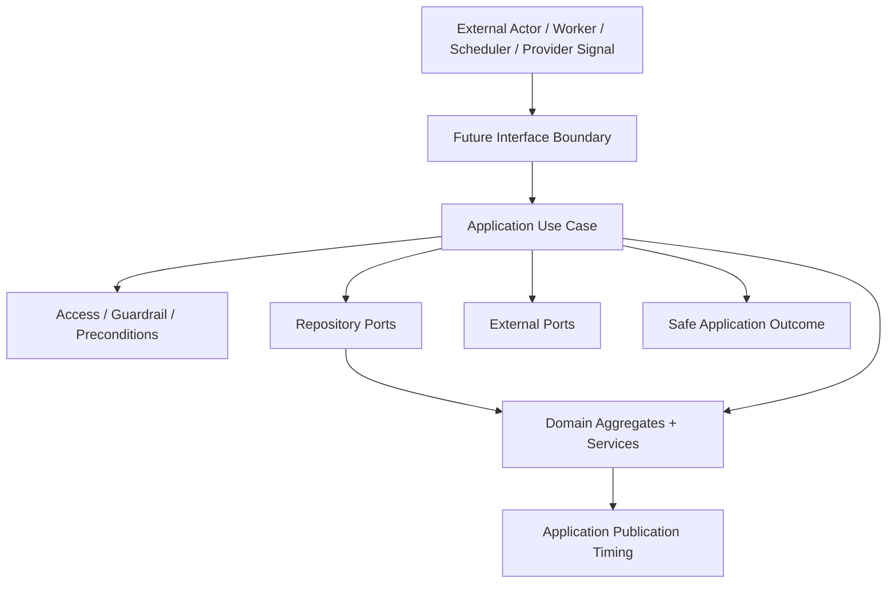

# OmniWA Application Overview

## Purpose

This document defines the responsibility of OmniWA's Application Layer for Phase 3.1.

It does not define REST APIs, OpenAPI, DTOs, database schema, repository implementation, provider implementation, queue implementation, service implementation, Docker, Prisma, or source code.

## Frozen Inputs

The Application Layer must comply with:

- Phase 0 Product Definition freeze.
- Phase 1 Architecture freeze.
- Phase 2 Domain freeze.
- MVP tenancy: Single Tenant + Multi Instance.
- MVP supported message types: text, image, video, document, and audio.
- Product posture: API platform with product-enforced guardrails.
- Architecture dependency rule: Interface -> Application -> Domain, with Infrastructure implementing ports.
- Provider isolation: Application must use product-oriented provider ports and must not depend on Baileys directly.
- Domain rule: business policy belongs to Domain, not Application orchestration.

## Application Layer Responsibility

The Application Layer owns workflow coordination.

Application is responsible for:

- Receiving product-level commands or internal workflow requests from future Interface, Worker, Scheduler, or provider-signal boundaries.
- Sequencing use cases across one or more bounded contexts.
- Loading and saving aggregates through repository ports.
- Calling approved domain behavior, domain services, policies, specifications, and factories.
- Enforcing cross-aggregate precondition order without redefining the business rule.
- Calling external ports such as provider, queue, event bus, clock, UUID, configuration, secret, webhook transport, observability, and audit/health projection ports.
- Creating visible async work when a use case accepts work that will complete later.
- Controlling Application-level transaction scope conceptually.
- Controlling Domain Event publication timing.
- Preserving idempotency for accepted async work and external boundary retries.
- Propagating safe correlation context.
- Mapping domain, application, and infrastructure error categories to safe application outcomes.

## Application Layer Is Not Responsible For

Application must not own:

- Aggregate invariants.
- Domain policy meaning.
- Supported message type rules.
- Guardrail outcome meaning.
- Session usability semantics.
- Media retention business rules.
- Webhook retry business rules.
- Provider-native translation mechanics.
- Database schema, ORM models, SQL, migrations, or repository implementation.
- Queue engine mechanics, worker leases, or concrete retry scheduling implementation.
- HTTP routes, REST resources, request/response schemas, OpenAPI, or DTO shapes.
- Secret storage implementation.
- Logging, metrics, tracing, or telemetry exporter implementation.
- Provider/Baileys implementation details.

## Relationship With Domain

Application uses Domain as the source of business truth.

| Application Does | Domain Does |
| --- | --- |
| Load aggregates through repository ports. | Protect aggregate invariants. |
| Pass safe values and translated signals to domain behavior. | Decide business validity and lifecycle meaning. |
| Coordinate multiple aggregate outcomes. | Create Domain Event facts from aggregate roots. |
| Invoke domain services where cross-aggregate business decisions are approved. | Keep business policy independent from infrastructure and interface. |
| Persist aggregate outcomes through ports. | Remain unaware of persistence and transaction mechanics. |
| Decide publication timing. | Never publish directly to EventBus, Queue, Webhook, Log, Provider, or external systems. |

## Relationship With Infrastructure

Application depends on ports, not concrete infrastructure.

| Application Uses | Infrastructure Later Implements |
| --- | --- |
| Repository ports. | Persistence adapters. |
| MessagingProvider and provider signal ports. | Baileys adapter or future provider adapters. |
| QueueProvider or async work port. | Queue engine adapter. |
| EventBus port. | Internal event bus adapter. |
| WebhookTransport port. | Webhook delivery transport adapter. |
| SecretProvider port. | Secret storage adapter. |
| ConfigurationProvider port. | Configuration source adapter. |
| ObservabilitySink / Audit / Health projection ports. | Logging, metrics, tracing, audit sink, health probe adapters. |
| Clock and UUID ports. | Runtime time and identity generation adapters. |

Infrastructure may translate, persist, send, receive, and observe. It must not own product policy or bypass Application sequencing.

## Relationship With Interface

Interface is a delivery mechanism. It calls Application use cases.

Interface may later:

- Authenticate an entry boundary.
- Validate transport shape.
- Map external request concepts into application command/query concepts.
- Map application outcomes into transport-specific responses.

Interface must not:

- Call Domain directly for workflow behavior.
- Call Infrastructure directly for business behavior.
- Call Baileys or provider adapters.
- Own retry, persistence, queue, webhook, or guardrail policy.
- Publish Domain Events or Integration Events directly.

## Command And Query Posture

Phase 3.1 uses lightweight command/query separation.

| Type | Application Behavior |
| --- | --- |
| Command | Coordinates a product state change through domain behavior, repository ports, preconditions, event publication timing, and async work visibility. |
| Query | Reads safe product/application state without mutation and without publishing Domain Events. |
| Internal workflow command | Handles provider, worker, scheduler, or event-driven work through the same Application boundary rules. |

This is not full CQRS, event sourcing, or a separate read/write database design.

## Application Flow

## Application Event Publication Rule

Application controls publication timing for Domain Events.

| Step | Responsibility |
| --- | --- |
| Aggregate changes state | Domain aggregate root records Domain Event fact. |
| Application receives aggregate outcome | Application decides whether to persist, publish, transform, create async work, request audit, update health, or schedule webhook delivery. |
| Infrastructure transports event later | EventBus/queue/webhook transports are implementation concerns behind ports. |

Application must not publish events before accepted work has visible lifecycle state where the workflow requires it.

## Application Data Safety Rules

- Do not expose Secret values.
- Do not pass raw Confidential payloads into logs, telemetry, audit, or webhook delivery.
- Do not retain message or media bodies by default.
- Do not use phone number, JID, provider ID, content hash, or Secret as aggregate identity.
- Do not use provider-native payloads as domain inputs.
- Use safe references, classifications, and correlation identifiers.

## Phase 3.1 Scope

Phase 3.1 defines use case inventory only.

It does not yet finalize:

- Detailed command models.
- Detailed query models.
- Application port catalog.
- Transaction policy details.
- Event publication policy details.
- Idempotency policy details.
- Error mapping policy details.
- Testing strategy details.

Those are later Phase 3 deliverables.
