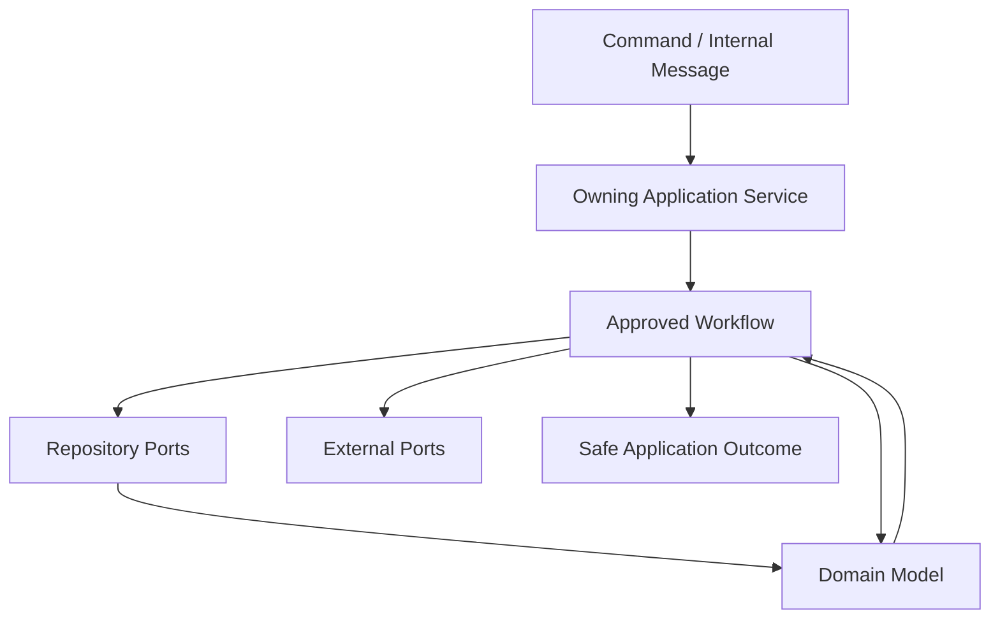

# OmniWA Application Services

## Purpose

This document defines Phase 3.4 Application Service responsibilities, ownership, boundaries, and dependency rules.

Application Services are conceptual use case orchestration owners. This document does not create classes, files, modules, implementation methods, DTOs, REST APIs, OpenAPI, database schemas, Prisma models, or source code.

## Service Principles

- Application Services orchestrate; Domain decides.
- Application Services call repository ports and external ports, never concrete infrastructure.
- Application Services may coordinate multiple bounded contexts only when a workflow requires it.
- Application Services must not own aggregate invariants, domain policies, or domain event facts.
- Application Services must preserve command/query boundaries.
- Application Services must preserve idempotency, validation, authorization, transaction, and error mapping strategies.
- Application Services must return safe Application outcomes, not transport responses.

## Service Responsibility Model

| Responsibility | Application Service Does | Application Service Does Not Do |
| --- | --- | --- |
| Orchestration | Sequence commands, workflows, repository calls, domain calls, ports, and follow-up work. | Define business rules or aggregate invariants. |
| State access | Load and persist through repository ports. | Use SQL/ORM/database concepts or repository implementations. |
| Transactions | Define conceptual Unit of Work and commit timing. | Open low-level database transactions directly in Domain or Interface. |
| Events | Decide publication timing and follow-up work. | Create Domain Events outside aggregate roots or transport events directly. |
| Async work | Create visible WorkerJob/owner lifecycle before acceptance. | Fire-and-forget work or depend on queue engine details. |
| Errors | Map errors to safe Application outcomes. | Expose raw provider/infrastructure/stack details. |
| Security | Invoke access decisions and enforce sensitive boundary outcomes. | Authenticate tokens or own identity-provider mechanics. |

## Service Ownership Catalog

| Application Service | Owns Orchestration For | Primary Commands | Primary Queries | Primary Domain Contexts | External Ports Used Conceptually |
| --- | --- | --- | --- | --- | --- |
| InstanceApplicationService | Instance lifecycle, connection request, QR pairing, disconnect/logout, reconnect, destruction. | CreateInstance, UpdateInstanceMetadata, ConnectInstance, StartQrPairing, RefreshQrPairing, ConfirmSessionActivated, DisconnectInstance, ReconnectInstance, MarkInstanceLoggedOut, DestroyInstance. | GetInstanceStatus, ListInstances. | Instance, Session, Security and Access, Health. | MessagingProvider, QueueProvider, EventBus, Clock, UUID, SecretProvider where needed. |
| MessagingApplicationService | Outbound/inbound message acceptance, guardrail sequencing, provider status application, retry and cancellation. | SendTextMessage, SendMediaMessage, EvaluateOutboundGuardrails, ProcessOutboundMessageWork, ApplyProviderMessageStatus, ReceiveInboundMessage, ClassifyUnsupportedInboundMessage, RetryMessageSend, CancelMessage. | GetMessageStatus, GetMessageDeliveryHistory, GetMessageMetricsSnapshot. | Messaging, Guardrails, Session, Media, Provider Integration, Operations. | MessagingProvider, QueueProvider, EventBus, Clock, UUID. |
| MediaApplicationService | Media registration, processing, attachment, diagnostic capture, retention cleanup. | RegisterMedia, ProcessMediaWork, AttachMediaToMessageWorkflow, RequestDiagnosticCapture, CleanupMediaRetention. | GetMediaStatus, GetMediaMetricsSnapshot. | Media, Messaging, Operations, Audit, Security and Access. | QueueProvider, MediaStore future port, MessagingProvider media boundary, Clock, EventBus. |
| WebhookApplicationService | Subscription lifecycle, delivery scheduling, delivery execution, retry, dead-letter. | RegisterWebhookSubscription, UpdateWebhookSubscription, ActivateWebhookSubscription, SuspendWebhookSubscription, RetireWebhookSubscription, ScheduleWebhookDelivery, DeliverWebhookWork, RetryWebhookDelivery, MoveWebhookDeliveryToDeadLetter. | GetWebhookStatus, GetWebhookDeliveryHistory, GetWebhookMetricsSnapshot. | Webhook Delivery, Operations, Audit, Health. | WebhookTransport, QueueProvider, EventBus, Clock, SecretProvider. |
| ProviderApplicationService | Provider compatibility, capability refresh, translated provider signal routing. | EvaluateProviderCompatibility, HandleProviderConnectionSignal, HandleProviderAuthSignal, HandleProviderMessageSignal, HandleProviderFailureSignal, RefreshProviderCapability. | GetProviderCapabilityStatus. | Provider Integration, Instance, Session, Messaging, Media, Health. | MessagingProvider capability/signal ports, EventBus, Clock. |
| OperationsApplicationService | Visible async work lifecycle and worker command routing. | QueueAsyncWork, ReserveWorkerJob, CompleteWorkerJob, MarkWorkerJobRetryOrDead. | GetWorkerJobStatus, GetQueueMetricsSnapshot. | Operations, owner product contexts. | QueueProvider, Clock, EventBus. |
| AdministrationApplicationService | Access decision orchestration, configuration validation/activation, audit evidence. | EvaluateAccessDecision, ValidateConfigurationSnapshot, ActivateConfigurationSnapshot, RecordAuditEvidence. | GetConfigurationStatus, QueryAuditRecords. | Security and Access, Configuration, Audit. | ConfigurationProvider, SecretProvider, EventBus, Clock. |
| MonitoringApplicationService | Health refresh, telemetry capture, operational metrics read models. | RefreshHealthStatus, CaptureTelemetrySignal. | GetHealthStatus, GetOperationalMetricsSnapshot, GetActionRequiredItems. | Health, Observability, Audit, product contexts. | ObservabilitySink, EventBus, Clock. |
| QueryApplicationService | Cross-context safe read orchestration for side-effect-free query contracts. | None. | All queries in `QUERY_CATALOG.md` when a separate query boundary is useful. | Owner read models and projections. | None side-effecting; read/projection ports only later. |

## Service Boundary Rules

| Rule | Requirement |
| --- | --- |
| One primary service per command | Each command has one Application Service responsible for orchestration. |
| Cross-service coordination is workflow-level | A service may request another approved workflow/command conceptually, but must not mutate another context directly. |
| Query service is read-only | Query orchestration must not call command services to repair stale state. |
| Operations service does not own business outcome | WorkerJob lifecycle is visible work state; owner context interprets business result. |
| Provider service does not own business policy | It translates/classifies provider capability and signals only. |
| Webhook service does not own source facts | It owns external delivery lifecycle only. |
| Monitoring service does not own source facts | It projects health/telemetry and must not mutate source business state. |

## Dependency Rules

Allowed:

- Application Service -> Domain aggregates/services/policies/specifications/factories.
- Application Service -> Repository ports.
- Application Service -> Application ports.
- Application Service -> other Application workflow contracts when explicit in `WORKFLOW_DEPENDENCIES.md`.
- Application Service -> Shared primitives that are policy-neutral.

Forbidden:

- Application Service -> concrete database, ORM, Prisma, queue engine, Baileys, HTTP framework, logging sink, telemetry sink, or secret implementation.
- Application Service -> Interface/API handlers.
- Application Service -> provider-native payloads as product input.
- Application Service -> another service's internal state.
- Application Service -> direct event transport implementation.

## Service Interaction Diagram

## Service Review Result

The service model is **APPROVED** for Phase 3 freeze.

No implementation may introduce Application Services that bypass the ownership catalog or dependency rules without updating this document and receiving review.
