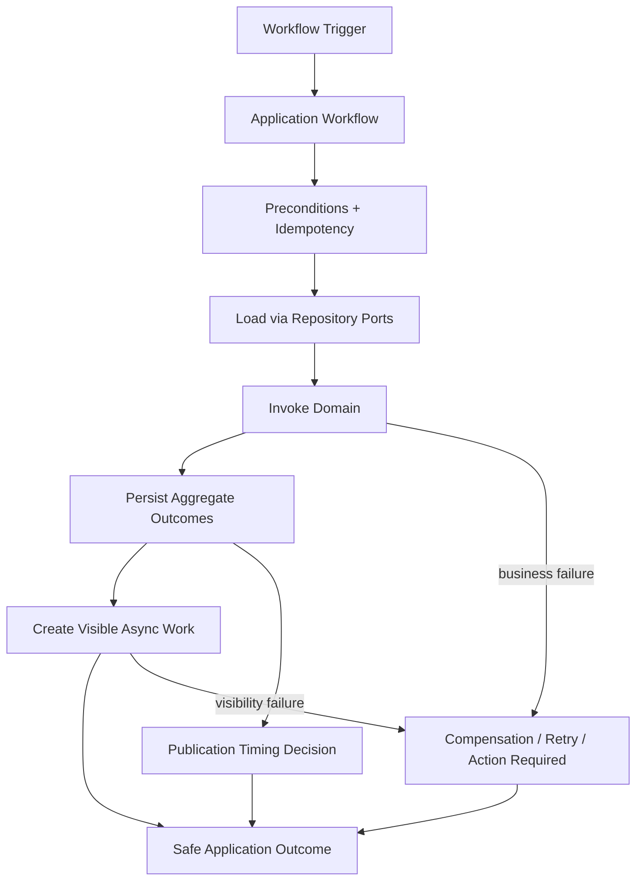
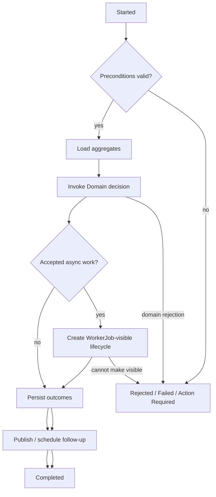
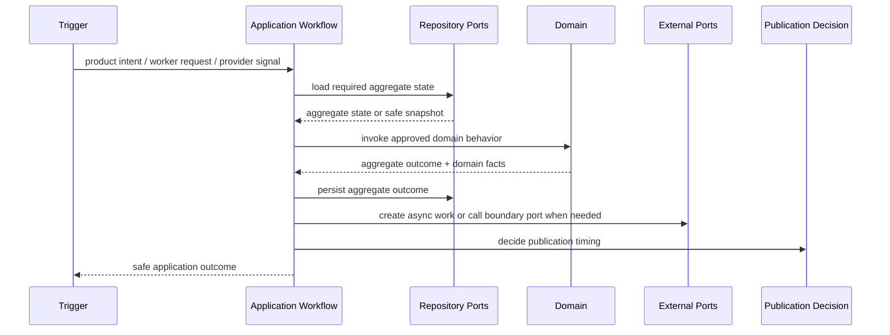

# OmniWA Application Workflows

## Purpose

This document defines Application Layer workflow orchestration for OmniWA Phase 3.2.

It does not create Commands, Queries, DTOs, REST APIs, OpenAPI, database schemas, repository implementations, queue implementations, provider implementations, service implementations, Docker, Prisma, or source code.

## Workflow Principles

- A workflow is Application orchestration over approved use cases, domain objects, repository ports, and external ports.
- Workflow steps must not contain business rules. They call approved Domain behavior, policies, services, specifications, factories, and aggregate roots.
- Workflow state is Application coordination state, not a replacement for Domain state machines.
- Domain Events are created by aggregate roots; Application controls publication timing.
- Accepted async work must have visible WorkerJob lifecycle before Application reports acceptance.
- Provider-native signals must be translated before any workflow passes them to Domain.
- Webhook delivery must always be asynchronous, retry-visible, and observable.
- Workflow failure handling must produce safe application outcomes without exposing Secret, raw Confidential data, provider-native payloads, database details, queue details, or stack traces.

## Workflow Categories

| Category | Meaning | Examples |
| --- | --- | --- |
| Synchronous command workflow | Completes at application boundary after one or more domain decisions. | Create Instance, Register Webhook Subscription, Validate Configuration Snapshot. |
| Async acceptance workflow | Accepts work and creates visible async lifecycle before work completes. | Send Message, Schedule Webhook Delivery, Register Media for processing. |
| Worker execution workflow | Executes previously accepted async work through Application boundary. | Process Outbound Message Work, Deliver Webhook Work, Process Media Work. |
| Provider-signal workflow | Routes translated provider observation to owner domain workflow. | Confirm Session Activated, Apply Provider Message Status, Receive Inbound Message. |
| Scheduled workflow | Runs recovery, cleanup, health, or capability checks through Application boundary. | Reconnect Instance, Cleanup Media Retention, Refresh Health Status. |
| Query workflow | Reads safe state and does not mutate Domain or publish events. | Get Instance Status, Get Message Status, Get Webhook Status. |

## Application Workflow Lifecycle

Application workflows use coordination states documented in `WORKFLOW_STATES.md`.

At high level:

1. Workflow starts from an external actor, worker, scheduler, provider-signal boundary, or application publication decision.
2. Application validates workflow preconditions and idempotency scope.
3. Application loads required aggregate state through repository ports.
4. Application invokes Domain behavior and records aggregate outcomes.
5. Application persists aggregate outcomes through repository ports.
6. Application decides event publication timing and follow-up work.
7. Application returns a safe outcome or moves the workflow to waiting, retrying, failed, cancelled, or action-required.

## Workflow Inventory

| Workflow ID | Workflow | Category | Primary Use Cases |
| --- | --- | --- | --- |
| WF-INS-001 | Instance Creation | Synchronous command workflow | UC-INS-001, UC-ADM-004, UC-MON-001. |
| WF-INS-002 | Instance Connection Request | Async acceptance workflow | UC-INS-003, UC-OPS-001. |
| WF-INS-003 | QR Authentication | Long-running provider-signal workflow | UC-INS-004, UC-INS-005, UC-INS-006. |
| WF-INS-004 | Reconnect Instance | Long-running scheduled/worker workflow | UC-INS-008, UC-OPS-001, UC-PRV-002, UC-INS-006. |
| WF-INS-005 | Disconnect Or Logout Handling | Provider-signal / command workflow | UC-INS-007, UC-INS-009, UC-PRV-002, UC-PRV-003. |
| WF-INS-006 | Instance Destruction | Multi-step command workflow | UC-INS-010, UC-ADM-001, UC-ADM-004, UC-MON-001. |
| WF-MSG-001 | Send Text Message | Async acceptance workflow | UC-MSG-001, UC-MSG-003, UC-OPS-001. |
| WF-MSG-002 | Send Media Message | Async acceptance workflow | UC-MSG-002, UC-MED-001, UC-MED-003, UC-MSG-003, UC-OPS-001. |
| WF-MSG-003 | Outbound Message Execution | Worker execution workflow | UC-MSG-004, UC-OPS-002, UC-OPS-003, UC-MSG-005. |
| WF-MSG-004 | Message Retry | Long-running retry workflow | UC-MSG-008, UC-OPS-004, UC-MSG-004. |
| WF-MSG-005 | Message Cancellation | Command workflow | UC-MSG-009, UC-OPS-004, UC-ADM-004. |
| WF-MSG-006 | Receive Inbound Message | Provider-signal workflow | UC-PRV-004, UC-MSG-006, UC-WEB-006, UC-ADM-004, UC-MON-002. |
| WF-MSG-007 | Unsupported Inbound Message Handling | Provider-signal workflow | UC-PRV-004, UC-MSG-007, UC-MON-002. |
| WF-MED-001 | Media Registration | Synchronous/async acceptance workflow | UC-MED-001, UC-OPS-001 where processing is required. |
| WF-MED-002 | Media Processing | Long-running worker workflow | UC-MED-002, UC-OPS-002, UC-OPS-003. |
| WF-MED-003 | Media Cleanup | Scheduled workflow | UC-MED-005, UC-OPS-001, UC-ADM-004. |
| WF-WEB-001 | Webhook Subscription Management | Multi-step command workflow | UC-WEB-001, UC-WEB-002, UC-WEB-003, UC-WEB-004, UC-WEB-005. |
| WF-WEB-002 | Webhook Delivery | Long-running worker workflow | UC-WEB-006, UC-WEB-007, UC-OPS-001, UC-OPS-002, UC-OPS-003. |
| WF-WEB-003 | Webhook Retry And Dead Letter | Long-running retry workflow | UC-WEB-008, UC-WEB-009, UC-OPS-004, UC-MON-001. |
| WF-PRV-001 | Provider Compatibility Refresh | Scheduled/command workflow | UC-PRV-001, UC-PRV-006, UC-MON-001. |
| WF-PRV-002 | Provider Signal Routing | Provider-signal workflow | UC-PRV-002, UC-PRV-003, UC-PRV-004, UC-PRV-005. |
| WF-ADM-001 | Configuration Activation | Multi-step command workflow | UC-ADM-001, UC-ADM-002, UC-ADM-003, UC-ADM-004, UC-MON-001. |
| WF-ADM-002 | Audit Evidence Recording | Event-driven evidence workflow | UC-ADM-004. |
| WF-MON-001 | Health Refresh | Scheduled/event-driven workflow | UC-MON-001. |
| WF-MON-002 | Telemetry Capture | Event-driven projection workflow | UC-MON-002. |
| WF-QRY-001 | Status Query Workflows | Query workflow | UC-INS-011, UC-INS-012, UC-MSG-010, UC-MED-006, UC-WEB-010, UC-MON-003, UC-MON-004. |

## Orchestration Responsibilities

| Responsibility | Application Workflow Rule |
| --- | --- |
| Preconditions | Call Domain specifications/policies/services or load safe snapshots before state change. |
| Persistence | Use repository ports only. No schema, ORM, or storage assumptions. |
| Async work | Create WorkerJob-visible work before reporting accepted async outcome. |
| Provider access | Use provider ports and translated signals only. |
| Retry | Delegate retry eligibility to domain policies/services and keep retry bounded. |
| Compensation | Prefer forward recovery, cancellation, terminal failure, dead-letter, or action-required state over hidden rollback. |
| Events | Persist aggregate outcome before publication where workflow correctness requires durable facts. |
| Safety | Do not expose Secret or raw Confidential data across workflow steps. |

## Workflow Diagram

## Activity Diagram

## Sequence Overview

## Phase 3.2 Scope Boundary

Phase 3.2 defines workflow orchestration only.

It does not define:

- Command models.
- Query models.
- DTOs or mappers.
- REST endpoints.
- Database schemas.
- Repository implementations.
- Queue implementation.
- Provider implementation.
- Event bus implementation.
- Concrete transaction mechanics.
- Concrete Saga implementation.

## Phase 3.2 Checklist

| Item | Status |
| --- | --- |
| Workflows identified | PASS |
| Workflow states defined | PASS |
| Dependencies defined | PASS |
| Long-running workflows identified | PASS |
| Saga candidates identified | PASS |
| Compensation strategies defined | PASS |

**Phase 3.2 is ready for review.**
