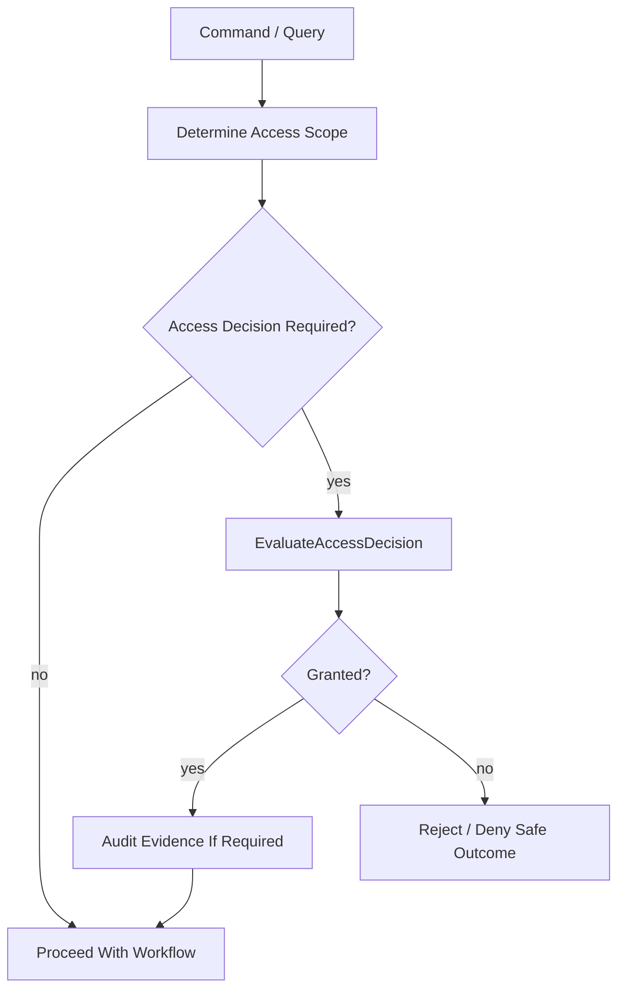

# OmniWA Authorization Boundaries

## Purpose

This document defines Phase 3.4 authorization boundaries for OmniWA's Application Layer.

It does not design authentication protocols, API keys, roles, sessions, OAuth, RBAC tables, policy engines, DTOs, REST APIs, OpenAPI, database schema, or source code.

## Authorization Principles

- Application coordinates authorization before privileged or sensitive mutation.
- Security and Access Domain owns product access decision semantics.
- Interface may authenticate transport entry later, but must not become the product authorization owner.
- Domain must not read identity-provider tokens, HTTP headers, API keys, or transport sessions.
- Infrastructure may verify or resolve identity/secret mechanics later, but must not grant product permissions by itself.
- Denied or missing access cannot mutate product state.
- Authorization evidence must be safe and audit-eligible when required.

## Boundary Responsibilities

| Boundary | Responsibility | Must Not Do |
| --- | --- | --- |
| Interface | Authenticate future entry boundary, parse actor context, pass safe actor reference to Application. | Decide privileged product permission or bypass Application. |
| Application | Determine whether command/query requires access decision; invoke EvaluateAccessDecision; enforce result before mutation/read; request audit where needed. | Authenticate raw tokens, define business access policy, or store credentials. |
| Security and Access Domain | Define AccessDecision, PrivilegedActionPolicy, access lifecycle, granted/denied/expired outcomes. | Read HTTP, identity-provider, database, queue, or provider implementation details. |
| Infrastructure | Implement identity/secret provider mechanics later; translate external auth data to safe actor references. | Mutate product state or grant product access without Application/Domain decision. |

## Authorization Requirement Matrix

| Command/Query Area | Authorization Requirement |
| --- | --- |
| CreateInstance / UpdateInstanceMetadata | Actor context required; privileged access where policy marks sensitive mutation. |
| ConnectInstance / DisconnectInstance / ReconnectInstance | Actor or scheduler context required; operator/admin intent audited where privileged. |
| DestroyInstance | Granted AccessDecision required. |
| SendTextMessage / SendMediaMessage | Actor/client context required; guardrail and session checks are separate from authorization. |
| CancelMessage / RetryMessageSend | Actor context required; privileged access where cancellation/retry affects controlled work. |
| RequestDiagnosticCapture | Granted AccessDecision and explicit audit/retention reason required. |
| Webhook subscription lifecycle | Actor context required; privileged access where secret/destination changes are sensitive. |
| Configuration validation/activation | Granted AccessDecision required for activation and sensitive settings. |
| Audit queries | Access-scoped; must never return Secret/raw Confidential evidence. |
| Metrics/health/status queries | Read scope required; no Secret/raw Confidential data. |
| Provider signal/worker/scheduler commands | Runtime boundary identity/authorization handled by trusted internal boundary; still must route through Application. |

## Application Authorization Flow

## Domain Must Not

- Authenticate users.
- Parse API keys, JWTs, OAuth tokens, cookies, HTTP headers, or CLI credentials.
- Call identity providers.
- Store identity-provider tokens.
- Read transport sessions.
- Treat raw actor identity as aggregate identity.
- Grant access by default when AccessDecision is missing.

## Interface Must Not

- Treat authentication success as permission for privileged product mutation.
- Call Domain directly to make access decisions.
- Bypass Application authorization checks.
- Format access failures with sensitive details.
- Leak Secret or raw Confidential data in auth errors.

## Infrastructure Must Not

- Grant product access without AccessDecision.
- Mutate product state after authenticating an external identity.
- Log raw credentials, tokens, session material, or API keys.
- Pass raw identity-provider payloads into Domain.

## Authorization Failure Outcomes

| Failure | Outcome |
| --- | --- |
| Missing actor for protected operation | Reject before mutation. |
| AccessDecision denied | Reject before mutation and audit where required. |
| AccessDecision expired | Reject; require new access decision. |
| Wrong capability or target | Reject as access decision violation. |
| Secret access lacks reason | Reject and mark security/audit event where required. |
| Unsafe query scope | QueryDenied safe outcome. |

## Freeze Decision

The authorization boundary strategy is **APPROVED** for Phase 3 freeze.
