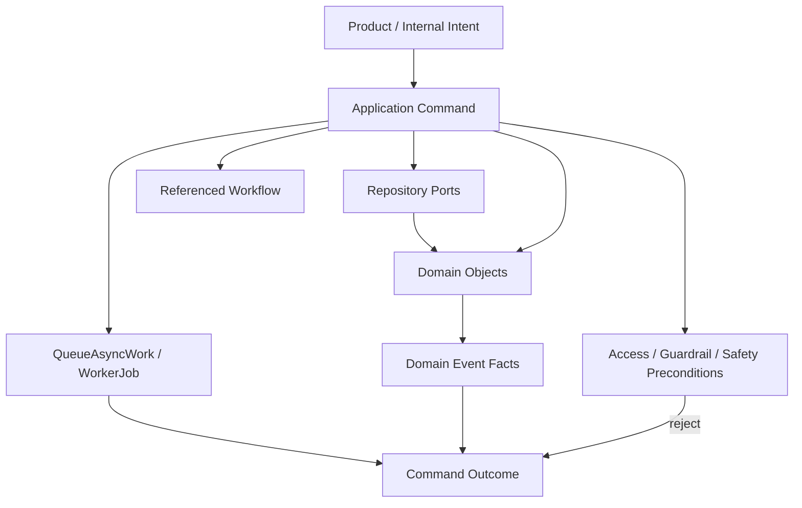

# OmniWA Command Catalog

## Purpose

This document catalogs Phase 3.3 Application Commands.

Every command maps to an approved Phase 3.1 use case. The catalog does not define command object fields, DTOs, REST APIs, OpenAPI operations, database schemas, queue payloads, provider payloads, or source code.

## Command Groups

| Group | Commands |
| --- | --- |
| Instance | CreateInstance, UpdateInstanceMetadata, ConnectInstance, StartQrPairing, RefreshQrPairing, ConfirmSessionActivated, DisconnectInstance, ReconnectInstance, MarkInstanceLoggedOut, DestroyInstance. |
| Messaging | SendTextMessage, SendMediaMessage, EvaluateOutboundGuardrails, ProcessOutboundMessageWork, ApplyProviderMessageStatus, ReceiveInboundMessage, ClassifyUnsupportedInboundMessage, RetryMessageSend, CancelMessage. |
| Media | RegisterMedia, ProcessMediaWork, AttachMediaToMessageWorkflow, RequestDiagnosticCapture, CleanupMediaRetention. |
| Webhook | RegisterWebhookSubscription, UpdateWebhookSubscription, ActivateWebhookSubscription, SuspendWebhookSubscription, RetireWebhookSubscription, ScheduleWebhookDelivery, DeliverWebhookWork, RetryWebhookDelivery, MoveWebhookDeliveryToDeadLetter. |
| Provider | EvaluateProviderCompatibility, HandleProviderConnectionSignal, HandleProviderAuthSignal, HandleProviderMessageSignal, HandleProviderFailureSignal, RefreshProviderCapability. |
| Operations | QueueAsyncWork, ReserveWorkerJob, CompleteWorkerJob, MarkWorkerJobRetryOrDead. |
| Administration | EvaluateAccessDecision, ValidateConfigurationSnapshot, ActivateConfigurationSnapshot, RecordAuditEvidence. |
| Monitoring | RefreshHealthStatus, CaptureTelemetrySignal. |

## Instance Commands

| Command | Use Case | Purpose | Trigger | Preconditions | Postconditions | Domain Objects Used | Repository Ports Used | Domain Events Produced | Workflow Referenced | Failure Cases |
| --- | --- | --- | --- | --- | --- | --- | --- | --- | --- | --- |
| CreateInstance | UC-INS-001 | Create one product-managed WhatsApp instance. | Product command. | Actor/readiness context safe; optional access decision where required; metadata safe. | Instance lifecycle is Created and safe audit/health follow-up may be requested. | InstanceFactory, Instance, AccessDecision, AuditRecord. | InstanceRepositoryPort, AccessDecisionRepositoryPort, AuditRecordRepositoryPort. | InstanceCreated, AuditRecorded where privileged. | WF-INS-001. | Access denied; unsafe metadata; duplicate identity; repository failure. |
| UpdateInstanceMetadata | UC-INS-002 | Update safe operator-visible metadata without lifecycle change. | Product command. | Instance exists; metadata safe; actor allowed. | Instance metadata summary updated; audit/action marker where required. | Instance, AccessDecision, AuditRecord. | InstanceRepositoryPort, AccessDecisionRepositoryPort, AuditRecordRepositoryPort. | InstanceActionRequired where applicable, AuditRecorded. | Synchronous command workflow pattern; no standalone Phase 3.2 workflow ID. | Missing/destroyed instance; unsafe Confidential value; access denied; consistency conflict. |
| ConnectInstance | UC-INS-003 | Start or resume connection workflow. | Product command or scheduler signal. | Instance not destroyed; session/provider capability considered; no conflicting connection workflow. | Connecting, QR-required, reconnect, or action-required outcome with visible work when async. | Instance, Session, WorkerJob, InstanceConnectionPolicy, CanReconnectInstance. | InstanceRepositoryPort, SessionRepositoryPort, WorkerJobRepositoryPort, ProviderProfileRepositoryPort. | InstanceQrRequired, InstanceActionRequired, WorkerJobQueued. | WF-INS-002. | Destroyed instance; active conflict; unusable session; unsupported provider capability; async visibility failure. |
| StartQrPairing | UC-INS-004 | Start product-level pairing flow. | Product command or connection workflow. | Instance connectable; no unsafe provider-native QR input; session boundary safe. | Pairing pending or action-required; QR exposure remains provider/application boundary concern. | SessionFactory, Session, Instance. | InstanceRepositoryPort, SessionRepositoryPort. | SessionPairingStarted, SessionPending, InstanceQrRequired. | WF-INS-003. | Missing/destroyed instance; concurrent pairing; Secret boundary failure; unsafe provider signal. |
| RefreshQrPairing | UC-INS-005 | Refresh eligible pending QR pairing. | Product command. | Pending pairing exists; refresh allowed; provider boundary safe. | Refreshed pairing state or new QR-required fact. | Session, PairingAttempt, Instance. | InstanceRepositoryPort, SessionRepositoryPort. | SessionPending, InstanceQrRequired, SessionRecoveryRequired where needed. | WF-INS-003. | No pending pairing; expired state requires new flow; provider unavailable; action-required state. |
| ConfirmSessionActivated | UC-INS-006 | Apply translated provider authentication success. | Translated provider signal. | Signal translated; session matches Instance; active-session rule can pass. | Session active; Instance connected when readiness is satisfied. | Session, Instance, ProviderProfile, InstanceSessionCoordinationDomainService. | SessionRepositoryPort, InstanceRepositoryPort, ProviderProfileRepositoryPort, HealthStatusRepositoryPort. | SessionActivated, InstanceConnected, HealthRecovered. | WF-INS-003. | Stale signal; active-session conflict; revoked session; unsupported provider profile; consistency conflict. |
| DisconnectInstance | UC-INS-007 | Intentionally disconnect or pause Instance without logout. | Product command. | Instance exists; actor allowed; disconnect reason safe. | Instance disconnected; audit evidence requested where required. | Instance, AccessDecision, AuditRecord. | InstanceRepositoryPort, AccessDecisionRepositoryPort, AuditRecordRepositoryPort. | InstanceDisconnected, AuditRecorded. | WF-INS-005. | Missing/destroyed instance; access denied; provider disconnect cannot be confirmed; consistency conflict. |
| ReconnectInstance | UC-INS-008 | Run controlled reconnect workflow. | Scheduler, operator, or product command. | Instance recoverable; session usable or recovery path known; no concurrent reconnect. | Reconnect work visible; eventual connected, disconnected, or action-required state. | Instance, Session, WorkerJob, CanReconnectInstance, InstanceConnectionPolicy. | InstanceRepositoryPort, SessionRepositoryPort, WorkerJobRepositoryPort, ProviderProfileRepositoryPort. | WorkerJobQueued, InstanceActionRequired, later InstanceConnected/Disconnected. | WF-INS-004. | Concurrent reconnect; revoked/expired session; provider action required; retry exhausted. |
| MarkInstanceLoggedOut | UC-INS-009 | Apply translated logout/unlink signal. | Translated provider signal. | Signal translated; session/instance reference safe; stale signal check passes. | Instance logged out/action-required; Session revoked where applicable. | Instance, Session, ProviderProfile, HealthStatus, AuditRecord. | InstanceRepositoryPort, SessionRepositoryPort, ProviderProfileRepositoryPort, HealthStatusRepositoryPort, AuditRecordRepositoryPort. | InstanceLoggedOut, SessionRevoked, HealthActionRequired, AuditRecorded. | WF-INS-005. | Stale signal; destroyed instance; session mismatch; unsafe provider payload. |
| DestroyInstance | UC-INS-010 | Terminally end Instance lifecycle. | Privileged product command. | Granted access decision; active work safety checked; reason safe. | Instance destroyed; new work rejected; cleanup/audit/health follow-up visible. | Instance, Session reference, AccessDecision, AuditRecord. | InstanceRepositoryPort, SessionRepositoryPort, AccessDecisionRepositoryPort, AuditRecordRepositoryPort, HealthStatusRepositoryPort. | InstanceDestroyed, AuditRecorded, HealthStatusChanged. | WF-INS-006. | Access denied; already destroyed; active cleanup conflict; unsafe audit evidence. |

## Messaging Commands

| Command | Use Case | Purpose | Trigger | Preconditions | Postconditions | Domain Objects Used | Repository Ports Used | Domain Events Produced | Workflow Referenced | Failure Cases |
| --- | --- | --- | --- | --- | --- | --- | --- | --- | --- | --- |
| SendTextMessage | UC-MSG-001 | Accept or reject one outbound text message intent. | Product command. | Text type; usable session; guardrail pass; idempotency safe. | Message accepted/rejected; WorkerJob visible if accepted async. | MessageFactory, Message, GuardrailDecision, Session snapshot, WorkerJob, MessageAcceptanceDomainService. | MessageRepositoryPort, SessionRepositoryPort, GuardrailDecisionRepositoryPort, WorkerJobRepositoryPort, ProviderProfileRepositoryPort. | Guardrail events, MessageAccepted/Rejected/Queued, WorkerJobQueued. | WF-MSG-001. | Unsupported/out-of-scope intent; guardrail block/throttle; unusable session; idempotency conflict; WorkerJob not visible. |
| SendMediaMessage | UC-MSG-002 | Accept or reject outbound image, video, document, or audio message. | Product command. | Supported media type; media ready or process-visible; guardrail pass; usable session. | Media-bearing Message accepted/rejected; worker visible when accepted. | Message, MediaAsset, GuardrailDecision, Session snapshot, WorkerJob, MessageAcceptanceDomainService, MediaReadinessDomainService. | MessageRepositoryPort, MediaAssetRepositoryPort, SessionRepositoryPort, GuardrailDecisionRepositoryPort, WorkerJobRepositoryPort, ProviderProfileRepositoryPort. | MediaAccepted/Failed where applicable, Guardrail events, MessageAccepted/Rejected/Queued, WorkerJobQueued. | WF-MSG-002. | Unsupported media; media not ready/failed; retention violation; guardrail violation; session unusable; idempotency conflict. |
| EvaluateOutboundGuardrails | UC-MSG-003 | Produce responsible-usage decision for outbound intent. | Send message precondition. | Intent safe; configuration snapshot available; rate/abuse classifications safe. | GuardrailDecision outcome visible to Messaging. | GuardrailDecisionFactory, GuardrailDecision, ComplianceGuardrailPolicy, IsRateLimitAllowed. | GuardrailDecisionRepositoryPort, ConfigurationSnapshotRepositoryPort, AccessDecisionRepositoryPort. | GuardrailEvaluated, GuardrailPassed/Blocked/Throttled/ActionRequired. | WF-MSG-001 and WF-MSG-002 precondition. | Missing/unsafe configuration; rate limit exceeded; abuse risk action required; unsafe body dependency. |
| ProcessOutboundMessageWork | UC-MSG-004 | Execute accepted outbound message work through provider port. | Worker job execution. | WorkerJob reserved; Message sendable; provider capability/session safe. | Message processing/dispatched/failed; WorkerJob completed/retry/dead. | Message, WorkerJob, ProviderProfile, MessageDeliveryStatusDomainService. | MessageRepositoryPort, WorkerJobRepositoryPort, ProviderProfileRepositoryPort, InstanceRepositoryPort, SessionRepositoryPort. | MessageProcessingStarted, MessageDispatched/Failed, WorkerJobStarted/Completed/RetryScheduled/Dead. | WF-MSG-003. | Provider unavailable; stale job; message cancelled; unsupported provider capability; retry exhausted. |
| ApplyProviderMessageStatus | UC-MSG-005 | Apply translated delivery/read/failure observation. | Translated provider signal. | Status translated; message reference safe; ordering marker valid. | Message lifecycle updated or stale signal ignored. | Message, ProviderProfile, MessageDeliveryStatusDomainService. | MessageRepositoryPort, ProviderProfileRepositoryPort, HealthStatusRepositoryPort. | MessageDispatched, MessageDelivered, MessageRead, MessageFailed. | WF-MSG-003 through provider status branch. | Unknown message; stale/out-of-order status; terminal conflict; provider-native status not translated. |
| ReceiveInboundMessage | UC-MSG-006 | Convert translated inbound provider signal into product Message fact. | Translated provider signal. | Instance known; payload translated/safe; duplicate check passed. | Inbound Message fact persisted; webhook/audit/telemetry scheduling may follow. | MessageFactory, Message, ProviderProfile. | MessageRepositoryPort, ProviderProfileRepositoryPort, WebhookSubscriptionRepositoryPort. | InboundMessageReceived. | WF-MSG-006. | Unsupported type; unsafe payload; duplicate observation; unknown instance. |
| ClassifyUnsupportedInboundMessage | UC-MSG-007 | Record unsupported inbound observation safely. | Translated provider signal. | Unsupported category safe; instance known; no raw payload leakage. | Unsupported fact or safe ignore outcome. | MessageFactory, Message. | MessageRepositoryPort, ProviderProfileRepositoryPort. | UnsupportedMessageReceived. | WF-MSG-007. | Unsafe raw payload; unknown instance; duplicate observation; unsafe unsupported category. |
| RetryMessageSend | UC-MSG-008 | Request retry for recoverable failed/retryable message. | Product command or worker retry decision. | Message retryable; retry budget available; owner work visible. | Retry work visible or terminal failure/dead-letter outcome. | Message, WorkerJob, RetryEligibilityDomainService, MessageSendingPolicy. | MessageRepositoryPort, WorkerJobRepositoryPort, ProviderProfileRepositoryPort. | WorkerJobRetryScheduled, MessageQueued or MessageFailed. | WF-MSG-004. | Message terminal/cancelled; retry exhausted; provider unsupported; idempotency conflict. |
| CancelMessage | UC-MSG-009 | Stop eligible outbound message work. | Product command. | Message cancellable; actor allowed where privileged; worker state not past cancellation point. | Message cancelled or explicit rejection. | Message, WorkerJob, AccessDecision. | MessageRepositoryPort, WorkerJobRepositoryPort, AccessDecisionRepositoryPort, AuditRecordRepositoryPort. | MessageCancelled, WorkerJobDead where applicable, AuditRecorded. | WF-MSG-005. | Message already terminal; worker completed; access denied; consistency conflict. |

## Media Commands

| Command | Use Case | Purpose | Trigger | Preconditions | Postconditions | Domain Objects Used | Repository Ports Used | Domain Events Produced | Workflow Referenced | Failure Cases |
| --- | --- | --- | --- | --- | --- | --- | --- | --- | --- | --- |
| RegisterMedia | UC-MED-001 | Register safe media metadata for supported workflow. | Product command. | Media category supported; metadata safe; retention policy clear. | Media accepted/failed; processing work visible if needed. | MediaAssetFactory, MediaAsset, MediaRetentionPolicy, IsMediaTypeSupported. | MediaAssetRepositoryPort. | MediaAccepted or MediaFailed. | WF-MED-001. | Unsupported type; unsafe metadata; retention violation; duplicate reference. |
| ProcessMediaWork | UC-MED-002 | Process accepted media through approved ports. | Worker job execution. | WorkerJob reserved; Media processable; provider/storage boundary safe. | Media processed/failed; WorkerJob completed/retry/dead. | MediaAsset, WorkerJob, ProviderProfile, MediaReadinessDomainService. | MediaAssetRepositoryPort, WorkerJobRepositoryPort, ProviderProfileRepositoryPort. | MediaProcessingStarted, MediaProcessed/Failed, WorkerJob events. | WF-MED-002. | Provider/storage failure; media expired; unsupported capability; retry exhausted. |
| AttachMediaToMessageWorkflow | UC-MED-003 | Associate acceptable media with media-bearing message workflow. | Message acceptance or media completion. | Media ready for message; Message reference valid; retention safe. | Media attached or safe rejection/failure. | MediaAsset, Message reference, IsMediaReadyForMessage. | MediaAssetRepositoryPort, MessageRepositoryPort. | MediaAttached or MediaFailed. | WF-MSG-002 / WF-MED-002. | Media failed/expired; message missing/cancelled; type mismatch; retention violation. |
| RequestDiagnosticCapture | UC-MED-004 | Request explicit bounded media diagnostic capture. | Privileged product command. | Access granted; expiry and retention category explicit; media eligible. | Diagnostic capture requested or rejected; audit evidence produced. | MediaAsset, AccessDecision, AuditRecord, MediaRetentionPolicy. | MediaAssetRepositoryPort, AccessDecisionRepositoryPort, AuditRecordRepositoryPort. | DiagnosticCaptureRequested, AuditRecorded. | Media administration synchronous command pattern; no standalone Phase 3.2 workflow ID. | Access denied; missing expiry; media not eligible; sensitive data risk. |
| CleanupMediaRetention | UC-MED-005 | Clean or expire media by retention policy. | Scheduler signal or product command. | Media retention eligible; no active workflow requires data; audit safety checked. | Media expired/cleaned or cleanup deferred/failed visibly. | MediaAsset, WorkerJob, CanCleanMedia, AuditRecord. | MediaAssetRepositoryPort, WorkerJobRepositoryPort, AuditRecordRepositoryPort. | MediaExpired, MediaCleaned, AuditRecorded. | WF-MED-003. | Active workflow conflict; diagnostic capture active; cleanup failure; unclear retention policy. |

## Webhook Commands

| Command | Use Case | Purpose | Trigger | Preconditions | Postconditions | Domain Objects Used | Repository Ports Used | Domain Events Produced | Workflow Referenced | Failure Cases |
| --- | --- | --- | --- | --- | --- | --- | --- | --- | --- | --- |
| RegisterWebhookSubscription | UC-WEB-001 | Create webhook subscription intent. | Product command. | URL/config safe; signal selection approved; secret reference safe; actor allowed. | Webhook subscription proposed/validated. | WebhookSubscriptionFactory, WebhookSubscription, AccessDecision. | WebhookSubscriptionRepositoryPort, AccessDecisionRepositoryPort. | WebhookSubscriptionProposed, WebhookSubscriptionValidated. | WF-WEB-001. | Invalid URL; unsafe signal selection; unsafe secret reference; access denied. |
| UpdateWebhookSubscription | UC-WEB-002 | Change safe subscription destination or signal selection. | Product command. | Subscription exists and not retired; actor allowed; new config safe. | Subscription validated or invalidated; audit where required. | WebhookSubscription, AccessDecision, AuditRecord. | WebhookSubscriptionRepositoryPort, AccessDecisionRepositoryPort, AuditRecordRepositoryPort. | WebhookSubscriptionValidated/Invalidated, AuditRecorded. | WF-WEB-001. | Retired subscription; invalid destination; unsafe selection; access denied. |
| ActivateWebhookSubscription | UC-WEB-003 | Make validated subscription eligible for delivery. | Product command. | Subscription validated; actor allowed; lifecycle not suspended/retired conflict. | Subscription active. | WebhookSubscription, AccessDecision. | WebhookSubscriptionRepositoryPort, AccessDecisionRepositoryPort, AuditRecordRepositoryPort. | WebhookSubscriptionActivated, AuditRecorded. | WF-WEB-001. | Not validated; suspended/retired conflict; access denied; consistency conflict. |
| SuspendWebhookSubscription | UC-WEB-004 | Stop future deliveries temporarily. | Product command. | Subscription exists; actor allowed; reason safe. | Subscription suspended; future delivery scheduling blocked. | WebhookSubscription, AccessDecision, AuditRecord. | WebhookSubscriptionRepositoryPort, AccessDecisionRepositoryPort, AuditRecordRepositoryPort. | WebhookSubscriptionSuspended, AuditRecorded. | WF-WEB-001. | Missing/retired subscription; access denied; active delivery handling conflict. |
| RetireWebhookSubscription | UC-WEB-005 | End subscription lifecycle. | Product command. | Subscription exists; actor allowed; pending delivery policy considered. | Subscription retired; pending delivery cancelled where approved. | WebhookSubscription, WebhookDelivery references, AccessDecision. | WebhookSubscriptionRepositoryPort, WebhookDeliveryRepositoryPort, AccessDecisionRepositoryPort, AuditRecordRepositoryPort. | WebhookSubscriptionRetired, WebhookDeliveryCancelled, AuditRecorded. | WF-WEB-001. | Active deliveries in progress; access denied; missing subscription; consistency conflict. |
| ScheduleWebhookDelivery | UC-WEB-006 | Create delivery lifecycle for approved product signal. | Application publication decision. | Active/valid subscription; sanitized approved signal; idempotency key. | WebhookDelivery scheduled; WorkerJob visible. | WebhookDeliveryFactory, WebhookSubscription, WebhookDelivery, IsWebhookDeliverable. | WebhookSubscriptionRepositoryPort, WebhookDeliveryRepositoryPort, WorkerJobRepositoryPort. | WebhookDeliveryScheduled, WorkerJobQueued. | WF-WEB-002. | Invalid/suspended subscription; unsafe payload; duplicate idempotency; WorkerJob not visible. |
| DeliverWebhookWork | UC-WEB-007 | Attempt webhook delivery through transport port. | Worker job execution. | WorkerJob reserved; delivery deliverable; payload safe. | Delivered, retry, failed, or dead-letter outcome. | WebhookDelivery, WorkerJob, WebhookRetryPolicy, RetryEligibilityDomainService. | WebhookDeliveryRepositoryPort, WorkerJobRepositoryPort, HealthStatusRepositoryPort. | WebhookDeliveryStarted/Succeeded/RetryScheduled/Failed/DeadLettered, WorkerJob events. | WF-WEB-002. | Receiver unavailable; non-retryable failure; retry exhausted; unsafe payload; transport classification failure. |
| RetryWebhookDelivery | UC-WEB-008 | Retry retry-eligible failed delivery. | Product command or worker retry decision. | Delivery retryable; subscription still valid; retry budget remains. | Retry scheduled or terminal failure/dead-letter. | WebhookDelivery, WorkerJob, CanRetryWebhookDelivery. | WebhookDeliveryRepositoryPort, WorkerJobRepositoryPort. | WebhookDeliveryRetryScheduled, WorkerJobRetryScheduled or WebhookDeliveryDeadLettered. | WF-WEB-003. | Terminal state; retry budget exhausted; subscription retired; idempotency conflict. |
| MoveWebhookDeliveryToDeadLetter | UC-WEB-009 | Terminally classify delivery that cannot continue automatically. | Worker failure or operator command. | Delivery not already delivered; reason safe; audit safe. | Delivery dead-lettered and operator-visible. | WebhookDelivery, WorkerJob, HealthStatus, AuditRecord. | WebhookDeliveryRepositoryPort, WorkerJobRepositoryPort, HealthStatusRepositoryPort, AuditRecordRepositoryPort. | WebhookDeliveryDeadLettered, WorkerJobDead, HealthActionRequired, AuditRecorded. | WF-WEB-003. | Already delivered; unsafe reason; unsafe audit evidence; consistency conflict. |

## Provider, Operations, Administration, And Monitoring Commands

| Command | Use Case | Purpose | Trigger | Preconditions | Postconditions | Domain Objects Used | Repository Ports Used | Domain Events Produced | Workflow Referenced | Failure Cases |
| --- | --- | --- | --- | --- | --- | --- | --- | --- | --- | --- |
| EvaluateProviderCompatibility | UC-PRV-001 | Classify provider profile and MVP capability support. | Startup, configuration change, scheduler, or operator command. | Provider capability summary translated/safe; config safe. | Provider profile supported/degraded/unsupported. | ProviderProfileFactory, ProviderProfile, ProviderCompatibilityDomainService. | ProviderProfileRepositoryPort, ConfigurationSnapshotRepositoryPort. | ProviderProfileSupported/Degraded/Unsupported, ProviderCapabilityChanged. | WF-PRV-001. | Unknown capability; unsupported provider; unsafe configuration; stale profile. |
| HandleProviderConnectionSignal | UC-PRV-002 | Route translated connection observation. | Provider signal. | Signal translated; Instance reference safe; freshness checked. | Routed instance readiness or health classification workflow. | ProviderProfile, Instance, HealthStatus. | ProviderProfileRepositoryPort, InstanceRepositoryPort, HealthStatusRepositoryPort. | ProviderFailureClassified, InstanceConnected/Disconnected, HealthStatusChanged. | WF-PRV-002. | Unknown instance; stale signal; unsafe observation; classification missing. |
| HandleProviderAuthSignal | UC-PRV-003 | Route translated auth/logout/session-invalid observation. | Provider signal. | Signal translated; Session reference safe; Secret not exposed. | Session activated/revoked/recovery outcome. | ProviderProfile, Session, InstanceSessionCoordinationDomainService. | ProviderProfileRepositoryPort, SessionRepositoryPort, InstanceRepositoryPort. | SessionActivated/Revoked/RecoveryRequired, InstanceLoggedOut where applicable. | WF-PRV-002 / WF-INS-003 / WF-INS-005. | Session mismatch; stale signal; raw session payload; action-required state. |
| HandleProviderMessageSignal | UC-PRV-004 | Route translated inbound/status message observation. | Provider signal. | Signal translated; safe message or instance reference; duplicate check. | Routed inbound, unsupported, status update, or ignored signal. | ProviderProfile, Message, MessageDeliveryStatusDomainService. | ProviderProfileRepositoryPort, MessageRepositoryPort. | InboundMessageReceived, UnsupportedMessageReceived, MessageDelivered/Read/Failed where applicable. | WF-PRV-002 / WF-MSG-006 / WF-MSG-007. | Unknown message/instance; stale status; unsafe payload; duplicate observation. |
| HandleProviderFailureSignal | UC-PRV-005 | Classify provider failure into product vocabulary. | Provider signal. | Failure translated; affected capability safe; owner context known when available. | Product failure classification and owner workflow request. | ProviderProfile, HealthStatus, affected owner aggregate. | ProviderProfileRepositoryPort, HealthStatusRepositoryPort. | ProviderFailureClassified, HealthDegraded/ActionRequired. | WF-PRV-002. | Unknown failure; unsafe raw error; provider profile missing; owner unavailable. |
| RefreshProviderCapability | UC-PRV-006 | Re-check provider capability after upgrade/configuration change. | Scheduler or operator command. | Approved capability categories; safe configuration snapshot. | Capability changed/degraded/supported outcome. | ProviderProfile, ConfigurationSnapshot, ProviderCapabilityPolicy. | ProviderProfileRepositoryPort, ConfigurationSnapshotRepositoryPort. | ProviderCapabilityChanged, ProviderProfileSupported/Degraded/Unsupported. | WF-PRV-001. | Unsupported capability; stale configuration; unsafe provider output. |
| QueueAsyncWork | UC-OPS-001 | Create visible WorkerJob for accepted async work. | Application workflow. | Owner context valid; retry policy finite; idempotency key safe. | WorkerJob queued and observable. | WorkerJobFactory, WorkerJob. | WorkerJobRepositoryPort. | WorkerJobQueued. | All async workflows; WF-WEB-002, WF-MSG-001, WF-MSG-002, WF-MED-001. | Duplicate work; invalid owner context; unsafe job payload; repository/queue port failure. |
| ReserveWorkerJob | UC-OPS-002 | Reserve eligible visible work for execution. | Worker runtime request. | Job eligible; no active reservation; owner context valid. | WorkerJob reserved/running eligibility outcome. | WorkerJob, CanReserveWorkerJob. | WorkerJobRepositoryPort. | WorkerJobReserved. | Worker execution workflows. | Already reserved/running/dead/completed; stale reservation; invalid owner context. |
| CompleteWorkerJob | UC-OPS-003 | Mark Operations job complete and route owner interpretation. | Worker runtime result. | Job running; result safe; owner context available. | WorkerJob completed; owner workflow may interpret result. | WorkerJob, owner aggregate, CanCompleteWorkerJob. | WorkerJobRepositoryPort and owner repository port by context. | WorkerJobCompleted plus owner events where owner interprets. | Worker execution workflows. | Job not running; unsafe result; owner rejects outcome; consistency conflict. |
| MarkWorkerJobRetryOrDead | UC-OPS-004 | Classify failed job as retryable, dead, or recovery-required. | Worker failure or scheduler recovery. | Failure category safe; retry policy available; job lineage valid. | Retry scheduled, dead, or recovery-required state. | WorkerJob, RetryEligibilityDomainService, WorkerJobRetryPolicy. | WorkerJobRepositoryPort, HealthStatusRepositoryPort, AuditRecordRepositoryPort. | WorkerJobRetryScheduled, WorkerJobDead, WorkerJobRecoveryRequired. | Retry/dead-letter workflows. | Retry exhausted; unsafe failure category; duplicate terminal state; owner unavailable. |
| EvaluateAccessDecision | UC-ADM-001 | Decide whether actor may perform sensitive/privileged action. | Application precondition. | Actor/capability/target safe; expiry/reason available where needed. | Access granted/denied/privileged marker. | AccessDecisionFactory, AccessDecision, PrivilegedActionPolicy. | AccessDecisionRepositoryPort. | AccessGranted/Denied, PrivilegedActionMarked, SecretAccessRequested. | Privileged command precondition; WF-ADM-001. | Unknown actor/capability; expired decision; missing Secret reason; policy violation. |
| ValidateConfigurationSnapshot | UC-ADM-002 | Validate proposed configuration and guardrail safety. | Product command or startup. | Access granted where required; setting categories safe; Secret references safe. | Configuration validated/rejected. | ConfigurationSnapshotFactory, ConfigurationSnapshot, ConfigurationSafetyDomainService. | ConfigurationSnapshotRepositoryPort, AccessDecisionRepositoryPort. | ConfigurationValidated, ConfigurationRejected, ConfigurationGuardrailBypassRejected. | WF-ADM-001. | Missing Secret reference; guardrail bypass; invalid setting category; access denied. |
| ActivateConfigurationSnapshot | UC-ADM-003 | Activate validated configuration snapshot. | Product command or controlled startup. | Snapshot validated; access granted; audit safety available. | Active/superseded configuration outcome. | ConfigurationSnapshot, AccessDecision, AuditRecord. | ConfigurationSnapshotRepositoryPort, AccessDecisionRepositoryPort, AuditRecordRepositoryPort. | ConfigurationActivated, ConfigurationSuperseded, AuditRecorded. | WF-ADM-001. | Snapshot invalid/rejected; access denied; active conflict; unsafe audit evidence. |
| RecordAuditEvidence | UC-ADM-004 | Create Secret-safe audit evidence for approved source signal. | Application publication decision. | Source signal safe; redaction marker and retention category explicit. | AuditRecord recorded/redacted or visible audit gap. | AuditRecordFactory, AuditRecord, AuditEvidenceSafetyDomainService. | AuditRecordRepositoryPort. | AuditRecordRequested, AuditRedactionApplied, AuditRecorded. | WF-ADM-002. | Unsafe source signal; missing redaction; missing retention category; audit sink unavailable later. |
| RefreshHealthStatus | UC-MON-001 | Update safe product/dependency health projection. | Scheduler or source event. | Source signal safe; dependency/failure category known. | Health changed/degraded/recovered/action-required. | HealthStatusFactory, HealthStatus, HealthClassificationDomainService. | HealthStatusRepositoryPort. | HealthStatusChanged, HealthDegraded, HealthRecovered, HealthActionRequired. | WF-MON-001. | Unsafe source signal; unknown dependency category; stale source; projection conflict. |
| CaptureTelemetrySignal | UC-MON-002 | Sanitize and project safe telemetry signal. | Application publication decision or runtime observation. | Data classification safe; redaction/correlation valid. | Telemetry captured/sanitized/projected/dropped. | TelemetrySignalFactory, TelemetrySignal, TelemetrySafetyPolicy. | TelemetrySignalRepositoryPort. | TelemetryCaptured, TelemetrySanitized, TelemetryProjected, TelemetryDropped. | WF-MON-002. | Unsafe data; missing redaction; invalid correlation; projection unavailable. |

## Command Dependency Diagram

## Catalog Constraints

- Commands not listed here require a new approved use case or Phase 3 change.
- Commands with no standalone Phase 3.2 workflow ID must still follow the approved workflow category and boundary rules.
- Internal commands are not implementation details; they preserve Application boundary for workers, provider signals, scheduler, and publication handling.
- Commands must not be split into transport request/response models in this phase.
