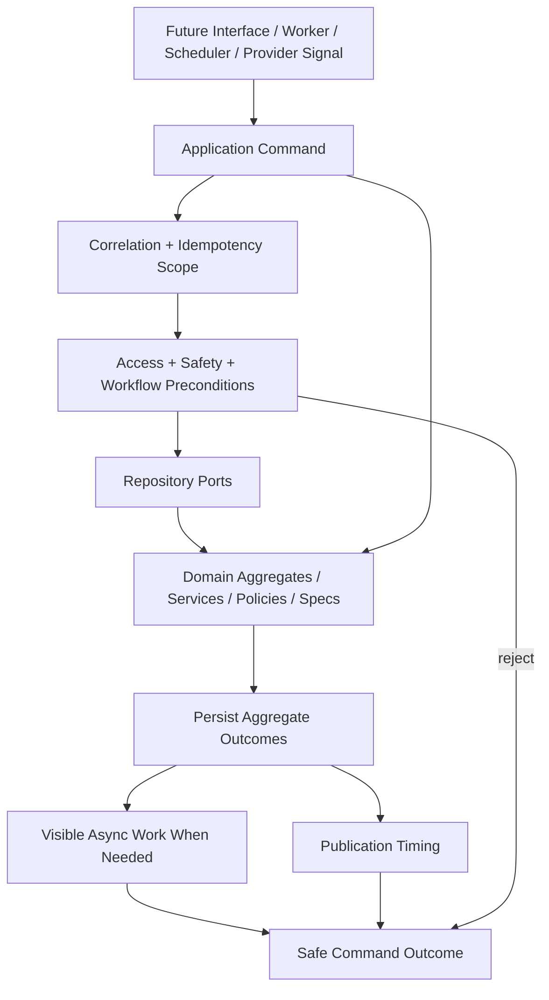

# OmniWA Command Model

## Purpose

This document defines the Phase 3.3 Application Command Model for OmniWA.

Commands are internal Application Layer contracts in product language. They are not DTOs, REST request schemas, OpenAPI operations, database records, queue payload schemas, provider payloads, or source code.

## Frozen Inputs

The Command Model must comply with:

- Phase 0 Product Definition freeze.
- Phase 1 Architecture freeze.
- Phase 2 Domain freeze.
- Phase 3.1 Use Case Inventory.
- Phase 3.2 Application Workflows.
- Dependency direction: Interface -> Application -> Domain.
- Provider isolation through product-oriented ports.
- Mandatory product-enforced guardrails before outbound message acceptance.
- Visible async lifecycle for accepted background work.

## Command Definition

A Command expresses an intent to change product state, start visible async work, classify a translated external signal, or coordinate an internal workflow step.

A Command must:

- Map to one approved Application use case.
- Use product language, not transport, database, queue, or provider language.
- Carry only safe application concepts.
- Reference actor, correlation, idempotency, target identity, and safe intent conceptually when relevant.
- Invoke Domain behavior through Application orchestration.
- Use repository ports and external ports only through approved Application boundaries.
- Return a safe application outcome, not a transport-specific response.

A Command must not:

- Define a request object or DTO shape.
- Encode HTTP, REST, OpenAPI, SQL, Prisma, queue engine, or Baileys concepts.
- Read provider-native payloads as product input.
- Contain business policy that belongs to Domain.
- Optimize reads for dashboard/reporting concerns.
- Publish Domain Events directly from outside aggregate roots.

## Command Categories

| Category | Meaning | Examples |
| --- | --- | --- |
| Product command | External product intent that may mutate Domain state. | CreateInstance, SendTextMessage, RegisterWebhookSubscription. |
| Internal workflow command | Application-controlled command created by another workflow. | QueueAsyncWork, ScheduleWebhookDelivery, RecordAuditEvidence. |
| Worker command | Worker Runtime asks Application to execute visible async work. | ProcessOutboundMessageWork, DeliverWebhookWork, ProcessMediaWork. |
| Provider-signal command | Translated provider signal enters Application as a command-like classification request. | HandleProviderAuthSignal, HandleProviderMessageSignal. |
| Scheduler command | Scheduled runtime asks Application to run recovery, cleanup, or health workflow. | ReconnectInstance, CleanupMediaRetention, RefreshHealthStatus. |
| Administration command | Privileged or sensitive product mutation. | DestroyInstance, ActivateConfigurationSnapshot, RequestDiagnosticCapture. |

## Command Naming Rules

| Rule | Requirement |
| --- | --- |
| Product vocabulary | Use names from approved use cases and workflows. |
| Imperative verb | Start with an action such as Create, Send, Register, Refresh, Apply, Handle, Retry, Cancel, Activate, or Record. |
| Aggregate/context clarity | Include the product target when needed: Instance, Message, Media, Webhook, Provider, WorkerJob, Configuration. |
| No transport names | Do not use HTTP, route, controller, request, response, table, job engine, or provider-native naming. |
| No implementation suffix | Do not encode handler, service implementation, adapter, repository implementation, or framework naming. |

## Command Lifecycle

1. Application receives a product command or internal workflow command from an approved boundary.
2. Application establishes correlation and idempotency scope where required.
3. Application checks access, safety, and workflow preconditions.
4. Application loads required aggregate state through repository ports.
5. Application invokes approved Domain behavior, policies, specifications, services, or factories.
6. Application persists aggregate outcomes through repository ports.
7. Application creates visible async work when the command accepts work that completes later.
8. Application controls event publication timing and follow-up workflow scheduling.
9. Application returns a safe command outcome.

## Command Outcome Vocabulary

| Outcome | Meaning |
| --- | --- |
| Completed | Command finished its Application responsibility synchronously. |
| Accepted | Command accepted product work and created durable product state. |
| Queued | Command accepted async work and visible WorkerJob or owner lifecycle exists. |
| Waiting | Command entered a visible waiting state, usually for QR, provider, user, or recovery signal. |
| Rejected | Command failed before accepted product work existed. |
| Failed | Command failed after accepted work or during orchestration. |
| ActionRequired | Command cannot continue without operator, user, account, secret, or configuration action. |
| Cancelled | Command intentionally stopped eligible work. |
| DeadLettered | Async command work reached exhausted terminal failure. |

The outcome vocabulary is not an API response model.

## Idempotency Rules

| Command Type | Idempotency Expectation |
| --- | --- |
| External product mutation | Required when duplicate submission can create duplicate accepted work. |
| Async acceptance | Required before reporting accepted or queued state. |
| Provider-signal command | Required through translated signal identity, occurrence marker, or safe provider reference. |
| Worker command | Required through WorkerJob identity and reservation ownership. |
| Scheduler command | Required through target identity and scheduling window. |
| Query | Not a command; query caching does not replace command idempotency. |

## Retryability Rules

Retryability is a product classification produced by Domain policy, Domain specification, or safe failure classification. A command may coordinate retry only when the owner context allows it.

| Retryable Command Category | Examples | Constraint |
| --- | --- | --- |
| Provider boundary work | ReconnectInstance, ProcessOutboundMessageWork, ProcessMediaWork. | Retry bounded and idempotent. |
| Webhook delivery work | DeliverWebhookWork, RetryWebhookDelivery. | Retry must not mutate source business fact. |
| Async job lifecycle | MarkWorkerJobRetryOrDead. | Retry exhaustion must be visible. |
| Health/capability refresh | RefreshHealthStatus, RefreshProviderCapability. | Failure becomes degraded/stale/action-required, not hidden. |

## Long-running Commands

Long-running commands must expose progress through workflow state, owner aggregate state, WorkerJob lifecycle, or health/action-required state.

| Command | Reason |
| --- | --- |
| ConnectInstance / StartQrPairing / RefreshQrPairing | QR and authentication require user/provider signal. |
| ReconnectInstance | Provider and session recovery can take multiple attempts. |
| SendTextMessage / SendMediaMessage | Acceptance is fast, final provider status is asynchronous. |
| ProcessOutboundMessageWork | Provider outcome is external and failure-prone. |
| ProcessMediaWork | Media may cross provider/storage boundaries later. |
| DeliverWebhookWork / RetryWebhookDelivery | External receiver availability is outside OmniWA control. |
| CleanupMediaRetention | Cleanup may defer while active workflows reference media. |

## Cancelable Commands

| Command | Cancellation Meaning |
| --- | --- |
| CancelMessage | Cancel eligible outbound message work before terminal delivery/read state. |
| SuspendWebhookSubscription | Stop future deliveries for a subscription. |
| RetireWebhookSubscription | End subscription lifecycle and cancel pending delivery where approved. |
| DestroyInstance | Cancel or drain related work only when destruction policy allows. |
| MarkWorkerJobRetryOrDead | Terminally classify work when retry is unsafe or exhausted. |

## Command Flow

## Command Model Constraints

- Every command in `COMMAND_CATALOG.md` must map to an approved use case.
- Commands must not introduce capabilities outside MVP scope.
- Commands must not mutate multiple contexts without Application orchestration.
- Commands must not hide accepted async work.
- Commands must not return Secret or raw Confidential data.
- Commands must not define transport response shape.
- Commands must not create read models or reporting projections as a side effect unless explicitly part of an approved Application publication workflow.
