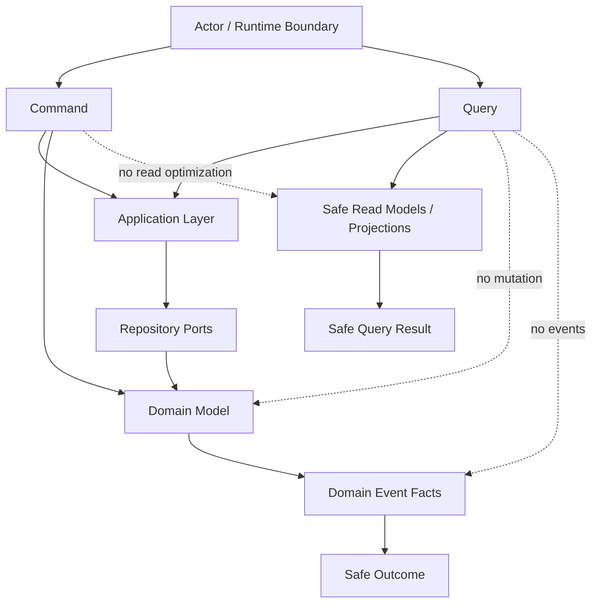

# OmniWA Command / Query Boundaries

## Purpose

This document defines boundaries between Application Commands and Application Queries for Phase 3.3.

It does not define DTOs, REST APIs, OpenAPI, database schema, read database design, event sourcing, repository implementation, provider implementation, or source code.

## Boundary Summary

| Concern | Command | Query |
| --- | --- | --- |
| Primary intent | Change state, start workflow, classify signal, or create visible async work. | Read safe state, status, history, configuration, metrics, or monitoring information. |
| Domain mutation | Allowed through approved Domain behavior and repository ports. | Forbidden. |
| Domain Events | May result from aggregate roots. Application controls publication timing. | Must not produce Domain Events. |
| Async work | May create visible WorkerJob/owner lifecycle. | Must not create async work. |
| External port calls | Allowed through Application orchestration when part of approved workflow. | No side-effecting external calls. |
| Caching | Not a command concern. | Allowed where consistency and safety permit. |
| Read optimization | Not a reason to change command model. | Query may use safe read models conceptually without designing storage. |
| Failure outcome | Rejected, failed, action-required, dead-lettered, or cancelled where appropriate. | Safe empty/unavailable/stale/denied outcome later; no mutation to repair. |

## Command Boundary Rules

- A Command must map to an approved use case.
- A Command may read state only to make or coordinate a product mutation.
- A Command must not exist only to return optimized data for UI or reporting.
- A Command must not bypass Domain policy, repository ports, guardrails, or Application workflow sequencing.
- A Command that accepts async work must create visible lifecycle state before acceptance is reported.
- A Command may coordinate multiple bounded contexts only through Application orchestration.
- A Command must not expose provider-native, Secret, or raw Confidential data.

## Query Boundary Rules

- A Query must be side-effect free.
- A Query must not mutate Domain, repository state, projections, or runtime state.
- A Query must not publish events.
- A Query must not enqueue jobs.
- A Query must not call provider, webhook transport, queue engine, or storage adapters to refresh state.
- A Query must return stale/unavailable markers rather than repairing state.
- A Query must not create audit evidence in Phase 3.3.
- A Query must not reveal Secret or raw Confidential data.

## Cross-cutting Rules

| Rule | Command Treatment | Query Treatment |
| --- | --- | --- |
| Idempotency | Required for duplicate-prone mutation, async acceptance, provider signal, worker and scheduler workflows. | Not applicable; caching and request de-duplication are not product idempotency. |
| Retryability | Explicit product classification through Domain policy/specification or safe failure category. | No retry side effect; caller may repeat a read. |
| Long-running behavior | Must expose waiting/queued/retrying/action-required/dead-letter state. | Reads long-running state but never advances it. |
| Cancellation | Command may request cancellation if Domain lifecycle permits. | Query may read cancelable/current state but cannot cancel. |
| Read-only behavior | Commands are not read-only even when they load state. | Queries are strictly read-only. |
| Caching | Commands are not cached as product outcomes except idempotency replay of accepted result. | Queries may be cached when data safety and consistency allow. |
| Eventual consistency | Commands must know whether they require strong owner state or can schedule eventual follow-up. | Queries must declare strong/eventual/stale/retention-bound expectation. |
| Data safety | Commands sanitize inputs/outcomes and never accept raw provider payloads. | Queries redact outputs and never expose Secret/raw Confidential values. |

## Boundary Examples

| Scenario | Correct Boundary | Reason |
| --- | --- | --- |
| Send one text message. | Command: SendTextMessage. | Mutates Message and creates async work. |
| Read message delivery state. | Query: GetMessageStatus. | Read-only status. |
| Retry failed webhook delivery. | Command: RetryWebhookDelivery. | Mutates delivery/job lifecycle. |
| View webhook retry history. | Query: GetWebhookDeliveryHistory. | Retention-bound read. |
| Apply provider delivered signal. | Command: ApplyProviderMessageStatus. | Translated external signal changes Message lifecycle. |
| Read provider capability snapshot. | Query: GetProviderCapabilityStatus. | Safe read of capability classification. |
| Refresh provider capability snapshot. | Command: RefreshProviderCapability. | External classification workflow may mutate ProviderProfile/Health. |
| Read queue oldest pending age. | Query: GetQueueMetricsSnapshot. | Operational metrics read, no queue mutation. |

## Forbidden Hybrids

| Forbidden Hybrid | Why Rejected |
| --- | --- |
| Query that reconnects an instance if status is stale. | Query side effect and hidden workflow. |
| Query that marks webhook delivery failed after timeout. | Mutates WebhookDelivery; must be command/workflow. |
| Command that exists only to return dashboard list data. | Read optimization belongs to Query. |
| Command that silently refreshes provider state for status response. | Provider calls must be explicit workflows. |
| Query that writes audit record of itself in Phase 3.3. | Query side effect; read auditing would need a separate approved command/workflow. |
| Query that creates missing projection. | Projection repair is workflow/scheduler responsibility. |
| Command that accepts async work without WorkerJob or owner lifecycle. | Violates async visibility and reliability rules. |
| Query that returns raw message body, media binary, webhook secret, session material, phone, or JID. | Violates data classification and retention rules. |

## CQRS-lite Overview

OmniWA uses CQRS-lite:

- Commands and Queries are separated conceptually.
- Domain model remains the source of business truth.
- Application orchestrates use cases and publication timing.
- Read models may exist conceptually for safe queries, but this phase does not design databases or storage.
- Event sourcing is not introduced.
- A separate read database is not required by this phase.

## Review Checklist For New Application Messages

| Question | Command Required Answer | Query Required Answer |
| --- | --- | --- |
| Does it change state? | Yes or starts visible workflow. | No. |
| Does it map to approved use case? | Yes. | Prefer yes; otherwise Product Scope/Monitoring trace required. |
| Does it publish events? | Only through aggregate facts and Application timing. | No. |
| Does it need idempotency? | Yes when duplicate-prone. | No product idempotency. |
| Does it contain business rule? | No; invokes Domain. | No; reads safe state. |
| Does it expose sensitive data? | No. | No. |

## Phase 3.3 Checklist

| Item | Status |
| --- | --- |
| Commands identified | PASS |
| Queries identified | PASS |
| Catalog completed | PASS |
| Boundaries defined | PASS |
| Cross-cutting rules defined | PASS |
| Dependencies identified | PASS |

**Phase 3.3 is ready for review.**
