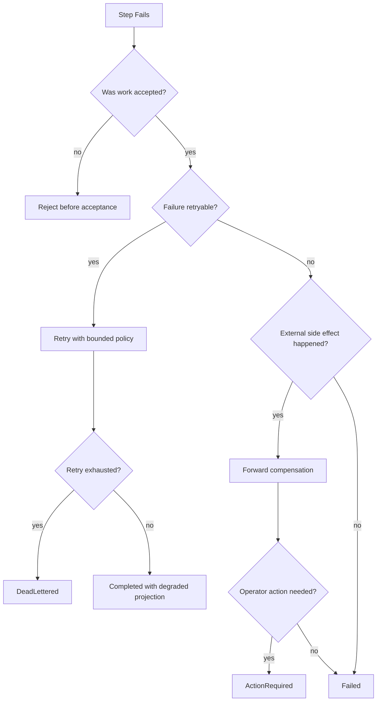

# OmniWA Compensation Strategies

## Purpose

This document defines Phase 3.2 compensation strategies for Application workflows.

Compensation here means safe Application-level recovery after a workflow step fails. It does not mean database rollback mechanics, distributed transaction implementation, Saga implementation, provider internals, queue internals, or source code.

## Compensation Principles

- Prefer rejecting before acceptance when preconditions fail.
- Once async work is accepted, failure must be visible through owner lifecycle, WorkerJob lifecycle, audit, health, or operator-facing status.
- Prefer forward recovery over hidden rollback.
- Do not attempt to undo external provider side effects that cannot be reliably reversed.
- Do not mutate source business facts from webhook delivery failures.
- Do not delete data referenced by active workflows.
- Do not expose Secret, raw Confidential data, stack traces, provider-native payloads, or infrastructure details during compensation.

## Compensation Types

| Strategy | Meaning | Use When | Not For |
| --- | --- | --- | --- |
| Reject before acceptance | Return rejection before durable accepted state or async work exists. | Access, validation, unsupported capability, policy denial, unsafe config. | Failures after accepted work exists. |
| Retry | Re-attempt bounded, idempotent work. | Transient provider, webhook receiver, media processing, queue/transport boundary failures. | Business rule violations, unsupported features, revoked sessions. |
| Cancel | Stop future work when lifecycle allows it. | Pending message, pending webhook attempt, pending media processing, destruction cleanup. | Already completed provider side effects. |
| Mark failed | Move owner lifecycle to terminal failure with reason classification. | Non-retryable accepted work failure. | Temporary receiver/provider failure with retry budget remaining. |
| Dead-letter | Preserve exhausted async work for operator visibility and future explicit replay. | Retry exhausted, unsafe-to-retry webhook/message/media job. | Business success or rejected-before-acceptance outcomes. |
| Action required | Surface need for operator/user intervention. | Missing secret, revoked session, provider account issue, incompatible provider, unsafe config. | Automatic transient retry. |
| Supersede | Activate a newer safe snapshot instead of mutating history. | Configuration changes, future compatibility snapshot updates. | Business state rollback. |
| Defer | Wait until safety preconditions become true. | Media cleanup with active references, QR/user action waiting, reconnect backoff. | Unknown unbounded waiting without timeout or visibility. |
| Sanitize/drop | Remove unsafe details and continue with safe evidence only. | Audit/telemetry/webhook payload safety. | Required business data loss without visible failure. |

## Compensation Matrix

| Workflow | Failure Scenario | Primary Strategy | Secondary Strategy | Reason |
| --- | --- | --- | --- | --- |
| WF-INS-001 Instance Creation | Access/configuration/idempotency fails before persistence. | Reject before acceptance. | None. | No accepted product state should exist. |
| WF-INS-001 Instance Creation | Audit/health projection fails after Instance exists. | Mark observability gap. | Retry projection if allowed. | Instance source fact should remain durable. |
| WF-INS-002 Instance Connection Request | Another connection/reconnect is active. | Reject or defer according to connection policy. | Return current visible workflow status. | Single active provider connection invariant. |
| WF-INS-002 Instance Connection Request | Session missing, revoked, or secret unavailable. | Action required. | Reject if no recovery path exists. | Automatic retry cannot fix missing user/operator action. |
| WF-INS-003 QR Authentication | QR generation fails transiently. | Retry within policy. | Action required if exhausted. | Provider boundary may recover. |
| WF-INS-003 QR Authentication | QR expires or pairing times out. | Defer/expire visible workflow. | Action required or refresh workflow. | User/provider action is required. |
| WF-INS-003 QR Authentication | Authenticated signal conflicts with existing active session. | Mark failed/action required. | Revoke pending session if created. | Do not allow two active sessions for one Instance. |
| WF-INS-004 Reconnect Instance | Provider unavailable. | Retry with backoff. | Action required or failed after exhaustion. | Reconnect is expected to handle transient provider failure. |
| WF-INS-004 Reconnect Instance | Session revoked. | Action required. | Mark disconnected/logged-out. | Domain state blocks automatic recovery. |
| WF-INS-005 Disconnect Or Logout Handling | Provider stop fails after domain state moved. | Action required. | Health degraded. | Runtime release is external; do not revert logout decision blindly. |
| WF-INS-005 Disconnect Or Logout Handling | Provider signal is stale. | Sanitize/drop as ignored. | Audit if security-relevant. | Stale signal must not corrupt business state. |
| WF-INS-006 Instance Destruction | Active non-cancellable work exists. | Reject or defer destruction. | Mark action required. | Prevents silent loss of accepted work. |
| WF-INS-006 Instance Destruction | Cleanup/release fails after destruction accepted. | Action required. | Retry cleanup. | Destroyed Instance should not accept new work; cleanup remains visible. |
| WF-MSG-001 Send Text Message | Guardrail/session/type policy denies send. | Reject before acceptance. | None. | Message should not be accepted. |
| WF-MSG-001 Send Text Message | WorkerJob visibility cannot be created. | Mark failed before accepted response. | Retry internal acceptance only if idempotent. | Accepted async work must be visible. |
| WF-MSG-002 Send Media Message | Media invalid or unsupported. | Reject before message acceptance. | None. | MVP message types are fixed. |
| WF-MSG-002 Send Media Message | Media processing fails after message accepted. | Mark media/message failed. | Retry media processing if policy allows. | Source work must reach visible terminal or retry state. |
| WF-MSG-003 Outbound Message Execution | Provider timeout/unavailable. | Retry. | Dead-letter or ActionRequired. | External provider failures are retryable only within policy. |
| WF-MSG-003 Outbound Message Execution | Provider returns non-retryable rejection. | Mark failed. | Audit/health projection. | Message lifecycle needs terminal explanation. |
| WF-MSG-003 Outbound Message Execution | Worker duplicate attempts same message. | Reject/drop duplicate execution. | Audit if repeated. | Message has single current state and idempotency boundary. |
| WF-MSG-004 Message Retry | Retry budget exhausted. | Dead-letter. | Action required for future replay decision. | Prevents infinite retry. |
| WF-MSG-004 Message Retry | Retry request for non-retryable message. | Reject before acceptance. | Return terminal message status. | Domain policy owns retry eligibility. |
| WF-MSG-005 Message Cancellation | Message already sent/delivered/failed terminal. | Reject cancellation. | Audit request. | Provider side effects cannot be undone. |
| WF-MSG-005 Message Cancellation | Pending job can be cancelled. | Cancel. | Mark cancelled and audit. | Lifecycle allows safe cancellation before execution point. |
| WF-MSG-006 Receive Inbound Message | Duplicate/stale provider signal. | Sanitize/drop as idempotent duplicate. | Audit if suspicious. | Avoid duplicate business facts. |
| WF-MSG-006 Receive Inbound Message | Webhook scheduling fails after message fact. | Retry scheduling or mark webhook delivery gap. | Health degraded. | Source message fact must not be rolled back. |
| WF-MSG-007 Unsupported Inbound Message Handling | Unsupported payload contains unsafe data. | Sanitize/drop unsafe payload. | Metadata-only audit/telemetry. | Does not expand support or leak data. |
| WF-MED-001 Media Registration | Unsupported media type. | Reject before acceptance. | None. | Phase 0 message types are fixed. |
| WF-MED-001 Media Registration | Processing work cannot be made visible. | Fail acceptance. | Retry only before accepted outcome. | Async work visibility rule. |
| WF-MED-002 Media Processing | Storage/provider/media boundary transient failure. | Retry. | Dead-letter after exhaustion. | Processing can be retried idempotently. |
| WF-MED-002 Media Processing | Media later proves unsafe or invalid. | Mark Media failed. | Fail dependent Message if accepted. | Business state must expose failure. |
| WF-MED-003 Media Cleanup | Media referenced by active workflow. | Defer. | Retry later. | Do not delete active workflow data. |
| WF-MED-003 Media Cleanup | Storage delete fails. | Retry cleanup. | Action required if exhausted. | Cleanup side effect is external. |
| WF-WEB-001 Webhook Subscription Management | Invalid or unsafe endpoint configuration. | Reject before activation. | Keep previous active subscription. | Bad update should not break current deliverability. |
| WF-WEB-001 Webhook Subscription Management | Persistence fails during update. | Reject update. | Preserve previous state. | Avoid partial subscription activation. |
| WF-WEB-002 Webhook Delivery | Receiver timeout or 5xx-like failure. | Retry. | Dead-letter after exhaustion. | Receiver availability is external. |
| WF-WEB-002 Webhook Delivery | Payload contains unsafe data. | Sanitize/drop delivery and mark failed/action-required. | Audit security event. | Sensitive data must not cross webhook boundary. |
| WF-WEB-002 Webhook Delivery | Queue visibility failure before scheduling. | Mark delivery scheduling failure visible. | Retry scheduling. | Source fact remains durable. |
| WF-WEB-003 Webhook Retry And Dead Letter | Subscription disabled before retry. | Dead-letter or cancel attempt. | Audit. | Do not deliver to disabled endpoint. |
| WF-WEB-003 Webhook Retry And Dead Letter | Payload retention expired. | Dead-letter/failed. | Action required if replay requested later. | Cannot fabricate lost payload. |
| WF-PRV-001 Provider Compatibility Refresh | Provider unavailable. | Keep last known safe snapshot with staleness marker. | Health degraded. | Refresh failure should not erase prior safe capability state. |
| WF-PRV-001 Provider Compatibility Refresh | Provider incompatible. | Action required. | Block dependent workflows through policy where approved. | Unsafe provider usage must be visible. |
| WF-PRV-002 Provider Signal Routing | Unknown or unsafe signal. | Quarantine/drop. | Audit/telemetry if allowed. | Provider must not inject raw state. |
| WF-ADM-001 Configuration Activation | Invalid configuration. | Reject before activation. | Keep active snapshot. | Prevents unsafe runtime state. |
| WF-ADM-001 Configuration Activation | Activation published but later superseded. | Supersede with new snapshot. | Audit. | Snapshot history should remain append-oriented. |
| WF-ADM-002 Audit Evidence Recording | Evidence contains sensitive data. | Sanitize/drop unsafe fields. | Security observation. | Audit must not leak sensitive data. |
| WF-ADM-002 Audit Evidence Recording | Mandatory audit persistence fails. | Mark observability/security gap. | Retry audit recording. | Failure must be visible. |
| WF-MON-001 Health Refresh | Dependency unavailable. | Mark degraded/unknown. | Retry on next schedule. | Health is projection, not source business state. |
| WF-MON-002 Telemetry Capture | Observability backend unavailable. | Drop or buffer through approved boundary later. | Do not fail business workflow. | Telemetry is not business truth. |
| WF-QRY-001 Status Query Workflows | Unauthorized or unsafe read. | Reject. | None. | Queries must not mutate state to satisfy read. |
| WF-QRY-001 Status Query Workflows | Projection stale. | Return stale marker. | Do not repair during query. | Read workflow remains side-effect free. |

## Long-running Workflow Compensation

| Long-running Workflow | Timeout Handling | Retry Handling | Terminal Handling |
| --- | --- | --- | --- |
| QR Authentication | Expire QR and workflow waiting state. | Refresh/generate QR only within policy. | ActionRequired or Failed. |
| Reconnect Instance | Backoff until retry policy ends. | One active reconnect per Instance. | Connected, ActionRequired, or Failed. |
| Outbound Message Execution | Classify timeout as provider/network failure. | Retry idempotently when safe. | Sent/Failed/DeadLettered/ActionRequired. |
| Message Retry | Respect scheduled retry windows. | Bounded retry count and idempotency key. | DeadLettered or Failed. |
| Media Processing | Timeout classifies boundary failure. | Retry when media preparation is safe. | Ready/Failed/DeadLettered. |
| Webhook Delivery | Receiver timeout becomes delivery attempt failure. | Retry with idempotent delivery metadata. | Delivered/DeadLettered/Failed. |
| Media Cleanup | Defer while active references exist. | Retry cleanup after reference release. | Cleaned/Failed/ActionRequired. |

## Compensation Activity Diagram

## Compensation Constraints

- Compensation must not bypass aggregate boundaries.
- Compensation must not create Domain Events directly from Infrastructure or Provider code.
- Compensation must not mutate Webhook source facts.
- Compensation must not hide retry exhaustion.
- Compensation must not convert unsupported product scope into implicit support.
- Compensation must not use raw provider payloads as audit/webhook content.
- Compensation must not remove media, message, session, or webhook data still required by active workflows.
- Compensation must not rely on synchronous external provider success for API acceptance.

## Future Compensation Decisions

Future ADRs are required before adding:

- Concrete Saga implementation.
- Dead-letter replay contract.
- Cross-node compensation ownership.
- Multi-region recovery semantics.
- Object storage deletion guarantees.
- Tenant-level compensation policy.
