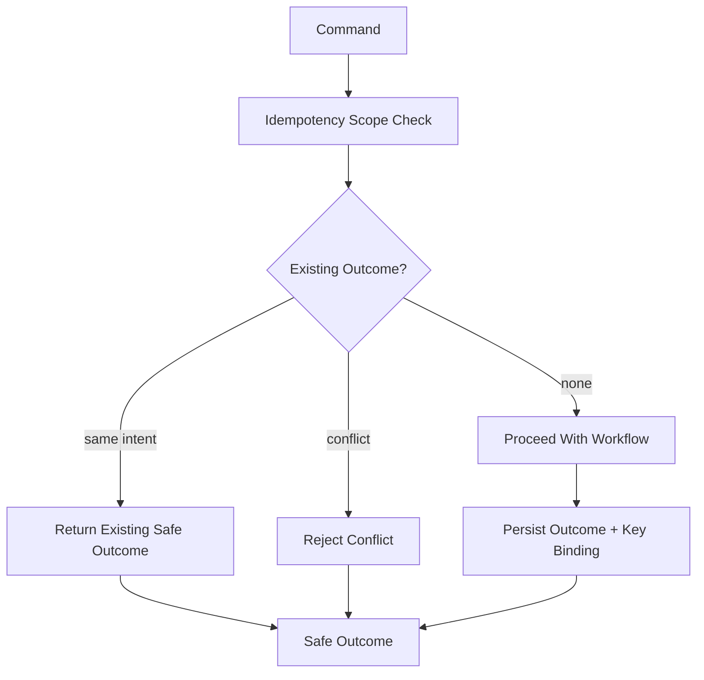

# OmniWA Idempotency Strategy

## Purpose

This document defines the Phase 3.4 Application idempotency strategy.

It does not define key storage schema, cache implementation, database constraints, queue payloads, REST headers, DTO fields, provider payload fields, or source code.

## Idempotency Principles

- Idempotency is required wherever duplicate execution could create duplicate product state, duplicate external attempt state, or hidden accepted work.
- Idempotency scope is owned by Application workflows and owner contexts, not by transport or provider implementation.
- Idempotency keys must use safe product references and must not contain Secret or raw Confidential data.
- Retried work must be idempotent.
- Provider uncertainty may still result in Unknown or ActionRequired; idempotency must not hide uncertainty.
- Queries do not use product idempotency; query caching is separate.

## Required Idempotent Commands

| Command | Idempotency Scope | Key Basis Conceptually | Duplicate Behavior |
| --- | --- | --- | --- |
| CreateInstance | Actor plus safe instance creation intent where provided. | Command name, actor/context, client idempotency marker or safe creation reference. | Return same created/rejected outcome where safe. |
| ConnectInstance | Instance connection workflow. | InstanceId plus connection intent window. | Return current visible connection workflow state. |
| StartQrPairing / RefreshQrPairing | Instance pairing workflow. | InstanceId plus pairing attempt reference. | Return active/refreshed pairing state or reject stale duplicate. |
| ConfirmSessionActivated | Provider translated auth signal. | InstanceId, SessionId, translated signal occurrence marker. | Ignore duplicate activation signal safely. |
| ReconnectInstance | Instance reconnect workflow. | InstanceId plus reconnect reason/window. | Preserve one active reconnect and return existing state. |
| SendTextMessage | Outbound message intent. | InstanceId, safe recipient reference, command idempotency key, message type. | Return existing MessageId/outcome or reject conflict. |
| SendMediaMessage | Outbound media message intent. | InstanceId, MediaId or safe media reference, command idempotency key, message type. | Return existing MessageId/MediaId outcome or reject conflict. |
| EvaluateOutboundGuardrails | Guardrail evaluation for one intent. | Intent reference plus configuration/rate window marker. | Reuse same GuardrailDecision while valid. |
| ProcessOutboundMessageWork | Worker execution for one Message/Job. | MessageId, JobId, reservation marker. | Prevent duplicate provider send attempt where possible; classify duplicate safely. |
| ApplyProviderMessageStatus | Provider translated status. | MessageId or safe provider reference plus occurrence/order marker. | Ignore stale/duplicate observation. |
| ReceiveInboundMessage | Inbound provider observation. | InstanceId plus safe provider message occurrence marker. | Create one inbound product fact or ignore duplicate. |
| RetryMessageSend | Retry attempt for one Message. | MessageId plus retry attempt lineage. | Return existing retry work or terminal state. |
| CancelMessage | Message cancellation request. | MessageId plus cancellation intent marker. | Return current cancelled/non-cancellable outcome. |
| RegisterMedia | Media registration. | Safe media reference or client idempotency key plus category. | Return existing MediaId/outcome or reject conflict. |
| ProcessMediaWork | Media processing work. | MediaId, JobId, processing attempt marker. | Prevent duplicate processing state corruption. |
| CleanupMediaRetention | Retention cleanup for media. | MediaId plus retention window. | Return cleaned/deferred/current state. |
| Register/Update/Activate/Suspend/RetireWebhookSubscription | Webhook subscription lifecycle. | WebhookId or subscription intent plus lifecycle action marker. | Return current lifecycle or reject conflicting duplicate. |
| ScheduleWebhookDelivery | Product signal to subscription delivery. | SourceSignalRef plus WebhookId. | Create one WebhookDelivery or return existing scheduled state. |
| DeliverWebhookWork | Delivery attempt. | WebhookDeliveryId, JobId, attempt number. | Preserve attempt idempotency and terminal state. |
| RetryWebhookDelivery | Delivery retry. | WebhookDeliveryId plus retry attempt lineage. | Return existing retry/dead-letter state. |
| MoveWebhookDeliveryToDeadLetter | Dead-letter classification. | WebhookDeliveryId plus terminal reason marker. | Preserve terminal dead-letter state. |
| Provider signal handlers | Translated provider observations. | ProviderId, safe target reference, occurrence marker. | Route once or ignore duplicate/stale signal. |
| QueueAsyncWork | Async work request. | OwnerContextRef, JobType, idempotency key. | Return existing visible WorkerJob or reject conflicting work. |
| Reserve/Complete/RetryOrDead WorkerJob | Worker lifecycle. | JobId and reservation/attempt marker. | Prevent duplicate reservation/completion. |
| Validate/ActivateConfigurationSnapshot | Configuration lifecycle. | SnapshotId or safe proposed snapshot identity. | Return existing validation/activation outcome or reject conflict. |
| RecordAuditEvidence | Audit source signal. | SourceSignalRef plus audit category. | Avoid duplicate audit evidence where policy requires uniqueness. |
| RefreshHealthStatus / CaptureTelemetrySignal | Projection signal. | SourceSignalRef plus projection category. | Update/project once or safely collapse duplicates. |

## Commands That Are Not Product-idempotent By Default

| Command | Reason |
| --- | --- |
| EvaluateAccessDecision | Access decisions may be time/expiry scoped. Duplicate handling depends on AccessDecision lifecycle. |
| Query commands | Queries are not commands and do not mutate state. |
| Read metrics/status queries | Caching is handled by Query Model, not command idempotency. |

## Idempotency Key Safety

Idempotency keys must not contain:

- Session material.
- API keys or webhook secrets.
- Raw message body.
- Raw media binary or checksum that exposes content.
- Raw webhook payload.
- Raw provider payload.
- Raw phone numbers or JIDs.
- Database row IDs as business identity unless they are approved product identifiers.

Idempotency keys should be scoped by:

- Command name.
- Actor or safe owner context where relevant.
- Product target identity.
- Work type.
- Safe correlation or client-supplied idempotency marker.
- Retry or occurrence marker where relevant.

## Retry Relationship

| Retry Source | Idempotency Requirement |
| --- | --- |
| Worker retry | Same JobId lineage or explicit retry lineage must avoid duplicate owner state transitions. |
| Provider retry | Message/Media/Instance workflow must distinguish retry from duplicate provider signal. |
| Webhook retry | WebhookDelivery attempt identity must avoid duplicate delivery state inside OmniWA. |
| Reconnect retry | One reconnect per Instance; duplicate attempts return current workflow state. |
| Cleanup retry | Cleanup must be safe to repeat and must not delete active workflow data. |

## Idempotency Failure Outcomes

| Failure | Application Outcome |
| --- | --- |
| Duplicate with same accepted outcome | Return existing safe outcome. |
| Duplicate still in progress | Return current visible workflow/WorkerJob state. |
| Duplicate conflicts with different intent | Reject as idempotency conflict. |
| Missing key for required idempotent command | Reject before acceptance. |
| Unsafe key contains sensitive data | Reject and record security/audit signal where required. |
| Provider duplicate/stale signal | Ignore safely or classify stale observation. |

## Diagram

## Freeze Decision

The idempotency strategy is **APPROVED** for Phase 3 freeze.
