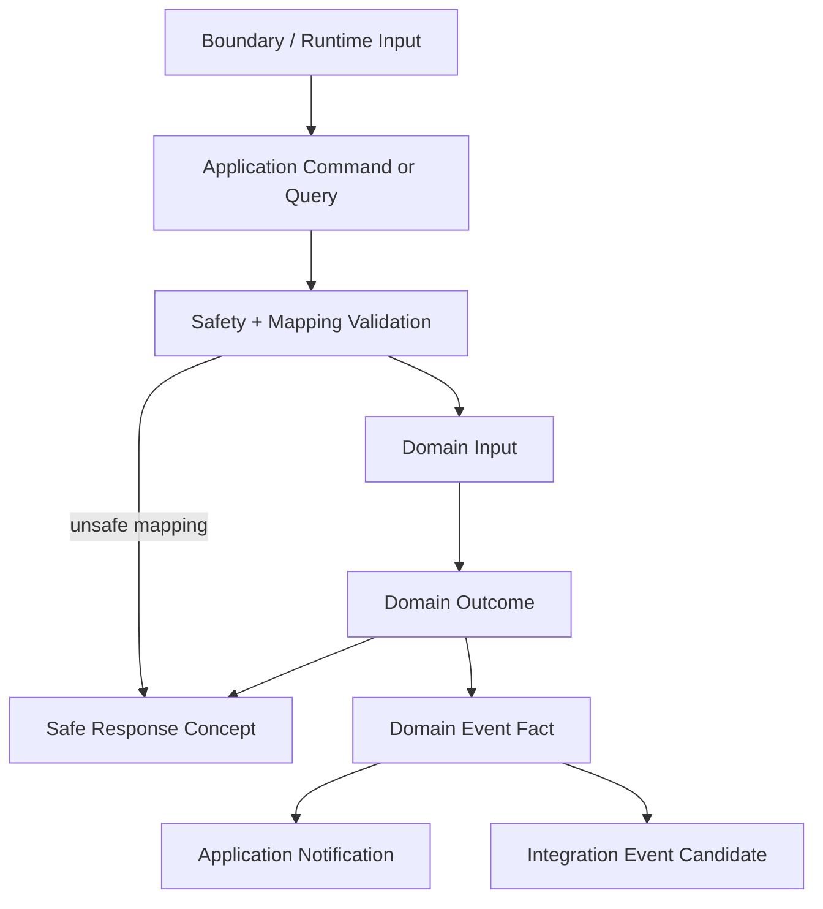

# OmniWA Mapper Strategy

## Purpose

This document defines the Phase 3.4 Application mapper strategy.

Mapping here means conceptual translation between approved internal Application messages, Domain inputs/outcomes, safe responses, notifications, and integration event candidates. It does not define DTO classes, REST payloads, OpenAPI schemas, database mappers, ORM models, serialization code, provider payload schemas, or source code.

## Mapper Principles

- Mappers translate language; they do not make business decisions.
- Mappers must not bypass Application validation, authorization, idempotency, or transaction boundaries.
- Mappers must not create Domain Events.
- Mappers must not expose Secret or raw Confidential data.
- Mappers must not leak provider-native, database, queue, HTTP, or framework concepts into Domain.
- Mapping failures must become safe Application errors.

## Mapping Types

| Mapping | Purpose | Owner | Business Rule Allowed? |
| --- | --- | --- | --- |
| Boundary -> Command/Query | Convert future transport/runtime input into Application message concept. | Interface or runtime boundary later. | No. |
| Command -> Domain | Convert safe command concepts and loaded snapshots into Domain inputs. | Application. | No; call Domain for rules. |
| Domain -> Response | Convert Domain/Application outcome into safe response concept. | Application. | No. |
| Domain Event -> Notification | Convert persisted product facts into follow-up Application signals. | Application publication timing. | No. |
| Event -> Integration | Convert approved product facts into sanitized integration event candidate. | Webhook/Application boundary. | No; eligibility uses Webhook Domain rules. |
| Infrastructure Observation -> Application Message | Translate provider/transport/dependency observation into safe product signal. | Infrastructure adapter plus Application classification boundary. | No product policy in adapter. |

## Command To Domain Mapping

Command -> Domain mapping prepares safe inputs for aggregates, domain services, policies, specifications, and factories.

| Command Area | Mapping Inputs | Domain Target | Mapping Constraints |
| --- | --- | --- | --- |
| Instance | Safe InstanceId, metadata, actor/access result, session/provider snapshots. | Instance, Session, InstanceConnectionPolicy. | No provider-native QR/session/socket object. |
| Messaging | Safe recipient reference, MessageType, guardrail decision, session/media/provider snapshots, idempotency marker. | Message, GuardrailDecision, MessageAcceptanceDomainService. | No raw body retention by default; no raw phone/JID as aggregate identity. |
| Media | MediaCategory, safe metadata, retention classification, diagnostic policy. | MediaAsset, MediaRetentionPolicy, IsMediaTypeSupported. | No raw binary as normal domain input. |
| Webhook | WebhookUrl concept, signal selection, secret reference, source signal reference. | WebhookSubscription, WebhookDelivery, IsWebhookDeliverable. | No webhook secret value or raw payload. |
| Provider | Provider capability/failure classification and translated signal categories. | ProviderProfile and owner context domain services. | Provider-native payloads remain outside Domain. |
| Operations | OwnerContextRef, JobType, retry policy, safe failure category. | WorkerJob, retry specifications. | No queue-engine internals. |
| Administration | Actor reference, capability, configuration categories, safe source evidence. | AccessDecision, ConfigurationSnapshot, AuditRecord. | No identity-provider token or Secret value. |
| Monitoring | Health subject, dependency category, telemetry category, data classification. | HealthStatus, TelemetrySignal. | No raw logs or telemetry payloads. |

## Domain To Response Mapping

Domain/Application outcomes become safe response concepts.

| Source Outcome | Response Concept | Mapping Rule |
| --- | --- | --- |
| Aggregate accepted state | CommandAccepted / CommandCompleted. | Include safe identity and lifecycle category only. |
| WorkerJob queued | CommandQueued. | Include safe JobId/owner lifecycle reference where allowed. |
| QR/pairing waiting | CommandWaiting. | Do not retain QR as Domain state; expose only safe pairing status concept. |
| Domain rejection | CommandRejected. | Include safe product reason category; no sensitive details. |
| Retry/dead-letter/action-required | CommandActionRequired / CommandFailed / DeadLettered. | Include safe category, owner context, and next-action concept. |
| Query read model | QueryResult / QueryEmpty / QueryStale / QueryUnavailable / QueryDenied. | Redact and include staleness/retention markers where relevant. |

Response mapping must not define HTTP status, REST body shape, DTO field names, or OpenAPI schema.

## Event To Integration Mapping

Only approved, sanitized product facts may become integration event candidates.

| Source Fact | Integration Mapping Rule |
| --- | --- |
| Instance lifecycle facts | Include safe InstanceId, lifecycle category, health/action marker where approved. |
| Message lifecycle facts | Include safe MessageId, direction/type category, status/failure category; no raw message body. |
| Media facts | Include safe MediaId, media category, processing/failure category; no raw binary. |
| Webhook delivery facts | Include delivery lifecycle/failure category only when externally approved. |
| Guardrail facts | Include blocked/throttled/action-required category where approved; no sensitive intent body. |
| Health facts | Include safe subject and health category when approved. |
| Audit/Telemetry facts | Not external by default; may inform observability only. |

Webhook Delivery remains the owner of external delivery lifecycle. Event -> Integration mapping must not mutate source business state.

## Mapper Safety Rules

- Redact Secret and raw Confidential data before any response, audit, telemetry, webhook, or log boundary.
- Use safe product identifiers and references.
- Do not use provider IDs, phone numbers, JIDs, message body, media binary, webhook payload, or session material as product identity.
- Preserve correlation/request/trace references only when they do not embed sensitive data.
- Preserve failure categories without raw exception messages.
- Treat unknown or unmappable data as a safe mapping error, not as best-effort raw pass-through.

## Mapper Flow

## Mapper Rejection Rules

A mapping must be rejected when it:

- Requires a business decision inside mapper logic.
- Requires raw provider payload in Domain.
- Includes Secret or raw Confidential data in response/integration/audit/telemetry.
- Changes event meaning for transport convenience.
- Creates a new product capability not approved by Product Scope.
- Depends on database, queue, HTTP, OpenAPI, DTO, or provider implementation detail.

## Freeze Decision

The mapper strategy is **APPROVED** for Phase 3 freeze.
