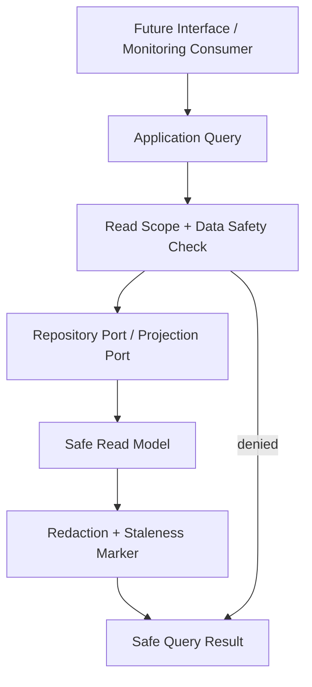

# OmniWA Query Model

## Purpose

This document defines the Phase 3.3 Application Query Model for OmniWA.

Queries are internal Application Layer read contracts in product language. They are not DTOs, REST response schemas, OpenAPI operations, SQL queries, ORM models, database views, dashboard components, or source code.

## Query Definition

A Query reads safe product, operational, health, audit, configuration, or metrics information without changing state.

A Query must:

- Be traceable to an approved use case, Product Scope capability, Non-Functional Requirement, Success Metric, or Monitoring requirement.
- Return safe information only.
- Respect actor/read scope and data classification.
- State consistency expectations explicitly.
- Indicate whether cached or stale data is acceptable.
- Use approved read models conceptually without designing database/schema implementation.

A Query must not:

- Mutate Domain state.
- Publish Domain Events or Integration Events.
- Create WorkerJob or async work.
- Trigger provider, webhook, media, or queue side effects.
- Repair stale state.
- Expose Secret, raw Confidential data, message/media bodies, webhook secrets, raw provider payloads, raw phone numbers, raw JIDs, or implementation stack traces.

## Query Categories

| Category | Meaning | Examples |
| --- | --- | --- |
| Status query | Reads current safe lifecycle or health status. | GetInstanceStatus, GetMessageStatus, GetWebhookStatus. |
| Inventory query | Reads safe lists or summaries. | ListInstances. |
| History query | Reads safe retained evidence or lifecycle history. | QueryAuditRecords. |
| Configuration query | Reads safe active configuration metadata without Secret values. | GetConfigurationStatus. |
| Metrics query | Reads safe operational metrics snapshots. | GetOperationalMetricsSnapshot, GetQueueMetricsSnapshot. |
| Monitoring query | Reads health, action-required, failure, or observability projections. | GetHealthStatus, GetWebhookMetricsSnapshot. |

## Read Model Types

| Read Model | Meaning | Source Of Truth | Notes |
| --- | --- | --- | --- |
| Aggregate safe summary | Safe projection of aggregate-owned state. | Aggregate repository port or owner projection. | No raw payloads or Secret material. |
| Lifecycle status view | Current lifecycle, terminal state, action-required marker, retry/dead-letter state. | Owner aggregate and WorkerJob summary where approved. | May be strongly consistent for one aggregate. |
| Health projection | Current health classification and safe cause category. | HealthStatus projection. | Eventually consistent with source facts. |
| Audit summary | Secret-safe retained evidence summary. | AuditRecord. | Subject to retention and access control. |
| Metrics snapshot | Point-in-time operational measurement. | Observability/Telemetry/Health projections. | Not source of business truth. |
| Configuration status view | Safe active/superseded/rejected configuration metadata. | ConfigurationSnapshot. | Secret values never returned. |

## Consistency Model

| Consistency Type | Meaning | Use For |
| --- | --- | --- |
| Strong owner read | Query should reflect one owner aggregate state after its last accepted command outcome. | Instance status by InstanceId, Message status by MessageId, Webhook delivery status by WebhookDeliveryId. |
| Eventual projection read | Query reads projections that may lag source facts. | Health, metrics, webhook summaries, audit projections. |
| Stale-allowed read | Query may return cached/stale marker when freshness cannot be guaranteed. | ListInstances, metrics snapshots, health dashboards. |
| Retention-bound read | Query can return only data still retained under policy. | Audit records, webhook delivery history, message/media metadata. |

Queries must disclose stale or unavailable projections through safe application outcomes later. This document does not design response shape.

## Caching Guidance

| Query Type | Caching Candidate | Requirement |
| --- | --- | --- |
| Health and metrics snapshots | Yes, short-lived. | Must include freshness/staleness marker conceptually. |
| Instance list | Yes, short-lived. | Must not hide action-required or destroyed lifecycle when stale. |
| Individual aggregate status | Conditional. | Strong owner read preferred when used for operator action. |
| Audit records | Conditional. | Must respect access and retention; cache must not expose sensitive data. |
| Configuration status | Yes, short-lived. | Must not expose Secret values and must distinguish active/superseded/rejected. |

## Query Flow

## Query Safety Rules

- Query result may include safe identifiers, lifecycle states, retry/dead-letter classifications, health categories, timestamps, redaction markers, and correlation references where allowed.
- Query result must not include session material, API keys, webhook secrets, raw message body, raw media binary, raw webhook payload, raw provider payload, raw phone/JID, or implementation error detail.
- Query result must distinguish unknown, stale, unavailable, and action-required states where relevant.
- Query must not make provider calls to refresh state.
- Query must not enqueue work to repair missing projection.
- Query must not create audit evidence in Phase 3.3; read auditing, if required later, must be modeled as a separate approved command/workflow.

## Query Model Constraints

- Every query in `QUERY_CATALOG.md` must trace to Product Scope, Monitoring requirements, Success Metrics, or approved use cases.
- Queries must remain side-effect free.
- Queries must not become analytics/campaign/reporting products without product decision and ADR.
- Queries must not force repository ports to become reporting/search APIs.
- Metrics queries must remain operational and must not incentivize spam or unsafe message volume.
