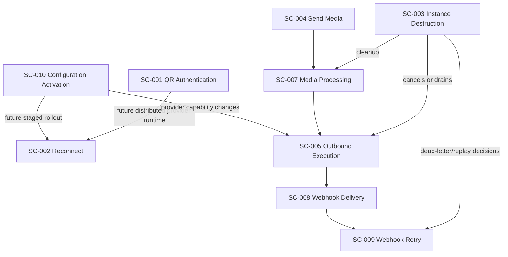

# OmniWA Saga Candidates

## Purpose

This document identifies workflows that may require Saga-style coordination as OmniWA evolves.

Phase 3.2 does not design a Saga implementation, Saga framework, orchestration engine, queue implementation, state store, database model, command model, or source code. It only marks workflows where multi-step, long-running, cross-boundary coordination may later need explicit Saga decisions.

## Saga Candidate Criteria

A workflow is a Saga candidate when it has most of these properties:

- It spans multiple bounded contexts or external systems.
- It is long-running or retryable.
- It has partial side effects that cannot be rolled back transactionally.
- It needs visible compensation or action-required outcomes.
- It may later require replay, timeout, operator intervention, or distributed coordination.

## Candidate Summary

| Candidate ID | Workflow | Candidate Strength | Why It Is A Candidate | Current Phase 3.2 Position |
| --- | --- | --- | --- | --- |
| SC-001 | WF-INS-003 QR Authentication | Strong | Spans Instance, Session, Provider, user action, timeout, and external auth signal. | Model as long-running Application workflow; no Saga implementation yet. |
| SC-002 | WF-INS-004 Reconnect Instance | Strong | Requires serialized recovery, provider/session restore, retry, and action-required outcomes. | Model as retry-visible workflow with one active reconnect per Instance. |
| SC-003 | WF-INS-006 Instance Destruction | Strong | Coordinates cancellation/cleanup across Instance, Session, Messaging, Media, Webhook, Provider, Audit, and Health. | Model as multi-step workflow; future Saga likely when cleanup is distributed. |
| SC-004 | WF-MSG-002 Send Media Message | Strong | Combines media registration/processing, message acceptance, worker execution, provider send, and status/webhook follow-up. | Model as Application orchestration with visible media/send work. |
| SC-005 | WF-MSG-003 Outbound Message Execution | Strong | Crosses WorkerJob, Messaging, Session, Provider, Webhook, Audit, Health, and retry/dead-letter boundaries. | Model as worker-driven Application workflow with bounded retry. |
| SC-006 | WF-MSG-004 Message Retry | Moderate | Retry policy may evolve into replay orchestration across multiple attempts and provider conditions. | Keep as retry workflow; explicit Saga only if replay logic becomes multi-step. |
| SC-007 | WF-MED-002 Media Processing | Moderate | Crosses Media and future MediaStore/Object Storage/Provider boundaries, with dependent message execution. | Keep as worker workflow; future Saga if storage and provider steps split. |
| SC-008 | WF-WEB-002 Webhook Delivery | Strong | External receiver availability, retry, dead-letter, and idempotency require long-running coordination. | Model as async delivery workflow; do not mutate source business facts. |
| SC-009 | WF-WEB-003 Webhook Retry And Dead Letter | Strong | Retry exhaustion and future replay need explicit lifecycle and operator visibility. | Keep as retry/dead-letter workflow; future Saga for replay. |
| SC-010 | WF-ADM-001 Configuration Activation | Moderate | Future distributed runtimes may need rollout, validation, and rollback/supersede coordination. | Keep snapshot activation; future Saga if rollout spans nodes/regions. |
| SC-011 | WF-PRV-001 Provider Compatibility Refresh | Weak | Usually projection-like, but future multi-provider compatibility may require staged rollout. | Not a Saga now; monitor future provider expansion. |
| SC-012 | WF-MED-003 Media Cleanup | Moderate | Retention cleanup can conflict with active work and future storage deletion side effects. | Keep scheduled workflow with safety checks and deferral. |

## Strong Saga Candidates

### SC-001 QR Authentication

| Aspect | Description |
| --- | --- |
| Workflow | WF-INS-003 QR Authentication. |
| Participants | Instance, Session, Provider, Clock, Audit, Health, optional Webhook delivery. |
| Long-running reason | Waits for user scan and provider authentication signal. |
| Partial effects | Pending connection, QR exposure, pending session, provider runtime ownership. |
| Compensation | Expire QR, revoke invalid pending session, release provider runtime, move to ActionRequired on unrecoverable provider/auth failure. |
| Future Saga trigger | Multi-node runtime ownership, QR replay/recovery, or distributed provider runtime. |

### SC-002 Reconnect Instance

| Aspect | Description |
| --- | --- |
| Workflow | WF-INS-004 Reconnect Instance. |
| Participants | Instance, Session, Provider, WorkerJob, Clock, Health, Audit. |
| Long-running reason | Provider recovery can fail transiently and requires bounded retry. |
| Partial effects | Reconnect ownership, provider restore attempt, health status changes. |
| Compensation | Retry transient failures, release reconnect ownership, mark ActionRequired for revoked session or missing secret. |
| Future Saga trigger | Clustered provider runtimes, distributed locks, or multi-region runtime failover. |

### SC-003 Instance Destruction

| Aspect | Description |
| --- | --- |
| Workflow | WF-INS-006 Instance Destruction. |
| Participants | Instance, Session, Messaging, Webhook, Media, Provider, WorkerJob, Audit, Health. |
| Long-running reason | Active accepted work may need cancellation, draining, or deferred cleanup. |
| Partial effects | Instance disabled/destroyed, related workflows cancelled, provider connection released, retention cleanup scheduled. |
| Compensation | Reject unsafe destruction before state change; cancel cancellable work; defer cleanup; mark ActionRequired for external release failure. |
| Future Saga trigger | Multi-node cleanup, external object storage deletion, provider logout release, or tenant-level destruction. |

### SC-004 Send Media Message

| Aspect | Description |
| --- | --- |
| Workflow | WF-MSG-002 Send Media Message. |
| Participants | Media, Messaging, Instance, Session, WorkerJob, Provider, Audit, Health, Webhook. |
| Long-running reason | Media may need processing before provider send; provider status is asynchronous. |
| Partial effects | Media registered, message accepted, worker job created, provider send attempted, webhook scheduled. |
| Compensation | Fail media/message when preparation fails; retry provider/media transient failures; dead-letter exhausted work. |
| Future Saga trigger | Object Storage, virus scanning, transcoding, multiple providers, or delayed media availability. |

### SC-005 Outbound Message Execution

| Aspect | Description |
| --- | --- |
| Workflow | WF-MSG-003 Outbound Message Execution. |
| Participants | Messaging, Session, Provider, WorkerJob, Webhook, Audit, Health. |
| Long-running reason | Provider send and status updates are external and unreliable. |
| Partial effects | Message processing state, provider send attempt, provider message reference, status facts, delivery webhook scheduling. |
| Compensation | Retry transient provider failures, fail non-retryable work, move to ActionRequired for session/provider issues, dead-letter exhausted work. |
| Future Saga trigger | Multi-worker cluster, provider failover, Cloud API provider, or exactly-once delivery orchestration. |

### SC-008 Webhook Delivery

| Aspect | Description |
| --- | --- |
| Workflow | WF-WEB-002 Webhook Delivery. |
| Participants | Webhook, QueueProvider, WebhookTransport, Audit, Health, Observability. |
| Long-running reason | External receiver may be unavailable and retry is bounded. |
| Partial effects | Delivery attempt created, outbound HTTP-like attempt later, receiver may have received duplicate attempt. |
| Compensation | Retry idempotently, dead-letter exhausted delivery, suspend unsafe subscription, preserve source event. |
| Future Saga trigger | Replay UI, multi-endpoint fanout, per-tenant delivery policy, or cross-region delivery. |

## Moderate Candidates

| Workflow | Reason To Defer Saga | Future Signal For ADR |
| --- | --- | --- |
| WF-MSG-004 Message Retry | Retry can remain a bounded worker workflow until replay spans multiple contexts or provider failover. | Retry replay needs independent state machine beyond WorkerJob and Message lifecycle. |
| WF-MED-002 Media Processing | Today it is one media worker workflow; future storage/scanning/transcoding may split steps. | Media processing involves multiple external services with independent compensation. |
| WF-MED-003 Media Cleanup | Retention cleanup can defer safely today. | Cleanup crosses object storage, backup retention, legal hold, or tenant-level deletion. |
| WF-ADM-001 Configuration Activation | Snapshot/supersede is enough in MVP. | Configuration rollout becomes staged across nodes, regions, or tenants. |

## Non-candidates For MVP

| Workflow | Reason |
| --- | --- |
| WF-INS-001 Instance Creation | Short command workflow with one aggregate outcome and projection follow-ups. |
| WF-MSG-001 Send Text Message | Acceptance workflow only; execution is covered by WF-MSG-003. |
| WF-MSG-005 Message Cancellation | Best-effort cancellation; cannot roll back provider side effects. |
| WF-MSG-006 Receive Inbound Message | Source fact creation plus async follow-ups; no multi-step compensation beyond webhook retry. |
| WF-MSG-007 Unsupported Inbound Message Handling | Safe classification/projection workflow. |
| WF-MED-001 Media Registration | Short validation and acceptance workflow. |
| WF-WEB-001 Webhook Subscription Management | Command workflow; invalid updates are rejected before activation. |
| WF-PRV-002 Provider Signal Routing | Routing workflow; owner workflows handle long-running coordination. |
| WF-ADM-002 Audit Evidence Recording | Evidence projection; mandatory failures become observability/security issues, not Saga. |
| WF-MON-001 Health Refresh | Projection workflow. |
| WF-MON-002 Telemetry Capture | Best-effort projection workflow. |
| WF-QRY-001 Status Query Workflows | Read-only and side-effect free. |

## Saga Boundary Rules

- Saga coordination, if later introduced, must live in Application Layer.
- Saga state must not become the source of Domain truth.
- Saga steps must invoke Domain behavior through approved application use cases and ports.
- Saga compensation must use forward recovery, cancellation, terminal failure, dead-letter, or action-required states.
- Saga implementation must not allow Infrastructure to create Domain Events.
- Saga adoption must require a future ADR because Phase 1 Architecture Freeze did not approve a concrete Saga engine.

## Saga Candidate Map

## Future ADR Required

A future ADR is required before implementing any concrete Saga mechanism for:

- Saga state persistence.
- Saga timeout and replay semantics.
- Saga compensation contracts.
- Cross-node Saga ownership.
- Operator replay of dead-lettered Saga work.
- Saga observability model.
