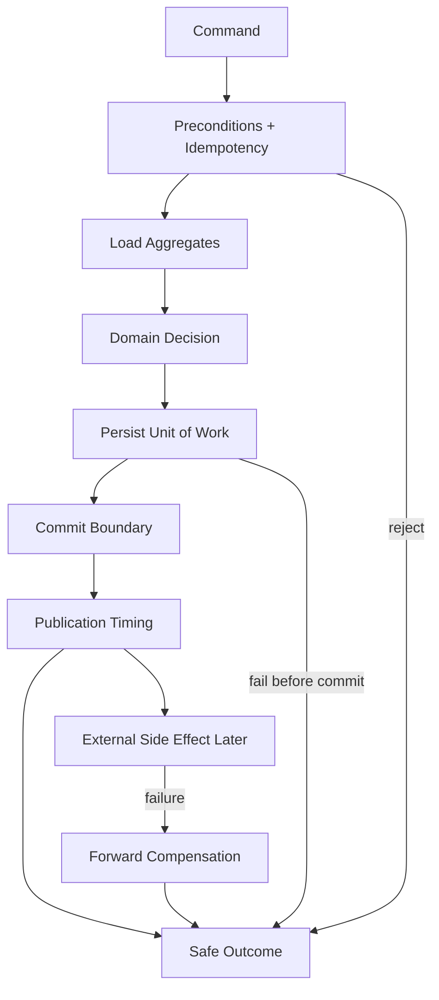

# OmniWA Transaction Strategy

## Purpose

This document defines the Phase 3.4 Application transaction strategy.

It defines conceptual transaction boundaries, Unit of Work, commit timing, and rollback policy. It does not select a database, ORM, Prisma, isolation level, transaction API, outbox implementation, queue engine, distributed transaction coordinator, or source code.

## Transaction Principles

- Application use cases own transaction boundaries conceptually.
- Domain does not open, commit, or roll back transactions.
- Interface does not own transaction policy.
- Infrastructure later executes transaction mechanics behind ports.
- External provider, webhook receiver, queue engine, and observability side effects are not assumed to be locally transactional with OmniWA state.
- Accepted async work must not be committed without visible lifecycle state.
- Event publication timing must be controlled by Application after durable state requirements are satisfied.

## Unit Of Work Definition

A Unit of Work is the Application-owned consistency boundary for one command or internal workflow step.

It may include:

- Loading required aggregate state through repository ports.
- Invoking Domain behavior.
- Persisting one or more aggregate outcomes when Application coordination requires it.
- Persisting idempotency outcome where required.
- Persisting WorkerJob or owner lifecycle state for accepted async work.
- Capturing Domain Event facts for later publication timing.

It must not include:

- HTTP request/response mechanics.
- Provider final delivery.
- Webhook receiver delivery success.
- Logging/telemetry export success.
- Queue engine internals.
- Database-specific transaction API details.

## Transaction Boundary Types

| Boundary Type | Used For | Commit Requirement | Notes |
| --- | --- | --- | --- |
| Single aggregate boundary | Simple lifecycle change in one aggregate. | Commit aggregate outcome and event facts together conceptually. | Example: UpdateInstanceMetadata, RegisterMedia. |
| Cross-aggregate precondition boundary | A target aggregate change depends on other safe snapshots. | Source snapshots are checked before target commit; only owner aggregates mutate through their roots. | Example: Message acceptance requires GuardrailDecision and Session/Media snapshots. |
| Async acceptance boundary | Command accepts work that completes later. | Owner state and WorkerJob-visible lifecycle must commit together conceptually or acceptance fails. | Example: SendTextMessage, ScheduleWebhookDelivery. |
| Worker execution boundary | Worker executes visible work. | WorkerJob state and owner aggregate outcome must be coordinated so work cannot disappear. | Example: ProcessOutboundMessageWork, DeliverWebhookWork. |
| Projection/evidence boundary | Audit, health, telemetry, metrics, or query projection updates. | Source business fact is not rolled back by projection failure. | Example: RecordAuditEvidence, RefreshHealthStatus. |
| External side-effect boundary | Provider/webhook/storage call occurs. | Commit local state before or after call according to workflow, but do not assume atomicity with external system. | Use compensation/retry/action-required. |

## Commit Timing

| Workflow Category | Commit Timing Rule |
| --- | --- |
| Synchronous command | Commit aggregate outcome before returning Completed. |
| Async acceptance | Commit accepted owner state and visible async work before returning Accepted/Queued. |
| Provider call execution | Commit processing/reservation state before provider attempt when duplicate execution must be prevented; commit result classification after provider attempt. |
| Webhook delivery execution | Commit delivery attempt state before transport attempt; commit success/retry/dead-letter classification after attempt. |
| Provider signal handling | Commit translated product state after stale/idempotency checks pass. |
| Query | No transaction that mutates state; read consistency depends on query model. |
| Audit/health/telemetry follow-up | Commit projection/evidence independently; failure does not roll back source fact. |

## Rollback Policy

| Failure Point | Policy |
| --- | --- |
| Before accepted state exists | Reject command and do not create product state. |
| Before Unit of Work commit | Roll back local uncommitted aggregate outcomes conceptually. |
| After local commit but before external side effect | Use retry, cancellation, dead-letter, or action-required state; do not pretend no state was accepted. |
| After external provider side effect | Use forward recovery and status classification; do not attempt distributed rollback. |
| After webhook receiver side effect | Preserve delivery attempt history and idempotency; do not roll back source fact. |
| Event publication failure | Preserve source state and create visible retry/recovery/observability gap according to workflow. |
| Audit/telemetry failure | Source fact remains durable; failure becomes observability/security gap if mandatory. |

## Transaction Matrix

| Command/Workflow | Boundary | Must Commit Together Conceptually | External Side Effects |
| --- | --- | --- | --- |
| CreateInstance | Single aggregate plus audit/health follow-up. | Instance outcome and InstanceCreated fact. | None. |
| ConnectInstance / StartQrPairing | Async/long-running connection boundary. | Instance/Session pending state and visible work when async. | Provider QR/auth signals are external and non-transactional. |
| SendTextMessage | Async acceptance boundary. | Guardrail outcome, Message accepted/queued state, WorkerJob visibility where accepted. | Provider send happens later. |
| SendMediaMessage | Cross-aggregate/async boundary. | Media readiness or processing-visible state, Message accepted state, WorkerJob visibility. | Media/provider work happens later. |
| ProcessOutboundMessageWork | Worker execution boundary. | WorkerJob execution state and Message outcome classification. | Provider send attempt is not atomic with local state. |
| ScheduleWebhookDelivery | Async acceptance boundary. | WebhookDelivery scheduled state and WorkerJob visibility. | Webhook transport happens later. |
| DeliverWebhookWork | Worker execution boundary. | WebhookDelivery attempt state and WorkerJob outcome. | Receiver processing is not under OmniWA transaction. |
| ActivateConfigurationSnapshot | Single aggregate plus publication boundary. | Configuration active/superseded outcome and event fact. | Consumer adoption is eventual. |
| RecordAuditEvidence | Evidence boundary. | AuditRecord redaction/retention decision. | Audit sink mechanics deferred. |
| RefreshHealthStatus | Projection boundary. | HealthStatus classification. | Dependency probes are outside source aggregate transaction. |

## Event Publication Rule

Application must treat Domain Event facts as part of the aggregate decision and publication as a separate Application-controlled step.

Publication must:

- Happen only after durable source state requirements are met.
- Preserve ordering expectations per aggregate identity where required.
- Avoid duplicating effects through idempotency.
- Create visible recovery path if a required publication/follow-up cannot be scheduled.

## Transaction Diagram

## Freeze Decision

The transaction strategy is **APPROVED** for Phase 3 freeze.

Concrete persistence and transaction mechanics are deferred to future implementation and require compliance with this strategy.
