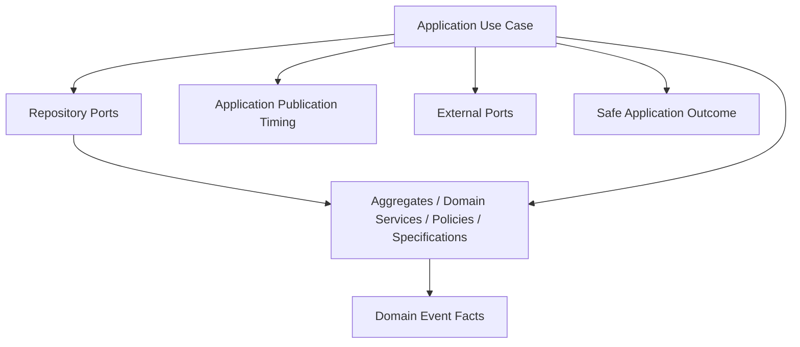
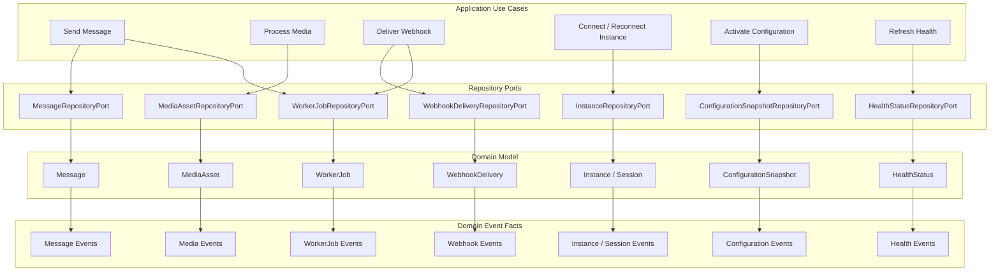

# OmniWA Use Case Dependencies

## Purpose

This document maps Phase 3.1 use cases to repository ports, domain objects, domain events, and external ports.

It does not define REST APIs, OpenAPI, DTOs, database schema, repository implementation, queue implementation, provider implementation, event bus implementation, or source code.

## Dependency Rules

- Use cases depend on Domain and ports, not concrete Infrastructure.
- Repository ports are semantic aggregate ports from Phase 2; they are not reporting/query APIs.
- Provider behavior crosses through product-oriented provider ports and Provider Integration.
- Queue/worker behavior crosses through QueueProvider or async work ports later; Operations owns visible job lifecycle.
- Event publication timing belongs to Application.
- Domain Events are created by aggregate roots, not by Application orchestration.
- Queries do not publish Domain Events.

## Standard Dependency Pattern

## Instance And Session Dependencies

| Use Case | Repository Ports | Domain Objects / Rules | Domain Events | External Ports | Notes |
| --- | --- | --- | --- | --- | --- |
| UC-INS-001 Create Instance | InstanceRepositoryPort, AccessDecisionRepositoryPort, AuditRecordRepositoryPort | InstanceFactory, Instance, AccessDecision, AuditRecord | InstanceCreated, AuditRecorded | UUID, Clock, EventBus later | Privileged context may require access decision before creation. |
| UC-INS-002 Update Instance Metadata | InstanceRepositoryPort, AccessDecisionRepositoryPort, AuditRecordRepositoryPort | Instance, AccessDecision, AuditRecord | InstanceActionRequired where applicable, AuditRecorded | Clock, EventBus later | Metadata must remain safe and non-provider-native. |
| UC-INS-003 Request Instance Connection | InstanceRepositoryPort, SessionRepositoryPort, WorkerJobRepositoryPort, ProviderProfileRepositoryPort | Instance, Session snapshot, WorkerJob, CanReconnectInstance, InstanceConnectionPolicy | InstanceQrRequired, InstanceActionRequired, WorkerJobQueued | QueueProvider, MessagingProvider, EventBus later | Accepted async connect/reconnect work must be visible. |
| UC-INS-004 Start QR Pairing | InstanceRepositoryPort, SessionRepositoryPort | SessionFactory, Session, Instance | SessionPairingStarted, SessionPending, InstanceQrRequired | MessagingProvider, SecretProvider later | QR payload is not domain state. |
| UC-INS-005 Refresh QR Pairing | InstanceRepositoryPort, SessionRepositoryPort | Session, PairingAttempt, SessionRevocationPolicy | SessionPending, InstanceQrRequired, SessionRecoveryRequired | MessagingProvider, SecretProvider later | Refresh is valid only for eligible pairing lifecycle. |
| UC-INS-006 Confirm Session Activated | SessionRepositoryPort, InstanceRepositoryPort, ProviderProfileRepositoryPort, HealthStatusRepositoryPort | Session, Instance, ProviderProfile, InstanceSessionCoordinationDomainService | SessionActivated, InstanceConnected, HealthRecovered | EventBus later | Provider auth signal must already be translated. |
| UC-INS-007 Request Instance Disconnect | InstanceRepositoryPort, AccessDecisionRepositoryPort, AuditRecordRepositoryPort | Instance, AccessDecision, AuditRecord | InstanceDisconnected, AuditRecorded | MessagingProvider later, EventBus later | Disconnect is not logout. |
| UC-INS-008 Reconnect Instance | InstanceRepositoryPort, SessionRepositoryPort, WorkerJobRepositoryPort, ProviderProfileRepositoryPort | Instance, Session, WorkerJob, CanReconnectInstance | WorkerJobQueued, InstanceActionRequired, later InstanceConnected/Disconnected | QueueProvider, MessagingProvider later | Reconnect must be serialized per instance. |
| UC-INS-009 Mark Instance Logged Out | InstanceRepositoryPort, SessionRepositoryPort, ProviderProfileRepositoryPort, HealthStatusRepositoryPort, AuditRecordRepositoryPort | Instance, Session, ProviderProfile, HealthStatus, AuditRecord | InstanceLoggedOut, SessionRevoked, HealthActionRequired, AuditRecorded | EventBus later | Provider logout signal is translated before domain state changes. |
| UC-INS-010 Destroy Instance | InstanceRepositoryPort, SessionRepositoryPort, AccessDecisionRepositoryPort, AuditRecordRepositoryPort, HealthStatusRepositoryPort | Instance, AccessDecision, AuditRecord, HealthStatus | InstanceDestroyed, AuditRecorded, HealthStatusChanged | EventBus later, SecretProvider later for cleanup workflow | Destroyed is terminal. |
| UC-INS-011 Get Instance Status | InstanceRepositoryPort, SessionRepositoryPort, HealthStatusRepositoryPort | Instance, Session availability summary, HealthStatus | None | None required at Phase 3.1 | Query only; no mutation. |
| UC-INS-012 List Instances | InstanceRepositoryPort, HealthStatusRepositoryPort | Instance summaries, HealthStatus | None | None required at Phase 3.1 | Single Tenant + Multi Instance only. |

## Messaging And Guardrail Dependencies

| Use Case | Repository Ports | Domain Objects / Rules | Domain Events | External Ports | Notes |
| --- | --- | --- | --- | --- | --- |
| UC-MSG-001 Send Text Message | MessageRepositoryPort, SessionRepositoryPort, GuardrailDecisionRepositoryPort, WorkerJobRepositoryPort, ProviderProfileRepositoryPort | MessageFactory, Message, GuardrailDecision, MessageAcceptanceDomainService, CanSendMessage | Guardrail events, MessageAccepted/Rejected/Queued, WorkerJobQueued | QueueProvider, EventBus later, UUID, Clock | Guardrail outcome before MessageAccepted. |
| UC-MSG-002 Send Media Message | MessageRepositoryPort, MediaAssetRepositoryPort, SessionRepositoryPort, GuardrailDecisionRepositoryPort, WorkerJobRepositoryPort, ProviderProfileRepositoryPort | Message, MediaAsset, GuardrailDecision, MessageAcceptanceDomainService, MediaReadinessDomainService | MediaAccepted/Failed where applicable, Guardrail events, MessageAccepted/Rejected/Queued, WorkerJobQueued | QueueProvider, EventBus later | Media readiness precondition required. |
| UC-MSG-003 Evaluate Outbound Guardrails | GuardrailDecisionRepositoryPort, ConfigurationSnapshotRepositoryPort, AccessDecisionRepositoryPort | GuardrailDecisionFactory, ComplianceGuardrailPolicy, IsRateLimitAllowed | GuardrailEvaluated, GuardrailPassed/Blocked/Throttled/ActionRequired | Clock, EventBus later | Mandatory guardrails cannot be bypassed. |
| UC-MSG-004 Process Outbound Message Work | MessageRepositoryPort, WorkerJobRepositoryPort, ProviderProfileRepositoryPort, InstanceRepositoryPort, SessionRepositoryPort | Message, WorkerJob, ProviderProfile, MessageDeliveryStatusDomainService | MessageProcessingStarted, MessageDispatched/Failed, WorkerJobStarted/Completed/RetryScheduled/Dead | MessagingProvider, QueueProvider, EventBus later | Worker enters through Application, not Interface. |
| UC-MSG-005 Apply Provider Message Status | MessageRepositoryPort, ProviderProfileRepositoryPort, HealthStatusRepositoryPort | Message, ProviderProfile, MessageDeliveryStatusDomainService | MessageDispatched/Delivered/Read/Failed | EventBus later | Stale translated status must not corrupt lifecycle. |
| UC-MSG-006 Receive Inbound Message | MessageRepositoryPort, ProviderProfileRepositoryPort, WebhookSubscriptionRepositoryPort | MessageFactory, Message, ProviderProfile | InboundMessageReceived | EventBus later | Raw provider payload must not enter domain. |
| UC-MSG-007 Classify Unsupported Inbound Message | MessageRepositoryPort, ProviderProfileRepositoryPort | MessageFactory, Message | UnsupportedMessageReceived | EventBus later | Does not create supported send capability. |
| UC-MSG-008 Retry Message Send | MessageRepositoryPort, WorkerJobRepositoryPort, ProviderProfileRepositoryPort | Message, WorkerJob, RetryEligibilityDomainService, MessageSendingPolicy | WorkerJobRetryScheduled, MessageQueued or MessageFailed | QueueProvider, EventBus later | Retry is bounded and visible. |
| UC-MSG-009 Cancel Message | MessageRepositoryPort, WorkerJobRepositoryPort, AccessDecisionRepositoryPort, AuditRecordRepositoryPort | Message, WorkerJob, AccessDecision | MessageCancelled, WorkerJobDead where applicable, AuditRecorded | QueueProvider later, EventBus later | Cannot cancel contradictory terminal state. |
| UC-MSG-010 Get Message Status | MessageRepositoryPort, WorkerJobRepositoryPort, WebhookDeliveryRepositoryPort | Message, WorkerJob summary, WebhookDelivery summary | None | None required at Phase 3.1 | Query only; no raw body. |

## Media Dependencies

| Use Case | Repository Ports | Domain Objects / Rules | Domain Events | External Ports | Notes |
| --- | --- | --- | --- | --- | --- |
| UC-MED-001 Register Media | MediaAssetRepositoryPort | MediaAssetFactory, MediaAsset, IsMediaTypeSupported, MediaRetentionPolicy | MediaAccepted or MediaFailed | UUID, Clock, EventBus later | Metadata-only by default. |
| UC-MED-002 Process Media Work | MediaAssetRepositoryPort, WorkerJobRepositoryPort, ProviderProfileRepositoryPort | MediaAsset, WorkerJob, ProviderProfile, MediaReadinessDomainService | MediaProcessingStarted, MediaProcessed/Failed, WorkerJob events | MessagingProvider/media provider port, QueueProvider, EventBus later | No object storage implementation selected. |
| UC-MED-003 Attach Media To Message Workflow | MediaAssetRepositoryPort, MessageRepositoryPort | MediaAsset, Message reference, IsMediaReadyForMessage | MediaAttached or MediaFailed | EventBus later | Media does not mutate Message lifecycle directly. |
| UC-MED-004 Request Diagnostic Capture | MediaAssetRepositoryPort, AccessDecisionRepositoryPort, AuditRecordRepositoryPort | MediaAsset, AccessDecision, AuditRecord, MediaRetentionPolicy | DiagnosticCaptureRequested, AuditRecorded | SecretProvider later if needed, EventBus later | Explicit bounded diagnostic policy required. |
| UC-MED-005 Cleanup Media Retention | MediaAssetRepositoryPort, WorkerJobRepositoryPort, AuditRecordRepositoryPort | MediaAsset, WorkerJob, CanCleanMedia, AuditRecord | MediaExpired, MediaCleaned, AuditRecorded | QueueProvider, EventBus later | Cleanup cannot break active workflow. |
| UC-MED-006 Get Media Status | MediaAssetRepositoryPort | MediaAsset | None | None required at Phase 3.1 | Query only; no binary. |

## Webhook Delivery Dependencies

| Use Case | Repository Ports | Domain Objects / Rules | Domain Events | External Ports | Notes |
| --- | --- | --- | --- | --- | --- |
| UC-WEB-001 Register Webhook Subscription | WebhookSubscriptionRepositoryPort, AccessDecisionRepositoryPort | WebhookSubscriptionFactory, WebhookSubscription, AccessDecision | WebhookSubscriptionProposed, WebhookSubscriptionValidated | SecretProvider later, EventBus later | Webhook secret value is not exposed. |
| UC-WEB-002 Update Webhook Subscription | WebhookSubscriptionRepositoryPort, AccessDecisionRepositoryPort, AuditRecordRepositoryPort | WebhookSubscription, AccessDecision, AuditRecord | WebhookSubscriptionValidated/Invalidated, AuditRecorded | SecretProvider later, EventBus later | Retired subscription cannot be updated normally. |
| UC-WEB-003 Activate Webhook Subscription | WebhookSubscriptionRepositoryPort, AccessDecisionRepositoryPort, AuditRecordRepositoryPort | WebhookSubscription, AccessDecision | WebhookSubscriptionActivated, AuditRecorded | EventBus later | Validated before active. |
| UC-WEB-004 Suspend Webhook Subscription | WebhookSubscriptionRepositoryPort, AccessDecisionRepositoryPort, AuditRecordRepositoryPort | WebhookSubscription, AccessDecision, AuditRecord | WebhookSubscriptionSuspended, AuditRecorded | EventBus later | Stops future scheduling without mutating source facts. |
| UC-WEB-005 Retire Webhook Subscription | WebhookSubscriptionRepositoryPort, WebhookDeliveryRepositoryPort, AccessDecisionRepositoryPort, AuditRecordRepositoryPort | WebhookSubscription, WebhookDelivery references, AccessDecision | WebhookSubscriptionRetired, WebhookDeliveryCancelled where approved, AuditRecorded | EventBus later | Delivery lifecycle remains separate. |
| UC-WEB-006 Schedule Webhook Delivery | WebhookSubscriptionRepositoryPort, WebhookDeliveryRepositoryPort, WorkerJobRepositoryPort | WebhookDeliveryFactory, WebhookSubscription, WebhookDelivery, IsWebhookDeliverable | WebhookDeliveryScheduled, WorkerJobQueued | QueueProvider, EventBus later | External delivery is async and visible. |
| UC-WEB-007 Deliver Webhook Work | WebhookDeliveryRepositoryPort, WorkerJobRepositoryPort, HealthStatusRepositoryPort | WebhookDelivery, WorkerJob, WebhookRetryPolicy, RetryEligibilityDomainService | WebhookDeliveryStarted/Succeeded/RetryScheduled/Failed/DeadLettered, WorkerJob events | WebhookTransport, QueueProvider, EventBus later | Transport outcome must be classified safely. |
| UC-WEB-008 Retry Webhook Delivery | WebhookDeliveryRepositoryPort, WorkerJobRepositoryPort | WebhookDelivery, WorkerJob, CanRetryWebhookDelivery | WebhookDeliveryRetryScheduled, WorkerJobRetryScheduled or WebhookDeliveryDeadLettered | QueueProvider, EventBus later | Delivered/dead/cancelled cannot retry. |
| UC-WEB-009 Move Webhook Delivery To Dead Letter | WebhookDeliveryRepositoryPort, WorkerJobRepositoryPort, HealthStatusRepositoryPort, AuditRecordRepositoryPort | WebhookDelivery, WorkerJob, HealthStatus, AuditRecord | WebhookDeliveryDeadLettered, WorkerJobDead, HealthActionRequired, AuditRecorded | EventBus later | Dead-letter must be operator-visible. |
| UC-WEB-010 Get Webhook Status | WebhookSubscriptionRepositoryPort, WebhookDeliveryRepositoryPort, HealthStatusRepositoryPort | WebhookSubscription, WebhookDelivery, HealthStatus | None | None required at Phase 3.1 | Query only; no secret/payload exposure. |

## Provider Integration Dependencies

| Use Case | Repository Ports | Domain Objects / Rules | Domain Events | External Ports | Notes |
| --- | --- | --- | --- | --- | --- |
| UC-PRV-001 Evaluate Provider Compatibility | ProviderProfileRepositoryPort, ConfigurationSnapshotRepositoryPort | ProviderProfileFactory, ProviderProfile, ProviderCompatibilityDomainService | ProviderProfileSupported/Degraded/Unsupported, ProviderCapabilityChanged | MessagingProvider capability port later | Provider cannot expand product scope. |
| UC-PRV-002 Handle Provider Connection Signal | ProviderProfileRepositoryPort, InstanceRepositoryPort, HealthStatusRepositoryPort | ProviderProfile, Instance, HealthStatus | ProviderFailureClassified, InstanceConnected/Disconnected where applicable, HealthStatusChanged | MessagingProvider signal intake port, EventBus later | Provider signal must be translated before domain. |
| UC-PRV-003 Handle Provider Auth Signal | ProviderProfileRepositoryPort, SessionRepositoryPort, InstanceRepositoryPort | ProviderProfile, Session, InstanceSessionCoordinationDomainService | SessionActivated/Revoked/RecoveryRequired, InstanceLoggedOut where applicable | MessagingProvider signal intake port, SecretProvider later | No raw session material in Application outcome. |
| UC-PRV-004 Handle Provider Message Signal | ProviderProfileRepositoryPort, MessageRepositoryPort | ProviderProfile, Message, MessageDeliveryStatusDomainService | InboundMessageReceived, UnsupportedMessageReceived, MessageDelivered/Read/Failed where applicable | MessagingProvider signal intake port, EventBus later | Routes to Messaging after translation. |
| UC-PRV-005 Handle Provider Failure Signal | ProviderProfileRepositoryPort, HealthStatusRepositoryPort | ProviderProfile, HealthStatus, ProviderCompatibilityDomainService | ProviderFailureClassified, HealthDegraded/ActionRequired | MessagingProvider signal intake port, EventBus later | Failure category must be safe product vocabulary. |
| UC-PRV-006 Refresh Provider Capability | ProviderProfileRepositoryPort, ConfigurationSnapshotRepositoryPort | ProviderProfile, ConfigurationSnapshot, ProviderCapabilityPolicy | ProviderCapabilityChanged, ProviderProfileSupported/Degraded/Unsupported | MessagingProvider capability port later | Capability refresh does not add MVP features. |

## Operations, Administration, And Monitoring Dependencies

| Use Case | Repository Ports | Domain Objects / Rules | Domain Events | External Ports | Notes |
| --- | --- | --- | --- | --- | --- |
| UC-OPS-001 Queue Async Work | WorkerJobRepositoryPort | WorkerJobFactory, WorkerJob | WorkerJobQueued | QueueProvider, UUID, Clock, EventBus later | Accepted work must become visible. |
| UC-OPS-002 Reserve Worker Job | WorkerJobRepositoryPort | WorkerJob, CanReserveWorkerJob | WorkerJobReserved | QueueProvider later | Reservation mechanics deferred. |
| UC-OPS-003 Complete Worker Job | WorkerJobRepositoryPort, owner repository port by context | WorkerJob, owner aggregate, CanCompleteWorkerJob | WorkerJobCompleted plus owner events where owner interprets | EventBus later | Operations does not decide owner business outcome. |
| UC-OPS-004 Mark Worker Job Retry Or Dead | WorkerJobRepositoryPort, HealthStatusRepositoryPort, AuditRecordRepositoryPort | WorkerJob, RetryEligibilityDomainService, WorkerJobRetryPolicy | WorkerJobRetryScheduled, WorkerJobDead, WorkerJobRecoveryRequired | QueueProvider, EventBus later | Retry finite; dead operator-visible. |
| UC-ADM-001 Evaluate Access Decision | AccessDecisionRepositoryPort | AccessDecisionFactory, AccessDecision, PrivilegedActionPolicy | AccessGranted/Denied, PrivilegedActionMarked, SecretAccessRequested | Clock, EventBus later | Required before privileged mutation. |
| UC-ADM-002 Validate Configuration Snapshot | ConfigurationSnapshotRepositoryPort, AccessDecisionRepositoryPort | ConfigurationSnapshotFactory, ConfigurationSnapshot, ConfigurationSafetyDomainService | ConfigurationValidated/Rejected/GuardrailBypassRejected | ConfigurationProvider, SecretProvider later, EventBus later | Secret values not exposed. |
| UC-ADM-003 Activate Configuration Snapshot | ConfigurationSnapshotRepositoryPort, AccessDecisionRepositoryPort, AuditRecordRepositoryPort | ConfigurationSnapshot, AccessDecision, AuditRecord | ConfigurationActivated, ConfigurationSuperseded, AuditRecorded | ConfigurationProvider later, EventBus later | Only validated safe snapshot can become active. |
| UC-ADM-004 Record Audit Evidence | AuditRecordRepositoryPort | AuditRecordFactory, AuditRecord, AuditEvidenceSafetyDomainService | AuditRecordRequested, AuditRedactionApplied, AuditRecorded | Audit sink port later, EventBus later | No Secret/raw Confidential evidence. |
| UC-MON-001 Refresh Health Status | HealthStatusRepositoryPort | HealthStatusFactory, HealthStatus, HealthClassificationDomainService | HealthStatusChanged/Degraded/Recovered/ActionRequired | Dependency probe ports later, EventBus later | Health is projection only. |
| UC-MON-002 Capture Telemetry Signal | TelemetrySignalRepositoryPort | TelemetrySignalFactory, TelemetrySignal, TelemetrySafetyPolicy | TelemetryCaptured/Sanitized/Projected/Dropped | ObservabilitySink later, EventBus later | Telemetry not business truth. |
| UC-MON-003 Get Health Status | HealthStatusRepositoryPort | HealthStatus | None | None required at Phase 3.1 | Query only. |
| UC-MON-004 Query Audit Records | AuditRecordRepositoryPort, AccessDecisionRepositoryPort | AuditRecord, AccessDecision | None | None required at Phase 3.1 | Query must not expose Secret/raw Confidential data. |

## Cross-use-case Dependencies

| Source Use Case | Downstream Use Case | Dependency Type | Rule |
| --- | --- | --- | --- |
| Send Text Message / Send Media Message | Evaluate Outbound Guardrails | Synchronous precondition | GuardrailDecision outcome required before MessageAccepted. |
| Send Media Message | Register Media / Attach Media To Message Workflow | Synchronous or explicit pending precondition | Media-bearing message cannot claim readiness before MediaAsset supports it. |
| Send Message / Schedule Webhook Delivery / Process Media | Queue Async Work | Async visibility dependency | Accepted async work must have WorkerJobQueued before accepted outcome is claimed. |
| Process Outbound Message Work | Apply Provider Message Status | Translated observation dependency | Provider result must be translated before Message lifecycle update. |
| Domain Event publication | Schedule Webhook Delivery | Eventual integration dependency | Webhook delivery is async and must not mutate source fact. |
| Provider Auth Signal | Confirm Session Activated / Mark Instance Logged Out | Translation dependency | Provider-native auth/logout signals cannot enter Domain directly. |
| Worker Job Completion | Owner context interpretation | Ownership dependency | Operations does not decide business outcome for Message, Media, Session, or Webhook. |
| Privileged commands | Evaluate Access Decision | Synchronous precondition | Denied or missing access cannot mutate product state. |
| Product facts | Record Audit Evidence / Refresh Health Status / Capture Telemetry Signal | Eventual projection/evidence dependency | Audit/Health/Telemetry must use safe source signals only. |

## Dependency Diagram

## Dependency Review Checklist

| Item | Status |
| --- | --- |
| Use cases map to repository ports | PASS |
| Use cases map to approved aggregates/services/policies/specifications | PASS |
| Use cases map to approved Domain Events | PASS |
| Query use cases do not publish events | PASS |
| External ports remain technology-neutral | PASS |
| Provider dependency stays behind provider ports | PASS |
| Queue dependency stays behind queue/async work ports | PASS |
| No database/API/DTO/repository implementation dependency introduced | PASS |

## Phase 3.1 Checklist

| Item | Status |
| --- | --- |
| Application boundary defined | PASS |
| Use cases identified | PASS |
| Use cases grouped | PASS |
| Dependencies identified | PASS |
| Actors identified | PASS |
| Domain interaction identified | PASS |

**Phase 3.1 is ready for review.**
