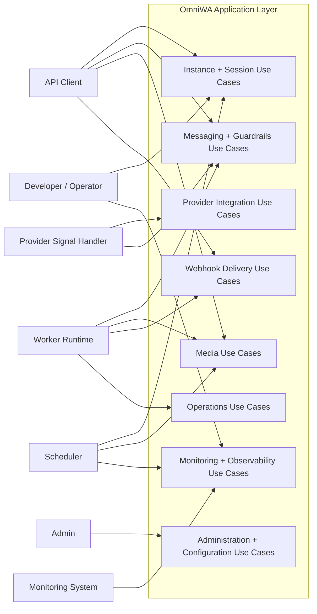
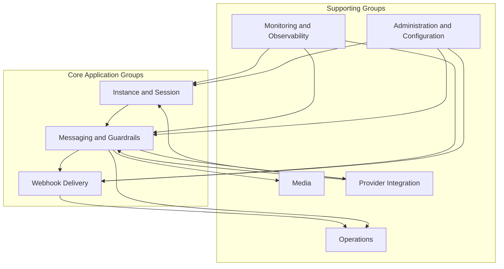

# OmniWA Use Case Groups

## Purpose

This document groups Phase 3.1 application use cases by product capability and owning domain context.

It does not define REST resources, OpenAPI, DTOs, database schema, repository implementation, queue implementation, provider implementation, or source code.

## Grouping Principles

- Group by business capability, not transport endpoint.
- Keep use cases aligned with frozen bounded contexts.
- Keep provider, worker, scheduler, and webhook handling behind Application boundaries.
- Separate commands from queries.
- Keep future capabilities outside MVP unless explicitly marked future/deferred.

## Use Case Group Matrix

| Group | Primary Domain Contexts | Primary Actors | Use Case Scope |
| --- | --- | --- | --- |
| Instance and Session | Instance, Session, Security and Access, Health | API Client, Developer/Operator, Admin, Provider Signal Handler, Scheduler | Create/manage instance lifecycle, pairing, session activation, disconnect/logout/reconnect, status queries. |
| Messaging and Guardrails | Messaging, Guardrails, Session, Media, Provider Integration, Operations | API Client, Worker Runtime, Provider Signal Handler | Accept/reject/send messages, evaluate guardrails, process outbound work, apply translated delivery state, receive inbound messages. |
| Media | Media, Messaging, Operations, Audit | API Client, Worker Runtime, Scheduler, Admin | Register, process, attach, diagnose, cleanup, and query supported media assets. |
| Webhook Delivery | Webhook Delivery, Operations, Audit, Health, Observability | API Client, Developer/Operator, Worker Runtime, Application Event Handler | Manage subscriptions and deliver approved integration events with retry/dead-letter visibility. |
| Provider Integration | Provider Integration, Instance, Session, Messaging, Media, Health | Provider Signal Handler, Scheduler, Developer/Operator | Evaluate provider profile/capability and route translated provider observations to product use cases. |
| Operations | Operations, owner product contexts | Worker Runtime, Scheduler, Application Event Handler, Developer/Operator | Create and manage visible async work lifecycle without deciding owner business outcome. |
| Administration and Configuration | Security and Access, Configuration, Audit | Admin, Developer/Operator | Evaluate access decisions, validate/activate configuration, and record safe audit evidence. |
| Monitoring and Observability | Health, Observability, Audit, product contexts | Developer/Operator, Monitoring System, Scheduler | Refresh/query health, capture sanitized telemetry, and query safe audit/operational evidence. |

## Command Groups

| Group | Command Use Cases |
| --- | --- |
| Instance and Session | Create Instance, Update Instance Metadata, Request Instance Connection, Start QR Pairing, Refresh QR Pairing, Confirm Session Activated, Reconnect Instance, Mark Instance Disconnected, Mark Instance Logged Out, Destroy Instance. |
| Messaging and Guardrails | Send Text Message, Send Media Message, Evaluate Outbound Guardrails, Process Outbound Message Work, Apply Provider Message Status, Receive Inbound Message, Classify Unsupported Inbound Message, Retry Message Send, Cancel Message. |
| Media | Register Media, Process Media Work, Attach Media To Message Workflow, Request Diagnostic Capture, Cleanup Media Retention. |
| Webhook Delivery | Register Webhook Subscription, Update Webhook Subscription, Activate Webhook Subscription, Suspend Webhook Subscription, Retire Webhook Subscription, Schedule Webhook Delivery, Deliver Webhook Work, Retry Webhook Delivery, Move Webhook Delivery To Dead Letter. |
| Provider Integration | Evaluate Provider Compatibility, Handle Provider Connection Signal, Handle Provider Auth Signal, Handle Provider Failure Signal, Refresh Provider Capability. |
| Operations | Queue Async Work, Reserve Worker Job, Complete Worker Job, Mark Worker Job Retry Or Dead. |
| Administration and Configuration | Evaluate Access Decision, Validate Configuration Snapshot, Activate Configuration Snapshot, Record Audit Evidence. |
| Monitoring and Observability | Refresh Health Status, Capture Telemetry Signal. |

## Query Groups

| Group | Query Use Cases |
| --- | --- |
| Instance and Session | Get Instance Status, List Instances. |
| Messaging and Guardrails | Get Message Status. |
| Media | Get Media Status. |
| Webhook Delivery | Get Webhook Status. |
| Monitoring and Observability | Get Health Status, Query Audit Records. |

Queries do not mutate Domain state and do not publish Domain Events.

## Use Case Diagram

## Use Case Group Diagram

## Future Evolution

| Future Change | Use Cases Reused | Use Cases Likely To Change | New Use Cases Likely Needed | Constraint |
| --- | --- | --- | --- | --- |
| Telegram | Messaging lifecycle, media processing, webhook delivery, operations, audit, health, telemetry. | Provider compatibility, provider signal handling, message/media capability checks. | Channel profile evaluation, channel-specific capability classification if approved. | Product decision and ADR; no Telegram-native leakage into Domain. |
| WhatsApp Cloud API | Message send/receive, webhook delivery, health, audit, operations. | Provider auth/signal handling, session lifecycle if auth model differs, provider compatibility. | Cloud provider profile activation and cloud signal handling if approved. | Provider ADR required. |
| Campaign | Guardrail evaluation and operations may be reused. | Messaging must remain single-message lifecycle. | Campaign, audience, schedule, approval, stop use cases in new context. | Out of MVP; product decision and ADR required. |
| Analytics | Existing event/query-safe projections may be consumed. | Monitoring queries may gain approved projection sources. | Analytics projection/query use cases. | Must not become source of truth or raw payload sink. |
| Billing | Usage facts from message/webhook/job events may be consumed. | None in source use cases by default. | Usage recording, billing period, invoice preparation. | Product decision and ADR required. |
| AI Agent | Message/webhook/guardrail/audit flows may be reused with strict access. | Messaging acceptance may require additional agent-origin guardrails. | Agent intent evaluation, agent action approval, agent audit evidence. | Product decision, security review, and ADR required. |

## Group Review Checklist

| Item | Status |
| --- | --- |
| Use cases grouped by domain capability | PASS |
| Command and query groups separated | PASS |
| Actors identified | PASS |
| Future evolution constrained | PASS |
| No REST/API/database/DTO design introduced | PASS |
