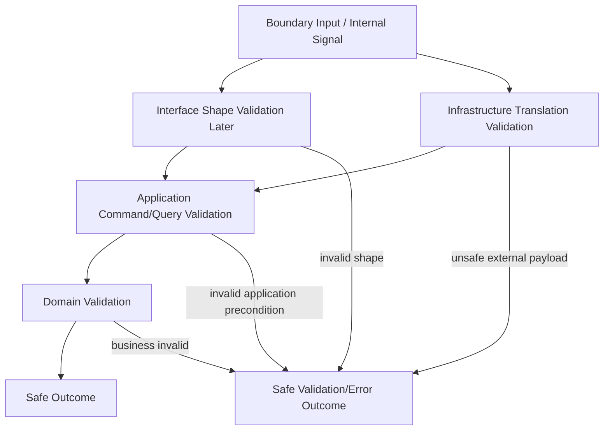

# OmniWA Validation Strategy

## Purpose

This document defines the Phase 3.4 Application validation strategy.

It separates Interface validation, Application validation, Domain validation, and Infrastructure validation. It does not define DTO classes, REST validators, OpenAPI schemas, database constraints, Prisma schemas, provider payload schemas, or source code.

## Validation Principles

- Each layer validates its own boundary.
- Application validation must not replace Domain validation.
- Domain validation must not know transport, provider, database, or queue details.
- Infrastructure validation must translate external data into safe product concepts before Application/Domain consumption.
- Validation failures must be classified safely and must not expose Secret or raw Confidential data.
- Unsupported product scope must be rejected explicitly, not coerced.

## Layer Responsibilities

| Layer | Validates | Must Not Validate |
| --- | --- | --- |
| Interface | Future transport shape, authentication envelope, request parsing, basic required fields. | Product business policy, aggregate invariants, provider behavior, persistence rules. |
| Application | Command/query semantics, workflow preconditions, idempotency requirement, authorization preconditions, cross-aggregate precondition order, data safety before orchestration. | Aggregate invariants, supported capability meaning, raw transport shape, database constraints. |
| Domain | Business rules, aggregate invariants, policies, specifications, factories, lifecycle validity, domain error category. | DTO shape, HTTP concerns, provider-native payloads, persistence mechanics, queue mechanics. |
| Infrastructure | External payload shape, provider signal translation, config source parsing, secret boundary mechanics, adapter-level capability detection, dependency response classification. | Product policy, aggregate mutation, command/query orchestration. |

## Application Validation

Application validates:

- Command exists in `COMMAND_CATALOG.md`.
- Query exists in `QUERY_CATALOG.md`.
- Command/query target identity is a safe product reference.
- Required idempotency scope exists for duplicate-prone commands.
- Actor context exists where authorization may be needed.
- Workflow preconditions can be checked without mutating Domain.
- Cross-aggregate precondition order is explicit.
- Data classification allows passing values to Domain, Audit, Webhook, or Observability.
- Translated provider signals are safe and classified before owner workflow routing.
- Query consistency and caching expectation are declared.

Application validation does not decide:

- Whether a message type is supported as a business capability.
- Whether a session is usable as a Domain rule.
- Whether a webhook delivery can retry as a Domain policy.
- Whether media retention is valid as a Domain policy.

It calls Domain specifications, policies, services, and aggregate roots for those decisions.

## Domain Validation

Domain validates:

- Aggregate state transitions.
- Business invariants.
- Domain policies.
- Domain specifications.
- Creation invariants through factories.
- Domain error categories.
- Supported MVP capability constraints.
- Guardrail, retention, retry, access, and configuration business rules.

Domain validation returns product language outcomes and safe domain errors. It does not return HTTP status, SQL error, provider exception, or queue engine classification.

## Infrastructure Validation

Infrastructure validates:

- Provider payload can be translated safely.
- Provider capability/failure can be classified into product vocabulary.
- Configuration source can be parsed and mapped to safe configuration concepts.
- Secret references can be resolved without exposing values.
- External transport outcomes can be classified safely.
- Adapter payloads do not leak Secret or raw Confidential data into logs or Domain.

Infrastructure validation failure must become a safe Infrastructure Error, External Provider Error, Configuration Error, Security Error, or Unknown Error before crossing into Application.

## Validation Flow

## Validation Matrix

| Scenario | Owner | Failure Category |
| --- | --- | --- |
| Missing required future request field | Interface | Validation Error. |
| Command not listed in catalog | Application | Validation Error. |
| Missing idempotency for SendTextMessage | Application | Validation Error / Idempotency Error. |
| Unsupported sticker outbound message | Domain | UnsupportedCapability. |
| Guardrail throttles outbound message | Domain | PolicyViolation. |
| Revoked session used for send | Domain | BusinessRuleViolation / InvalidStateTransition. |
| Provider signal cannot be translated | Infrastructure/Application boundary | ExternalSignalClassificationError / External Provider Error. |
| Webhook URL unsafe by product policy | Domain | BusinessRuleViolation / PolicyViolation. |
| Query requests Secret data | Application | Security Error / SensitiveDataViolation. |
| Configuration attempts to disable guardrails | Domain | ConfigurationDomainError / PolicyViolation. |

## Freeze Decision

The validation strategy is **APPROVED** for Phase 3 freeze.
