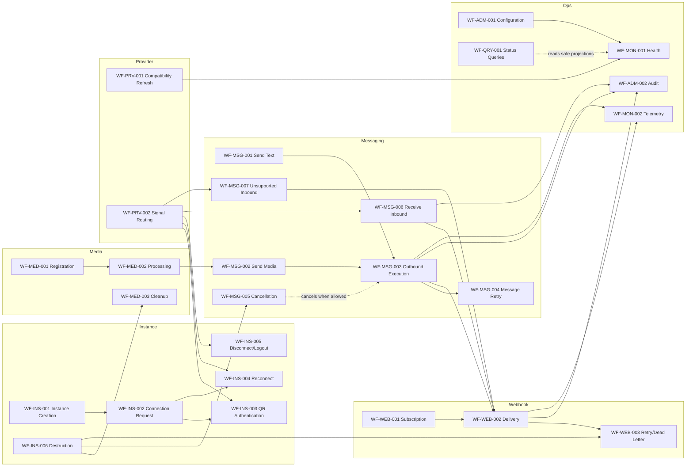

# OmniWA Workflow Dependencies

## Purpose

This document defines dependencies between Phase 3.2 Application workflows.

It describes orchestration relationships only. It does not define command models, query models, DTOs, REST endpoints, database joins, queue implementation, provider implementation, or module implementation.

## Dependency Principles

- Workflow dependencies must follow the frozen Architecture dependency rules and Phase 2 Domain boundaries.
- Workflows depend on Domain contracts, repository ports, and external ports, not concrete infrastructure.
- Cross-context workflow coordination must happen through Application orchestration, Domain Events, Integration Events, or approved ports.
- Worker workflows enter through Application use cases and must not call Interface/API handlers.
- Provider workflows route translated signals only; provider runtime never calls business workflows directly.
- Webhook delivery depends on product facts but never owns or mutates the source business state.

## Dependency Types

| Type | Meaning | Example |
| --- | --- | --- |
| Sequential mandatory | Workflow B cannot start until Workflow A reaches a required outcome. | Send media message waits for media registration/processing decision. |
| Conditional | Dependency exists only for a branch or failure category. | Connection request branches to QR authentication only when no usable session exists. |
| Parallel after source fact | Multiple workflows can start after one durable source fact. | Inbound message can schedule webhook, audit, telemetry, and health projection after persistence. |
| Event-driven | Workflow starts from Domain/Application/Integration Event publication decision. | Webhook delivery starts after approved product event publication. |
| Worker-driven | Workflow starts from visible async work reservation. | Outbound message execution starts after WorkerJob is queued and reserved. |
| Independent | Workflow does not require another workflow to complete. | Status query reads safe state without mutation. |

## Workflow Dependency Matrix

| Workflow | Depends On | May Start | Must Not Depend On | Notes |
| --- | --- | --- | --- | --- |
| WF-INS-001 Instance Creation | Auth/access, Configuration snapshot. | Audit, Health projection. | Provider runtime, Message, Webhook delivery. | Creation does not connect provider. |
| WF-INS-002 Instance Connection Request | Instance, Session summary, connection policy, Provider port. | WF-INS-003 or WF-INS-004, Audit, Health. | API waiting for final provider delivery. | Chooses QR or restore path. |
| WF-INS-003 QR Authentication | WF-INS-002 when QR required, Provider translated signals. | Webhook delivery, Audit, Health. | Messaging send workflows. | Waiting state is expected. |
| WF-INS-004 Reconnect Instance | Disconnect/health/scheduler signal, Instance, Session. | Audit, Health, ActionRequired. | Concurrent reconnect for same Instance. | Serialized per Instance. |
| WF-INS-005 Disconnect Or Logout Handling | Provider translated signal or user/admin intent. | Audit, Health, Webhook delivery. | Message mutation outside Messaging context. | May block later send workflows through Session/Instance state. |
| WF-INS-006 Instance Destruction | Access, active work summaries, destruction policy. | Cancellation/cleanup workflows, Audit, Health. | Provider direct business rules. | Must not silently delete active work. |
| WF-MSG-001 Send Text Message | Instance, Session, Configuration, guardrail policy. | WF-MSG-003, Webhook scheduling for accepted facts, Audit, Health. | Direct provider call before visible work. | Async acceptance only. |
| WF-MSG-002 Send Media Message | WF-MED-001 or existing Media, Instance, Session, guardrail policy. | WF-MED-002 if needed, WF-MSG-003, Audit, Health. | Unsupported media expansion. | Media readiness is a precondition or wait state. |
| WF-MSG-003 Outbound Message Execution | Visible outbound WorkerJob, Message, Session, Provider port. | WF-MSG-004 on retryable failure, Webhook delivery, Audit, Health. | Interface/API layer. | Worker enters Application workflow. |
| WF-MSG-004 Message Retry | Failed/retryable Message and retry policy. | WF-MSG-003, Audit, Health. | Infinite retry. | Retry work must be visible. |
| WF-MSG-005 Message Cancellation | Message and WorkerJob summary. | Audit, Health. | Provider rollback. | Cancellation cannot undo provider side effects. |
| WF-MSG-006 Receive Inbound Message | WF-PRV-002 translated inbound signal. | WF-WEB-002, WF-ADM-002, WF-MON-002, WF-MON-001. | Provider-native payload exposure. | Source message fact must be persisted before integration delivery. |
| WF-MSG-007 Unsupported Inbound Message Handling | WF-PRV-002 translated unsupported signal. | Safe webhook/audit/telemetry where allowed. | Supported message lifecycle. | Does not expand MVP message support. |
| WF-MED-001 Media Registration | Media intent, media policy, configuration. | WF-MED-002 if processing needed. | Database/storage implementation. | Can be standalone or part of send media workflow. |
| WF-MED-002 Media Processing | Visible media processing WorkerJob, Media aggregate. | WF-MSG-003 if dependent send was waiting, Audit, Health. | Message business rules. | Media prepares asset; Messaging owns delivery lifecycle. |
| WF-MED-003 Media Cleanup | Retention policy, active work summaries. | Audit, Health. | Active message/webhook deletion. | Must defer when references exist. |
| WF-WEB-001 Webhook Subscription Management | Access and Webhook policy/specification. | Audit, Health. | Source business state mutation. | Defines future deliverability only. |
| WF-WEB-002 Webhook Delivery | Product event publication decision, active subscription, visible delivery job. | WF-WEB-003 on retryable failure, Audit, Health. | Source aggregate mutation. | Always asynchronous. |
| WF-WEB-003 Webhook Retry And Dead Letter | Failed delivery attempt and retry policy. | Audit, Health, future replay decision. | Business state rollback. | Dead letter is terminal until explicit recovery workflow. |
| WF-PRV-001 Provider Compatibility Refresh | Provider abstraction and configuration. | Health, ActionRequired, Audit. | Domain business mutation. | Produces safe capability/compatibility observations. |
| WF-PRV-002 Provider Signal Routing | Provider translated signal envelope. | Owner workflow by signal type. | Direct Domain mutation by provider. | Routes to one owner or safely ignores. |
| WF-ADM-001 Configuration Activation | Access, configuration policy, secret/config ports. | Health, Audit, dependent consumers via published activation. | Runtime mutation without active snapshot. | Uses snapshot/supersede semantics. |
| WF-ADM-002 Audit Evidence Recording | Sanitized workflow/domain facts. | Observability gap signal if failed. | Raw Secret or provider-native payloads. | Mandatory audit failure must be visible. |
| WF-MON-001 Health Refresh | Safe health signals and dependency observations. | Telemetry/alerting later. | Business state mutation. | Health is a projection. |
| WF-MON-002 Telemetry Capture | Sanitized workflow outcomes and correlation context. | None required. | Business workflow rollback. | Observability failure should not corrupt business state. |
| WF-QRY-001 Status Query Workflows | Access and safe read state. | None. | Mutation, event publication, async work. | Queries are read-only workflows. |

## Sequential Dependencies

| Chain | Required Order | Reason |
| --- | --- | --- |
| Instance connect with QR | WF-INS-002 -> WF-INS-003 -> Session activation -> Health/Audit/Webhook. | QR authentication requires accepted connection intent and provider signal. |
| Instance reconnect | Disconnect/health signal -> WF-INS-004 -> Session restore -> Health/Audit/Webhook. | Reconnect must serialize on Instance and Session ownership. |
| Send text | WF-MSG-001 -> visible WorkerJob -> WF-MSG-003 -> status publication/webhook. | API must not wait for final provider status but must make work visible. |
| Send media | WF-MED-001 -> WF-MED-002 when needed -> WF-MSG-002 -> WF-MSG-003. | Media must be valid/ready or process-visible before delivery execution. |
| Receive inbound | WF-PRV-002 -> WF-MSG-006 -> WF-WEB-002 + audit/telemetry/health. | Provider signal must be translated and source fact persisted before delivery. |
| Webhook failure | WF-WEB-002 -> WF-WEB-003 -> delivered/dead-letter/action-required. | Receiver failure handling is retry-visible and bounded. |
| Instance destruction | WF-INS-006 -> cancellation/cleanup decisions -> audit/health. | Destruction cannot silently leave active accepted work. |
| Configuration activation | WF-ADM-001 -> active snapshot publication -> health/audit. | Consumers need one active configuration reference. |

## Parallelizable Dependencies

| Source Fact | Parallel Follow-up | Guardrail |
| --- | --- | --- |
| Instance created/updated | Audit evidence and health projection. | Follow-up failure must not erase source fact. |
| Message accepted | Audit, telemetry, health projection, and worker execution scheduling where visible. | Worker visibility must exist before accepted async outcome. |
| Inbound message persisted | Webhook scheduling, audit, telemetry, health projection. | Webhook scheduling failure becomes visible delivery gap. |
| Message delivery status changed | Webhook delivery, telemetry, health projection. | Messaging remains source of message state. |
| Webhook delivery failed | Retry scheduling, health projection, audit. | Retry bounded by Webhook policy. |
| Provider capability refreshed | Health and configuration-facing projection. | Does not mutate Domain business state directly. |

## Independent Workflows

| Workflow | Independence Boundary |
| --- | --- |
| WF-QRY-001 Status Query Workflows | Read-only; no mutation or event publication. |
| WF-MON-002 Telemetry Capture | Best-effort projection; cannot roll back source workflow. |
| WF-ADM-002 Audit Evidence Recording | Event/evidence driven; mandatory failures are visible but do not define business state. |
| WF-PRV-001 Provider Compatibility Refresh | Can run on schedule; downstream workflows consume safe capability snapshot. |
| WF-MON-001 Health Refresh | Projection workflow; may consume outcomes from others but does not own them. |

## Forbidden Workflow Dependencies

| Forbidden Dependency | Reason |
| --- | --- |
| Worker workflow -> Interface/API handler. | Violates Architecture Freeze and worker boundary. |
| Provider runtime -> Domain mutation directly. | Provider must be behind translated Application boundary. |
| Webhook delivery -> source aggregate mutation. | Webhook is integration delivery, not business owner. |
| Query workflow -> Domain mutation or event publication. | Queries must be side-effect free. |
| Messaging workflow -> Session ownership mutation. | Session context owns session lifecycle. |
| Media cleanup -> deletion of active message/webhook data. | Retention must respect active workflow references. |
| Audit/Telemetry workflow -> Secret/raw Confidential data. | Security and compliance guardrail. |
| Send message workflow -> direct provider call before visible WorkerJob. | API must not wait for provider final delivery and async work must be visible. |

## Workflow Dependency Graph

## Dependency Validation Rules

- Every async chain must have a visible owner lifecycle before the triggering workflow completes.
- Every provider-signal chain must start from `WF-PRV-002 Provider Signal Routing`.
- Every webhook chain must start from a durable product fact or explicit subscription lifecycle fact.
- Every retry chain must terminate in `Completed`, `Failed`, `DeadLettered`, `Cancelled`, or `ActionRequired`.
- Every read-only chain must remain inside `WF-QRY-001` and must not publish events.
