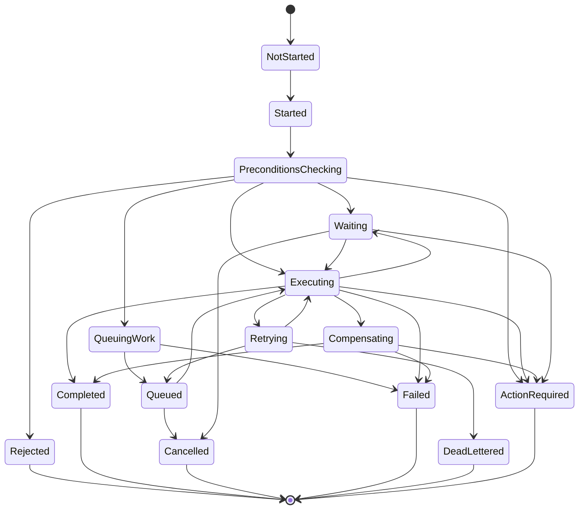

# OmniWA Workflow States

## Purpose

This document defines Application-level workflow coordination states for Phase 3.2.

These states do not replace Domain lifecycle states, runtime process states, queue engine states, or database transaction states.

## State Principles

- Workflow state describes Application orchestration progress.
- Domain aggregate state remains source of business truth.
- WorkerJob lifecycle remains source of async work visibility.
- Workflow state must not hide accepted work.
- Workflow state must not include Secret or raw Confidential data.
- Workflow state must be safe to use for observability and operator reasoning.

## Application Workflow State Catalog

| State | Meaning | Entry Condition | Exit Condition | Not To Mean |
| --- | --- | --- | --- | --- |
| NotStarted | Workflow has not been accepted for orchestration. | No trigger accepted yet. | Trigger accepted and correlation established. | Domain initial state. |
| Started | Application accepted trigger and created correlation scope. | Product intent, provider signal, worker request, scheduler signal, or publication decision received. | Preconditions begin. | Work accepted for async execution. |
| PreconditionsChecking | Application is validating workflow preconditions and idempotency. | Workflow has safe input and required context. | Preconditions pass, reject, or action-required outcome is known. | Business rule ownership by Application. |
| Rejected | Workflow is rejected before accepted state is created. | Domain policy/specification/access/validation fails before acceptance. | Terminal. | Failed accepted work. |
| Waiting | Workflow is waiting for external/user/provider/worker signal. | Work cannot proceed synchronously and is not failed. | Required signal arrives, timeout occurs, or cancellation happens. | Hidden work without lifecycle. |
| QueuingWork | Application is creating visible async work. | Domain accepted workflow but completion will be async. | WorkerJob lifecycle is visible or workflow fails before accepted outcome. | Queue engine operation detail. |
| Queued | Async work is visible through WorkerJob or approved owner lifecycle. | WorkerJobQueued or equivalent visible owner lifecycle exists. | Worker reserves/executes, cancellation, retry, or terminal state. | Provider delivery success. |
| Executing | Application is executing workflow step through Domain and ports. | Worker or synchronous orchestration is actively processing. | Step succeeds, retries, waits, fails, cancels, or compensates. | Concrete worker process state. |
| Retrying | Workflow is waiting for or performing an approved retry. | Failure is classified retryable and retry policy allows continuation. | Retry executes, retry exhausted, cancellation, or action-required. | Infinite retry. |
| Compensating | Workflow is applying safe forward compensation after partial failure. | A step failed after earlier visible state or side-effect. | Compensation completes, fails, or requires operator action. | Database rollback or hidden cleanup. |
| ActionRequired | Workflow cannot continue without operator/user action. | Missing Secret, revoked session, provider/account issue, unsafe config, exhausted recovery, or policy action required. | Operator starts a new approved workflow or state becomes terminal. | Generic unknown failure. |
| Cancelled | Workflow intentionally stopped before successful completion. | Cancellation accepted for non-terminal workflow. | Terminal, except future explicit recovery may create new workflow. | Business success. |
| Completed | Workflow completed its Application responsibility. | Required aggregate outcomes, visible work, publication decision, or query outcome completed. | Terminal. | Upstream WhatsApp final delivery guarantee. |
| Failed | Workflow reached terminal failure after accepted state or non-recoverable orchestration failure. | Failure classified non-retryable or retry exhausted without dead-letter path. | Terminal, except new recovery workflow. | Silent drop. |
| DeadLettered | Workflow's async work reached operator-visible dead-letter state. | Retry exhausted or unsafe-to-retry work. | Terminal until explicit future replay/recovery policy. | Completed work. |

## State Transition Guidance

| From | Allowed To | Rule |
| --- | --- | --- |
| NotStarted | Started | Trigger accepted. |
| Started | PreconditionsChecking, Failed | Begin preconditions or fail on unsafe trigger classification. |
| PreconditionsChecking | Rejected, Waiting, QueuingWork, Executing, ActionRequired | Decision depends on domain/access/idempotency/precondition outcome. |
| Waiting | Executing, Retrying, Cancelled, ActionRequired, Failed | Signal, timeout, or operator action decides next step. |
| QueuingWork | Queued, Failed, ActionRequired | Accepted async work must become visible before acceptance is reported. |
| Queued | Executing, Cancelled, Retrying, DeadLettered | Worker/runtime and owner policy decide progress. |
| Executing | Completed, Waiting, Retrying, Compensating, Failed, ActionRequired | Step outcome is classified safely. |
| Retrying | Queued, Executing, DeadLettered, Failed, ActionRequired | Retry policy and failure category decide next state. |
| Compensating | Completed, Failed, DeadLettered, ActionRequired | Compensation outcome is visible. |
| Rejected | Terminal | No accepted work exists. |
| Completed | Terminal | No further Application work in same workflow. |
| Cancelled | Terminal | New workflow required for recovery/retry if allowed. |
| Failed | Terminal | New workflow required for recovery/retry if allowed. |
| DeadLettered | Terminal | Future explicit replay/recovery policy required. |

## State Mapping By Workflow Type

| Workflow Type | Common States | Notes |
| --- | --- | --- |
| Synchronous command | Started -> PreconditionsChecking -> Executing -> Completed/Rejected/Failed. | Should be short-lived and not wait for provider final delivery. |
| Async acceptance | Started -> PreconditionsChecking -> QueuingWork -> Queued -> Completed. | Completed means Application accepted and work is visible, not that external side effect finished. |
| Worker execution | Started -> PreconditionsChecking -> Executing -> Completed/Retrying/DeadLettered/Failed. | Worker enters through Application use case. |
| Provider-signal | Started -> PreconditionsChecking -> Executing -> Completed/Ignored-as-Rejected/ActionRequired. | Provider payload must already be translated. |
| Scheduled workflow | Started -> PreconditionsChecking -> Executing/QueuingWork -> Completed/ActionRequired. | Scheduler does not mutate Domain directly. |
| Query workflow | Started -> PreconditionsChecking -> Executing -> Completed/Rejected. | No Domain mutation or Domain Event publication. |

## Long-running Workflow States

Long-running workflows commonly use `Waiting`, `Queued`, `Retrying`, `ActionRequired`, and `DeadLettered`.

| Workflow | Long-running States | Reason |
| --- | --- | --- |
| QR Authentication | Waiting, ActionRequired, Failed | Requires external pairing action and provider auth signal. |
| Reconnect Instance | Queued, Executing, Retrying, ActionRequired | Provider/session recovery may take multiple attempts. |
| Outbound Message Execution | Queued, Executing, Retrying, ActionRequired | Provider status and delivery uncertainty are asynchronous. |
| Message Retry | Retrying, Queued, DeadLettered | Retry policy is bounded and must remain visible. |
| Media Processing | Queued, Executing, Retrying, Failed | Media work may require provider/storage boundaries later. |
| Webhook Delivery | Queued, Executing, Retrying, DeadLettered | Receiver availability is external and retry-visible. |
| Media Cleanup | Queued, Waiting, Completed, Failed | Cleanup must not remove data needed by running work. |
| Health Refresh | Waiting, Executing, Completed, ActionRequired | Dependency checks/projections may lag. |

## Workflow State Diagram

## State Constraints

- `Completed` for async acceptance means accepted work is visible, not final provider/webhook completion.
- `Rejected` occurs before accepted work exists.
- `Failed`, `DeadLettered`, and `ActionRequired` must be observable.
- `Retrying` must be bounded and idempotent.
- `Compensating` must use safe forward compensation; it must not imply database rollback mechanics.
- Query workflows must not enter `QueuingWork`, `Queued`, `Retrying`, or `DeadLettered`.
- Workflow state must not duplicate or override aggregate state.
