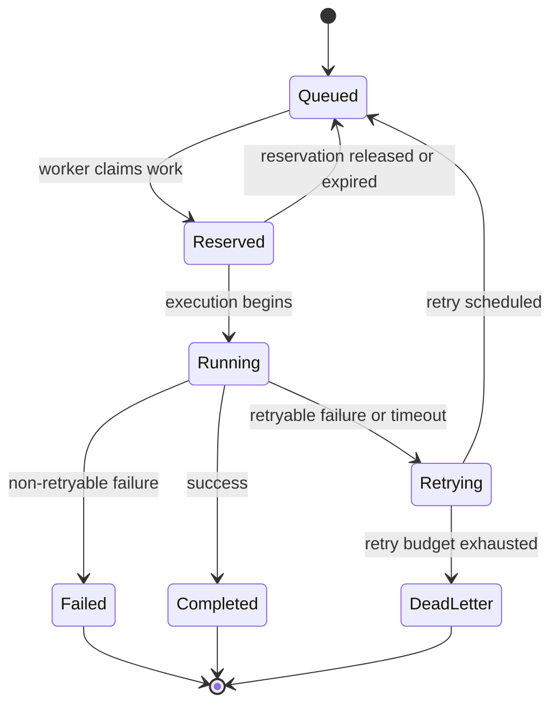
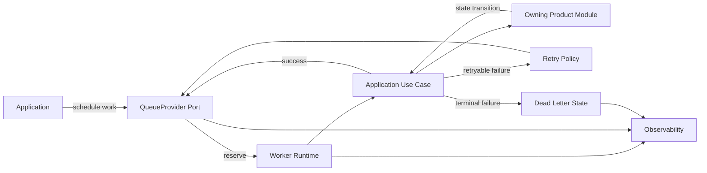

# OmniWA Async Processing

## Purpose

This document defines async processing architecture for OmniWA Phase 1.4.

It covers queue-visible work, workers, retries, timeouts, dead letter, backpressure, concurrency, locking, and idempotency at architecture level.

It does not select BullMQ, Redis, database-backed jobs, a managed queue service, Docker, Prisma, source code, or concrete queue implementation.

## Async Processing Principles

- Async work is application-owned work with explicit lifecycle state.
- QueueProvider is an extension point; queue engine details remain outside this phase.
- Accepted async work must not silently disappear.
- Worker Runtime executes Application use cases, not Interface handlers.
- Retried work must be idempotent.
- Exhausted retries must become terminal failed, dead-letter, or action-required state.
- Job payloads must follow data classification and retention rules.

## Async Work Types

| Work Type | Created By | Processed By | Lifecycle Owner | Notes |
| --- | --- | --- | --- | --- |
| Outbound message send | Application after Messaging/Guardrails acceptance | Worker Runtime | Messaging + Worker | Provider final delivery may arrive later as status event. |
| Media processing | Application after Media acceptance | Worker Runtime | Media + Worker | Binary media not retained by default after processing. |
| Webhook delivery | Webhook/Application after integration event preparation | Worker Runtime/Webhook Runtime | Webhook + Worker | Always async and retry-visible. |
| Reconnect attempt | Scheduler/Application after recoverable disconnect | Worker Runtime | Instance/Session + Worker | One reconnect per instance at a time. |
| Retention cleanup | Scheduler/Application | Worker Runtime | Owning product module + Audit | Must respect retention decisions. |
| Recovery validation | Application/operator workflow | Worker Runtime | Affected module + Audit | Used after restore or incident recovery. |
| Health refresh | Scheduler/Application | Background Runtime/Worker where needed | Health | Must distinguish dependency vs product health. |

## Queue Lifecycle

## Worker Runtime Rules

Worker Runtime must:

- Reserve work before execution.
- Execute through Application use cases.
- Preserve correlation ID across async boundary.
- Update job lifecycle state before and after execution.
- Classify failures before retry or terminal transition.
- Release or requeue work safely when shutting down.
- Emit sanitized metrics and logs.

Worker Runtime must not:

- Call Interface layer.
- Call Provider adapter directly for product behavior.
- Mutate domain state outside Application.
- Drop work without terminal or retry-visible state.
- Log raw job payload when it contains Confidential or Secret data.

## Retry Strategy

Retry architecture is conceptual in Phase 1.4.

| Retry Concern | Rule |
| --- | --- |
| Retry eligibility | Determined by Application and owning module based on failure category. |
| Retry count | Bounded per work type. Exact values are later implementation policy. |
| Retry delay | Supports backoff conceptually; no algorithm selected here. |
| Retry visibility | Every retry increments visible retry metadata. |
| Retry exhaustion | Moves to Failed, Dead Letter, or Action Required. |
| Retry safety | Requires idempotency key or equivalent idempotency semantics. |

Retryable examples:

- Temporary webhook receiver timeout.
- Temporary provider network failure.
- Temporary queue reservation loss.
- Recoverable provider disconnect.

Non-retryable examples:

- Unsupported message type.
- Guardrail block.
- Session Revoked.
- Missing Secret.
- Invalid webhook receiver configuration.
- Unsafe configuration failure.

## Timeout Strategy

Timeouts must exist conceptually for:

- Worker reservation.
- Worker execution.
- Provider operation attempt.
- Webhook transport attempt.
- Media processing attempt.
- Reconnect attempt.
- Health probe.

Timeout outcomes:

- Retryable timeout moves to Retrying.
- Non-retryable timeout moves to Failed or Action Required.
- Timeout classification must preserve safe observability context.

## Dead Letter Strategy

Dead Letter is used when:

- Retry budget is exhausted.
- Work cannot proceed safely.
- Work payload or target is invalid after acceptance.
- Downstream receiver remains unavailable beyond retry policy.
- Recovery requires operator decision.

Dead Letter requirements:

- Must be operator-visible.
- Must include failure category and safe context.
- Must not include Secret or raw Confidential payloads.
- Must support later explicit replay/recovery policy without implying automatic replay now.

## Backpressure Strategy

Backpressure protects OmniWA and external systems from overload.

Signals:

- Queue depth.
- Oldest pending work age.
- Worker utilization.
- Retry growth.
- Provider failure rate.
- Webhook receiver failure rate.
- Provider event lag.

Actions:

- Slow acceptance of non-critical work where product policy allows.
- Mark workflows throttled or action-required.
- Prioritize recovery or lifecycle-critical work over integration notifications where safe.
- Surface degraded health to operators.

Backpressure must not:

- Hide accepted work.
- Drop accepted work silently.
- Bypass guardrails.
- Retry aggressively enough to overload downstream receivers.

## Concurrency Strategy

Concurrency rules:

- At most one active provider connection per instance.
- At most one reconnect workflow per instance.
- At most one worker processes a specific outbound message work item.
- Webhook delivery attempts for the same event must preserve idempotency.
- Retention cleanup must not delete state needed by running work.
- Session state changes must coordinate with provider runtime ownership.

Architecture-level concurrency controls:

- Work reservation.
- Instance-level operation guard.
- Message-level idempotency key.
- Webhook event idempotency key.
- Reconnect ownership token.
- Session/provider runtime ownership marker.

No concrete locking library or storage mechanism is selected in this phase.

## Locking Strategy

Locking is a conceptual safety mechanism, not an implementation selection.

| Lock Scope | Purpose | Failure Handling |
| --- | --- | --- |
| Instance operation | Prevent concurrent connect/reconnect/destroy conflicts. | Release on completion, timeout, or terminal failure. |
| Provider connection | Ensure one active provider runtime per instance. | Mark degraded/action-required on stale ownership. |
| Outbound message | Prevent duplicate provider send execution. | Retry or dead-letter if ownership cannot be established. |
| Webhook event | Prevent simultaneous duplicate delivery attempts unless explicitly idempotent. | Requeue or skip duplicate attempt with visible state. |
| Retention cleanup | Prevent cleanup of active work. | Defer cleanup and emit safe metric. |

## Idempotency Strategy

Idempotency is required for:

- Outbound message work.
- Webhook delivery.
- Media processing.
- Reconnect work.
- Recovery validation.
- Retention cleanup.

Idempotency rules:

- Idempotency keys must not expose Secret or raw Confidential data.
- Repeated execution must converge to one product outcome where possible.
- Provider uncertainty may still produce Unknown or Action Required state; it must not be hidden.
- Webhook retry should not create duplicate product delivery state inside OmniWA.
- External receivers own downstream deduplication, but OmniWA must provide stable delivery identity where future contracts define it.

## Async Processing Diagram

