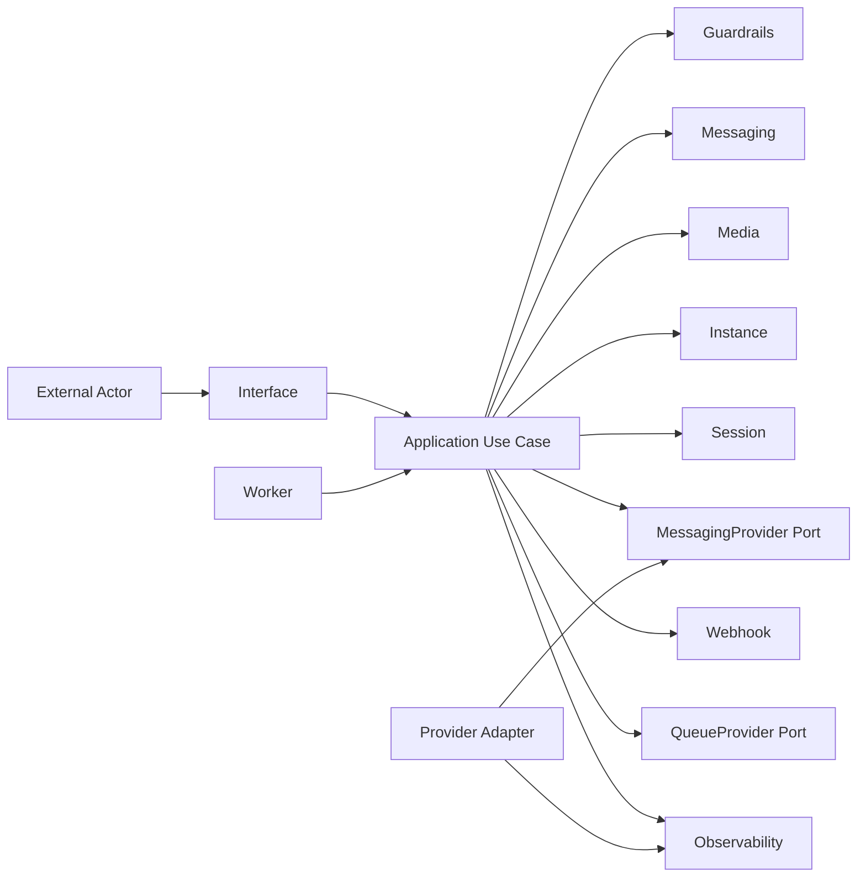
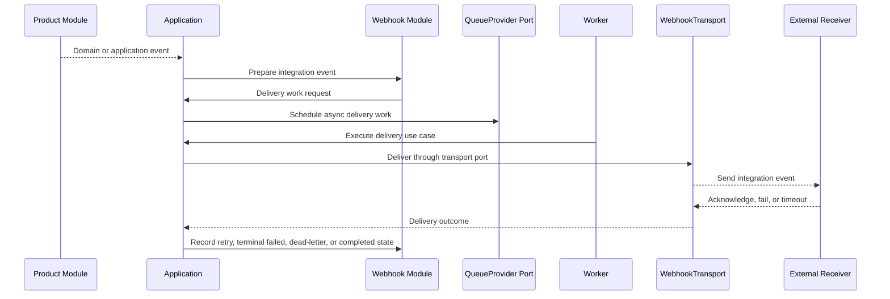

# OmniWA Component Interactions

## Purpose

This document defines component interactions at module level for OmniWA Phase 1.3.

It shows how modules collaborate without designing REST endpoints, database schemas, queue engines, Baileys internals, Docker, or source code.

## Interaction Principles

- Interface invokes Application; it does not call Provider or Infrastructure for product behavior.
- Application coordinates product modules and ports.
- Product modules define policy and events.
- Provider adapters translate provider behavior through application ports.
- Worker and Scheduler execute application-owned workflows.
- Webhook delivery is async and observable.
- External events leave OmniWA only through Webhook-owned integration flows.

## Interaction Diagram

## Outbound Supported Message Flow

| Step | Interaction | Owner |
| --- | --- | --- |
| 1 | External actor enters through Interface boundary. | Interface |
| 2 | Interface attaches request/correlation context and invokes Application. | Interface |
| 3 | Application validates access, input shape, instance state, and workflow eligibility. | Application, Auth, Validation, Instance |
| 4 | Guardrails evaluates spam/broadcast/rate-limit/abuse-risk policy. | Guardrails |
| 5 | Messaging validates supported message type and message lifecycle transition. | Messaging |
| 6 | Media validates product-level media policy when the message contains supported media. | Media |
| 7 | Application records accepted or rejected state through ports. | Application |
| 8 | Application requests provider operation through MessagingProvider port. | Application |
| 9 | Provider adapter translates request to provider-specific behavior. | Provider |
| 10 | Provider result is translated into product-level status or error category. | Provider, Application |
| 11 | Messaging state is updated and observable outcome is emitted. | Messaging, Observability |
| 12 | Webhook module prepares integration event when approved. | Webhook |

Notes:

- This is not an endpoint design.
- Provider calls are not assumed to be transactional with OmniWA-owned state.
- Accepted work must be observable as completed, pending, retried, failed, dead-letter, or action-required.

## Inbound Provider Event Flow

| Step | Interaction | Owner |
| --- | --- | --- |
| 1 | Provider adapter receives provider-native event. | Provider |
| 2 | Provider translates event into OmniWA product event or provider error category. | Provider |
| 3 | Application receives translated event through provider/event port. | Application |
| 4 | Application routes event to Instance, Session, Messaging, Media, or Health ownership. | Application |
| 5 | Product module validates state transition and emits domain event. | Product module |
| 6 | Application decides publication and async work timing. | Application |
| 7 | Webhook prepares external integration event if the event is allowed externally. | Webhook |
| 8 | Observability records sanitized status and correlation context. | Observability |

## Webhook Delivery Flow

## Reconnect And Action-Required Flow

| Step | Interaction | Owner |
| --- | --- | --- |
| 1 | Provider emits disconnect/reconnect signal. | Provider |
| 2 | Provider translates signal into provider status category. | Provider |
| 3 | Application coordinates Instance and Session state. | Application |
| 4 | Session classifies whether session is recoverable or action-required. | Session |
| 5 | Instance updates health state and operator-visible status. | Instance |
| 6 | Scheduler/Worker may trigger approved reconnect workflow through Application. | Scheduler, Worker |
| 7 | Health and Observability emit sanitized operational state. | Health, Observability |

## Media Processing Flow

| Step | Interaction | Owner |
| --- | --- | --- |
| 1 | Messaging identifies supported media message category. | Messaging |
| 2 | Media validates metadata and retention policy. | Media |
| 3 | Application requests provider media operation through port if needed. | Application |
| 4 | Provider adapter performs provider-specific media behavior. | Provider |
| 5 | Media records metadata outcome and diagnostic capture status where enabled. | Media |
| 6 | Binary media is not retained by default after processing. | Media |

## Retention And Cleanup Flow

| Step | Interaction | Owner |
| --- | --- | --- |
| 1 | Scheduler emits retention check signal. | Scheduler |
| 2 | Application invokes retention use cases for owned modules. | Application |
| 3 | Product modules determine eligible expired records by ownership. | Product modules |
| 4 | Application invokes store ports for cleanup. | Application |
| 5 | Audit records security-sensitive cleanup or diagnostic retention changes. | Audit |
| 6 | Observability emits safe retention metrics. | Observability |

## Internal Event Ownership

| Event Category | Publisher | Consumer | Sync / Async | Event Type | Notes |
| --- | --- | --- | --- | --- | --- |
| Instance lifecycle event | Instance through Application | Health, Webhook, Audit where approved | Sync for local state, Async for webhook | Business Event | Instance owns lifecycle fact. |
| Session state event | Session through Application | Instance, Health, Audit, Webhook where approved | Sync/Async based on workflow | Business Event | Secret material is never included. |
| Message lifecycle event | Messaging through Application | Webhook, Observability, Audit where applicable | Async for external delivery | Business Event / Integration Event | Message body excluded from normal event logs. |
| Media processing event | Media through Application | Messaging, Webhook, Observability | Sync/Async | Business Event | Binary media not included by default. |
| Guardrail event | Guardrails through Application | Messaging, Audit, Observability, Webhook where approved | Sync for decision, Async for external event | Business Event | Used to block/throttle/action-required workflows. |
| Provider status event | Provider adapter to Application | Instance, Session, Health, Observability | Sync/Async based on action | Infrastructure Event | Translated before product modules see it. |
| Webhook delivery event | Webhook/Worker through Application | Observability, Audit where applicable | Async | Infrastructure / Integration Event | Tracks delivery lifecycle. |
| Queue lifecycle event | Worker through Application | Health, Observability | Async | Infrastructure Event | No raw job payload in logs. |
| Audit event | Application/platform modules | Audit adapter | Sync or async by policy | Infrastructure Evidence Event | Must not include Secret values. |
| Health state event | Health through Application | Interface, Observability, Webhook where approved | Sync/Async | Infrastructure/Product Status Event | Separates OmniWA vs external dependency failure. |

## Interaction Constraints

- API/interface layer must not call Baileys or Provider adapters directly.
- Provider must not publish external webhook events directly.
- Worker must not call Interface.
- Scheduler must not mutate domain state directly.
- Webhook must not own original business facts; it owns integration delivery lifecycle.
- Product events must be sanitized before crossing Webhook or Observability boundaries.
