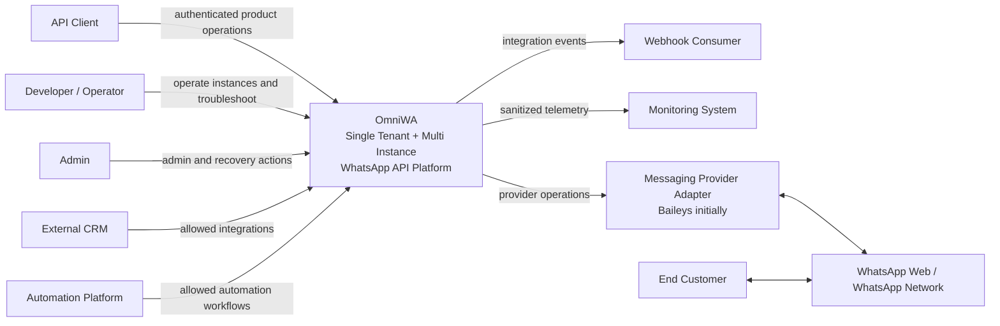
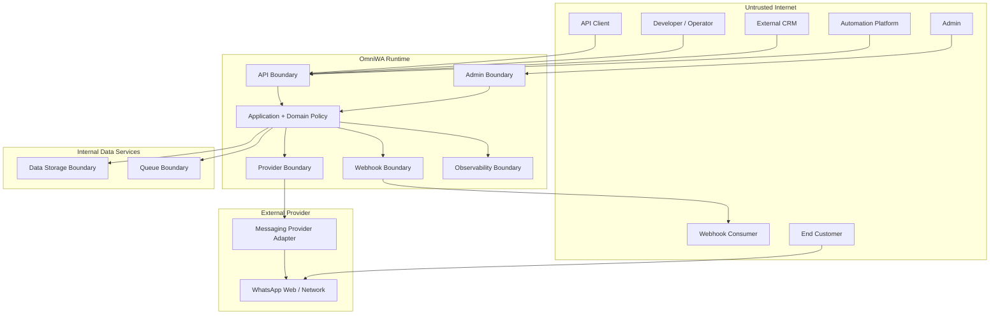
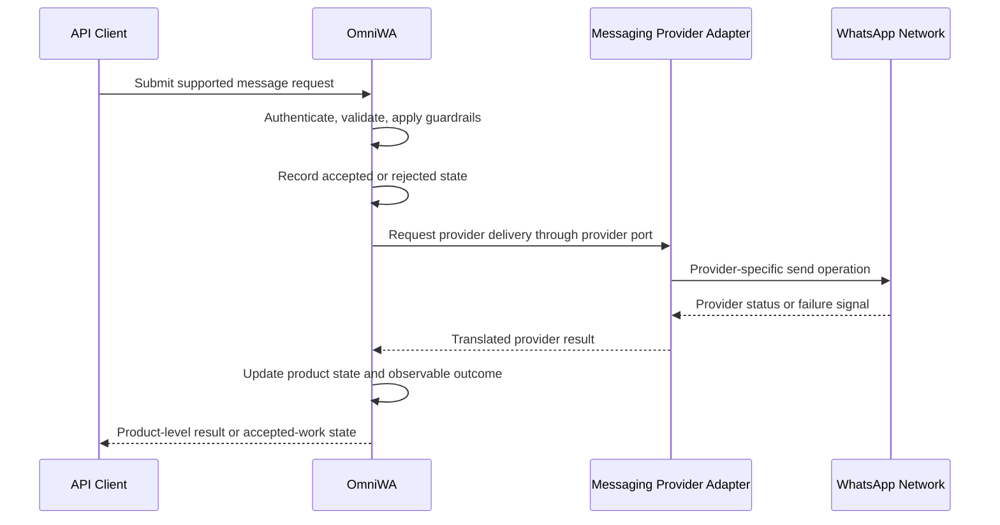
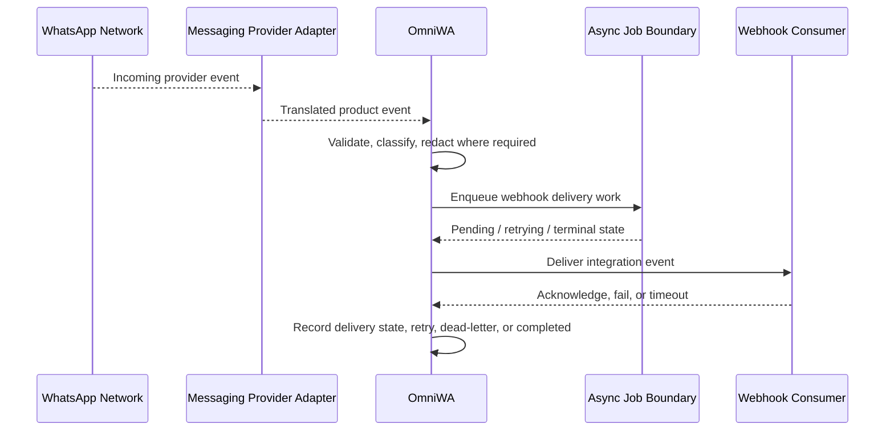

# OmniWA Context Diagrams

## Purpose

This document contains Mermaid diagrams for OmniWA system context.

The diagrams show actors, external systems, trust boundaries, and high-level flows. They do not define API endpoints, schemas, modules, queue internals, or deployment topology.

## C4 Context Diagram

## Trust Boundary Diagram

## High-Level Message Flow

## Webhook Flow

## Context Diagram Notes

- The provider adapter is inside the OmniWA architecture boundary but communicates with external provider systems.
- WhatsApp Web / WhatsApp Network is outside OmniWA control.
- Webhook consumers, CRMs, automation platforms, and monitoring systems are outside OmniWA trust boundaries.
- Internal data services are trusted only through defined data/queue boundaries.
- No diagram implies a concrete API route, database schema, queue engine, or deployment topology.
