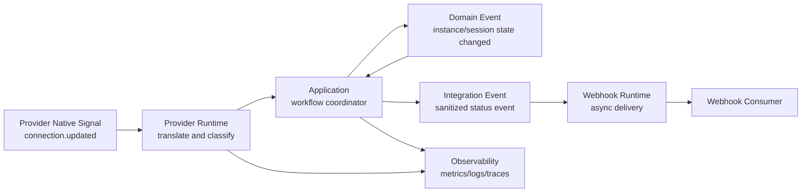
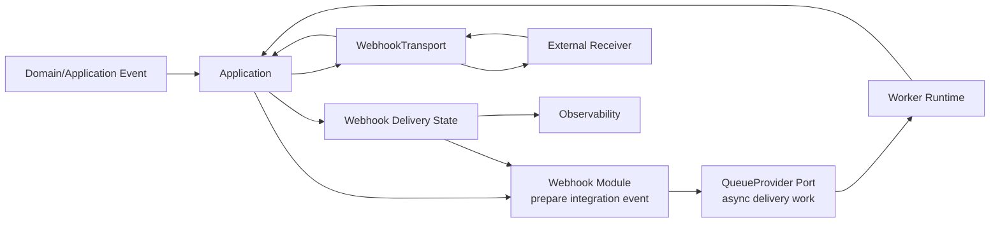

# OmniWA Event Propagation

## Purpose

This document defines runtime event propagation for OmniWA Phase 1.4.

It describes event categories, ownership, propagation paths, and constraints without selecting an event bus library, queue engine, webhook protocol, database schema, or source implementation.

## Event Propagation Principles

- Domain events are facts created by domain policy.
- Application controls when events are published, queued, persisted, ignored, or transformed.
- Integration events are owned by Webhook module.
- Provider-native events are infrastructure events until translated.
- Async events are durable work signals and must have lifecycle visibility.
- Events must not bypass guardrails, validation, application workflow sequencing, or redaction.

## Event Categories

| Category | Meaning | Owner | Runtime Handling |
| --- | --- | --- | --- |
| Provider Event | Provider-native or provider-derived signal. | Provider adapter before translation. | Translated to application/provider status event before domain consumption. |
| Domain Event | Business fact created by product module. | Instance, Session, Messaging, Media, Webhook, Guardrails. | Returned to Application for publication timing. |
| Application Event | Workflow fact or command-like internal signal. | Application. | May trigger in-process handlers or async jobs. |
| Async Event | Durable work signal. | Application/Worker. | Queued with lifecycle state and idempotency context. |
| Integration Event | Product event intended for external systems. | Webhook. | Delivered asynchronously through Webhook Runtime. |
| Observability Event | Sanitized signal for logs, metrics, traces, health, alerting. | Observability/Health. | Exported only after redaction/safe-field validation. |
| Audit Event | Evidence record for security-sensitive or operational actions. | Audit. | Recorded without Secret values. |

## Provider Event Propagation

Example: `connection.updated`.

Rules:

- Provider adapter must not publish Integration Event directly.
- Application decides whether translated provider signal updates Instance, Session, Health, or Messaging state.
- Webhook payload must be sanitized and must not include Secret data.

## Message Event Propagation

| Source Event | Domain Owner | Application Action | Integration Event Candidate | Observability |
| --- | --- | --- | --- | --- |
| message.intent.accepted | Messaging | Queue outbound work and update lifecycle. | message.accepted when approved. | Message accepted metric. |
| message.sent | Messaging | Update lifecycle and schedule webhook if configured. | message.sent. | Provider send latency. |
| message.delivered | Messaging | Update lifecycle and schedule webhook if configured. | message.delivered. | Delivery status metric. |
| message.read | Messaging | Update lifecycle and schedule webhook if configured. | message.read. | Read status metric. |
| message.failed | Messaging | Classify failure and expose terminal/action-required state. | message.failed with sanitized category. | Failure metric and alert candidate. |
| inbound.message.received | Messaging | Classify supported/unsupported type and create event. | message.received or message.unsupported. | Inbound event metric. |

## Instance And Session Event Propagation

| Source Event | Owner | Consumers | Sync / Async | Notes |
| --- | --- | --- | --- | --- |
| instance.created | Instance | Health, Audit, Webhook where approved | Sync local, async external | No Secret data. |
| instance.connected | Instance | Health, Webhook, Observability | Sync local, async external | Provider-ready state is translated. |
| instance.disconnected | Instance | Session, Health, Scheduler, Webhook | Sync local, async reconnect if recoverable | Must classify recoverable vs action-required where possible. |
| instance.logged_out | Instance/Session | Health, Audit, Webhook | Sync local, async external | Usually action-required. |
| session.pending | Session | Instance, Health | Sync | Pairing/restore in progress. |
| session.active | Session | Instance, Provider Runtime, Health | Sync | Session material remains Secret. |
| session.expired | Session | Instance, Health, Audit | Sync, async operator notification possible | Re-pairing may be required. |
| session.revoked | Session | Instance, Health, Audit | Sync, async external where safe | Never include Secret material. |

## Webhook Event Propagation

Rules:

- Webhook module owns Integration Event preparation.
- Webhook Runtime owns external delivery lifecycle.
- Webhook delivery outcomes do not mutate original business facts.
- Failed delivery moves through retry/failed/dead-letter state.

## Async Event Propagation

| Async Event | Publisher | Consumer | Lifecycle Required |
| --- | --- | --- | --- |
| outbound.message.send.requested | Application | Worker | Queued, Reserved, Running, Completed, Retrying, Dead. |
| media.process.requested | Application | Worker | Queued, Reserved, Running, Completed, Retrying, Dead. |
| webhook.delivery.requested | Webhook/Application | Worker | Pending, Delivering, Delivered, Retrying, Failed, Dead Letter. |
| reconnect.requested | Scheduler/Application | Worker | Queued, Running, Completed, Retrying, Dead or Action Required. |
| retention.cleanup.requested | Scheduler/Application | Worker | Queued, Running, Completed, Failed. |
| recovery.validation.requested | Application | Worker | Queued, Running, Completed, Failed, Action Required. |

## Event Naming Guidelines

Event names are conceptual and may be revised in later implementation planning. They should:

- Use product language, not provider-native names.
- Be past tense for facts, such as `message.sent`.
- Be command-like only for async work requests, such as `webhook.delivery.requested`.
- Avoid embedding transport, database, queue, or provider implementation details.
- Avoid exposing Secret or unredacted Confidential data.

## Event Propagation Constraints

- Domain must not publish directly to EventBus, Queue, Log, or Webhook.
- Application must control event publication timing.
- Provider must translate events before Application consumes them.
- Webhook must prepare external Integration Events and own external delivery state.
- Observability must receive sanitized events only.
- Audit events must not contain Secret plaintext.
- Async event payloads must be minimal and classified.
