# OmniWA Extension Points

## Purpose

This document defines architectural extension points for OmniWA Phase 1.3.

Extension points are abstractions that protect product policy from infrastructure and provider changes. They do not define source interfaces, method signatures, REST APIs, database schemas, queue engine behavior, or Baileys internals.

## Extension Point Principles

- Abstractions are product-oriented, not library-oriented.
- Default implementations are conceptual and may be chosen in later architecture phases.
- Future implementations require ADR or product decision when they change product behavior.
- Testing implementations are first-class to preserve Phase 1.1 testability requirements.
- Secret and Confidential data handling rules apply to every extension point.

## Extension Point Matrix

| Extension Point | Purpose | Default Implementation | Future Implementations | Testing Implementation |
| --- | --- | --- | --- | --- |
| MessagingProvider | Send/receive supported messages, provider status, provider error classification, connectivity signals. | Baileys-backed provider adapter. | WhatsApp Cloud API adapter, Telegram adapter, Messenger adapter, Instagram adapter after product approval. | MockProvider, contract provider simulator. |
| SessionStore | Store and retrieve OmniWA-owned session state through Secret-aware boundary. | MVP persistence adapter selected later. | Encrypted external secret store, managed session store, tenant-aware store after multi-tenant ADR. | In-memory Secret-aware fake. |
| MediaStore | Store diagnostic media or large artifacts only when explicitly enabled. | No default binary retention; local or durable adapter only if later approved. | Object storage, encrypted diagnostic artifact store. | Ephemeral fake media store. |
| QueueProvider | Schedule and track async work lifecycle. | Queue adapter selected later. | Redis-backed queue, database-backed jobs, managed queue service after ADR. | In-memory deterministic fake queue. |
| WebhookTransport | Deliver integration events to external receivers. | HTTP-like outbound transport selected later without endpoint design here. | Signed delivery transport, managed event destination, retry-aware relay. | Fake receiver transport with success/failure/timeout simulation. |
| EventBus | Dispatch in-process events inside the modular monolith. | Internal in-process event bus implementation selected later. | Instrumented bus, module-scoped bus, event recorder for diagnostics. | Synchronous fake event bus. |
| Clock | Provide deterministic time and scheduling references. | System clock adapter. | Monotonic clock wrapper, distributed clock policy after cluster ADR. | Fixed/frozen clock. |
| UUIDGenerator | Generate identifiers for workflows, jobs, events, and correlation-safe records. | Runtime UUID generator adapter. | ULID/time-sortable ID generator if approved later. | Deterministic ID generator. |
| ConfigurationProvider | Provide validated configuration concepts to application and adapters. | Environment/config-file loader selected later. | Managed configuration service, feature flag provider with guardrail restrictions. | Static validated config fixture. |
| SecretProvider | Resolve and protect Secret data. | Local encrypted/secret-source adapter selected later. | Cloud secret manager, HSM/KMS-backed provider, tenant-aware secret provider after ADR. | Redacting fake secret provider. |
| AuditSink | Persist audit records without exposing Secret values. | Audit persistence adapter selected later. | External audit archive, compliance evidence system after product approval. | Capturing fake audit sink. |
| ObservabilitySink | Emit sanitized logs, metrics, traces, and alerts. | Structured logging/telemetry adapter selected later. | OpenTelemetry-style exporter, managed monitoring platform, local diagnostic sink. | Capturing redaction-check sink. |
| HealthProbe | Collect dependency and product health signals. | Internal health adapter selected later. | External health check integrations, dependency-specific probes. | Deterministic health probe. |
| SerializationCodec | Serialize internal/external event payloads safely. | Structured serializer selected later. | Versioned event codec, encrypted payload codec where approved. | Strict test codec that rejects unsafe fields. |

## Extension Point Diagram

```mermaid
flowchart TB
  Application[Application Use Cases]

  subgraph Ports[Application Ports / Extension Points]
    MessagingProvider[MessagingProvider]
    SessionStore[SessionStore]
    MediaStore[MediaStore]
    QueueProvider[QueueProvider]
    WebhookTransport[WebhookTransport]
    EventBus[EventBus]
    Clock[Clock]
    UUIDGenerator[UUIDGenerator]
    ConfigurationProvider[ConfigurationProvider]
    SecretProvider[SecretProvider]
    AuditSink[AuditSink]
    ObservabilitySink[ObservabilitySink]
    HealthProbe[HealthProbe]
    SerializationCodec[SerializationCodec]
  end

  subgraph Adapters[Infrastructure Adapters]
    Baileys[Baileys-backed Provider]
    StoreAdapter[Persistence Adapter]
    QueueAdapter[Queue Adapter]
    WebhookAdapter[Webhook Transport Adapter]
    ConfigAdapter[Configuration Adapter]
    SecretAdapter[Secret Adapter]
    TelemetryAdapter[Telemetry Adapter]
    TestFakes[Test Fakes]
  end

  Application --> Ports
  Baileys --> MessagingProvider
  StoreAdapter --> SessionStore
  StoreAdapter --> MediaStore
  QueueAdapter --> QueueProvider
  WebhookAdapter --> WebhookTransport
  ConfigAdapter --> ConfigurationProvider
  SecretAdapter --> SecretProvider
  TelemetryAdapter --> ObservabilitySink
  TestFakes -. test scope .-> Ports
```

## Extension Ownership

| Extension Point | Contract Owner | Adapter Owner | Sensitive Data Classification |
| --- | --- | --- | --- |
| MessagingProvider | Application + Messaging/Instance/Session concepts | Provider module | Confidential and Secret may cross; provider payloads must be translated. |
| SessionStore | Application + Session module | Infrastructure | Secret. |
| MediaStore | Application + Media module | Infrastructure | Confidential; diagnostic capture may include sensitive content. |
| QueueProvider | Application + Worker module | Infrastructure | Internal/Confidential depending on job payload. |
| WebhookTransport | Application + Webhook module | Infrastructure | Confidential. |
| EventBus | Application | Infrastructure | Internal/Confidential depending on event content. |
| Clock | Application/Common | Infrastructure | Public/Internal. |
| UUIDGenerator | Application/Common | Infrastructure | Internal. |
| ConfigurationProvider | Configuration module | Infrastructure | Internal/Secret. |
| SecretProvider | Configuration/Auth/Session modules | Infrastructure | Secret. |
| AuditSink | Audit module | Infrastructure | Internal/Confidential; never Secret plaintext. |
| ObservabilitySink | Observability module | Infrastructure | Sanitized Internal only by default. |
| HealthProbe | Health module | Infrastructure | Internal. |
| SerializationCodec | Application/Webhook/Observability | Infrastructure or Shared if policy-neutral | Depends on payload; must enforce safe fields. |

## Extension Rules

- New provider implementations must satisfy MessagingProvider product contracts and must not leak native payloads into domain policy.
- SessionStore implementations must treat session material as Secret and must support recovery expectations.
- QueueProvider implementations must expose lifecycle states required by reliability targets.
- WebhookTransport implementations must support observable delivery attempts, failures, and timeout classification.
- EventBus implementations must not become the external webhook contract.
- ConfigurationProvider must fail fast on invalid required configuration.
- SecretProvider must never expose Secret values to logs.
- ObservabilitySink must reject or redact unsafe fields.
- Testing implementations must be deterministic and must not weaken production contracts.

## Future Provider Evolution

| Future Provider | Expected Change | Contract Impact |
| --- | --- | --- |
| WhatsApp Cloud API | New MessagingProvider adapter and possibly new product contract for official API differences. | Requires ADR and product decision if capabilities differ from MVP contract. |
| Telegram | New provider/channel adapter after product scope approval. | May require new channel identity concepts. |
| Messenger | New provider/channel adapter after product scope approval. | May require platform-specific status and policy mapping. |
| Instagram | New provider/channel adapter after product scope approval. | May require media and conversation model review. |

Provider evolution must not change core domain policy by accident. Any change in product behavior requires ADR and product decision.
