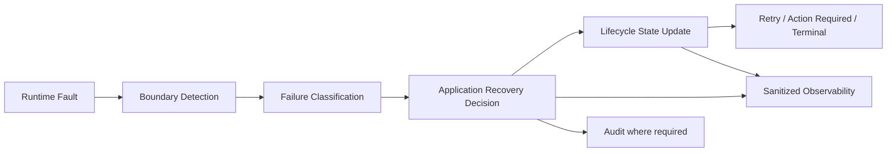

# OmniWA Runtime Failure Handling

## Purpose

This document defines runtime failure handling for OmniWA Phase 1.4.

It describes failure categories, detection, propagation, recovery, logging, and alerting at architecture level. It does not define REST status codes, OpenAPI, database schemas, Prisma, Docker, source code, BullMQ details, or Baileys internals.

## Failure Handling Principles

- Errors must be classified before crossing runtime/module boundaries.
- Provider failures must not leak raw provider errors into product policy.
- Unknown errors must be sanitized and observable.
- Recovery must preserve lifecycle visibility.
- Retrying must be bounded and idempotent.
- Secret data must never be logged.
- Confidential data must be redacted from normal logs.

## Failure Category Matrix

| Failure Category | Detection | Propagation | Recovery | Logging | Alerting |
| --- | --- | --- | --- | --- | --- |
| Provider Failure | Provider adapter receives disconnect, send error, status ambiguity, media failure, or provider exception. | Provider translates to External Provider Error, action-required, retryable, or terminal category. | Retry if recoverable; reconnect if connection issue; mark action-required for logout/revoked/policy/missing credentials. | Log safe provider category, instance ID where safe, correlation ID, no raw payload. | Alert on repeated provider failures, reconnect exhaustion, account action-required. |
| Validation Failure | Interface/Application/Validation detects malformed input or unsupported scope. | Classified as Validation Error before use-case execution or state mutation. | Caller/operator corrects input; no retry by Worker unless input was generated internally and fixable. | Log validation category and safe field names, not payload body. | Usually no alert unless volume spike indicates abuse or integration defect. |
| Business Failure | Domain/Application detects state conflict or product rule violation. | Classified as Business Error or Guardrail/Security category. | User/operator changes workflow or waits until state allows action; guardrail states remain visible. | Log rule category and safe context. | Alert only for abnormal rates or critical workflow blockage. |
| Webhook Failure | WebhookTransport times out, receiver fails, receiver is unreachable, or delivery outcome is invalid. | Webhook state moves Delivering -> Retrying, Failed, or Dead Letter. | Retry with bounded policy; dead-letter when exhausted; operator recovery/replay requires later explicit policy. | Log delivery metadata, retry count, terminal state, correlation ID, redacted payload reference. | Alert on retry backlog, high failure rate, dead-letter growth, oldest pending age. |
| Network Failure | Provider, webhook transport, queue, storage, or monitoring dependency reports network-level unavailability. | Classified as Infrastructure Error or External Provider Error depending on boundary. | Retry/backoff, mark dependency degraded, trigger health state change. | Log dependency category and safe operational metadata. | Alert when sustained, affects reliability targets, or blocks accepted work. |
| Configuration Failure | Configuration validation fails at startup or unsafe runtime setting is detected. | Classified as Configuration/Infrastructure/Security Error. | Fail fast before accepting work where possible; require operator correction. | Log missing/invalid key names only when safe; never log Secret values. | Alert immediately for production-blocking config. |
| Queue Failure | QueueProvider cannot accept, reserve, acknowledge, retry, or terminally classify work. | Classified as Infrastructure Error and Health degradation. | Stop accepting affected async work if lifecycle cannot be guaranteed; recover queue; mark work visible when possible. | Log queue operation category, work type, safe job ID. | Alert immediately if accepted work visibility is at risk. |
| Worker Failure | Worker crashes, loses reservation, fails work, loops retries, or becomes unhealthy. | Worker state and job state update through Application/Health. | Release or retry work; drain on shutdown; dead-letter if retry budget exhausted. | Log job metadata, lifecycle state, failure category. | Alert on restart loop, stuck work, oldest pending age, retry exhaustion. |
| Media Failure | Media validation, transfer, processing, cleanup, or diagnostic capture fails. | Media state moves Failed or action-required as appropriate. | Retry provider transfer if safe; clean temporary data; surface failure category. | Log media type/size class and safe references, no binary content. | Alert on high media failure rate or cleanup failure. |
| Session Failure | Session restore, authentication, expiry, revocation, or cleanup fails. | Session state moves Expired, Revoked, Empty, or action-required. | Re-pair when required; retry restore only when recoverable. | Log safe session state category, never session material. | Alert on repeated session restore failure or revoked sessions. |
| Unexpected Failure | Any unhandled runtime exception or unclassified behavior. | Classified as Unknown Error before leaving boundary. | Move work to retry or terminal state; mark health degraded if systemic. | Log sanitized stack/category and correlation ID, no payload/Secret. | Alert if it affects accepted work, provider connectivity, or high-volume workflows. |

## Failure Propagation Flow

## Recovery Patterns

| Pattern | Used For | Constraints |
| --- | --- | --- |
| Immediate reject | Validation failure, guardrail block, unsupported message type. | Must not create accepted work state. |
| Async retry | Webhook delivery, provider transient failure, media transient failure. | Must be bounded, observable, and idempotent. |
| Reconnect | Recoverable provider disconnect or session disruption. | One reconnect per instance at a time. |
| Action required | Logout, revoked session, missing credentials, policy/account issue, unsafe configuration. | Must be operator-visible. |
| Dead letter | Retry exhaustion or unsafe-to-retry work. | Terminal until explicit recovery/replay policy. |
| Degraded health | Dependency partial failure or high failure rate. | Must separate OmniWA-controlled and external dependency health. |
| Fail fast | Invalid required configuration or unsafe startup condition. | Prefer before accepting work. |

## Logging Rules

Runtime failure logs must include where safe:

- Failure category.
- Runtime process.
- Module owner.
- Correlation ID.
- Request ID if the failure started from an external request.
- Instance ID where safe.
- Job/event ID where safe.
- Retry count and terminal state where applicable.

Runtime failure logs must not include:

- Session material.
- API keys or webhook secrets.
- Raw provider payloads.
- Raw message bodies.
- Raw media payloads.
- Raw webhook payloads.
- Unredacted phone numbers or JIDs.

## Alerting Rules

Alert candidates:

- Accepted work cannot be made lifecycle-visible.
- Queue oldest pending age exceeds target.
- Webhook dead-letter rate increases.
- Provider reconnect exhaustion crosses threshold.
- Session revocation or logout spike.
- Worker restart loop.
- Unknown outcome rate exceeds expected baseline.
- Secret/redaction violation is detected.
- Configuration failure prevents startup or safe operation.

Non-alert by default:

- Single validation failure.
- Single business guardrail block.
- Single webhook retry that later succeeds.
- Expected operator-driven disconnect.

## Failure Ownership

| Failure Source | Classification Owner | Recovery Owner | Product State Owner |
| --- | --- | --- | --- |
| Provider runtime | Provider adapter maps, Application classifies product outcome | Application/Worker/Scheduler | Instance, Session, Messaging, Media |
| Interface runtime | Validation/Auth/Application | Application | Relevant product module |
| Worker runtime | Worker/Application | Worker/Application | Worker job owner and affected product module |
| Webhook transport | WebhookTransport/Application | Webhook/Worker | Webhook |
| Configuration | Configuration/Application | Operator/Application startup policy | Configuration/Health |
| Observability | Observability/Health | Operator/Application | Health |

## Non-Recoverable Conditions

The following are not auto-recoverable by default:

- Session Revoked.
- Logged Out state.
- Missing or invalid Secret material.
- WhatsApp account policy restriction.
- Provider behavior incompatible with pinned provider contract.
- Unsupported MVP message type as outbound capability.
- Unsafe configuration that disables required guardrails.

These conditions must be surfaced as action-required or terminal states rather than retried indefinitely.
