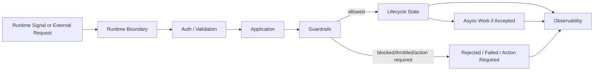

# OmniWA Runtime Lifecycle Guardrails

## Purpose

This document defines runtime guardrails, constraints, and invariants for OmniWA Phase 1.4.

It ensures lifecycle behavior remains compatible with Phase 0, Phase 1.1, Phase 1.2, and Phase 1.3 decisions.

This document does not design REST APIs, OpenAPI, database schemas, Prisma, Docker, source code, BullMQ details, or Baileys internals.

## Required Runtime Guardrails

| Guardrail ID | Guardrail | Reason | Applies To |
| --- | --- | --- | --- |
| LG-001 | API Runtime must not wait for provider final delivery before acknowledging accepted async work. | Preserves latency targets and avoids false delivery guarantees. | API Runtime, Application, Messaging. |
| LG-002 | Worker Runtime must not call Interface/API layer. | Preserves dependency direction and avoids presentation coupling. | Worker, Application. |
| LG-003 | Provider Runtime must not publish business or integration events directly. | Provider is adapter boundary, not product policy owner. | Provider, Application, Webhook. |
| LG-004 | Webhook delivery must always be asynchronous and observable. | Required for retry, failure visibility, and reliability targets. | Webhook, Worker, QueueProvider. |
| LG-005 | One Session may be attached to only one active Provider runtime at a time. | Prevents duplicate connection ownership and session corruption. | Session, Provider, Instance. |
| LG-006 | Message lifecycle must not skip required intermediate states for accepted async work. | Preserves operator visibility and 0 silent-drop target. | Messaging, Worker. |
| LG-007 | Provider-native payloads must be translated before product modules consume them. | Protects domain policy from provider churn. | Provider, Application, product modules. |
| LG-008 | Guardrails must run before outbound message work is accepted. | Enforces product posture against spam/broadcast/abuse-risk. | Guardrails, Messaging, Application. |
| LG-009 | Secret data must never cross Observability or Webhook boundary. | Required by data classification. | Session, Auth, Provider, Webhook, Observability. |
| LG-010 | Confidential payloads must be redacted from normal logs. | Required by data classification and logging strategy. | All modules. |
| LG-011 | Reconnect workflows must be serialized per instance. | Prevents conflicting provider/session outcomes. | Scheduler, Worker, Provider, Instance. |
| LG-012 | Dead-lettered work must be operator-visible. | Prevents hidden failure. | Worker, Webhook, Health, Observability. |
| LG-013 | Scheduler must not mutate domain state directly. | Scheduler emits signals; Application owns workflow. | Scheduler, Application. |
| LG-014 | Webhook delivery failure must not mutate original business fact. | Delivery lifecycle is separate from domain event truth. | Webhook, Messaging, Instance, Session. |
| LG-015 | Runtime shutdown must drain, release, or terminally classify in-flight work. | Prevents stuck invisible work. | Worker, Provider, Webhook. |
| LG-016 | Provider Runtime must not call Application orchestration directly. | Provider reports translated signals through Application-owned ports and never owns workflow sequencing. | Provider, Application. |

## Runtime Constraints

| Constraint ID | Constraint |
| --- | --- |
| RTC-001 | One instance has at most one active provider connection. |
| RTC-002 | One instance has at most one active session. |
| RTC-003 | One session cannot be Active and Revoked simultaneously. |
| RTC-004 | Two reconnect attempts for the same instance cannot run concurrently. |
| RTC-005 | Two workers cannot process the same outbound message work item concurrently. |
| RTC-006 | Webhook delivery attempts for the same event must preserve idempotency. |
| RTC-007 | Provider Runtime cannot bypass Application to update product state. |
| RTC-008 | Worker Runtime cannot bypass Application to mutate product modules. |
| RTC-009 | Queue-visible work cannot be accepted without a visible lifecycle path. |
| RTC-010 | Provider final delivery uncertainty must become known product state, failure category, unknown, or action-required state. |
| RTC-011 | Retention cleanup cannot remove data still needed by running accepted work. |
| RTC-012 | Configuration cannot silently disable required guardrails. |

## Runtime Invariant Matrix

| Invariant | Validation Approach Later |
| --- | --- |
| A Message has one current lifecycle state. | State transition tests and ownership checks. |
| An Instance has one active Session at most. | Instance/session lifecycle tests. |
| Provider Ready is required before outbound send execution unless future provider contract changes. | Worker/provider precondition tests. |
| Webhook Delivered is terminal. | Webhook state machine tests. |
| Worker Dead is terminal for that job lineage unless explicit recovery creates new work. | Worker lifecycle tests. |
| Domain modules do not publish directly to queues/webhooks/logs. | Architecture import/rule tests. |
| Secret values never appear in logs, metrics, traces, webhooks, or audit records. | Redaction and secret scanning tests. |
| Accepted async work reaches completed, terminal failed, dead-letter, pending, retrying, or action-required state. | Async workflow tests. |
| Provider errors are classified before crossing into product state. | Provider contract tests. |
| Provider Runtime does not call Application use-case orchestration directly. | Provider adapter dependency and port-contract tests. |
| Guardrail decisions are visible when work is blocked/throttled/action-required. | Guardrail workflow tests. |

## Guardrail Flow

## Startup Guardrails

At runtime startup:

- Required configuration must be validated before accepting work.
- Secret configuration must be loaded through SecretProvider boundaries.
- Provider runtimes must not start for destroyed or logged-out instances unless a pairing/recovery workflow is active.
- Worker runtimes must report healthy before reserving work.
- Observability must be available enough to record startup failures safely.

## Shutdown Guardrails

At runtime shutdown:

- API Runtime should stop accepting new work before Worker drain when a controlled shutdown is requested.
- Worker Runtime should finish, release, retry, or terminally classify in-flight work.
- Provider Runtime should close connection ownership cleanly and emit sanitized state.
- Webhook Runtime should not lose delivery outcome for an in-flight attempt.
- Shutdown must not log Secret or raw Confidential data.

## Recovery Guardrails

During recovery:

- Recovered work must be reconciled into visible lifecycle states.
- Failed webhooks may be retried only when idempotency expectations are satisfied.
- Session restoration must mark re-pairing as action-required when Secret/session state is invalid.
- Recovery actions that affect security-sensitive state require audit.
- Recovery must not claim WhatsApp delivery that OmniWA cannot verify.

## Guardrail Violations

Guardrail violations are architecture blockers:

- Direct Baileys usage outside Provider Runtime.
- Worker calling Interface.
- Provider sending webhook directly.
- Fire-and-forget webhook delivery.
- Accepted work without lifecycle state.
- Raw Secret in logs.
- Configuration disabling guardrails silently.
- Concurrent provider connection ownership for the same instance.

Violations require correction before implementation readiness. Any intentional exception requires ADR review.
