# OmniWA Module Architecture

## Purpose

This document defines OmniWA at C4 Level 2: Container/Module level.

It identifies the internal modules of the Modular Monolith, their ownership boundaries, runtime components, high-level interactions, and Phase 1.3 readiness.

This document does not design REST APIs, OpenAPI, database schemas, Prisma, Docker, queue implementation, Baileys internals, or source code.

## Architecture Baseline

Phase 1.3 follows the approved architecture baseline:

- Phase 0 is frozen.
- MVP is Single Tenant + Multi Instance.
- Primary persona is developer-led SaaS builder.
- Secondary persona is internal technical team.
- MVP supports text, image, video, document, and audio.
- OmniWA is an API platform with product-enforced guardrails.
- Architecture style is Modular Monolith with Clean Architecture and Hexagonal Ports and Adapters.
- Business logic must not depend directly on Baileys.
- Provider, queue, persistence, webhook transport, configuration, observability, and secret handling must stay behind ports/adapters.

## Module Model

OmniWA is organized as a modular monolith with product modules and platform modules.

Product modules own OmniWA business concepts. Platform modules provide cross-cutting capabilities and technical boundaries. Interface modules expose future entry surfaces but do not own business policy.

| Module | Type | Primary Ownership |
| --- | --- | --- |
| Interface | Interface | Public/client/admin entry surfaces and presentation mapping. |
| Application | Application | Use-case orchestration, transaction boundaries, ports, event publication timing. |
| Instance | Product Domain | Instance lifecycle, instance status, pairing/reconnect state at product level. |
| Session | Product Domain | Session state ownership, action-required session status, session retention rules. |
| Messaging | Product Domain | Supported MVP message workflow and delivery lifecycle visibility. |
| Media | Product Domain | Media metadata, supported media handling policy, no-default-retention enforcement. |
| Webhook | Product Domain | Integration event preparation, webhook delivery lifecycle, retry-visible state. |
| Guardrails | Product Domain | Spam, broadcast, rate-limit, and abuse-risk product policy. |
| Provider | Infrastructure Adapter Boundary | Messaging provider abstraction and provider adapter isolation. |
| Worker | Application Runtime | Async job execution, retry coordination, terminal state transitions. |
| Scheduler | Application Runtime | Time-based maintenance, retention, recovery checks, reconnect scheduling signals. |
| Auth | Platform | Authentication and authorization boundary concepts. |
| Configuration | Platform | Validated runtime configuration and feature-setting access. |
| Audit | Platform | Audit event recording for security-sensitive and operational actions. |
| Observability | Platform | Logging, metrics, tracing, health signals, redaction-safe telemetry. |
| Health | Platform | Product and dependency health state aggregation. |
| Validation | Platform | Boundary validation and product input normalization. |
| Common | Shared | Policy-neutral primitives and result/error helpers. |
| Testing | Test Support | Fake ports, contract fixtures, architecture rule validation support. |

## Module Classification

### Core Product Modules

Core product modules are:

- Instance.
- Session.
- Messaging.
- Media.
- Webhook.
- Guardrails.

These modules define the stable product language of OmniWA. They must not import provider, persistence, queue, transport, framework, or telemetry implementations.

### Application Coordination Modules

Application coordination modules are:

- Application.
- Worker.
- Scheduler.

These modules coordinate use cases and async work through ports. They own workflow sequencing but not product policy that belongs in domain modules.

### Boundary And Adapter Modules

Boundary and adapter modules are:

- Interface.
- Provider.

Interface maps external entry interactions into application use cases. Provider maps external messaging systems into OmniWA product concepts.

### Platform Modules

Platform modules are:

- Auth.
- Configuration.
- Audit.
- Observability.
- Health.
- Validation.
- Common.
- Testing.

These modules provide cross-cutting capabilities. They must remain policy-aware only where explicitly assigned; otherwise they provide policy-neutral support.

## Runtime Components

Runtime components are conceptual containers inside the modular monolith. They do not define deployment topology.

| Runtime Component | Purpose | Owned Modules |
| --- | --- | --- |
| API Process | Receives external client/admin/operator interactions and invokes application use cases. | Interface, Application, Auth, Validation, Observability, product modules through Application. |
| Worker Process | Executes async jobs and delivery/retry work. | Worker, Application, Webhook, Messaging, Media, Provider ports, Observability. |
| Scheduler | Produces scheduled application signals for retention, reconnect, health refresh, and recovery checks. | Scheduler, Application, Instance, Session, Webhook, Audit, Observability. |
| Background Jobs | Durable work units with lifecycle visibility. | Worker, Application, Webhook, Messaging, Media, Instance, Session. |
| Provider Adapter Runtime | Maintains provider-facing interactions and translates provider events. | Provider, Application ports, Observability, Session/Instance concepts through Application. |
| Observability Pipeline | Emits sanitized logs, metrics, traces, health states, and alerts. | Observability, Health, Audit. |

## Module Diagram

```mermaid
flowchart TB
  subgraph InterfaceLayer[Interface Layer]
    Interface[Interface Module]
  end

  subgraph ApplicationLayer[Application Layer]
    Application[Application Module]
    Worker[Worker Module]
    Scheduler[Scheduler Module]
  end

  subgraph DomainLayer[Domain Modules]
    Instance[Instance]
    Session[Session]
    Messaging[Messaging]
    Media[Media]
    Webhook[Webhook]
    Guardrails[Guardrails]
  end

  subgraph PlatformLayer[Platform Modules]
    Auth[Auth]
    Validation[Validation]
    Audit[Audit]
    Observability[Observability]
    Health[Health]
    Configuration[Configuration]
    Common[Common]
  end

  subgraph InfrastructureBoundary[Infrastructure Adapters]
    Provider[Provider Adapter Boundary]
    Stores[Storage Adapters]
    Queue[Queue Adapter]
    WebhookTransport[Webhook Transport Adapter]
    Secrets[Secret Adapter]
  end

  Interface --> Application
  Worker --> Application
  Scheduler --> Application
  Application --> Instance
  Application --> Session
  Application --> Messaging
  Application --> Media
  Application --> Webhook
  Application --> Guardrails
  Application --> Auth
  Application --> Validation
  Application --> Audit
  Application --> Observability
  Application --> Health
  Application --> Configuration
  Application --> Common
  Provider --> Application
  Stores --> Application
  Queue --> Application
  WebhookTransport --> Application
  Secrets --> Application
```

## Ownership Rules

The module model follows these ownership rules:

- A module owns a product concept when it defines that concept's lifecycle, invariants, events, and failure states.
- Modules may read other modules through application-level query/use-case contracts, not through direct data ownership.
- No module may bypass Application to mutate another module's state.
- Provider adapters translate provider behavior but do not own product policy.
- Worker and Scheduler execute application-owned work; they do not define domain rules.
- Common must not contain product business logic.

## Future Evolution Summary

| Future Change | Modules Likely To Change | Modules That Should Not Change Without ADR |
| --- | --- | --- |
| WhatsApp Cloud API | Provider, Messaging provider contracts, Media provider contracts, Provider tests | Core product policy unless product contract changes. |
| Telegram | Provider, Messaging, Media, product decisions for non-WhatsApp channel concepts | Existing WhatsApp-specific MVP scope without product decision. |
| Messenger | Provider, Messaging, Media, Webhook event mapping | Instance/session ownership rules unless channel model changes by ADR. |
| Instagram | Provider, Messaging, Media, Guardrails if product posture changes | Logging/security rules and Secret handling. |
| Multi Tenant | Auth, Configuration, Audit, Observability, all product data ownership docs | Single Tenant assumptions without product decision and ADR. |
| Cluster | Worker, Scheduler, QueueProvider, Health, Observability | Domain modules; clustering is runtime/infrastructure concern. |
| Horizontal Scaling | Worker, Provider runtime coordination, QueueProvider, Health | Product module invariants and provider abstraction contracts. |

## Phase 1.3 Checklist

| Item | Status |
| --- | --- |
| Module ownership defined | PASS |
| Module responsibilities defined | PASS |
| Dependency matrix completed | PASS |
| Package boundaries completed | PASS |
| Extension points completed | PASS |
| Cross-cutting concerns completed | PASS |
| Fitness functions defined | PASS |
| Future evolution assessed | PASS |

**Phase 1.3 is ready for review.**
