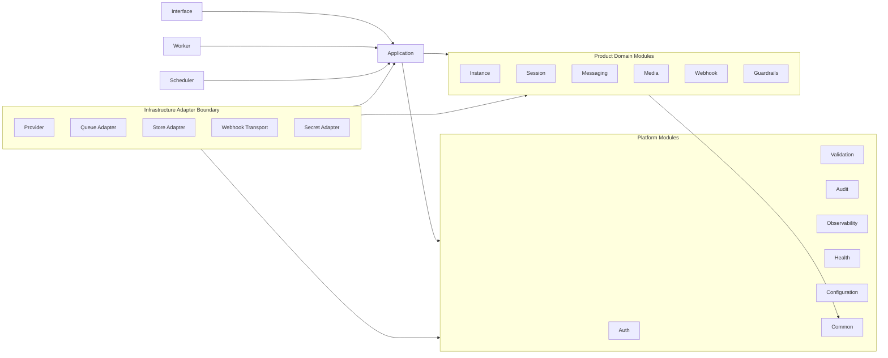

# OmniWA Module Dependency Matrix

## Purpose

This document defines allowed and forbidden module dependencies for OmniWA Phase 1.3.

It extends `docs/architecture/DEPENDENCY_RULES.md` without changing the approved dependency direction.

This document does not define implementation imports, package manager workspaces, framework modules, API routes, database schemas, or source code.

## Dependency Principles

Dependencies must follow:

```text
Interface -> Application -> Domain
Infrastructure -> Application ports and Domain types
Shared -> no OmniWA package
```

The module matrix interprets that rule at module level:

- Interface depends on Application contracts, Auth/Validation boundary concepts, and Observability context.
- Application coordinates product modules and ports.
- Product modules depend only on Common and approved product concepts, not infrastructure.
- Infrastructure adapters depend inward on application ports and domain/product concepts.
- Worker and Scheduler enter through Application use cases.
- Cross-cutting modules are consumed through ports or stable primitives, not by hidden global calls.

## Dependency Matrix

| Module | Allowed Dependencies | Forbidden Dependencies | Notes |
| --- | --- | --- | --- |
| Interface | Application, Auth, Validation, Observability, Common | Provider, storage adapters, queue adapters, WebhookTransport, Baileys, domain mutation bypass | Interface is a delivery mechanism and must not own product behavior. |
| Application | Product modules, platform ports, Common, domain events | Concrete Provider, concrete storage, concrete queue, concrete telemetry sink, Baileys, REST/framework types | Application owns orchestration and ports, not adapter implementation. |
| Instance | Common, approved domain concepts, domain events | Provider adapter, queue adapter, storage adapter, Interface, WebhookTransport, Baileys | Instance owns lifecycle policy, not technical execution. |
| Session | Common, Instance identity concepts, domain events | Provider-native session types, Secret store implementation, Interface, Messaging provider internals | Session material is Secret; provider-native format stays outside domain. |
| Messaging | Common, Instance/Session concepts by application contract, Media policy, Guardrails result, domain events | Session storage, Webhook delivery transport, Provider adapter, queue engine, broadcast/campaign modules | Messaging owns message lifecycle, not session storage or delivery transport. |
| Media | Common, Messaging concepts by application contract, domain events | Object storage implementation, Provider media internals, queue engine, Interface | Media owns product-level media policy and metadata, not storage technology. |
| Webhook | Common, integration event concepts, Observability context, domain events through Application | Direct product mutation, direct Provider, raw provider payloads, external CRM state | Webhook owns integration event preparation and delivery lifecycle. |
| Guardrails | Common, Messaging intent concepts, Instance state summary, domain events | Provider adapter, queue engine, external compliance services by default, raw logs | Guardrails owns product-enforced abuse/rate/broadcast policy. |
| Provider | Application provider ports, product DTO/concepts required by ports, Observability port, Configuration/Secret ports | Domain policy mutation, Interface, Webhook external event contracts, Guardrails bypass | Provider translates external systems into OmniWA concepts. |
| Worker | Application use cases, QueueProvider port, Observability, Common | Interface, direct Provider adapter calls, direct domain mutation, queue engine APIs in business logic | Worker executes application-owned async work. |
| Scheduler | Application use cases, Clock port, Observability, Common | Direct domain mutation, concrete scheduler engine, Interface, Provider adapter direct calls | Scheduler emits scheduled signals only. |
| Auth | Common, Configuration/Secret ports, Audit contract, Observability | Product policy decisions, Provider, queue/storage concrete implementations | Auth provides access decisions, not workflow ownership. |
| Configuration | Common, SecretProvider port, Observability | Domain policy mutation, product guardrail bypass, raw environment access from Domain/Application | Configuration exposes validated concepts. |
| Audit | Common, Application audit port, Observability | General logging replacement, Secret values, direct Interface behavior | Audit is security/operation evidence, not debug logging. |
| Observability | Common, redaction rules, Configuration concepts | Product business rules, Secret values, raw provider/webhook/message payloads | Observability emits sanitized telemetry only. |
| Health | Application health ports, Observability, product health summaries | Provider implementation details, storage/queue engine APIs in domain, Interface mapping | Health aggregates safe health signals. |
| Validation | Common, product input shape concepts | Domain lifecycle mutation, Guardrail decision ownership, Provider adapter | Validation rejects malformed input; domain enforces invariants. |
| Common | None | Any OmniWA package, provider types, persistence types, transport types | Common is policy-neutral and dependency-light. |
| Testing | Any module in test scope through test-only boundaries | Production imports from Testing | Testing support must not enter production packages. |

## Forbidden Cross-Module Shortcuts

The following shortcuts are forbidden:

- Interface calling Provider, storage, queue, or WebhookTransport directly.
- Worker calling Provider adapter directly instead of Application use cases.
- Scheduler mutating product state directly.
- Messaging writing Session state.
- Session applying message business rules.
- Webhook sending messages.
- Provider deciding guardrail outcomes.
- Observability receiving raw Secret or unredacted Confidential payloads.
- Common becoming a product utility bucket.

## Dependency Diagram



## Validation Expectations

Phase 1 implementation planning must define automated checks for:

- Package imports following the matrix.
- No direct Baileys imports outside Provider adapter boundaries.
- No production imports from Testing.
- No direct infrastructure imports from Interface/Application/Domain except approved ports.
- No product policy inside Common.
