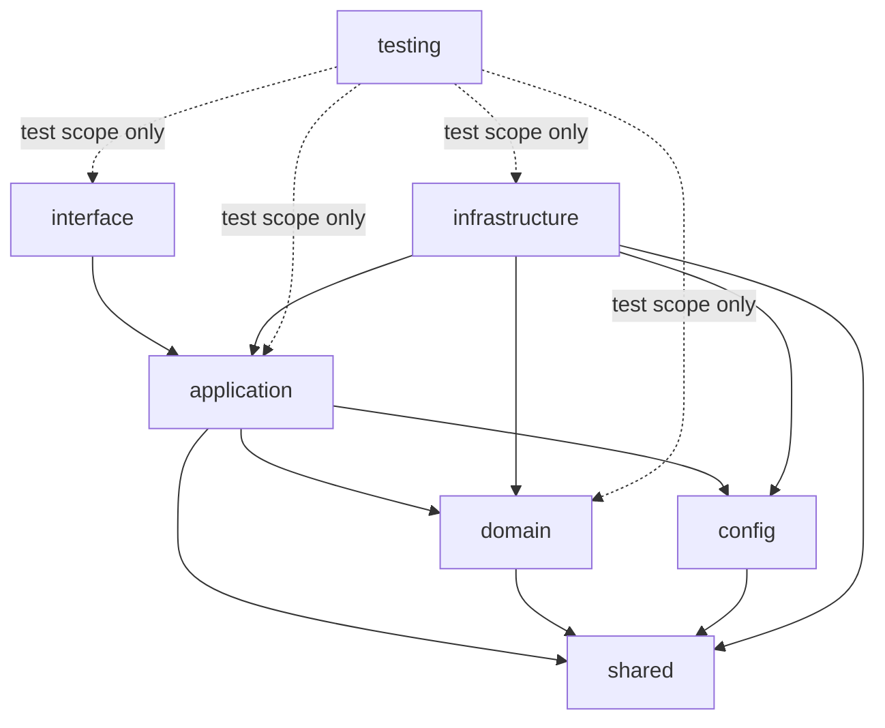

# OmniWA Package Boundaries

## Purpose

This document maps OmniWA modules to conceptual package boundaries.

It refines ADR-011 Package Boundary and `DEPENDENCY_RULES.md` for Phase 1.3. It does not create source folders, package manager workspaces, code, or framework modules.

## Package Vocabulary

| Package Boundary | Purpose |
| --- | --- |
| `interface` | Future external entry surfaces and presentation mapping. |
| `application` | Use cases, orchestration, ports, transaction boundaries, event publication timing. |
| `domain` | Product policy, invariants, domain events, domain errors, owned product concepts. |
| `infrastructure` | Technical adapter implementations for providers, stores, queues, transports, logs, telemetry, secrets, configuration sources. |
| `shared` | Policy-neutral primitives with no OmniWA package dependencies. |
| `config` | Validated configuration concepts and configuration adapter boundary. |
| `testing` | Test-only fakes, fixtures, and architecture validation helpers. |

## Package Direction

Allowed direction:

```text
interface -> application -> domain -> shared
infrastructure -> application
infrastructure -> domain
application -> shared
config -> shared
testing -> any module in test scope only
```

Forbidden direction:

```text
domain -> application
domain -> infrastructure
domain -> interface
application -> infrastructure implementation
interface -> infrastructure implementation for business behavior
infrastructure -> interface
shared -> any OmniWA package
production -> testing
```

## Module Placement

| Module | Allowed Packages | Forbidden Packages | Notes |
| --- | --- | --- | --- |
| Interface | `interface`, may use `application`, `shared` | `domain` direct mutation, `infrastructure`, `testing` in production | Interface should only call application use cases. |
| Application | `application`, may use `domain`, `shared`, approved `config` concepts | `interface`, concrete `infrastructure`, `testing` in production | Ports live here when they serve use cases. |
| Instance | `domain`, may use `shared` | `interface`, `infrastructure`, `config`, `testing` in production | Owns product lifecycle policy. |
| Session | `domain`, may use `shared` | `infrastructure`, provider-native types, `interface`, `testing` in production | Secret session handling rules are domain policy; storage mechanics are not. |
| Messaging | `domain`, may use `shared` | `infrastructure`, provider-native types, `interface`, `testing` in production | Message lifecycle policy stays domain-owned. |
| Media | `domain`, may use `shared` | object storage implementation, provider media implementation, `interface` | Media product policy is separate from storage. |
| Webhook | `domain` for product policy, `application` for delivery orchestration, `infrastructure` for transport adapter | direct provider adapter, direct external CRM code | Split event preparation policy from transport implementation. |
| Guardrails | `domain`, may use `shared` | `infrastructure`, `config` as bypass path, provider adapter | Guardrails are product policy and cannot be purely configuration-driven. |
| Provider | `infrastructure`, implements `application` ports and maps to `domain` concepts | `interface`, product policy ownership | Baileys and future provider libraries are isolated here. |
| Worker | `application` runtime boundary, queue adapter in `infrastructure` | `interface`, direct domain mutation, queue engine in domain/application policy | Worker calls application use cases. |
| Scheduler | `application` runtime boundary, scheduler adapter in `infrastructure` if needed | `interface`, direct domain mutation | Scheduler emits signals, not policy. |
| Auth | `application` access contracts, `domain` policy where authorization is product policy, `infrastructure` identity adapters | provider adapter, queue/storage concrete coupling in domain | Auth spans boundary concepts and adapter implementation. |
| Configuration | `config`, `application` configuration ports, `infrastructure` config loaders | raw environment access from domain/application | Configuration is validated before application use. |
| Audit | `application` audit port, `domain` audit semantics, `infrastructure` audit store adapter | general logging replacement, Secret data exposure | Audit has evidence semantics. |
| Observability | `application` ports, `infrastructure` sinks, `shared` primitives | domain business rule ownership, raw payload capture by default | Redaction rules are mandatory at boundary. |
| Health | `application` health contracts, `domain` health concepts, `infrastructure` dependency probes | provider implementation leakage into domain | Health aggregates signals without owning reconnect policy. |
| Validation | `interface` boundary validation, `application` validation contracts, `shared` primitives | domain invariant replacement, provider adapter | Validation checks shape, not business ownership. |
| Common | `shared` only | all OmniWA package imports | Keep small and policy-neutral. |
| Testing | `testing` only | production imports | Test support cannot become production dependency. |

## Package Diagram



## Import Rules

### Interface Package

Allowed:

- Import application use-case contracts.
- Import auth and validation boundary contracts.
- Import shared request/correlation primitives.

Forbidden:

- Import provider adapters.
- Import queue/storage/webhook transport implementations.
- Mutate domain state directly.
- Publish integration events directly.

### Application Package

Allowed:

- Import domain concepts and domain services.
- Define and consume ports.
- Coordinate transaction and event timing.

Forbidden:

- Import Baileys.
- Import concrete store/queue/provider/logging libraries.
- Use transport-specific request/response types as domain inputs.

### Domain Package

Allowed:

- Import shared primitives.
- Define product concepts, rules, errors, and domain events.

Forbidden:

- Import application, infrastructure, interface, framework, provider, queue, persistence, or telemetry concerns.

### Infrastructure Package

Allowed:

- Implement application ports.
- Translate external data into product concepts.
- Depend on external libraries.

Forbidden:

- Own product policy.
- Call interface package.
- Bypass application guardrails.

### Shared Package

Allowed:

- Policy-neutral primitives.
- Generic identifiers.
- Generic result/error wrappers.

Forbidden:

- Product rules.
- Provider/persistence/transport-specific types.
- Hidden global state.

### Config Package

Allowed:

- Validated configuration concepts.
- Configuration error categories.
- Secret-aware configuration descriptors.

Forbidden:

- Business policy changes hidden in config.
- Raw Secret exposure to logs.

### Testing Package

Allowed:

- Fake implementations of ports.
- Contract fixtures.
- Architecture rule helpers.

Forbidden:

- Production import dependency.
- Production behavior decisions.

## Boundary Exceptions

Any exception requires an ADR that states:

- Which package rule is being violated.
- Why the exception is necessary.
- How the exception is contained.
- How it will be tested.
- When it should be revisited.
