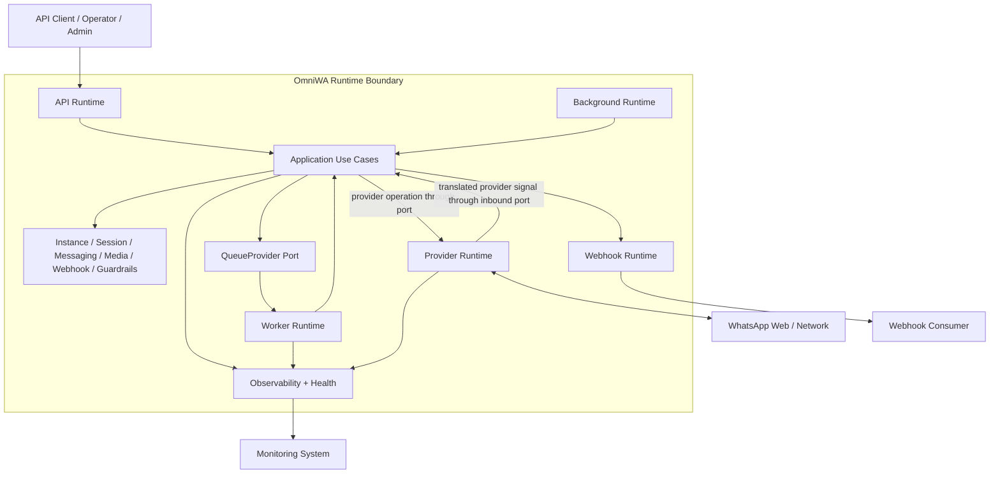

# OmniWA Runtime Architecture

## Purpose

This document defines OmniWA runtime architecture for Phase 1.4.

It describes runtime processes, runtime interactions, runtime constraints, runtime invariants, runtime metrics, and future runtime evolution.

This document does not design REST APIs, OpenAPI, database schemas, Prisma, Docker, source code, Baileys internals, or BullMQ implementation details.

## Architecture Baseline

Runtime architecture must follow:

- Phase 0 frozen product decisions.
- Phase 1.1 architecture principles and accepted ADRs.
- Phase 1.2 system context and trust boundaries.
- Phase 1.3 module ownership, dependency matrix, package boundaries, extension points, cross-cutting concerns, and fitness functions.

The most important inherited constraints are:

- MVP is Single Tenant + Multi Instance.
- MVP supports text, image, video, document, and audio.
- OmniWA is an API platform with product-enforced guardrails.
- Runtime behavior must preserve Modular Monolith, Clean Architecture, and Hexagonal Ports and Adapters.
- Interface/API runtime must enter product behavior through Application use cases.
- Worker, Scheduler, and Provider runtime must also enter product behavior through Application use cases or ports.
- Business logic must not depend directly on Baileys.
- Accepted async work must be observable and must not silently disappear.
- Webhook delivery must be async and retry-visible.
- Secret data must never be logged.
- Confidential data must be redacted from normal logs.

## Runtime Process Model

Runtime processes are conceptual execution roles. They do not define deployment topology or process count.

| Runtime Process | Purpose | Primary Modules | Entry/Exit Boundary |
| --- | --- | --- | --- |
| API Runtime | Receives external client/admin/operator interactions, authenticates, validates, and invokes Application use cases. | Interface, Auth, Validation, Application, Observability | Public/API/Admin boundary in; product result or accepted-work state out. |
| Worker Runtime | Executes queued application-owned work such as message sends, webhook deliveries, media work, retries, and recovery tasks. | Worker, Application, Messaging, Media, Webhook, Instance, Session, Observability | Queue boundary in; state transition and telemetry out. |
| Background Runtime | Runs scheduled and maintenance workflows such as retention checks, health refresh, reconnect scans, and cleanup signals. | Scheduler, Application, Health, Audit, Observability | Schedule signal in; application use case out. |
| Webhook Runtime | Prepares, schedules, delivers, retries, and classifies outbound integration events. | Webhook, Worker, Application, WebhookTransport, Observability | Internal event in; external webhook receiver out. |
| Provider Runtime | Maintains provider-facing connection activity and translates provider events into OmniWA concepts. | Provider, Application ports, Instance, Session, Messaging, Health, Observability | Provider boundary in/out. |
| Monitoring Runtime | Receives sanitized logs, metrics, traces, health signals, and alerts. | Observability, Health, Audit | Observability boundary out. |

## Runtime Component Diagram

## Runtime Interaction Rules

| Rule | Description |
| --- | --- |
| API returns product state, not provider certainty | API Runtime may return accepted/rejected/queued state, but it must not imply upstream WhatsApp completion unless that state is known later through provider status. |
| Provider is not the product boundary | Provider Runtime translates provider events and errors; Application and product modules own product state transitions. |
| Worker owns execution, not policy | Worker Runtime executes application-owned work and updates lifecycle through Application use cases. |
| Webhook is outbound-only integration runtime | Webhook Runtime owns external delivery lifecycle but does not create original business facts. |
| Scheduler emits signals only | Background Runtime does not mutate domain state directly. |
| Observability is sanitized | Monitoring Runtime receives safe telemetry only. |

## Runtime Constraints

| Constraint ID | Constraint | Reason |
| --- | --- | --- |
| RC-001 | One instance may have at most one active provider connection at a time. | Prevents duplicate sends and conflicting session state. |
| RC-002 | One instance may have at most one active session at a time. | Preserves Single Tenant + Multi Instance clarity and session ownership. |
| RC-003 | Two reconnect workflows must not run concurrently for the same instance. | Avoids provider thrash and ambiguous recovery results. |
| RC-004 | Two workers must not process the same outbound message work item concurrently. | Prevents duplicate provider send attempts. |
| RC-005 | Webhook delivery must be idempotent from OmniWA's perspective. | Retries must not create ambiguous delivery state. |
| RC-006 | Provider operations must go through MessagingProvider-style ports. | Maintains provider abstraction and Baileys isolation. |
| RC-007 | API Runtime must not wait for final provider delivery before acknowledging accepted async work. | Preserves latency targets and honest delivery semantics. |
| RC-008 | Message and media bodies are not retained by default after processing. | Preserves retention and privacy decisions. |
| RC-009 | Every accepted work item must have visible lifecycle state. | Satisfies 0 known silent drops target. |
| RC-010 | Webhook delivery must be queued or otherwise async-visible before external delivery is attempted. | Preserves retry and failure visibility. |

## Runtime Invariants

| Invariant ID | Invariant |
| --- | --- |
| RI-001 | A Message has exactly one current lifecycle state. |
| RI-002 | A Message state transition must be monotonic except documented retry/recovery transitions. |
| RI-003 | An Instance has at most one active Session. |
| RI-004 | A Session cannot be both Active and Revoked. |
| RI-005 | Worker Runtime must not send a message when provider state is not Connected or explicitly send-capable. |
| RI-006 | Provider Runtime must not publish external integration events directly. |
| RI-007 | Domain modules create domain events, but Application controls publication timing. |
| RI-008 | Webhook Runtime must not deliver Secret data. |
| RI-009 | Queue-visible work must end in Completed, Failed, Dead Letter, Cancelled, or Action Required if it cannot remain pending. |
| RI-010 | Reconnect failure must classify the instance/session as Disconnected, Logged Out, Expired, Revoked, or Action Required rather than Unknown where classification is possible. |
| RI-011 | A Webhook delivery attempt cannot move from Delivered back to Retrying. |
| RI-012 | Provider-native payloads must be translated before product modules consume them. |
| RI-013 | Provider Runtime must not call Application use-case orchestration directly; it reports translated provider signals through Application-owned provider event ports. |

## Runtime Metrics

| Metric | Definition | Runtime Owner | Notes |
| --- | --- | --- | --- |
| Connection duration | Time an instance remains in Connected state before disconnect or shutdown. | Provider Runtime, Health | Split by disconnect category. |
| Reconnect count | Number of reconnect attempts grouped by result and reason. | Background Runtime, Provider Runtime | Supports reconnect success target. |
| Queue latency | Time from accepted work to worker reservation. | Worker Runtime | Track by work type. |
| Processing latency | Time from worker start to completed or terminal state. | Worker Runtime | Track message, media, webhook, reconnect, recovery. |
| Webhook latency | Time from integration event readiness to delivery outcome. | Webhook Runtime | Track first attempt and eventual success. |
| Retry count | Number of retries per work item and workflow type. | Worker Runtime, Webhook Runtime | Alert on retry exhaustion. |
| Failure rate | Failed or terminal work as percentage of processed work. | Observability, Health | Group by failure category. |
| Worker utilization | Share of worker runtime spent running accepted work. | Worker Runtime | Architecture metric only; no tool selection. |
| Oldest pending work age | Age of oldest pending queue-visible item. | Worker Runtime, Health | Must support queue success target. |
| Provider event lag | Time from provider event receipt to product state classification. | Provider Runtime, Application | Useful for backpressure detection. |
| Dead-letter rate | Percentage of work ending in Dead Letter. | Worker Runtime, Webhook Runtime | Must be operator-visible. |
| Unknown outcome rate | Percentage of workflows ending in Unknown state. | Observability, Health | Should be minimized and investigated. |

## Future Runtime Evolution

| Future Evolution | Runtime Impact | Modules Affected | Modules Expected To Remain Stable |
| --- | --- | --- | --- |
| Multi-node | Requires distributed coordination for locks, idempotency, provider ownership, and queue reservation. | Worker, Provider, Scheduler, Health, Observability, QueueProvider | Messaging, Media, Webhook product policy should remain stable. |
| Horizontal Scaling | Requires clear work partitioning and ownership of provider connections per instance. | Worker, Provider, QueueProvider, Health | Domain invariants and provider abstraction should remain stable. |
| Cluster Worker | Requires stronger job leasing, heartbeat, and retry ownership semantics. | Worker, QueueProvider, Observability | Interface and product modules should not change. |
| Multiple Queue | Requires routing rules by work type and unified lifecycle visibility. | Worker, QueueProvider, Webhook, Messaging, Media | Domain state machines should remain stable. |
| Multi Region | Requires new product and architecture decisions for consistency, session ownership, and recovery. | Provider, Session, QueueProvider, Health, Backup/Recovery concerns | Existing MVP single-region assumptions cannot be silently reused. |
| Cloud API Provider | Adds provider adapter and may change provider status/media semantics. | Provider, Messaging provider contract, Media provider contract, Failure Handling | Core module dependency rules remain unchanged. |

## Phase 1.4 Checklist

| Item | Status |
| --- | --- |
| Runtime lifecycle defined | PASS |
| Runtime states defined | PASS |
| Sequence diagrams completed | PASS |
| Failure handling defined | PASS |
| Event propagation defined | PASS |
| Async processing defined | PASS |
| Runtime constraints defined | PASS |
| Runtime invariants defined | PASS |

**Phase 1.4 is ready for review.**
