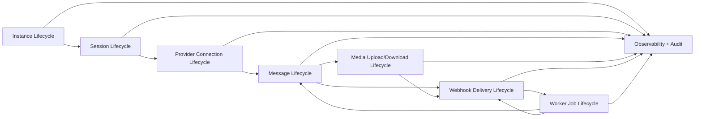

# OmniWA Runtime Lifecycle

## Purpose

This document defines runtime lifecycle behavior for key OmniWA product and runtime concepts.

It does not design database schemas, REST APIs, queue engine implementation, Docker, source code, Baileys internals, or BullMQ behavior.

## Lifecycle Principles

- Lifecycle state is product-visible where it affects operators, reliability, or integration behavior.
- Lifecycle state must separate OmniWA-controlled state from upstream WhatsApp, device, account, provider, network, and downstream receiver state.
- State changes that affect product behavior flow through Application use cases.
- Provider-native signals are translated before they update product lifecycle state.
- Accepted async work must have observable lifecycle state and terminal classification.
- Secret and Confidential data must not be exposed through lifecycle logs.

## Runtime Lifecycle Overview

## Instance Lifecycle

| State | Meaning | Entered By | Exited By |
| --- | --- | --- | --- |
| Created | Product instance exists but no active provider connection is established. | Instance creation workflow. | Connect workflow or destroy workflow. |
| Connecting | OmniWA is attempting provider connection or session restoration. | Connect/reconnect workflow. | QR Pending, Connected, Disconnected, Logged Out, Destroyed. |
| QR Pending | Provider requires user pairing action. | Provider QR signal translated by Application. | QR consumed, timeout, logout, destroy. |
| Connected | Instance has a usable provider connection for supported workflows. | Provider connected/authenticated signal. | Disconnection, logout, destroy. |
| Disconnected | Instance is not connected but may be recoverable. | Provider disconnect signal or failed health check. | Reconnect workflow, Logged Out, Destroyed. |
| Logged Out | Session/account is no longer authenticated or linked. | Provider logout/revocation signal. | New pairing workflow or destroy. |
| Destroyed | Instance lifecycle is ended. | Destroy workflow. | Terminal. |

Lifecycle rules:

- An Instance can have at most one active Session.
- An Instance can have at most one active provider connection.
- Destroyed is terminal for the product instance identity.
- Disconnected does not imply Logged Out.
- Logged Out requires operator action before messaging resumes.
- Instance health must not hide provider/account policy restrictions.

## Session Lifecycle

| State | Meaning | Entered By | Exited By |
| --- | --- | --- | --- |
| Empty | No usable session material exists for the instance. | New instance, destroyed session, logout cleanup. | Pairing/session capture. |
| Pending | Session establishment is in progress. | QR pairing or provider connection attempt. | Active, Expired, Revoked, Empty. |
| Active | Session material exists and is usable by provider runtime. | Successful authentication/session restore. | Expired, Revoked, Empty. |
| Expired | Session is no longer valid or cannot be restored automatically. | Provider/session restore failure classification. | New pairing or cleanup. |
| Revoked | Session has been invalidated by logout, device unlink, account condition, or policy signal. | Provider revocation/logout signal. | New pairing or cleanup. |

Lifecycle rules:

- Session material is Secret data.
- A Session cannot be both Active and Revoked.
- Session state changes must be auditable when security-sensitive.
- Session cleanup follows approved retention and backup rules.

## Provider Connection Lifecycle

| State | Meaning | Entered By | Exited By |
| --- | --- | --- | --- |
| Idle | No active provider connection attempt is running. | Runtime startup or disconnect completion. | Connecting. |
| Connecting | Provider runtime is attempting to connect or restore. | Application connect/reconnect request. | QR Required, Authenticated, Failed, Closed. |
| QR Required | Provider requires pairing signal. | Provider QR event translated by adapter. | Authenticated, Timeout, Closed. |
| Authenticated | Provider authentication/session is accepted. | Provider success signal. | Ready, Failed, Closed. |
| Ready | Provider is send/receive capable for supported workflows. | Provider ready signal. | Degraded, Disconnected, Closed. |
| Degraded | Provider is connected but not fully healthy. | Provider health signal or repeated recoverable failures. | Ready, Disconnected, Closed. |
| Disconnected | Provider connection has dropped. | Provider disconnect signal. | Connecting, Closed. |
| Failed | Connection attempt failed and needs retry or action. | Provider failure classification. | Connecting, Closed. |
| Closed | Provider runtime for this connection has ended. | Shutdown, destroy, replacement. | Terminal for that connection runtime. |

Lifecycle rules:

- Provider Runtime may emit infrastructure events to Application, but not business or integration events directly.
- Provider-native errors are mapped to product failure categories.
- Provider Ready is required before Worker sends outbound message work unless a future provider contract explicitly supports offline send semantics.

## Worker Lifecycle

| State | Meaning | Entered By | Exited By |
| --- | --- | --- | --- |
| Starting | Worker runtime is initializing dependencies and health context. | Process/runtime start. | Idle or Unhealthy. |
| Idle | Worker can reserve work but has none currently running. | Startup or completed work. | Reserving, Draining, Unhealthy. |
| Reserving | Worker is claiming queue-visible work. | Queue polling or signal. | Running, Idle, Unhealthy. |
| Running | Worker is executing application-owned work. | Successful reservation. | Completed, Retrying, Failed, Dead, Idle. |
| Draining | Worker stops accepting new work and finishes or releases current work. | Controlled shutdown. | Stopped. |
| Unhealthy | Worker cannot safely process work. | Dependency/configuration/runtime failure. | Idle, Draining, Stopped. |
| Stopped | Worker is no longer processing work. | Shutdown complete. | Terminal until restarted. |

Lifecycle rules:

- Worker must not call Interface.
- Worker must not call Provider adapter directly for product behavior.
- Worker must execute through Application use cases.
- Worker must not hide failed or abandoned work.

## Webhook Delivery Lifecycle

| State | Meaning | Entered By | Exited By |
| --- | --- | --- | --- |
| Pending | Integration event is prepared and waiting for delivery work. | Webhook module schedules delivery. | Delivering, Cancelled. |
| Delivering | A delivery attempt is in progress. | Worker executes delivery job. | Delivered, Retrying, Failed, Dead Letter. |
| Delivered | Receiver acknowledged delivery according to future transport rules. | Delivery outcome success. | Terminal. |
| Retrying | Delivery failed but has retry budget. | Timeout, network failure, receiver failure. | Pending or Delivering. |
| Failed | Delivery is terminally failed but not routed to dead letter. | Non-retryable failure or policy failure. | Terminal or operator recovery path. |
| Dead Letter | Retry budget exhausted or delivery cannot proceed safely. | Retry exhaustion or invalid receiver state. | Terminal until operator recovery. |
| Cancelled | Delivery should not proceed due to lifecycle cancellation. | Instance/message/event cancellation policy. | Terminal. |

Lifecycle rules:

- Webhook delivery must be async.
- Webhook delivery must be idempotent from OmniWA's perspective.
- Webhook payloads are Confidential and must be redacted from normal logs.

## Message Lifecycle

| State | Meaning | Entered By | Exited By |
| --- | --- | --- | --- |
| Created | Product message intent or inbound provider message has been created for classification. | Interface or Provider event translation. | Queued, Cancelled, Failed. |
| Queued | Message work is accepted for async processing. | Application schedules work. | Processing, Cancelled, Failed. |
| Processing | Worker/Application is attempting provider operation or classification. | Worker reservation or inbound event handling. | Sent, Delivered, Read, Failed, Cancelled. |
| Sent | Provider accepted outbound send or equivalent send-state is known. | Provider status translation. | Delivered, Read, Failed. |
| Delivered | Provider/WhatsApp status indicates delivery where available. | Provider status translation. | Read, Failed only if correction is required and documented. |
| Read | Provider/WhatsApp status indicates read where available. | Provider status translation. | Terminal for read state. |
| Failed | Message cannot proceed or provider/business failure is terminal. | Validation, business, provider, queue, or unexpected failure. | Terminal or operator recovery if explicitly supported. |
| Cancelled | Message work is intentionally stopped before completion. | Operator/application cancellation policy. | Terminal. |

Lifecycle rules:

- Message lifecycle must not skip required intermediate states for accepted async work.
- Product state must distinguish accepted/queued from sent/delivered/read.
- Upstream WhatsApp delivery is not guaranteed by OmniWA.
- Message body is not retained by default after processing.

## Media Upload Lifecycle

| State | Meaning |
| --- | --- |
| Received | Media upload intent or metadata enters OmniWA boundary. |
| Validating | Media type, size class, and product scope are checked. |
| Accepted | Media is accepted for supported message workflow. |
| Processing | Media is being prepared for provider operation. |
| Uploaded | Provider accepted media transfer where known. |
| Attached | Media is associated with message delivery workflow. |
| Failed | Media cannot be processed or provider transfer failed. |
| Cleaned | Temporary binary data is removed according to retention rules. |

Rules:

- Media binary is not retained by default after processing.
- Diagnostic media capture requires explicit enablement and expiration.
- Provider media transfer details stay behind provider adapter boundaries.

## Media Download Lifecycle

| State | Meaning |
| --- | --- |
| Referenced | Inbound provider event references media content. |
| Classified | Media type is classified as supported, unsupported, or unsafe. |
| Fetching | Provider adapter attempts provider-specific media retrieval if required by workflow. |
| Processed | Media metadata is available for product behavior. |
| Delivered To Workflow | Product event/message workflow receives sanitized media metadata or allowed content reference. |
| Failed | Media cannot be retrieved or classified. |
| Cleaned | Temporary binary data is removed according to retention rules. |

Rules:

- Inbound unsupported media may be surfaced as unsupported event where safe and useful.
- Raw provider media payloads must not enter domain policy.
- Confidential media payloads must not be written to normal logs.
