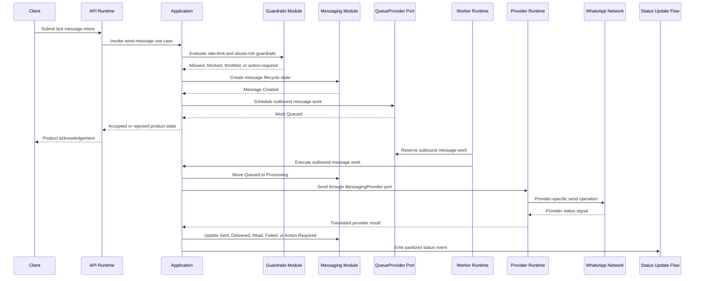
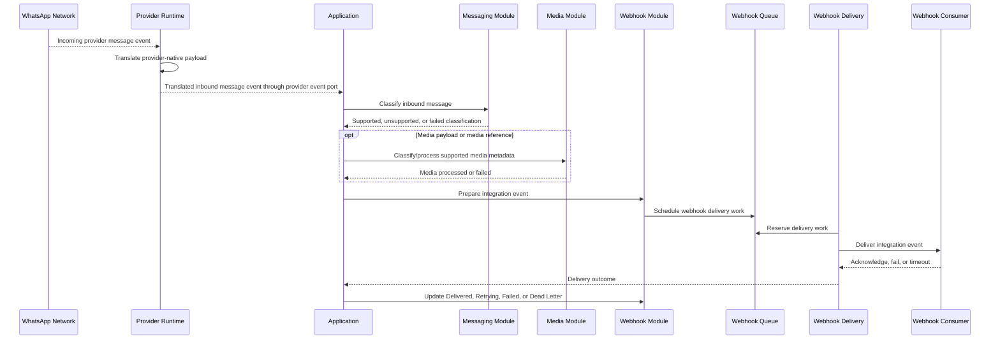
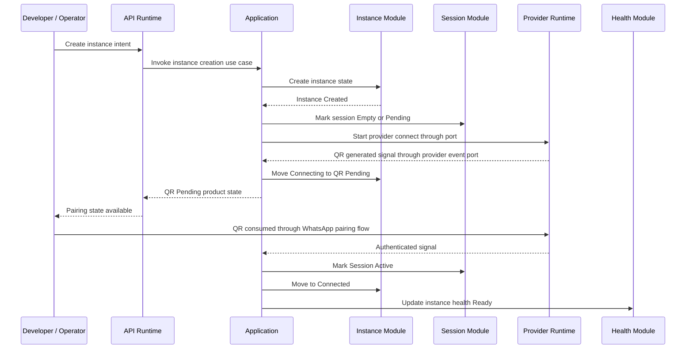
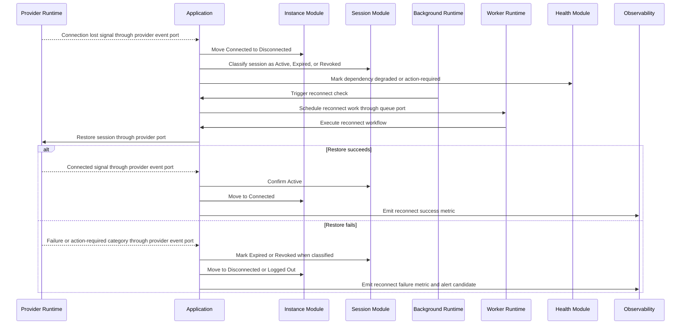
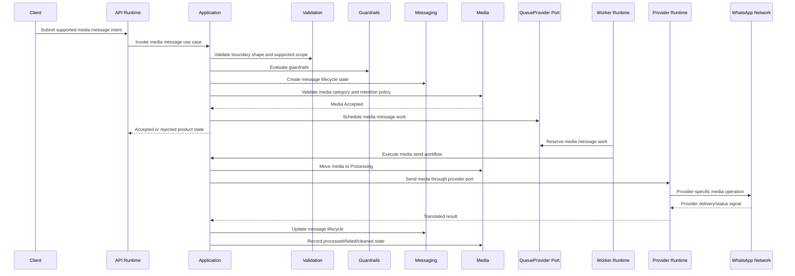
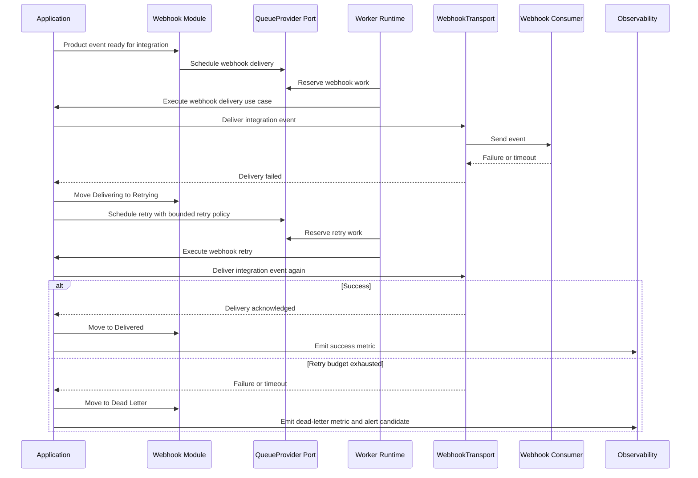

# OmniWA Runtime Sequence Diagrams

## Purpose

This document defines runtime sequence diagrams for OmniWA Phase 1.4.

The diagrams show interaction order between runtime roles and modules. They do not define REST endpoints, OpenAPI, database schemas, Prisma, Docker, source code, BullMQ implementation, or Baileys internals.

## Send Text Message

Notes:

- API Runtime does not wait for final WhatsApp delivery.
- Provider result is translated before product modules consume it.
- Message status updates are product states, not raw provider payloads.

## Receive Message

Notes:

- Provider does not publish webhook events directly.
- Webhook delivery is asynchronous and retry-visible.

## QR Login

Notes:

- QR rendering and presentation are Interface concerns.
- Provider-native session material remains Secret.

## Reconnect

Notes:

- Two reconnect workflows must not run concurrently for the same instance.
- Logout, policy restriction, missing credentials, and device unlink are not counted as auto-recoverable reconnect success.

## Send Media

Notes:

- Binary media is not retained by default after processing.
- Provider media upload details stay behind Provider Runtime.

## Webhook Retry

Notes:

- Webhook retry must preserve idempotency semantics.
- Dead Letter is terminal until operator recovery or explicit replay policy is defined later.
