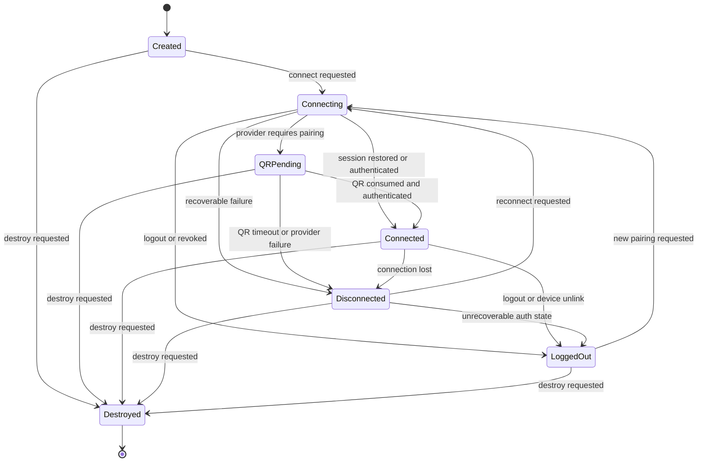
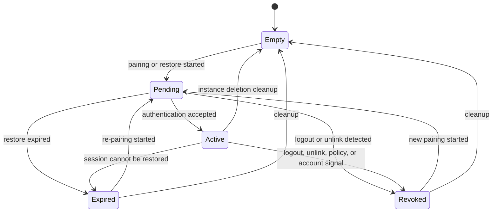
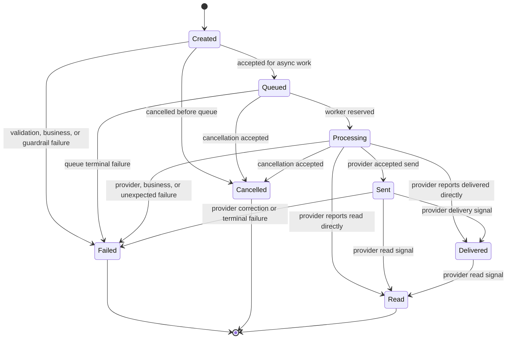
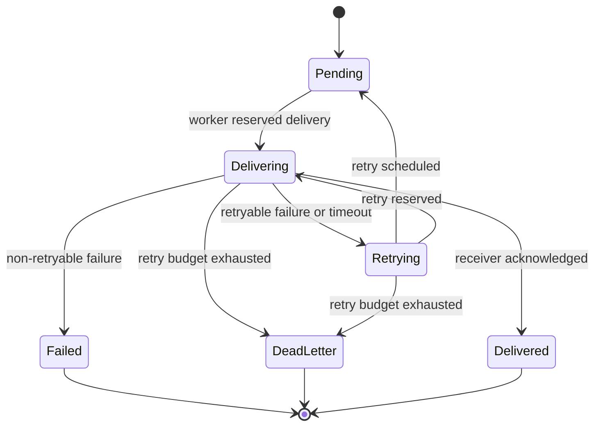
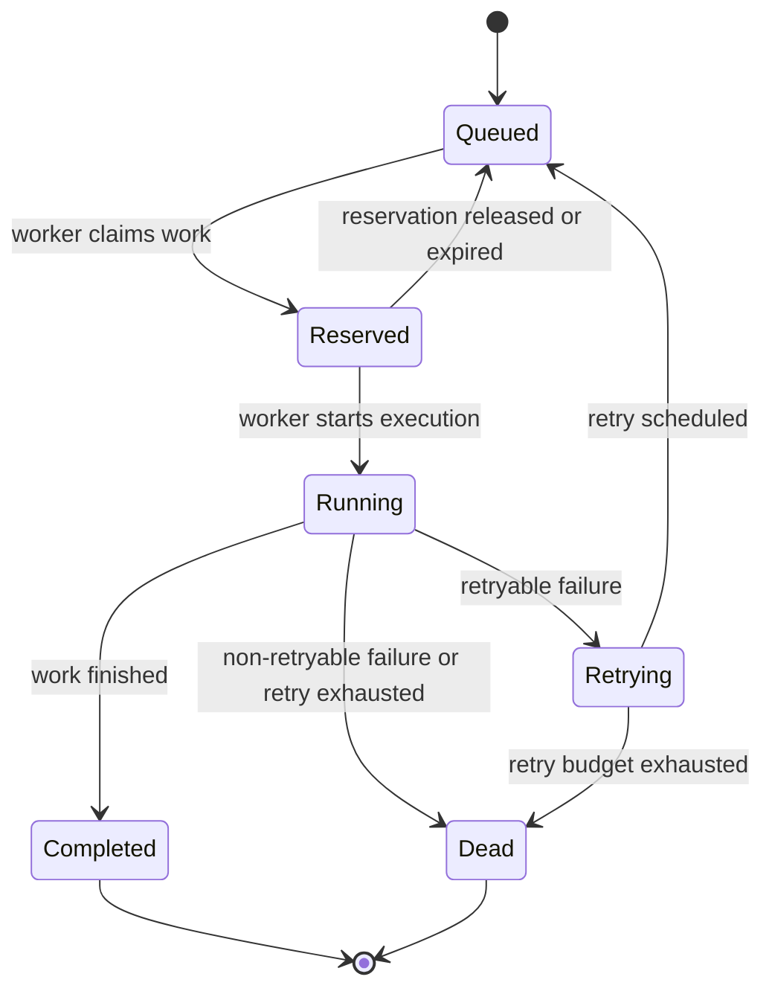

# OmniWA Runtime State Machines

## Purpose

This document defines runtime state machines for OmniWA Phase 1.4.

It does not define database schemas, persistence mechanics, REST APIs, source code, Docker, BullMQ, or Baileys internals.

## State Machine Principles

- State machines describe product/runtime lifecycle behavior, not storage implementation.
- State transitions that affect product behavior are owned by Application and product modules.
- Provider-native signals must be translated before entering state machines.
- Terminal states must be observable.
- Unknown states should be minimized and classified where possible.

## Instance State Machine

Required states:

- Created.
- Connecting.
- QR Pending.
- Connected.
- Disconnected.
- Logged Out.
- Destroyed.

Transition rules:

- Destroyed is terminal.
- Connected requires usable provider connection.
- Logged Out requires operator action before normal messaging resumes.
- Disconnected is recoverable only when Session is Active or recoverable.

## Session State Machine

Required states:

- Empty.
- Pending.
- Active.
- Expired.
- Revoked.

Transition rules:

- Active and Revoked are mutually exclusive.
- Session material is Secret data in all states.
- Empty means no usable product session material exists.
- Expired and Revoked are not automatically equivalent; Revoked is stronger and usually action-required.

## Message State Machine

Required states:

- Created.
- Queued.
- Processing.
- Sent.
- Delivered.
- Read.
- Failed.
- Cancelled.

Transition rules:

- Created to Queued is required for accepted async outbound work.
- API Runtime must not report Delivered or Read unless provider status has been translated.
- Failed must include a failure category where possible.
- Message body is not retained by default after processing.

## Webhook State Machine

Required states:

- Pending.
- Delivering.
- Delivered.
- Retrying.
- Failed.
- Dead Letter.

Transition rules:

- Delivered is terminal.
- Webhook work must be retry-visible.
- Dead Letter is terminal until operator recovery or explicit replay is defined.
- Webhook payloads are Confidential and must be redacted from normal logs.

## Worker Job State Machine

Required states:

- Queued.
- Reserved.
- Running.
- Completed.
- Retrying.
- Dead.

Transition rules:

- A job must not be Running in two workers simultaneously.
- Reservation must be visible as a lifecycle state.
- Dead is terminal for that job attempt lineage unless operator recovery creates new work.
- Job payloads must follow data classification and retention rules.

## Cross-State Invariants

| Invariant | Applies To |
| --- | --- |
| Worker cannot process outbound message when Instance is not Connected or send-capable. | Message, Instance, Provider Connection |
| Session Revoked moves Instance toward Logged Out or action-required state. | Session, Instance |
| Webhook Delivered does not change original Message lifecycle. | Webhook, Message |
| Provider Connection Closed cannot continue to emit product state transitions except final shutdown classification. | Provider Connection, Instance |
| Message Failed does not imply Webhook Failed; each lifecycle is independently owned. | Message, Webhook |
| Queue Dead state must be visible to operators. | Worker Job, Health, Observability |

## State Transition Ownership

| State Machine | State Owner | Transition Coordinator | External Signal Source |
| --- | --- | --- | --- |
| Instance | Instance module | Application | Provider Runtime, API Runtime, Scheduler |
| Session | Session module | Application | Provider Runtime, API Runtime |
| Message | Messaging module | Application | API Runtime, Worker Runtime, Provider Runtime |
| Webhook | Webhook module | Application/Worker | Product events, WebhookTransport outcomes |
| Worker Job | Worker module | Application/Worker | QueueProvider outcomes, Worker Runtime |
| Provider Connection | Provider module translates, Instance/Session own product state | Application | Provider Runtime |
